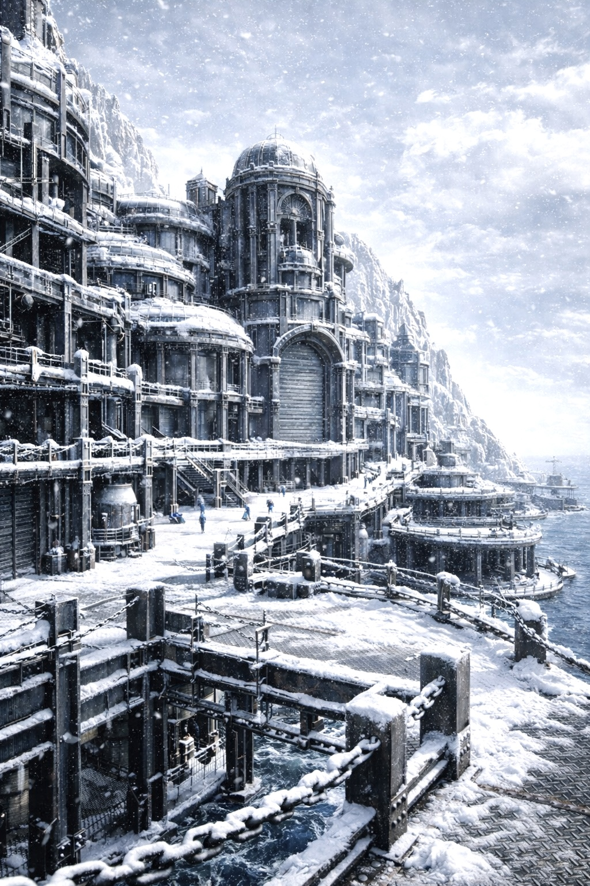

# 第2章：焔核の兆しと風の斥候

## 第1節：境界の風

アシハラの街道は、町の外れに近づくにつれて、その舗装の様子が次第に荒れていった。街中で聞き慣れたあの鉄の響きは、いつしか遠ざかり、代わりに土と石が混じった鈍い足音だけが、静かな道に響いていた。

最初に変化に気づいたのは音だった。鉄の音がなくなったのだ。

街の中では、足元のどこかで必ず金属が鳴っていた。縞鋼板の継ぎ目を踏めば、かすかな「キン」という金属の響きが返ってくる。補修された梁の隙間や打ち込まれたボルトも、歩く度に小さく震え、金属同士が微かに擦れる音が生まれていた。人の足音に混じり、鉄の街の生命のように鳴り響いていたその音が、ここではすっかり消えていた。

サクヤは一歩を踏み出した。靴底が地面に接触した瞬間、鈍い感触とともに重い音が返ってくる。鉄の「キン」という音とは明らかに違う。地面を踏みしめるたびに伝わるのは、土と石が混ざり合い、ぽってりと沈み込むような重たく鈍い響きだった。

目の前の縞鋼板は次第に途切れ、補修の跡も雑になっていた。錆びた鉄板の代わりに打ち付けられた古びた木板がところどころに見え隠れし、踏むと軋むような音を立てる。地面に打ち込まれたボルトの頭は浮き上がり、足裏に当たるたびにかすかな違和感を生んでいた。サクヤの視線は自然と足元に落ち、重たい靴底が土と鉄の混じった路面を踏みしめるたびに返ってくる鈍い感触に神経を集中させていた。

この場所では、街中とはまるで違う感覚があった。鉄の街は常に重苦しかった。住まう建物も、空に架かる橋も、街の中心に立つ鳥居までもが、まるで大地に押し付けられるかのような重みを持っていた。すべてがずっしりとした重力に引っ張られているようで、足元の感触も硬く鈍かった。

だが、今立つこの境界の地面は違う。明らかに軽い。足の裏に伝わる重さが、どこか物足りなく、薄くなっているのをサクヤは無意識に感じていた。いつの間にか、彼の歩幅が緩み、歩く速度がゆっくりと落ちていった。

そのとき、風が突然変わった。

街の中で鼻をつく油と錆びた鉄粉の匂いとは異なる、乾いた冷たさを持った風が、体の芯を撫でた。まるで遠くの雪山から運ばれてきたような、澄んだ冷気と清冽な空気が混じり合い、頬を撫でる。サクヤは無意識に立ち止まり、深く息を吸い込んだ。

それは、境界の匂いだった。

アシハラの人間なら、誰もがその空気の変化に気づく。境界線は目に見えるものではない。柵も門も看板もない。ただ、空気の質が変わるだけで、人はそこが境界だと理解する。マグメルとの境目は、そんな場所だった。

街の外へ出た者は、必ずここで一度足を止める。越えて行くか、戻るか。その決断の瞬間に立ち止まる。理由を言葉にできる者は少なく、誰もがただ無意識にそうなるのだ。サクヤも、その例外ではなかった。ほんのわずかな時間、彼は足を止めてしまった。

越えたら戻れないわけではない。だが、彼の胸の奥にある声がわずかに囁いた。

「戻りたい」と。

「あの街では、すべてが重かった」

彼の脳裏に、鉄の街の景色が浮かんだ。巨大な鋼鉄の建物。重厚な鉄橋。霧に霞む鉄の神社。すべてが圧力を孕んで、下へ、下へと押し付けられていた。

だが今、足元の地面は軽すぎる。まるで何かが欠落しているかのような、不安定さが漂う。サクヤは眉をひそめ、不意に呟いた。

「変だな……」

その言葉はどこからか零れ落ちるように、誰かに向けられたものではなく、自分自身への問いかけだった。乾いた風が頬に触れ、街の匂いを押し返す。

その一瞬の静寂を切り裂くように、前方の石積みの影が微かに動いた。

呼吸が止まる。サクヤの手は自然と腰の剣の柄に触れた。視線が影に釘付けになる。

人の気配。生きた存在の動きだ。風とは異なる、確かな躍動。

影はもう一度揺れ、そして次の瞬間、

そうっと、ひょい、と軽やかに道へ飛び出してきた。

小柄な影が、音もなく石の上に着地する。足元の地面には金属音は一切しなかった。それが逆に不自然な静けさを生み、サクヤの警戒心は一段と強まった。

彼の手が剣の柄をしっかりと握り直す。

影は顔を上げ、透き通るような声で言った。

「うわ、ちょっと待って！」

高くて鋭い声だったが、それは子どもの声ではなかった。小柄で軽装の身体に、背中には小さな弓が背負われている。

サクヤはわずかに目を細め、影の顔と装いを確かめた。

だが影は、彼の顔を見るより先に、真っ先に足元を見つめていた。

「そこ」

短く、意味深な言葉を投げかける。

「踏まない方がいい」

サクヤは一瞬、動きを止めた。

「……なんだ？」

影の指が地面を指し示す。

「そこ沈む」

その言葉が終わるよりも早く、サクヤの足元の地面が「ずず」と小さく音を立てて沈んだ。乾いた砂が崩れ落ちるような音が耳に届く。

影は肩をすくめて見せた。

「気をつけろよ」

空気の張り詰めた瞬間に、淡い警告がこだました。サクヤはその言葉と地面の感触に慎重に反応しながら、次の一歩を踏み出した。

━━━━━━━━━━━━━━━━━━━━━━━━━━━━━━

第2章：焔核の兆しと風の斥候

第2節：境界の遭遇

「ほらね」

小柄な影は、ささやくような声でそう言いながら、軽やかにサクヤの顔を見上げた。微かに震える風に揺れる細い髪が、まるで生き物のように周囲の空気を撫でている。

サクヤは剣の柄をしっかりと握り締めていて、その手を一瞬たりとも離そうとはしなかった。鋭い目つきは、まるでいつでも一瞬の攻撃に備えているような緊張感を漂わせている。

「動くな」

その言葉は重く、そして冷たく響いた。

「動いてない」

影はあっさりと返す。声に翳りはなく、飄々としている。まるで緊迫感とは無縁のようだ。

小柄な影は女性だった。

影はサクヤの足元を指差した。

「そこ、もう一回踏んだら沈む」

サクヤは眉をひそめ、視線を落とす。足元の地面をじっと見つめながら、疑念の色が濃くなる。

「なぜ分かる」

「分かるから」

「答えになってない」

影は肩をすくめ、小石をひとつ拾い上げた。その動作は無造作でありながら、どこか確信に満ちている。

「じゃあ」

そう言うと、影はその小石を足元に落とした。

カチッ

乾いた音が不意に響き、静寂を切り裂いた。その音は、単なる小石の落下音ではなく、この土地の秘密を告げる合図だった。

地面はわずかに沈み、まるで脆く崩れかけているかのようだった。

「こういう地面」

影は説明を続ける。

「音出る」

サクヤは無言で地面を見つめ、その感覚を確かめようとした。確かに、ここは街の普通の地面とはまるで違っている。鉄筋もなく、ただ砂利と土が混ざり合った不安定な様子で、重みを支えきれずにいるのが見て取れた。

影は手のひらを軽く払った。

「……危ないよ」

その声には淡い警告が含まれていたが、敵意はまったく感じられなかった。

サクヤはほんの少し剣を下げ、しかし警戒心は解かずに問いかける。

「お前は誰だ」

影は答える前に一瞬だけ周囲を見渡した。風の向き、丘の影、そして地面。瞬時に状況を把握し、その目には冷静な判断が宿っていた。

「リリィ」

短く名乗ったその名前には、どこか飄々とした軽さがあった。

「そっちは？」

サクヤは迷った。境界では名前を明かさない方が安全なことも多い。知らぬ者に情報を与えることは、時に命取りになることもある。

しかし目の前の人物はすでに自分の足元を見ていて、明確な敵意も感じなかった。

「……サクヤ」

そう答えると、リリィは小さく頷いた。

「サクヤね」

そして、再び地面を見つめる。

「そこ踏まない」

サクヤは半歩下がり、足元の不安定な地面を避けるように位置を変えた。

「お前、ここに慣れてるな」

「うん」

「マグメルの人間か」

「そう」

リリィはあっさりと答えた。その口調は、まるでそれが当たり前のことのように自然だった。

「だから知ってる」

「何を」

「壊れてる場所」

言葉はさらりと流れたが、その意味は重く、境界の空気とともに胸に沈み込んでいった。

乾いた風が二人の間を通り抜け、砂埃を小さく舞い上げる。

サクヤは瞳を細め、鋭く問いかける。

「壊れてるのか」

「うん」

リリィは肯定した。

「壊れてるのに使われてる」

「使われてるから直らない」

その言葉に、サクヤは一瞬、口を閉ざした。どこかで聞いたことのある響きだったが、詳しいことは思い出せなかった。

沈黙が一瞬流れ、二人の呼吸音だけが風に混じって響く。

「……お前は」

サクヤは問い直した。

「ここで何してる」

リリィは少しだけ考え込み、言葉を選ぶように答えた。

「逃げてる」

その一言は、軽く、そして飄々としていた。

「誰から」

「マグメルの連中」

サクヤの眉が深く寄せられた。

「同じ街の人間だろ」

「ああ」

「なら話せばいい」

リリィは首を横に振った。

「無理」

「なぜ」

「食べ物がないから」

その説明は、まるで日常の些細な話をするかのように淡々としていた。

「物資が足りないと、人を追う」

「捕まえる」

「持ってる物を取る」

「それだけ」

サクヤは顔を上げ、澄み切った空を見つめた。境界の風が肌を刺すように冷たく吹き抜け、街の生活臭は完全に消え去っていた。

「……境界を越えてまで？」

「越えるよ」

リリィは即答した。

「越えない理由、ないし」

サクヤは少しだけ微笑んだ。

「ずいぶん簡単に言うね」

「簡単だよ」

リリィは言い切った。

「生きる方が大事」

その言葉が消える間もなく、遠くから石が転がるような音が響いた。

足音。確かな威圧感を伴う。

リリィの顔がぱっと上がる。

「……来た」

「追手か」

「うん」

丘の向こうから、三人の重装備の影が揺らめいて近づいてくる。

「見つけたぞ！」

怒声が風に乗って飛んできた。鋭く、冷たく。

リリィは振り向かず、すぐに走り出した。

「走るよ」

サクヤは息を呑み、問いかける。

「戦わないのか」

「勝っても意味ない」

「どういう意味だ」

「また来るから」

リリィの足は速く、境界の風を切り裂く。

サクヤは一瞬迷いを見せたが、すぐに決意を固め、後を追った。

乾いた砂埃が二人の足元から舞い上がり、まるでこの境界の不安定さと危うさを象徴しているかのようだった。

追手の気配は背後でますます大きくなり、二人の呼吸は荒く、心臓の鼓動は耳鳴りのように響いた。

それでもリリィの飄々とした態度と、サクヤの剣を握る手の熱さが、境界の冷たい空気の中で不思議な対比を成していた。

逃げるしかない。だが、その逃走は単なる逃げ場のない状況ではなく、生き抜くための冷徹な選択肢のひとつだった。

細く揺れる影と、揺らぐ地面。二人はその境界を走り抜ける。

━━━━━━━━━━━━━━━━━━━━━━━━━━

第2章：焔核の兆しと風の斥候

第3節：風の距離

二人は、まるで合図でもあったかのように、同時に走り出した。

しかし、リリィの走り方は決して普通ではなかった。

彼女の動きは、不規則でもなく、ただ一直線でもなかった。蛇行することもなければ、無意味に方向を変えることもない。だが、確かに、彼女は風の流れに寄り添うように、見事なまでに自然と一体化して動いていた。

丘の斜面を斜めに横切り、またふいに方向を変えるその走りは、まるで風そのものが道標であるかのように。風が吹く方向と強さを瞬時に読み取り、その波に身を任せているかのように見えた。

サクヤはその異様な動きに、瞬間的に戸惑いの色を浮かべた。

「そっちじゃ遠回りだ！」

息を切らしながらも、思わず声を張り上げた。

リリィは振り返ることなく、軽やかに答える。

「遠回りじゃない」

その声には、静かな確信があった。

「音が出ないんだよ」

その言葉の意味がすぐには飲み込めなかったサクヤは、一瞬だけ理解が遅れた。

しかしすぐに気づいた。

リリィが選んでいるのは、足音を立てにくい地面。

石ころが散らばる乾いた土、しっかりと根を張った草の間の僅かな隙間。

彼女はそうした音の出ない場所だけを確実に踏んでいた。

その足取りは静寂と調和し、まるで地面を傷つけることのない、精密な踊りのようだった。

だが、追手はまるで対照的だった。

彼らの重く硬い装備が、地面を叩く度に不快な金属音が響き渡る。

「ジャリッ」

靴底が砂利を踏みしめる音。

「カチッ」

金属が石にぶつかる冷たい響き。

そんな雑音が、境界の静けさを破って空気の中に広がっていく。

「止まれ！」

後ろから怒鳴り声が飛び交った。

「逃げるな！」

追手たちの声は荒々しく、追いつめるような威圧感を帯びていた。

そんな緊迫した状況の中で、リリィは小さく笑った。

その唇の端が、わずかに上がった。

「逃げるよ」

その言葉には、揺るぎない決意が宿っていた。

「なんで笑ってるんだ」

サクヤが驚きのまじる声で言う。

「追手だぞ」

リリィはそれを遮るように、淡々と答えた。

「うん」

「でも、重いから」

彼女の言葉の意味は、すぐに明らかになった。

追手は重たい装備に縛られ、動きが鈍い。

さらに地形も味方しない。

彼らはただ無造作に足を踏み出すだけで、音を立て、勢いも鈍っていた。

リリィは敏捷に丘の陰へと滑り込んだ。

「こっち！」

サクヤも間髪入れずに続いた。

木々の間に潜み、岩の陰に身を寄せる。

リリィはそっと膝をつき、地面に触れた。

その手のひらに伝わる感触は、乾いていて硬く、そして何よりも音の出ないものだった。

確認はそれだけだった。

「……お前」

サクヤが声を低くした。

「どうしてそこまで分かるんだ？」

リリィは肩をすくめて答えた。

「住んでたから」

「境界に？」

「マグメル」

その一言に、重みがあった。

サクヤは少しだけ息を吐いた。

「まあ、それもあるけど、これね」

リリィが手をかざすと、そこにヒョウの姿が現れた。

その姿は透き通るように神秘的で、まるで風そのものを纏っているかのようだった。

「？！？」

「神使だよ？！」

サクヤは瞳を大きく見開いた。

リリィは穏やかな笑みを浮かべながら説明した。

「そう、神使の名前はヴェクター・ゼロ」

「この子の能力で、地形や風の流れ、距離までも正確に把握できるの」

「安心して。噛みつかないから」

その言葉に、サクヤの緊張はわずかに和らいだ。

彼の視線は、ヒョウの目の奥に宿る冷静で鋭い力を捉えていた。

サクヤが尋ねる。

「マグメルは……」

「そんなに酷いのか？」

リリィは少しだけ考え込んだ。

「場所による」

「街はきれい」

だが、その明るい言葉に続けて、彼女の視線は少しだけ落ちた。

「でも……」

「中は壊れてる」

彼女は静かに付け加えた。

サクヤは沈黙した。

リリィは口を開く。

「壊れてるのに、みんな使ってるんだ」

「使われてるから、直らない」

境界の風が静かに吹き抜け、わずかに砂埃が舞い上がった。

遠くから追手の声が近づいてくる。

「どこだ！」

「逃がすな！」

迫る声は鋭く、焦燥が混じっていた。

リリィはゆっくりと立ち上がった。

「来る」

サクヤも自然と身体を起こした。

その瞬間だった。

足元の地面が、微かにだが確かに沈んだ。

鈍い感触が足裏に伝わる。

その感触は、不快なほど軽く、異様な違和感を孕んでいた。

サクヤの胸の奥が針で突かれるように熱くなり、内側から圧力が高まる感覚が押し寄せた。

あの、鳥居の時と同じ感覚。

だが、今回は消えそうにもなかった。

「……まずい」

息が荒くなる。

視界の端が揺れ、不安定に揺れる。

リリィが振り返る。

「サクヤ？」

その呼びかけに答える間もなく、

丘の上に追手の影が現れた。

━━━━━━━━━━━━━━━━━━━━━━━━━━━━━━━━

第2章：焔核の兆しと風の斥候

第4節：追手

「見つけた！」丘の上から鋭く響く男の声が、静まり返った境界の空気を切り裂いた。

それと同時に、三つの影が一斜面を駆け下りてくる。彼らの動きは俊敏だが、装備の重さが足音に重みを加えていた。肩当て、胸当て、そして背負った大きな袋。走るたびに金属が擦れ合う音が連続して耳障りに鳴り響く。

「ジャリッ」、砂利が踏みつぶされる音。

「ガチッ」、鎧の金具が擦れる音。

その金属音は、境界の静寂を破る異物のように鋭く、空気を震わせた。まるで重厚な鉄の壁が地を這って進むかのような鈍い響きが、周囲の冷たい空気に不穏な緊張をもたらしている。

リリィはふと小さな舌打ちを漏らした。彼女の目が追手の動きを鋭く捉えている。

「早い」と短く呟いたその声には、わずかな苛立ちが混じっていた。

「三人だな」サクヤもまた、追手の数を確認しながら冷静に答える。

「うん」リリィが頷く。その声は静かだが確固としていた。

「回収屋だ」

「回収？」サクヤが問い返す。

リリィは小さく説明する。

「逃げた人とか、残された物資を拾い上げる連中」

「物資もか」サクヤが理解を示す。

彼女は剣の柄に手をかけ、抜き放った。刃がひときわ冷たく光る。

「逃げるはずじゃなかったのか」

「逃げるよ」リリィは言葉を切りながらも、少しだけ身を翻した。

「でも」

声を潜めて、振り向く。彼女の瞳が追手たちの接近を告げている。

「近すぎる」

その瞬間、追手の一人が鋭く叫んだ。

「止まれ！　その荷物は置いていけ！」

リリィは肩をすくめて応じた。

「荷物なんて、持っていないけど？」

「お前の弓だろう？」

サクヤが指摘する。

「それが欲しいだけだろう」

「かもね」リリィの口元がわずかに緩む。

彼女はゆっくりと矢を一本つがえた。弓の弦が張り詰める音が、皮膚の奥まで響いてくる。けれど放たない。

サクヤはわずかに眉をひそめる。

「撃たないのか？」

「まだ」

リリィの答えは冷静だ。

「距離が足りない」

追手たちは斜面を踏み込んだその刹那、地面が音もなく微かに崩れた。

「っ！」先頭の男の足が沈み込む。驚いたように体勢が崩れ、慌てて体を支えようとした。

その一瞬を狙い澄ませて、リリィの矢が放たれた。

「ヒュッ」

短く切れ味鋭い風切り音が空気を裂く。

矢は男の肩の装備をかすめていき、金属同士がぶつかり合う「ガン」という大きな音が空気に響いた。

「くそっ！」男が激しく怒鳴る声が、周囲の静寂と緊張を一層際立たせる。

リリィはすでに次の矢を構えている。しかし、またも放たない。

「……威嚇か」サクヤが冷静に指摘した。

「うん」リリィはうなずく。

「時間を稼いでるんだ」

追手たちは足を止めた。わずかな間隙を縫うように、リリィの声が小さく指示を飛ばす。

「左」

「？」

「岩の陰」

サクヤの脳裏にすぐに逃げ道が浮かんだ。二人は一瞬の沈黙の後、同時に動き出す。

「囲め！」追手たちが鋭く叫ぶ。だがその声が届く間もなく、状況は急変した。

サクヤの足元で、地面がぐにゃりと歪んだのだ。

「……！」

胸の奥に秘められた熱が、瞬間的に膨れ上がり、抑えきれないほどに激しく燃え盛った。

あの焔核の熱、彼女の体内にひっそりと宿る強大な焔の芯が、今や制御の限界を超え、外へ漏れ出しそうになっている。

視界の端が揺れ、周囲の空気が波打つように歪んだ。その歪みはまるで現実をねじ曲げるかのように、空間そのものを変形させていた。

リリィが振り返り、鋭い声で叫ぶ。

「サクヤ？」彼女の瞳が驚きと不安に揺れている。

地面は、ほんの一瞬だけ赤く染まったように見えた。熱が、確実に外へと放たれようとしていたのだ。

サクヤは歯を食いしばった。

「……やめろ」

その言葉は、誰に向けて発せられたのか自分でも分からなかった。しかし、体の内側で何かが激しく動き出しているのは確かだった。

「サクヤ！」リリィの声は鋭さを増し、切迫感を帯びていた。

「下を見て！」

サクヤは咄嗟に視線を落とした。

足元には、縞鋼板の欠片が散らばっている。それらが、ひび割れ始めていた。

地面の亀裂が、彼女の内に秘めた火種の圧力に呼応するかのように、徐々に広がっていく。

そこに潜む不気味な緊張感が、まるでこの境界の過酷さを象徴しているかのようだった。

金属の擦れる耳障りな音、息を呑むような静寂、そして迫りくる回収屋の足音。彼らは、ただの追跡者ではない。死体も物資も、人の命すらも拾い上げる冷酷な存在。その圧倒的な存在感が、辺りの空気をひんやりと凍らせている。

その場に漂う、生きるか死ぬかの瀬戸際の緊迫感が、身体の隅々までじわりと染み渡る。

リリィの矢が威嚇として放たれたその瞬間も、サクヤの体内に潜む焔の熱が暴れ出した時も、そして追手たちの重い金属音が鳴り響く度に、境界は彼らに牙をむくのだった。

━━━━━━━━━━━━━━━━━━━━━━━━━━━

第2章：焔核の兆しと風の斥候

第5節：歪む大地

斜面の土が、不意に崩れ落ちる音が耳の奥で深く響いた。細かな石や湿った土の粒がざわつきながら滑り落ちていくその様子は、まるで大地が怒りを露わにしたかのようだった。サクヤはバランスを崩しかけ、重心を必死に整えた。震える足の感覚が冷たく皮膚を刺し、乱れた呼吸が胸を締めつける。そんな中、彼は胸の奥深くにまだ熱が燻っているのを確かめた。消えてはいなかった。むしろ、さっきよりもその熱は確実に、しかし不穏に強くなっているのを知っていた。

彼女は深く息を吸い込む。だが、その息は単なる空気の流入ではなかった。重く、熱い空気が肺に入ってくるわけではない。体の内部、心臓の奥、もっと深い場所で何かが燃えている。炎とも違う、まるで見えざる焔が胸腔の内側で蠢き、波打っているような感覚。それは単なる熱ではない。身体の一部であるはずの血管が、まるで外部から圧迫されるように軋み、骨が柔らかく折れ曲がっていく錯覚すら覚える異質な圧力だった。熱はただじんわりと感じるものではなく、まるで血管の中を熱い鉄の棒が這い回るかのような焼けつく痛みを伴い、骨の髄まで震わせていた。

「……くそ」

サクヤは歯を強く食いしばった。内側から焼き付けられるような苦痛に耐えるため、意識して身体の震えを抑え込む。背後から追手の声が鋭く響き渡った。それはまるで狩りを告げる獣の唸りのように張り詰めていた。

「逃がすな！」

「囲め！」

硬い足音が斜面を慎重に降りてくる。石が踏みしめられる音、木の枝が擦れる音、そして歪む大地の震えが微かながら混じっているように感じられた。

リリィが振り返った。険しい目が追手の動きを捉えている。

「まだ来る」

その声に、サクヤは無言でうなずいた。

「分かってる」

短く、しかし確信を帯びた言葉が喉から漏れる。だが、身体は思うように動かなかった。重く、鈍く。胸の奥で、何かが膨れあがっているのがはっきりと感じられた。

熱？ いや、それだけではない。圧力。胸の奥から外へと押し広げようとする、異質な力の圧力がじわじわと広がりつつあった。

「サクヤ」

リリィの声が、いつになく低く、そして不安げに響く。

「今、変」

「……分かってる」

サクヤはゆっくりと息を吐く。肺から一気に吐き出す空気が、逆に体内の未知の熱を刺激するように感じられた。その刹那だった。

足元の地面が、かすかながらもはっきりと「ミシッ」という音を立てた。

だが、それはサクヤが踏み込んだからではない。むしろ、地面自体が勝手に歪み、ねじれ、形を変え始めていたのだ。

リリィの細く鋭い目が、その異変を逃さず捉えている。

「……なにそれ」

サクヤ自身も理解できなかった。ただ、ひとつだけ確かなことがあった。体の奥に潜む、燃え盛る得体の知れない熱の塊が、外へと飛び出そうともがいているのだと。

その瞬間、追手の一人が不用意に斜面を踏み込んだ。次の瞬間、地面は大きく沈み込み、まるで生き物が怒りの唸りを上げるかのように震えた。

「っ！？」

男がバランスを崩し、足を滑らせる。荒い呼吸がその場の緊張をさらに引き立てた。

サクヤの胸の奥の熱は、一気に膨れ上がった。炎のような熱と、空間そのものを押し広げようとする圧力の両方が、彼の体内で凶暴に暴れ狂っている。まるで自分の身体を内側から引き裂こうとするかのように、血管の壁が軋み、骨が粉を噴く音すら聞こえてきそうなほどの強烈な異質感。まるで炎が単なる熱ではなく、あたかも意志を持った生物のように自らの身体を侵食し、押し広げようとしているのを感じた。

次の瞬間、空気そのものが揺らいだ。視界の端で、目には見えない波紋がゆっくりと広がっていく。まるで風に揺れる水面のような、しかしそこに水はなく、透明で歪んだ波動が周囲を包み込む。まるで現実の法則が一瞬だけ歪み、光が屈折しているかのようだ。

砂粒が跳ね上がり、そのまま無音で宙に浮かび、小石がふわりと舞い上がる。重力がねじ曲げられたのか、地面は無理に引き裂かれ、ひび割れが走り始めた。亀裂は細かく枝分かれしながら広がっていき、その隙間からは熱を帯びた空気の揺らぎが揺れ動くのが見て取れた。

「な……」

追手の男は思わず声を失った。足が自然とすくみ、その場で固まってしまった。呼吸は浅く、心臓の鼓動が耳元で雷のように鳴り響く。彼の内側には本能的な恐怖が沸き起こっていた。理性では理解できない、目の前で起こる異常事態に対する極限の恐怖。まるで世界が歪み崩壊するのを目の当たりにしたかのようで、身体の動きが完全に止まっていた。

「なんだこれ……」

サクヤ自身も理解できていなかった。ただひとつ、はっきりしているのは、これが自分から発せられている力だということだった。

胸の奥から、制御不能な力が溢れ出ている。

これを止めなければ。

サクヤは足元に目を向けた。地面に散らばる縞鋼板の欠片が目に入った。鉄の冷たい光沢が、その空間の歪みの中で微かに煌めいている。

鉄。その構造。重さ。

彼のルーツ――硬く、確かな物質としての自分自身を思い出す。鋼の冷たさ、鉄の重み、そして圧倒的な強さ。自分はただの火の塊ではない。血と肉だけでできた存在ではない。自分は構造であり、鉄の意志であり、その重さが身体を支えているのだ。

その思考が頭の中で奔流のように渦巻く。熱に飲み込まれそうになる衝動と、冷たく硬い鉄の現実がせめぎ合う。

「……戻れ」

呟くように言葉を紡ぐ。何に向けられた言葉かわからなかったが、体の奥の炎は、ほんの一瞬だけ、まるで凍りついたかのように鎮まった。

空気の歪みがゆっくりと消え、跳ねた砂は音もなく落ちていく。浮かんだ石は静かに地面に戻り、ひび割れも徐々に閉じていった。

静寂が辺りを支配し、追手の男たちは動きを止めていた。誰も近づこうとしない。恐怖にも似た緊張がその場を覆っている。

「……なんだ今の」

一人が、声を震わせて呟く。恐怖が混じった声だ。

もう一人が小声で言った。

「魔法か？」

三人目が首を振りながら答えた。

「違う」

その目は、じっとサクヤを見据えていた。

「触るな」

その一言で、三人は瞬時に後ずさり、距離を取った。

リリィが小さく息を吐いた。

「……今の」

「知らない」

サクヤは率直に答えた。本当に何が起きたのか、彼自身も理解していなかった。ただ、胸の奥の熱は完全には消え去っておらず、まだそこに根を張っていることだけは確かだった。

リリィが静かに言葉を紡ぐ。

「でも……」

「助かった」

サクヤは言葉を返さなかった。追手はもう近づくことを恐れている。距離を取りながら、鋭くこちらを警戒しているのが肌で感じられた。

その隙に、リリィが決断を告げる。

「今」

「走る」

サクヤは頷いた。二人は一瞬の沈黙を破り、同時に動き出した。

境界の風が再び吹き抜け、彼女たちの髪と衣服を揺らす。背後で、追手の声が遠ざかっていくのを感じながら、二人は斜面を駆け下りていった。

━━━━━━━━━━━━━━━━━━━━━━━━━━━

第2章：焔核の兆しと風の斥候

第6節：小戦闘

二人は言葉を交わすことなく、乾いた大地の上をひた走った。靴底が砂粒を踏み砕き、細かな音が風にかき消される。背中を押す微かな風は冷たく、しかし確かな存在感をもって二人を前へと駆り立てていた。

その一歩一歩が刻むリズムは、まるで時間を刻む鼓動のように確かでありながらも、周囲には緊迫した静けさが張り詰めていた。彼女たちの背後には、決して消えることのない影が蠢いている。誰かが、いや三つの影が再び動き出しているのを感じた。

「……まだ来る」

リリィが小さく呟いた。彼女の声は乾いた風の中に溶け込み、しかしその言葉の重みは確かにサクヤの心に突き刺さっていった。

サクヤはゆっくりと振り返る。丘の向こう、遠くに三つの黒い影が揺らめいていた。距離は開いている。だが、その事実は彼女たちの追跡が終わったことを意味しなかった。追手たちは決して諦める様子を見せていない。

「諦めないな」

サクヤは低くつぶやく。息遣いは荒いが、声は冷静だった。

「回収屋だから」

リリィは答え、さらに続けた。

「逃がすと怒られる」

「誰に？」

「マグメルの上」

その言葉だけで、サクヤの内側に重いものがのしかかる。マグメル──今は彼女たちを追う者たちの背後にある、巨大で冷酷な権力の存在が。

リリィは足を止めた。地面に立ち止まるその瞬間、緊張が周囲の空気をさらに引き締めた。

「……なんだ？」

サクヤは問いかけるように言った。

「ここ」

リリィは短く答えた。

「戦う」

その答えにサクヤは眉根を寄せた。

「さっきは逃げるって言ったじゃないか」

「距離があれば」

リリィはすでに背負いし弓の弦を引き、構えを作っている。

「今は近い」

丘の上から追手たちの姿がはっきりと見えた。先頭の男が声を荒げる。

「止まれ！」

「逃げ場はない！」

その怒号が乾いた空気を震わせたが、リリィは静かに息を吐き、そのまま冷たく答えた。

「ある」

弦がピンと張り渡される。

ヒュッ。

鋭い音を立てて矢が放たれた。

その矢は追手の男の足元、乾ききった土の中に深く突き刺さった。次の瞬間、土が不気味な音を立てて崩れ落ちる。

「うおっ！？」

男はバランスを崩し、大きくよろめいた。

リリィは即座に次の矢をつがえている。

「地面を狙ったのか？」

サクヤは驚きを隠せず、問い返した。

「うん」

リリィの口元にわずかな笑みが浮かんだわけではない。ただ冷静な答え。

「ここは壊れているから」

二本目の矢がまた空気を切り裂いた。

次の男の足元に深く突き刺さり、砂利と土が脆く崩れ落ちる音が響いた。追手の一人が体勢を崩す。まるで地面がまるごと味方を裏切ったように。

その隙を見逃すことなく、サクヤは静かに前へ踏み出した。

ただ突っ込むのではない。

彼女の剣術は特異だ。力でぶつかるのではなく、相手の動きを読み解くことに長けていた。追手の重心の揺れ、剣の振り下ろす軌道。すべてが彼女の感覚器官に刻まれ、刹那の間に計算された動きへと昇華される。

半歩だけ外へずれる。

真正面から踏み込めば、相手の剣筋とぶつかることは目に見えている。そのわずかなずれが、攻撃の勢いを無効化する。

追手の一人が剣を抜き、荒々しく振り下ろしてくる。

サクヤは受け止めなかった。

刃を正面から受け止めるのではなく、角度をずらし、斜めに流す。

ギ、と鋭い音が一瞬響いた。

相手の剣の重みが手元から離れていく感覚とともに、男の腕がわずかに前に落ちる。

その隙を逃さず、サクヤの剣は最短距離で返された。

大振りでは決してない。

わずかに肩口の装備の継ぎ目を狙い、横から浅く刃を引っかいた。

ガン！

硬い装備が剣を受け止めた鈍い音が響く。

打撃の衝撃が男を後ろへ跳ね上げる。

「くそっ！」

別の追手が低く唸り、目がわずかに変わった。

ここで初めて、相手がただの素人ではないことを理解したような、その鋭い視線。

サクヤは追いかけない。

追えば間合いが崩れることを知っている。

足を止め、呼吸を整えた。

頭の奥底で、古びた言葉がひとつ浮かぶ。

考えずともそこにあった言葉。

恐怖に先駆けて、身体の深部を満たす何か。

次の男が横から踏み込んでくるのを、サクヤは冷静に見据えた。

その攻撃は剣ではない。

肩の突き、腰の押し込み。

踏み込みの浅さ。

届く距離と届かない距離、その狭間。

半歩、引く。

刃先は鼻先をかすめていった。

その空いた中心へ、彼女の剣が滑り込む。

打ち込むものではなく、通すもの。

男は咄嗟に身をひねり、直撃を避けた。

しかし体勢は明らかに崩れていた。

リリィの矢が再び飛んだ。

ヒュッ。

矢は男の足元を狙い、またしても地面が脆く崩れ落ちる。

「ちっ……！」

追手は苛立ちを隠せない。

その時、サクヤはようやくリリィの戦術の全貌を理解した。

相手を直接射るのではなく、足元の地形ごと崩し、一切の立ち位置の選択肢を奪う冷徹な戦い方。

相手に「選ばせない」という意思が、リリィの冷たい視線から伝わる。

その一瞬、サクヤの胸の奥がまた熱く膨れ上がるのを感じた。

「……っ」

未知の熱が体内に渦巻くように力を増し、空気が歪んだ。

リリィが叫んだ。

「サクヤ！」

「……大丈夫だ」

サクヤは歯を食いしばり、必死に自分を制した。

しかし、地面がまたひび割れた。

乾いた音が、足元を走る。

まるで見えない何かが地下から押し広げているような、異質な圧力の存在が。

追手の男たちが後ずさる。

「なんだ……」

「こいつ」

男の一人が低くつぶやき、素早く仲間に忠告した。

「触るな」

三人の動きが一斉に止まる。

サクヤ自身も何が起きているのかわからなかった。ただ、身体の奥で何かが確かに動いている。熱というより、圧力のようなものが、激しく膨れ上がり、彼の体を内側から押し広げている感覚。

追手の一人が舌打ちをして、声を潜めた。

「……引くぞ」

「だが」

「触るなって言っただろう」

男は鋭くサクヤを睨み、目が冷たく光った。

それからゆっくりと後退を始める。

「今日はやめだ」

三人は慎重に距離を取り、やがて丘の向こうへと姿を消した。

境界の風が静かに戻り、再び乾いた空気が辺りを満たした。

リリィは弓をゆっくりと下ろし、サクヤは剣を鞘に納めた。

胸の奥の熱はまだ冷めないままだった。

「今の……」

リリィが言葉を紡ぐ。

「なんだったの？」

サクヤは首を振り、答えた。

「わからない」

それだけだった。

しかし、リリィの視線は戦闘中とは明らかに変わっていた。

地面の異変や空気の歪みではなく、その前に見た、サクヤの剣の動きそのものに強く惹きつけられている。

冷静でありながらも鋭く、無駄のない剣の軌道。

力ずくで押し合うのではなく、相手の一瞬の重心の変化に合わせ、半歩ずらしながら重さを流す。その動きはまるで一つの幾何学的な芸術作品のように洗練されていた。

その視線は、単なる観察者のものではなかった。何かを探り、計算し、確かめようとする狩人の目だった。

戦いは終わった。けれど、彼女たちの間に流れる緊張と期待はまだ冷めていなかった。

━━━━━━━━━━━━━━━━━━━━━━━━━

第2章：焔核の兆しと風の斥候

第7節：逃走

戦いの残像がまだ肌に貼りついているかのように、周囲にはしばらく風の音だけが響いていた。耳を澄ませば、遠く丘の向こうで消えていった追手の気配はもう戻ってこない。まるで彼らが最初から存在しなかったかのように、空間は静寂そのものに包まれている。

境界の空気は、日常のざわめきや生の営みをすべて洗い流したかのように、驚くほど澄みきっていた。乾いた風が肌をかすめ、砂塵を小さく舞い上げながら、無言のまま丘をなめていく。どこまでも遠く、広がる緑の野原が淡く揺れている。追ってきた者たちの息遣いや足音の残り香はもうひとかけらも感じられなかった。

サクヤはゆっくりと肩の力を抜き、深く息を吐き出した。胸の奥にくすぶる熱は消えることなく、まるで芯に火が灯り続けているかのように彼の体内で静かに燃え盛っている。その熱は、ただの疲労や痛みではなく、明確に“何か”を示しているようだった。

「……本当に分からないの？」

背後から静かに、しかし確かな声音でリリィが呟いた。彼女の視線は彼の顔に向かい、まるで心の奥底を覗き込もうとしているかのように鋭かった。

サクヤは小さく首を振った。

「さっきのことだ」

リリィはさらに言葉を重ねる。

「地面も」

「空気も」

「全部、変だった」

その言葉を聞いて、サクヤはふと地面へ視線を落とした。そこにはひび割れが入り、崩れ落ちた砂の細かな粒が風に舞っている。確かに、さっきまでと比べると景色は微妙に変わっていた。何かが狂い、何かが変形した跡だ。

「……俺のせいか」

サクヤの声は、わずかに震えを帯びていた。

「たぶん」

リリィはあっさりと肯定する。その言い方は軽く聞こえたが、どこか冷ややかな重みを伴っていた。

サクヤは苦笑を浮かべる。

「ずいぶん軽く言うな」

「軽くないよ」

リリィは首を横に振った。

「怖いんだよ」

彼女のその言葉は、少し遅れてサクヤの耳に届いた。まるでそれを口に出すまでに葛藤があったかのように、一瞬の間を置いてから放たれた。

サクヤは顔を上げ、彼女の視線を捉えようとしたが、リリィは足元の地面を見つめ続けていた。

「さっき、空気が歪んだ」

「風も変だった」

二人の間に、しばらくの沈黙が流れる。

「……でも」

リリィが続ける。

「助かった」

サクヤは何も言葉を返さなかった。助かったことは確かだった。だが、その“助かり”の意味がどれほどのものなのか、彼にはまだ理解できなかった。胸の奥の熱は変わらず残り、消え去る気配を微塵も見せていない。

リリィはふと視線を上げ、彼の目をじっと見つめた。

「……さっきの」

一拍置いて、

「剣」

サクヤの指先が無意識に、刀の柄に触れた。握り込むわけでもなく、確かめるようにただ触れるだけのその動作に、彼の深い思いが込められていた。

「……ツェッテル式か」

その短い言葉は、断定の響きを持っていた。

サクヤは眉をわずかに動かし、驚きを隠しきれない様子で尋ねる。

「知ってるのか？」

リリィは肩をすくめ、軽く笑みを浮かべた。

「知ってるも何もさ」

一拍の間を置いて。

「今の動き、後から覚えたやつじゃ出せないよ」

サクヤは黙ったまま、じっと彼女の言葉を受け止めている。

リリィはさらに続ける。

「受けてない」

「流してる」

「踏み込みも直線じゃない」

ほんの一瞬の間を置いて、

「……最短で返してた」

サクヤの指先が柄をなぞるように動き、息をゆっくりと吐いた。

「……こいつがな」

一拍の間。

「勝手に通るんだ」

リリィは目を細め、わずかに興味を含んだ笑みを浮かべて言った。

「へえ」

短く笑いながら、

「いい関係だな」

サクヤは肩をすくめ、苦笑混じりに答える。

「叩き込まれただけだ」

一拍置いて。

「物心ついた頃には、もう握らされてた」

リリィはその言葉を聞いて、理解したように頷いた。

「どうりで」

一拍。

「体に染みついてるんだね」

サクヤは軽く鼻で笑いながら、しかし少しだけ感慨深げに言った。

「離れないだけだ」

彼の指先はもう一度、柄に触れた。

「こいつとは」

一拍置いて、

「そういうもんだ」

リリィはそれ以上の質問をしなかった。代わりにわずかに前を向き、その距離感がさっきよりも近くなっていることに彼は気づく。

「……少なくとも」

一拍の間を挟んで、

「素人じゃないな」

彼女のその言葉は軽やかだったが、否定の余地のない真実を含んでいた。

サクヤは反応せず、ただ一歩を踏み出した。胸の奥にくすぶる熱が、まだ冷めることなく彼を突き動かしている。消え去らない、その正体を誰も知らないまま。

「……動く」

リリィが静かに呟いた。

「ここに長居すると」

「また来る」

サクヤは小さく頷いた。

「マグメルへ？」

「うん」

リリィは歩き出した。今度は走ることなく、風の向きに合わせてゆっくりとした足取りで進んでいく。

「マグメルは遠いのか？」

サクヤが問いかける。

「ここからだと半日だね」

リリィは淡々と答えた。

「歩けばね」

「追手は？」

「もう追わないよ」

サクヤはその言葉に少し驚いた。

「なぜ分かる？」

リリィは肩をすくめ、軽く笑みをこぼした。

「さっき見たでしょ」

「怖がってた」

確かにそうだった。追手たちは距離を取り始めていた。あれは単なる戦術ではなく、深い警戒心の表れだった。

サクヤは歩きながら口を開く。

「マグメルは」

「どんな街なんだ？」

リリィは少し考え込み、小さく吐息をついた。

「静かだよ」

「静か？」

「そう」

彼女は言葉を続けた。

「みんな、疲れてるから」

サクヤはその言葉に黙り込んだ。

「……アシハラとは違うのか」

「全然違う」

リリィは微笑みながら答えた。

「鉄の街じゃないんだ」

再び風が吹き抜ける。街の匂いは完全に消え去り、そこにはもう何も残されていなかった。境界はすぐ後ろにあり、彼らから遠ざかっていく。

サクヤは一度だけ振り返った。視界にはもうアシハラの街はなく、あの鉄の森も、鳥居も、橋もすべて消え失せていた。

「……戻れないな」

その言葉は小さく、しかし確かな決意をまとって吐かれた。

リリィはゆったりと歩きながら、声をかける。

「戻る？」

サクヤは首を横に振った。

「いや」

境界の乾いた風が二人の間を通り過ぎる。

リリィは話を続ける。

「そもそも、なんでアシハラから？」

サクヤは短く答えた。

「俺は修理屋の端くれだ」

「何かが壊れ始めている気がする。けど、この歪みの原因は外にあると思っている」

リリィは静かに頷き、少しだけ顔を紅潮させた。

「私の神使……『ヴェクター・ゼロ』は、あらゆる抵抗を無視して最短距離を貫く」

「昔、私の師匠だった男はね、それがこの世界で一番賢くて美しい生き方だって言ってた。でも……虫酸が走るけどね」

彼女は自嘲気味に笑いながら、無骨な背中を見つめていた。その瞳には複雑な感情が浮かび上がっている。

「でも、あなたは違う。わざわざ一番重くて、抵抗だらけの面倒な道を選ぼうとしている」

「あなたのその『非効率で重い熱』がどこまで届くのか、少し興味が湧いたから、ちょっと同行させてもらうわ」

サクヤは肩をすくめるだけだった。

二人は何も言わず、ただ同じ方向──マグメルを目指して歩き始めた。乾いた風が二人の間を吹き抜け、静かに、しかし確かに未来へと誘っているかのようだった。

━━━━━━━━━━━━━━━━━━━━━━━━━━━━

第2章：焔核の兆しと風の斥候

第8節：戻れない向き

しばらくの間、二人の間に言葉はなかった。乾いた大地に響くのは、ただ二人の足音だけ。靴底が砂利を踏みしめる音が、静寂の中でやけに大きく、心の奥までも震わせる。

境界の空気は、妙に軽くて薄い。アシハラの街を包んでいたあの重い空気とはまるで違っていた。あの街では、いつだって鉄の匂いがどこかに漂っていた。鉄の冷たさ、錆びた鉄のざらつき。息を吸い込めば、すぐにその匂いが鼻腔を満たし、身を引き締めた。

そして油の匂い。機械を動かすための潤滑油の甘く粘る香り。工場の重苦しさを思わせる、それはどこか生活の痕跡でもあった。

煤の匂いも忘れてはならない。炎に炙られ、煤けた壁や天井から立ち上る、焦げた匂い。火の熱気と炭の香ばしさが混じったその匂いは、日常の喧騒と危険の象徴だった。

だが、ここにはそんな匂いは一切なかった。ただ乾いた風だけが、肌を軽やかに撫でて通り過ぎていく。風は冷たくもなく、熱くもなく、どこか透明で、まるで空気そのものが希薄になったかのようだった。

サクヤは歩きながら、もう一度振り返った。背後に広がる世界を確かめるように。だが、見えるものはまったくなかった。鉄の森も、赤く燃える鳥居も、鋼鉄の橋も。すべてが消え去り、境界はもう後ろにあるだけだった。

「……見えないな」

サクヤの声はかすかに震えていた。呟くようにそう言った。

リリィは振り返らず、淡々と答えた。

「境界はそんなもんだ」

「越えたら、もう見えなくなる」

サクヤは少し笑った。そこに不思議な感覚が混じっていた。

「不思議なものだね」

リリィは首を振る。

「不思議でもなんでもないよ」

彼女の声には諦めにも似た冷静さがあった。

「戻る人は、だいたいすぐ戻る」

「戻らない人は？」

少し間を置いて、リリィは静かに言った。

「戻らない」

その言葉を飲み込むように、サクヤはしばらく黙った。風だけが二人の間を吹き抜け、追手の気配はすっかり消え去っていた。代わりに聞こえてくるのは、遠くから小さく鳴る金属の音。

「カン」

乾いた音がわずかに響き、空気を震わせる。

もう一度。

「カン」

サクヤは顔を上げ、音の方向を探した。

「今の音、聞こえた？」

リリィが問いかける。

「うん、聞こえた」

「マグメルの街の音だよ」

リリィは短く答えた。

「こんな距離で？」

サクヤは少し驚き、眉を上げる。

「街が静かだから、音は遠くまで響くんだ」

彼女の言葉に、乾いた風が頬を撫でる。

二人は歩く速度をほんの少し落とした。風の向こう、ぼんやりと立ち上る薄い煙が見えた。街の気配がそこにあった。

「……あれが、マグメルか」

サクヤは前方をじっと見つめる。黒煙に染まった空、崩れかけた壊れた塔。歪んだ空気が街を包み込み、世界そのものが捻じ曲がって見えた。

リリィはうなずいたが、その表情はどこか硬かった。

「嫌いか？」

サクヤが尋ねる。

リリィはしばらく黙り込んだ。言葉を探しているようだったが、やがて呟くように答えた。

「嫌いじゃない。だけど、好きでもない」

その返答は、妙に現実的で感情の起伏を抑えたものだった。

サクヤは微笑んだ。

「難しいね」

「普通だよ」

リリィは淡々と答えた。

「住んでるだけ。それだけの場所」

その言葉に、街の喧騒も、廃墟のような姿も、陽炎のように揺らめく空気も、すべてが詰まっているように感じられた。

彼女たちはまた歩き始めた。遠景の街からは、かすかに煙が漂い、砕けた塔のシルエットが不気味に浮かび上がっていた。空気はどこか歪み、世界の法則が壊れているようにさえ思えた。

「ねえ、サクヤ」

リリィが歩きながら、ふいに声をかけた。

「アシハラの人間なら、これから気をつけたほうがいいよ。来週から冬だから」

サクヤは眉をひそめて振り向く。

「来週から？　今は夏じゃないのか？」

彼女の声には戸惑いが混じっていた。

リリィは自然な調子で答えた。

「うん。ここはね、夏と冬が二週間で入れ替わるんだ」

その言葉はまるで当たり前のことのように、あっさりと言い放たれた。

サクヤは遠くの街を見つめながら、目の前の世界がまったく普通ではないことを改めて感じた。目の前の風景と、リリィの言葉が不穏な現実を静かに告げていた。

胸の奥に、まだ熱が燻っているのを感じた。あの未知の熱。体内で燃え続ける異質な圧力。それは決して消え去らず、むしろこれから大きな波紋を生むことを予感させた。

「……さっきの、力」

サクヤがぽつりと言う。

リリィは歩き続けながら答えた。

「うん」

「外で出したのは、初めて？」

サクヤは少し考え込むように唇を噛んだ。

「……初めてだ」

リリィはくすりと笑った。

「じゃあ、面倒だね」

「面倒？」

サクヤは首をかしげる。

リリィは言葉を選びながら続ける。

「マグメルは、変なことが起こるとすぐに噂になるの」

サクヤは空を見上げた。乾いた雲がゆっくりと流れていく。静かな空模様の下で、この世界の異常さがじわじわと胸に迫ってきた。

「……隠せるかな」

サクヤは声を震わせ、問いかける。

「無理」

リリィは即答した。

「でも、慣れるよ」

その言葉は妙に現実的で、諦めを含んでいた。

サクヤは小さく息を吐く。

「慣れるか」

「うん。みんなそうしてる」

彼女たちはまた歩き出した。境界の風は、今や背後から優しく吹き込んでいた。

サクヤは最後にもう一度だけ振り返る。アシハラの街は視界にまったく入らなかったが、確かにそこにあった。鉄の街。鉄の森。鉄の神社。そして、かつてそこにあった重たく鈍く沈んだ空気は、今や軽やかな風に変わっていた。

サクヤは前を向いた。

「……行こう」

リリィはうなずいた。

遠くから、また金属音が微かに響いた。

「カン」

その音は、確かにマグメルの街から鳴り響いていた。静寂の中に忍び込む、不穏な未来を告げる鐘の音のように。