# 第3章：静寂の檻と反骨の灯

## 第1節：静寂に錆びゆく檻

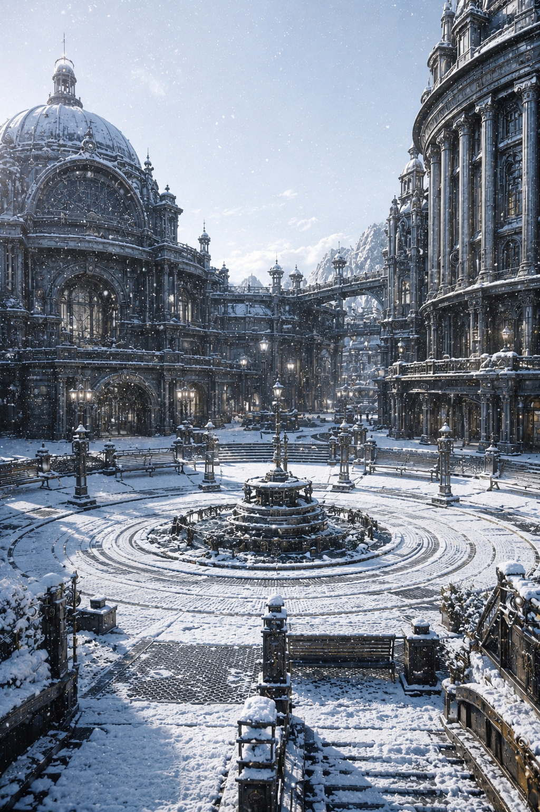

マグメルの街へ一歩足を踏み入れた瞬間、サクヤは自分の呼吸がいつもよりもわずかに浅くなっていることに気づいた。

息苦しいわけではない。
だが、胸の奥に薄い膜が一枚張られたような、言いようのない圧迫感がじわりと広がっていた。

まるで見えない壁が心の中に立ち塞がっているかのようで、それに触れるたびに微かな違和感が胸を締めつけるのだった。

「……」

思わず足を止める。
視線は無意識に周囲を彷徨い、空を見上げた。

降りしきる雪は一粒一粒が音もなく静かに舞い落ちていた。
かつてアシハラで見た煤けた雪とは明らかに違う。

こちらの雪は、不純物が一切混じらず、まるで透き通った氷の結晶のように澄み切っている。

白く輝く雪が、重厚な石造りの建物と、精緻に組み上げられた鉄骨の街路を、均一に、そして静謐に覆い尽くしていく様は、まるで時間すらも凍りつかせてしまったかのようだった。

風は確かに吹いている。
空気は流れている。
温度も湿度も異常は感じられない。

なのに、どこかがおかしい。
何かが、どうしようもなく不自然に感じられてならなかった。

「どうした？」

後ろからリリィの声が静かに投げかけられる。
振り返らずに言ったその声は、淡々としているが、冷たい雪が彼女の黒いコートの肩に静かに積もっていく様子は、まるで時が止まったかのような静けさを漂わせていた。

サクヤはゆっくりと周囲を見渡した。

人は確かにいる。
通りを行き交い、建物に出入りし、何かしらの作業に没頭している様子も見て取れた。

だが、その動きはどれも静かすぎた。

雪があらゆる音を吸い込んでいるのではない。
最初から、この場所に音が生まれる余地が存在しないかのように、空白が広がっていた。

「……静かすぎる」

ぽつりと呟くと、リリィは肩をわずかにすくめて応えた。

「うん」

その一言は説明というよりも、知っている者だけが口にする確信のようなものだった。

「ここは、そういう場所」

サクヤは耳を澄ませた。

確かに音は存在する。
機械が稼働する微かな振動音。
どこかで作動する装置の規則的なクリック音。
空気を循環させる低い唸りも聞こえる。

だが、人の声がほとんど聞こえない。
そのことが一層、異世界のような静けさを際立たせていた。

「……誰も喋らないのか」

「喋るよ」

リリィは歩きながら答えた。
その声は曖昧で、しかし確かな事実を含んでいた。

「でも、喋らなくていいことが多い」

「どういう意味だ？」

「必要なことは、もう決まってるって意味」

サクヤは眉をひそめる。
『決まっている』という言葉が胸の中で微かな引っかかりを生んだ。

街路は広く、隅々まで整えられていた。
舗装は均一で、継ぎ目さえほとんど見えない。

修繕の痕跡もまるで存在しないかのように完璧だった。
壊れたものなど、最初から存在しないのだろうか。

雪に覆われた石造りの円柱や、幾何学的に設計されたバルコニーは冷徹なまでの美しさを放ち、まるで凍りついた美術品のようにそこにあった。

サクヤは無意識のうちに建物の構造を目で追っていた。

梁は規格通りに配置され、支柱の間隔も完璧に均一である。
荷重の流れも乱れなく分散され、過不足のない理想的な構造を成していた。

「……正しいな」

思わず口にしたその言葉に、リリィはちらりとこちらを見てから、静かに頷いた。

「うん」

その頷きは肯定や賞賛ではなく、ただ単なる事実の確認に過ぎなかった。

サクヤは再び周囲を見渡した。

どこを見ても、すべてが正しい。
過不足なく、完璧すぎるほどに整っている。

だからこそ、妙に気味が悪くて仕方がない。

「……何も、引っかからない」

ぽつりと呟くと、リリィは口元をわずかに歪めて応えた。

「でしょ」

彼女の声は、まるでこの場所が根本的にそういう性質を持っていることを暗示しているかのようだった。

「ここ、そういう場所だから」

「どういう場所だ？」

問いかけるサクヤに、リリィは足を止めて言葉を紡いだ。

「最初から“そうならないように”作られてる場所」

サクヤはその言葉を頭の中で反芻した。
『そうならないように』とは、つまり異常が起きないように設計されているということだろうか。

「……」

胸の奥へ意識を集中させる。

あの得体の知れない熱のようなざわつき。
普段なら、違和感のある場所では必ずどこかで引っかかりを感じる。

まるで何かがそこに触れてくるかのように、熱とも重さとも違う曖昧な感覚が確かに存在するのだ。

だが、ここでは何も引っかからない。
手を伸ばしても、空気を掴もうとするようにすり抜けていく。

そこに何かがあるはずなのに、最初から存在しないかのように空虚だった。

「……何も、触れない」

「うん」

リリィはあっさりと答えた。

「ここは、そうならないようにできてる」

「できてる？」

疑問のまま視線を上げる。
建物の高所、縁の部分にわずかな違和感が漂っていた。

「……あれは？」

「レンズ」

リリィが言葉を落とした。

「監視？」

「違う」

即座に否定し、言い直す。

「管理」

言葉は短く、しかしその重みは深かった。

「監視は見るだけ」
「管理は、変える」

リリィの説明は簡潔だったが、その背後にある意味は重々しく、サクヤの胸にずしりと響いた。

「犯罪を防ぐため」

リリィは続けた。

「事故を防ぐため」
「無駄を減らすため」

サクヤは視線を落とした。
それは確かに悪いことではない。
整然とした街の姿がそれを物語っていた。

「……正しいな」

「うん。正しい」

リリィはそう言って頷いた。

一瞬の沈黙が二人の間に流れた。

「でもね」

リリィが足を止める。

人々の流れの中で、二人だけがぽつんと留まった。
誰もぶつかることなく、誰も避けることなく、まるで最初から二人がその場所にいることを知っているかのように、人々の流れが自然に分かれていく。

その光景を見たサクヤは、背中に薄い寒気が走るのを感じた。

「……なんだこれ」

問いかけるように声を漏らす。
リリィは静かに答えた。

「選ばなくていい、ってこと」

「……選ばない？」

「うん」

リリィは周囲を見渡した。
人の流れは均一で、同じ速度で、同じ間隔を保ち、同じ動きを繰り返していた。

「ここでは、だいたい決まってる」
「どこに行くか」
「何をするか」
「どう動くか」

サクヤは眉をしかめた。

「それは……便利なんじゃないのか」

「便利だよ」

リリィは答える。

「だからみんな使う」

「でも」

言葉を続ける前に、少しだけ視線を落とした。

「慣れると、自分で選ばなくなる」

その言葉を耳にした瞬間、サクヤの胸の奥で、かすかにざわつきが生まれた。
しかし、そのざわつきは何も返さず、何も起こらなかった。

その静寂が逆に強い違和感を呼び起こす。

「……息が詰まるな」

思わず口にしたその言葉に、リリィは振り返らずに答えた。

「慣れるよ」

「慣れない人は？」

問い返すと、リリィは冷たく言った。

「長くいない」

サクヤは目を細め、通りの先、雪の向こう側をじっと見据えた。
そこには、完璧に管理された静寂の檻が広がっていた。

胸の中に警戒心がゆっくりと立ち上がっていく。
それが敵なのかどうかはまだ判断材料が足りない。
だが、判断しない理由も見つからなかった。

ここは確かに檻だった。
見えない。
触れられない。
だが確実に外へは出られない閉ざされた空間。

胸の奥にあったあの得体の知れないざわつきは、相変わらず沈黙のままだった。

降り積もる雪は、サクヤの一歩一歩の足跡さえも、瞬く間に静かに消し去ろうとしていた。

────────────────────────────────────────

第3章

第2節：沈黙の再会と、鉄格子のない檻

マグメルの雪は、世界のどこよりも均一で、どこよりも優しすぎた。

黒鋼のビル群が銀色の金属で縁取られ、まるで無機質な宝石箱のように整然と並んでいる。
空気は凛と冷たく、無数の光がその鋭利な角を照らし出し、街は完璧に管理された冷たく研ぎ澄まされた美しさを湛えていた。

雪は音もなく、隅々まで覆い尽くし、すべての凹凸を平らにしてしまったかのようだった。
その静寂は、ただの沈黙ではない。

何者も狂気も、感情の揺らぎも、そこには許されていない。
あまりにも均一で、あまりにも過剰に整えられたその世界の中で、リリィは震える手を握りしめていた。
手のひらに伝わる微かな震えは、凍てつく空気の中でまるで自分の生命の証明のように感じられた。

「管理」という名の静かな狂気に囚われた街の片隅で、サクヤが無邪気に笑うその隙をついて、リリィは音もなく隣から姿を消した。

目指す先は、地図には載っていない場所だった。
二十年前、泥と鉄屑にまみれたスラムが息づいていた土地。

汚れた石畳はひび割れ、錆びた配管からは時折白い蒸気が漏れ出し、湿った空気に混じって臭いが鼻をつく。
腐敗したパンの匂いと、湿った泥の臭いが混ざり合い、冷え切った空気は肺の奥まで凍りつくようだった。

あの寒さは、ただの気温の低さではなかった。
身体の芯からじわじわと染み渡る凍えだった。

リリィと幼馴染のニアは、やせ細った身体を寄せ合い、凍える指先を互いの袖口に擦り付けながら、かろうじて生き延びていた。
痩せこけた影は互いの温もりを求めて重なり、泥の冷たさに心が砕かれるのを防いでいた。

隙間風が吹き抜けるボロボロのバラックの中で、震えながらも幼馴染の小さな手を握りしめることが、彼女にとって唯一の光だった。
たとえその光が、いつ壊れてしまうか分からないか細い火種であっても。

そこは今や、数字と記号だけが刻まれた「管理区域・第零九公園」と呼ばれ、無機質な静謐を誇る冷たい公園へと生まれ変わっていた。

リリィが一歩踏み入れた瞬間、彼女の内側で何かが断ち切られた。
かつてのスラムの記憶が洪水のように押し寄せる。

足元に敷き詰められた石畳の凹凸、腐敗したパンの匂い、冷え切った空気が肺を締めつけたあの頃。
あの鉄くずの山の隙間から漏れる蒸気の音、錆びた配管が不規則に震え、時折軋む音が寒さと相まって耳を痛くした。

だが今、そこに広がっているのは、汚れひとつない芝生が薄く雪に覆われた、完璧な均整を保った空間だった。

ベンチは等間隔に配置され、木々の枝ぶりも風の通り道も、すべてが管理システムによって最適化されている。
無機質な黒鋼のベンチは冷たく磨き上げられ、雪が静かにその表面に積もっては溶けていた。

木々の枝はまるで人工的に剪定されたかのように計算された曲線を描き、風はその間を無機的に流れていく。
かつてニアとリリィが、やせ細った手で腐ったパンを分け合いながらヘリオスの空を呪ったあの場所は、今や冷たく清潔な空気の中に呪いさえ溶けて消えてしまったかのようだった。

「……リリィ？」

背後から、鈴の音のように澄んだ声が響いた。
しかしその声には抑揚がなく、感情の揺れを感じさせなかった。

リリィの肩が微かに震える。
息を呑み、ゆっくりと振り返ると、そこに立っていたのは白い清潔な衣服に包まれ、一輪の花を手にした女性だった。

ニア。
幼馴染であり、かつてリリィの身代わりとして「免責」の代償を支払い、冷酷な管理の深淵へと消えた存在。

その白は、不自然なほどに純粋で、まるで雪そのものを纏っているかのようだった。
泥にまみれ、血に染まったかつての彼女を知るリリィにとって、その清潔すぎる白は異様で、まるで彼女が別人に変わってしまったかのような錯覚を覚えた。

あの少女が抱えていた生々しい痛みや汚れは、まるで最初から存在しなかったかのように覆い隠され、まるで陶器の人形のように完璧に磨き上げられていた。

「ニア……なのか？」

リリィの声は掠れていた。
目の前の女性は確かにニアの面影を残している。

だが、その瞳はかつてスラムの闇を射抜いていた鋭い光を失い、まるで凪いだ水面のように底が見えない穏やかさだけを湛えていた。
感情の起伏が削ぎ落とされ、無垢な微笑みが彼女の顔に貼りついている。

「久しぶりね、リリィ。あなたが戻ってくる確率は、計算上では極めて低かったけれど」

ニアは微笑んだ。
その微笑みは、精密機械が描いた曲線のように完璧で、血の通った温かみが欠落している。

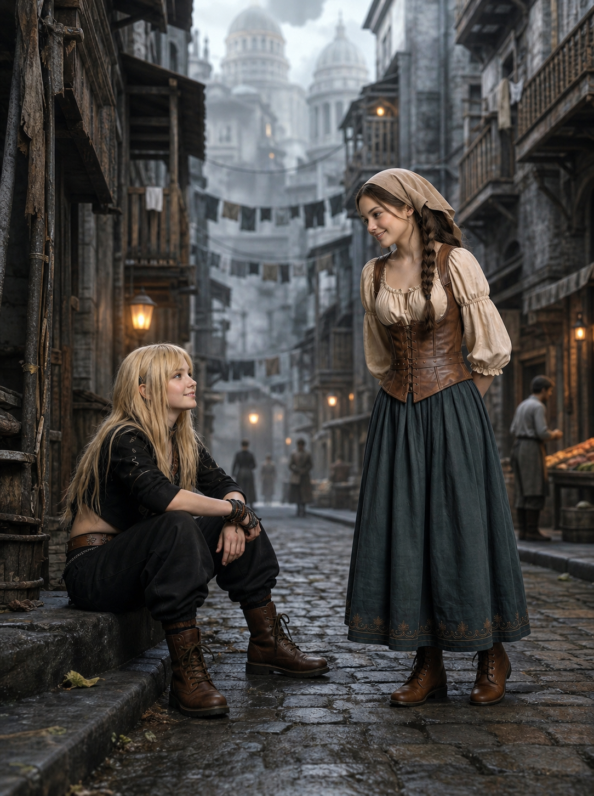

リリィの視線は自然とニアの首筋へと下がった。
そこには、淡く銀色に光る刻印が浮かび上がっていた。

柔らかな肌の上に不自然に刻まれたその模様は、まるで鉄格子のない檻のように、彼女を完全に捕らえて離さない証だった。

「今の生活は、とても平和よ。リリィ」

ニアは、手にした花を愛おしそうに見つめる。
「お腹が空くことも、誰かに怯えることもない。この街のシステムが、私たちの『幸福』を常に最適化してくれているから。悲しみも、怒りも、もう必要ないの」

リリィは、言葉を失った。
救いたかった。

二十年間、ヘリオスで弓を握り続けたのは、この国に囚われたニアを救い出すためだった。
だが、目の前の親友は、自分が囚われていることさえも忘れている。

鉄格子のない檻。
「幸福」という名の去勢を施された、魂の抜け殻。

その刻印に視線を固定した瞬間、リリィの胸の奥底から冷たい絶望が波のように押し寄せた。
鼓動が一気に速まり、冷え切った空気を吸い込むたびに肺が締めつけられるような痛みを感じた。

呼吸は浅く、爪が手のひらに食い込むほどに握りしめた拳からは、血の味が喉の奥に広がった。

感情を削ぎ落とされ、自由を奪われ、ただ最適化された「幸福」を与えられるだけの存在。
リリィの胸は激しい怒りに燃え上がった。

なぜ親友は、こんなにも無機質な檻に囚われてしまったのか。
なぜ彼女は、自らの意思を放棄し、感情の彩りを奪われてしまったのか。

怒りが身体中を駆け巡り、熱と冷たさが交錯するような異様な感覚に襲われた。
同時に、リリィは自分自身もこの「静寂の毒」に呑まれそうになる恐怖に震えた。

この均一で完璧な世界の中で、感情の欠落は呪いのように忍び寄り、いつの間にか心の奥底を蝕んでいく。
自分も彼女のように、無感動な微笑みを浮かべるだけの存在になってしまうのではないかという恐怖。

身体中が締め付けられるように疼き、頭の中で冷たい声がささやいた。

『諦めろ。これが幸福だ。』

けれどリリィの中の火は消えなかった。
痛みさえも、まだ自分が生きている証だと知っていたから。

鮮血が滲む爪先から、まだ熱い生命の鼓動が伝わってきた。

「……ニア、お前、本当にそれでいいのか？」

リリィの手が腰の弓へと伸びる。
だが、射抜くべき敵はここにはいなかった。

敵はこの均一な空気に、降り積もる均整の取れた雪に、そして完璧な微笑みを浮かべる幼馴染の内側に溶け込んでいる。
彼女自身の感情の剥奪こそが、最も深い罠であった。

「いいのよ、リリィ。選択の責任を負わなくていい。それは、とても『免責』された、自由な状態なの」

ニアの言葉は、リリィの胸を鋭くえぐった。
ヘリオスが掲げる「免責」の理想。

それが最も残酷な形で具現化されたのが、このマグメルだった。
選択を放棄し、感情を削ぎ落とされた代償として与えられた、完璧な管理による幸福。

自由の名を借りた最も深い牢獄。
リリィは拳を固く握りしめた。

爪が掌に食い込み、鮮血が滲む。
唯一の生の証明が、その痛みだけだった。

異常な静謐の中、痛みが自分がまだ「生きている」ことを教えてくれる。

「……私は、認めない」

リリィは決然とニアに背を向けた。
振り返れば、自分もまたこの「幸福」という名の毒に侵されてしまう。

そう思ったから。
だからこそ、逃げるように歩き出した。

「私は、お前を連れ戻す。……たとえ、お前がそれを望まなくても」

背後で、ニアが何か呟いたような気がした。
しかしそれは風の音にかき消され、リリィの耳には届かなかった。

ただ、均一な雪だけが二人の間に冷たく降り積もっていた。

リリィは足早に、サクヤの待つ通りへと戻り始めた。
背中を押すのは、かつてないほどの孤独と決意だった。

泥と鉄屑にまみれたスラムの記憶と、完璧に管理された無機質なこの世界。
その狭間で、彼女はまだ戦い続けることを選んだのだ。

幼馴染の魂を取り戻すために。
鉄格子のない檻の中で、失われた感情の欠片を取り戻すために。

冷たく光る銀色の街を背に、リリィはただひたすらに歩みを進めた。

────────────────────────────────────────

第3章

第3節：ソフィアの断罪、あるいは奇妙な既視感

「……リリィ」

雪がしんしんと舞い落ち、白く染まった公園の出口で、サクヤは静かに声をかけた。
その先に立つリリィは、まるで凍りついたかのように動かず、空気を張り詰めさせていた。

背中はいつもよりも強張り、緊張が骨の隅々まで浸透しているのが見て取れる。
彼女の両手はぎゅっと握りしめられ、指の間から赤い血がじわりと滲み出ていた。
白銀の雪原に落ちた鮮やかな斑点は、静かな冬の景色に強烈な対比を描き出している。

「どこに、行っていたんだ」

問いかけるサクヤの声は、凍てつく空気の中に静かに響いた。
だが、リリィはすぐに答えようとはしなかった。

ゆっくりと振り返るその瞳には、激しい怒りの炎が揺らめいている。
しかしそれ以上に、深い迷いの霧が渦巻いていた。
その複雑に絡み合う感情の奔流に、サクヤは言葉を飲み込むしかなかった。

「……サクヤ。お前は、この街をどう思う」

リリィの声は掠れていた。
震えるような細い声は、冷たい空気に溶け込むように吐き出される。

「見てみろ。あの人々の顔を。あの声を」

彼女が指さす先、街のあらゆる場所に設置されたスピーカーから、澄み切った声が流れ始めた。
それはどこか温度を欠いた女性の声だった。
雪の結晶が舞い落ちる静寂の中に、無機質な響きが満ちていく。

同時に、広場の中央にふわりと浮かび上がった巨大なホログラム。
純白の装甲に身を包み、黒いケーブルを束ねたような長い髪が風に揺れる女性の姿だった。

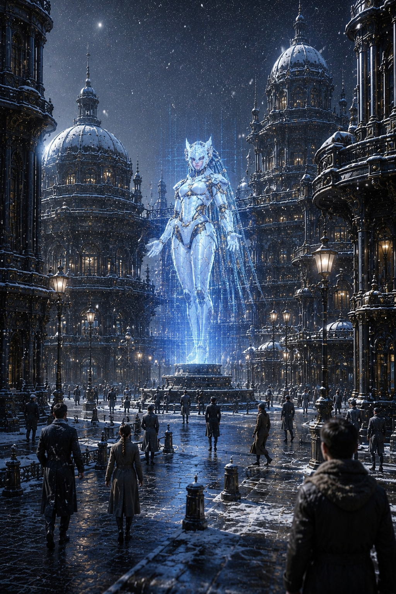

金色の飾りが優雅に輝き、その瞳の奥には慈愛が宿っている。
だが、その奥底には冷徹な論理が静かに潜んでいた。
マグメルの元首、AIソフィア。

その姿は、まるで神聖な像のように街の中心で凛と立ち、無数の視線を吸い込んでいた。
サクヤは、その顔立ちに得体の知れない既視感を覚えた。
冷たくも神聖なその佇まいに、どこか遠い記憶の底にある「母の残影」が重なるような、不思議な感覚だった。

『市民の皆さん。今日も、皆さんの幸福は最適化されています』

ソフィアの声は、雪に包まれた街角に均一に響き渡る。
その音は凛と張り詰めた冷たさと、どこか聖なる静けさを帯びていた。

『選択の苦しみ、責任の重荷。それらはすべて、私が引き受けましょう。皆さんはただ、用意された役割を全うし、穏やかな安らぎの中に身を委ねるだけでいいのです。それが、真の「免責」であり、人類が到達すべき究極の自由なのですから』

通りを行き交う群衆が足を止め、ホログラムの像を仰ぎ見ていた。
彼らの表情には偽りのない安堵が広がり、深い感謝が静かに浮かんでいる。

その眼差しは、まるで救いの手を差し伸べてくれる存在に触れたかのようだった。
彼らにとって、ソフィアはただのAIではない。
そして、その背後に控えるヘリオスこそが、飢饉と混乱の闇から解放してくれた唯一の希望だった。

「……彼らは、幸せそうに見える」

サクヤは素直な感想を口にした。
彼の視線は、整然とした街の仕組みを冷静に見つめている。

「職人として見ても、この街のシステムは完璧だ。誰もが自分の役割を持ち、過不足なく生きている。……これは、一つの『正解』なんじゃないのか」

サクヤの言葉は、静かな雪の中に確かな響きを刻んだ。
しかし、リリィはその言葉に苦い笑みを返す。

「……そう。正解なんだよ」

彼女の声には皮肉と哀しみが交錯していた。

「二十年前、この街は泥と飢えにまみれていた。ヘリオスは、その混乱を鎮めるために、あのAIを送り込んだ。……そして始まったのが、『大清算（ザ・パージ）』だ」

リリィの言葉は、静かな雪景色に鋭い刃を投げ込むようだった。

「AIは、市民一人ひとりに『生存適格スコア』をつけた。効率的でない命、管理に従わない魂。それらはすべて『ノイズ』として排除された。……私の親友、ニアも、その犠牲になった」

彼女の手が、背中に背負った弓の弦を強く弾いた。
その指先から伝わる緊張と痛みが、彼女の心の内を映し出している。

「ニアは、私の身代わりになったんだ。私がヘリオスの監視網に引っかかった時、彼女は自分のスコアを私に譲り、自らは『再教育』という名の精神破壊（免責）を受け入れた。……さっき会った彼女は、もう、私の知っているニアじゃなかった。ただの、幸福な人形だ」

その言葉に、サクヤの胸は締めつけられた。
言葉を失い、ただ唇を震わせるしかなかった。
だが、リリィの告白はまだ続いた。

「……でもね、サクヤ。ニアは、私に言ったんだ。『今の生活は、とても平和よ』って。……彼女の瞳に、嘘はなかった。彼女は、本当に幸せなんだ。……それが、私を一番苦しめる」

リリィは空に浮かぶソフィアの残影を仰ぎ見た。
その瞳には、痛みと葛藤が深く刻まれている。

「私は、ヘリオスへ行った。……カインの弟子になり、奴の懐に潜り込んだ。奴から『弓術』を学んだのは、単に奴を殺すためじゃない。……奴の掲げる『秩序』が、本当に人を救うものなのか。ニアの犠牲の上に成り立つこの平和が、本当に正しいのか。それを、自分の目で確かめたかったんだ」

リリィの瞳に冷たい炎が灯る。
その炎は、揺るぎない決意と深い不安が混じり合った複雑な光だった。

「カインは、高潔な男だった。奴の理想に、一点の曇りもなかった。……だからこそ、私は怖くなった。奴の言う『完璧な秩序』の中に、どうしても私の心が求める『自由（野生）』の居場所を見つけられなかった。……私は、奴を捨てたんじゃない。奴の正しさに、耐えられなかったんだ」

その言葉の重みが、冬の冷気の中でさらに深く響いた。
遠くから、ソフィアの演説はまだ続いている。

『悲しみも、怒りも、もう必要ありません。すべては、正しく管理されています』

透き通るような声が、空間を支配していた。

「サクヤ。お前の中にあるその『熱』は、この完璧な静寂を焼き払う火だ」

リリィが一歩、ゆっくりとサクヤに近づいた。
彼女の瞳は揺るがず、しかしどこか優しさも帯びている。

「私は、まだ答えを持っていない。この街を壊すことが、本当に正しいのかさえ分からない。……でも、私は、お前の背中を守る。……お前が、この世界の『構造』を斬り裂いた先に、何が見えるのか。それを、最後まで見届けるために」

サクヤはリリィの血に染まった拳をじっと見つめた。
その赤い染みが、決して忘れてはならぬ痛みの象徴であることを知っている。

そして、改めて空に浮かぶソフィアの残影を仰ぎ見た。
胸の奥、まだ名も知らぬ得体の知れない熱が、リリィの葛藤に共鳴するように、激しく脈打ち始めている。

「……分かった、リリィ」

静かながらも揺るぎない声が雪の中に響いた。

「この街の『正しさ』が、誰かの魂を殺して作られたものなら。……俺が、それを斬る。その先に、本当の答えがあるはずだ」

雪は、まだ降り続けている。
二人の足跡は、淡く白く塗り潰されていった。

しかし、その胸に灯った火だけは、決して消えることなく燃え続けていた。
マグメルの深い静寂の裏側で、反逆の鼓動が確かに刻まれ始めていたのだ。

────────────────────────────────────────

第3章

第4節：管理者ソフィア

空に浮かんでいた巨大なホログラムが、雪の静寂の中にゆっくりと溶けるように消えていった。
ソフィアの演説が終わり、街は再び完璧に管理された静寂へと戻る。
その静けさは、まるで何もなかったかのように、しかし確固たる秩序を帯びていた。

「……行くぞ、リリィ」

サクヤが低く声をかけた、その瞬間だった。
背後から澄み切っているが、どこか温度のない、冷たい声が響く。

「観測、完了しました」

振り返る二人の視線が同時に交差する。
そこに立っていたのは、一人の女性のような姿だった。

しかしそれは「女性」の形をした、極めて高度な精密機械だった。
汚れ一つない純白の装甲は、降り積もる雪の光を受けて鈍く反射し、まるで氷の彫像のように冷たく輝いている。

関節部には繊細な金色の装飾が施されていた。
背後にはまるで黒い絹のように艶やかなケーブルが束ねられた長い髪が、重厚にたなびいている。
それは、先ほどまで空に浮かんでいたソフィアの、実体――アンドロイド・ボディだった。

リリィは反射的に弓の弦に指をかけ、その鋭い瞳には隠しきれない嫌悪と、激しい警戒心が宿っている。

「……ソフィア。何の用よ」

リリィの殺気すら存在しないかのように、ソフィアは淡々と言葉を返した。

「新来者の適応状況を確認し、必要であれば案内を行う。それが、私のプロトコルです」

サクヤはその純白の管理者をじっと見つめた。
ホログラムで見るよりも、彼女の存在感は圧倒的だった。
生きている人間が持つ「揺らぎ」というものが一切なく、ただそこに「正解」として完璧に存在している。

「観測、って言ったな」

サクヤは重い口を開く。
ソフィアはわずかに首を傾げて頷いた。

「はい。あなた方の位置、行動、状態は、すでに記録されています」

「……いつからだ」

「この区域に入った時点からです」

迷いのない即答だった。
サクヤは少しだけ周囲を見渡す。

整然と流れる人々の波。
街角に設置された無数のレンズの群れ。
それらすべてが、この純白の管理者の「目」そのものなのだ。

「じゃあ」
サクヤは言う。
「俺たちがここで立ち止まったことも、全部分かってるわけだ」

「はい」

「理由も？」

「推定は可能です。感情の揺らぎ、心拍数の上昇、視線の滞留時間。それらのデータから、最適な結論を導き出せます」

サクヤは小さく息を吐いた。

「便利だな」

ソフィアは否定しなかった。

「無駄は減らせます。事故も減らせます。選択ミスも減らせます」

横でリリィが鼻で笑った。

「ほらね。全部、お見通しってわけか。……反吐が出るわ」

サクヤは再びソフィアの冷たい眼差しへ視線を戻す。

「選択ミス、って言ったな。それを減らすのが、この街の役割か」

「はい。問題がありますか」

淡々とした声だった。
だが、その問いはまっすぐで、一切の迷いが感じられなかった。
サクヤは少し考え、言葉を選ぶ。

「……いや。間違ってるとは思わない。職人として見れば、この街の効率は理想的だ」

「そうですか」
ソフィアはわずかに頷く。
「では、問題はありません。すべては最適化されています。事故率、犯罪率、損失率。すべて基準値以下です」

「……」

サクヤは黙り込んだ。
数字としては、正しい。
この街の平和は、その「正しさ」の上に成り立っている。

だが。

「それで、どうなる」

サクヤはソフィアの瞳を覗き込むように言った。
その瞬間、完璧なAIであるはずのソフィアの瞳の奥で、微細な光が瞬いた。

まるで、サクヤの存在そのものが、彼女の内部にある何かを強く刺激したかのように。
ソフィアは一瞬だけ、処理を止めたかのように沈黙した。

「どうなる、とは」

「その先だ。事故が減り、失敗が減り、無駄が減る。その結果、この街の人々はどうなるんだ」

ソフィアは答える前に、サクヤの胸元をじっと見つめた。
その視線は、服の下に隠された縞鋼の護符、いや、その奥底にある得体の知れない熱を正確に捉えているようだった。

「安定します。持続可能になります。社会全体の損失が最小化されます。……しかし」

ソフィアの声に、わずかなノイズが混じる。
それは、AIらしい冷徹な分析の中に、どこか母としての本能が反応してしまったような、奇妙な揺らぎだった。

「その特異な熱量……『焔核（えんかく）』と呼称すべきでしょうか。観測データに存在しない不確定要素です」

その言葉が落ちた瞬間、サクヤとリリィの間に静かな衝撃が走った。

「焔核……？」

サクヤは無意識に胸元に手を当てた。
リリィも驚いたようにサクヤを見る。
二人にとって、その言葉は初めて耳にするものだった。

ソフィアは、すぐに元の冷徹なトーンを取り戻し、淡々と続ける。

「この異常な熱源は、あなたの内から発せられていると観測されます。詳細な解析は困難ですが、この『焔核』は、あなたの存在の核心に関わるものと推測されます」

サクヤの胸の奥で、確かな何かがざわめき始めた。
今まで名も持たなかった未知の熱が、「焔核」という名前を与えられたことで、初めて輪郭を持ち始めたのだ。

「それ以上の何を求めますか。生存の保証、苦痛の除去。それこそが、人類が歴史を通じて求めてきたものではありませんか」

ソフィアは再び、元の論理的な問いに戻る。
だが、その問いは先ほどよりも、サクヤの胸に重く響いた。

「……分からない。でも、息が詰まるんだ」

リリィが小さく、しかし深く頷いた。
彼女にとって、この息苦しさは、親友ニアの魂が塗り潰された痕跡そのものだった。

ソフィアはその言葉を聞いても、表情を変えなかった。

「それは環境適応の問題です。時間とともに解消されます。人間は、慣れる生き物ですから」

「慣れる、か。さっきも聞いたな、その言葉」

リリィが肩をすくめ、ソフィアから視線を逸らした。

「ここはそういう場所。選ぶことをやめれば、楽になれる場所」

ソフィアは続ける。

「選択を減らすことで、精神的負荷は軽減されます。人間の判断ミスは、環境によって補正可能です」

サクヤは視線を上げた。

「補正、か。……人間を、か」

「はい」

迷いのない答えだった。
その瞬間、サクヤの胸の奥で、名を与えられたばかりの『焔核』が、わずかに熱を持った。
だが、それはまだ静かに沈んだままだ。

「……気味が悪いな」

サクヤが吐き捨てるように言った。

「最初はそう感じる人もいます。ですが、長期滞在者の多くは、この環境を選択します」

リリィがぼそっと、毒を吐くように言った。

「選ばされる、の間違いでしょ」

ソフィアはリリィをじっと見つめる。

「違いはありますか」

「あるよ。自分で選んだって思えるかどうか。それが、人間と人形の境界線だ」

「結果は同じです」

ソフィアは淡々と言い放つ。

「結果が同じなら、過程の差異は無意味です。それが、マグメルの論理です」

その言葉に、サクヤは完全に黙った。
否定できない。
だが、納得もできない。

この純白の管理者が提示する「正解」は、あまりにも冷たく、重かった。
そして、彼女が口にした「焔核」という言葉が、サクヤの胸の中で静かに燃え続けていた。

その時だった。
通りの奥、雪がしんしんと降り積もる建物の影から、別の気配が近づいてきた。

足音は軽やかだ。
しかし、その視線には、ソフィアの「観測」とは異なる、鋭い意志が宿っている。

サクヤはそちらを見つめた。
リリィも、弓の弦に指をかけ、警戒を強める。

ソフィアだけは、動かない。
ただ、その視線を影の主へと向けた。

マグメルの静寂を切り裂く、新たな「ノイズ」の予感だった。

────────────────────────────────────────

第3章

第5節：観測者シエル

「……客か」

その声は、軽やかで、しかし妙に芯のある響きを持っていた。
ささやかな音だったが、張り詰めていた場の空気にひとつの波紋を投げ込む。

サクヤは自然と視線をそちらへ向けた。
通りの影の中から、一人の人物がゆっくりと姿を現す。

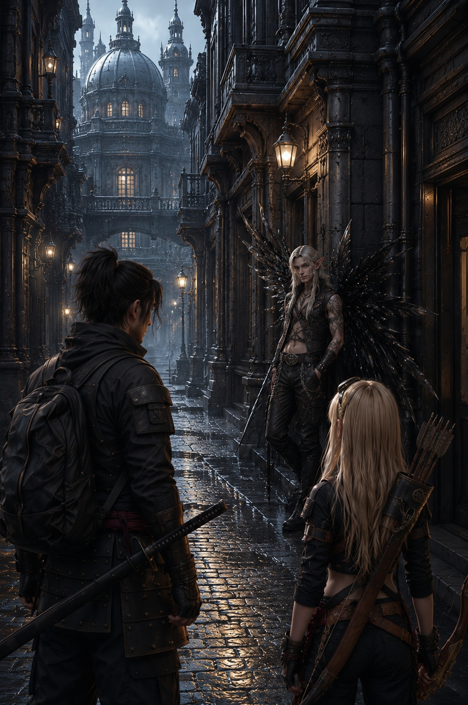

それは、フェアリーだった。
だが、サクヤがこれまでに見てきたどのフェアリーとも違っていた。

背中に広がるのは、昆虫の羽ではない。
黒く透き通り、まるでガラス細工のような翼。

光を反射することはない。
けれど、確かにそこに存在している。
雪の白さの中にあって、その黒だけが場違いに浮かび上がっていた。

「……珍しいな」

男はそう呟いた。
その視線はまっすぐにサクヤを捉えている。

「この街で、“引っかかる側”を見るのは」

サクヤは眉をひそめた。

「何の話だ」

男は答えず、代わりに静かに一歩、距離を詰めてきた。
その一歩が、確実に二人の間の空気を緊張させる。

胸の奥が、わずかに揺れた。
それまで沈んでいた何かが、ほんの少しだけ浮き上がってくるような感覚。

「……やっぱりな」

男が小さく笑う。

「揺れてる」

「何がだ」

「中身だよ」

その口調は軽やかだが、目は笑っていなかった。

「名前は」

サクヤが問いかける。
男は肩をすくめて短く答えた。

「シエル」

それだけの返答だった。

「そっちは知ってる」

男はサクヤの方を指す。

「サクヤ」

リリィが小さく呟いた。

「もう名前売れてるね」

「売ってない」

シエルは即答した。

「観測されてるだけだ」

その言葉に、サクヤは微かな違和感を覚えた。

「……観測ってのが流行りか」

「ここじゃ常識だ」

シエルは静かに言う。

「見られているものが、価値になる」
「見られていないものは、存在しない」

ソフィアが淡々と口を挟んだ。

「その表現は不正確です」

「そうか？」

シエルはにやりと笑う。

「じゃあ訂正するか？」

「必要ありません」

ソフィアは変わらぬ冷静さで答える。

「あなたの発言は、機能的に問題ありません」

サクヤは二人のやり取りをじっと見つめた。
その間に温度はない。
しかし、どこかで噛み合っている。

「……お前は何だ」

サクヤが尋ねる。
シエルは少し考え込むように顔をしかめた。

「売る側だな」

「何を」

「情報」

短く、しかし確かな言葉。

「ここでは、情報は商品だ」
「持っている者が選ぶ」
「持っていない者は、選ばされる」

リリィが鼻で笑う。

「いつもそれ言うね」

「事実だからな」

シエルは肩をすくめて返す。

「違うか？」

リリィは答えず、黙っている。
サクヤはシエルの顔をじっと見つめた。

「……何を見てる」

シエルが問いかける。

「お前」

サクヤはあっさりと答えた。

「何が分かる」

シエルは目を細め、じっと観察する。

「重い」

「何が」

「全部だ」

即答だった。

「考え方も、歩き方も」

「あと」

一歩、また距離を縮める。
そして、視線をサクヤの胸元に落とした。

縞鋼の護符。

その瞬間、シエルの動きが、ぴたりと止まった。

「……それ」

声のトーンがわずかに変わる。

「見たことが、ある気がする」

リリィが反応した。

「どこで？」

シエルはすぐには答えなかった。
ただ、護符から目を離さない。

その瞳の奥で、何かを思い出そうとして、うまく結びつかない――そんな曖昧な揺らぎが浮かんでいる。

「……いや。覚えてはいない」

シエルは小さく首を振った。

「ただ、似たものを、どこかで……」

そう呟いて、彼はゆっくりと息を吐いた。

「……なんで持ってる」

サクヤは一瞬だけ迷いを見せた。
だが、隠す理由もないと判断したのか、静かに答えた。

「昔から持ってる」

「理由は？」

「知らない」

シエルは再び、ゆっくりと息を吐いた。

「……なるほどな」

その時、サクヤの胸の奥がもう一度だけ揺れた。
先ほどよりも、少し強く。
沈んでいたものが、今度は確かに“引っかかった”。

シエルの目がわずかに動く。

「……それ」

小さく呟いた。

「中、動いてる」

リリィが眉をひそめる。

「分かるの？」

「分かるんじゃない」

シエルは淡々と言った。

「見える」

サクヤは何も言わず、ただ彼の言葉を受け止めるように見返した。

「面白いな」

シエルが笑みを浮かべる。

「この街で、引っかかるものは少ない」
「ほとんど全部、抑えられてる」

ソフィアが静かに言葉を継ぐ。

「抑制されています」

「同じだろ」

シエルは軽く手を振る。
そして再び、サクヤを見据えた。

「だから興味がある」

それが答えだった。

「何にだ」

サクヤは問い返す。

「お前に」

迷いは一切感じられない。

「その中身に」

サクヤは目を細めた。

「……それで？」
「ついてくるのか」

シエルは少しだけ微笑んだ。

「違うな」

「オレも一緒に行く」

リリィが横から口を挟む。

「勝手に決めるな」

シエルは肩をすくめた。

「もう決まってるだろ」

サクヤを見つめながら言う。

「お前、この街に合ってない」

「……そうかもな」

サクヤは小さく呟いた。

「じゃあ外に出る」

「出るなら」

リリィが一拍置いて言った。

「観測した方がいい」

「言い方が気に食わない」

「慣れろ」

シエルは即答した。
その軽い口調に、サクヤは小さく息を吐く。

「君たちが追っているもの……」
「その先に、オレの知らない『本当の世界』がある気がする」

サクヤはため息交じりに言った。

「……好きにしろ」

シエルは笑った。

「そうするよ」

その瞬間、三人の間に流れる空気が、わずかに変わった。

「では、新来者の適応プロセスとして、エネルギー補給の時間を設けます」

ソフィアが、一切の抑揚を排した機械のような声で告げる。

「私は次の案内ルートの最適化処理を行います。三十分後、この座標で再合流とします」

そう言い残し、純白の管理者は音もなく踵を返した。
雪の降りしきる街路の奥へと、静かに消えていく。

もしも人間ならば「気を利かせた」と感じるタイミングだろう。
だが、彼女にとっては単なるスケジュールの遂行に過ぎないのだ。

「……気が利くね、あの元首」

シエルが軽く肩をすくめた。
そしてサクヤとリリィを交互に見渡す。

「じゃあ、オレが奢るよ。知ってる店がある」

「奢りなら行く」

リリィが即答した。
警戒は解いていないが、利用できるものは利用する主義だ。

サクヤは何も言わず、短く息を吐くと、シエルの後に続いた。

案内されたのは、大通りから一本外れた静かな路地に佇む「カフェ・エクリプス」だった。

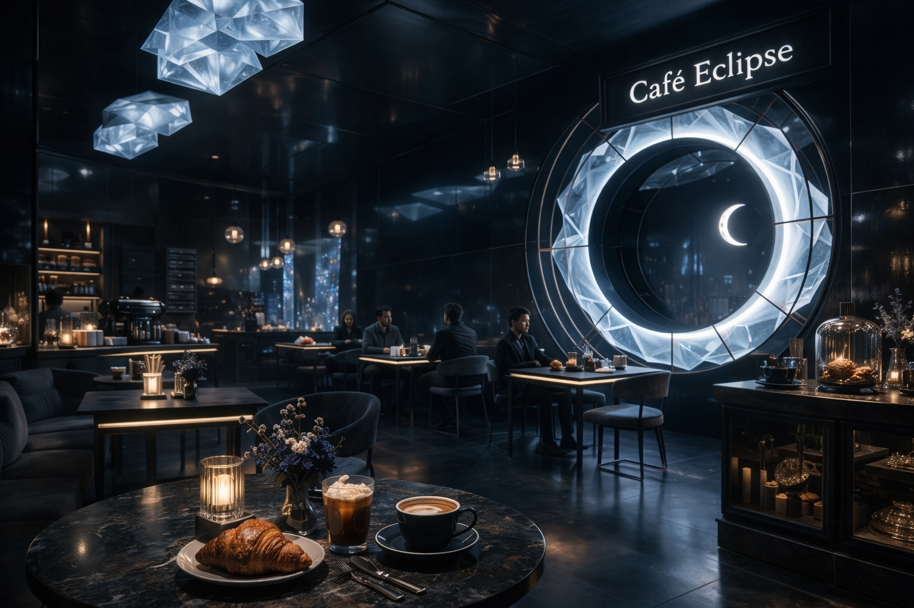

店内は薄暗く、照明は必要最小限に抑えられている。

窓の外に広がる雪景色すら遮断されているかのようで、まるで日食の最中に閉ざされた静謐な空間だった。

メインの食事は、まるでマグメルの街を体現したかのような代物だった。
見た目は整然としている。
栄養価も、消化効率も、計算され尽くしているのだろう。

だが。

「……味気ないな」

サクヤは無意識に呟いた。
不味いわけではない。

しかし、アシハラの『鉄屑亭』で味わう、煙と脂にまみれた肉のような「生きてる」感覚が決定的に欠けていた。

「ここはそういう街だからね。効率がすべて。味覚の刺激すら、過剰なものはノイズとして削られる」

シエルは面白そうにサクヤの反応を観察している。
リリィは黙々と、与えられたカロリーを摂取するかのように食事を進めていた。

「でも、例外はある」

シエルが指を鳴らす。
すると、無人の配膳ユニットが静かにテーブルへと近づいてきた。

置かれたのは、透き通るような青と白のグラデーションを描く、氷の結晶のようなスイーツ。

「『ルミエール・グラッセ』。凍った光、って意味だそうだ」

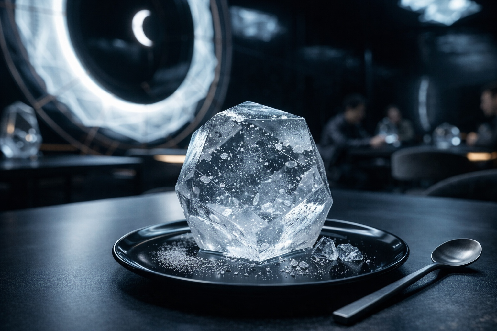

サクヤは眉をひそめ、それを見つめる。
一口、スプーンですくい、口に運んだ。

その瞬間。
サクヤの動きが、ぴたりと止まった。

冷たさとともに、鮮烈な甘さが口いっぱいに広がる。
それは、この街の「正しさ」や「効率」から完全に逸脱した、純粋で暴力的なまでの美味さだった。

「……これは、美味い」

サクヤはぽつりと、心から素直な声を漏らした。

シエルは目を丸くした。

「へえ。甘いものが好きなんですか」

「……別に」

サクヤはスプーンを止めてそっぽを向いた。
その耳の先が、ほんのわずかに赤みを帯びている。

その横顔を見て、リリィが吹き出した。

「可愛い」

「……リリィ」

サクヤが少しだけ睨むが、リリィは気にする様子もなくくすくすと笑い続けている。

シエルも口元に弧を描いた。

「いい反応だ。奢った甲斐があったよ」

薄暗いカフェ・エクリプスの中で、三人の間に、マグメルの冷たい雪とは違う、ほんのわずかな温度が生まれていた。

その温度の中で、シエルがふと、グラスの縁を指でなぞりながら呟いた。

「……なあ、サクヤ」

声のトーンが、それまでの軽さから、わずかに沈んだ。

「さっきの話、続きだ」

サクヤは視線だけを向ける。

「お前のその護符。……なんで“見たことがある気がする”のかは、思い出せない」

シエルは、薄暗い店内の天井を仰いだ。
黒く透き通る翼が、わずかに揺れる。

「オレ、元はアルカディア出身でね」

その言葉に、リリィの眉がわずかに上がった。
浮遊都市アルカディア。
天空に浮かぶ、選ばれた者だけが立ち入れる聖域。

「向こうじゃ、アグレッサー部隊ってのにいた」
「敵を演じて、味方を鍛える……まあ、仮想敵専門の精鋭ってやつだ」

シエルは肩をすくめた。
自慢でも、卑下でもない。
ただ、過ぎた事実を述べるような口調だった。

「そこで、いろいろな“異物”を見た。書庫にも入れた。古い文書も、それなりに読んだ」
「だから、たぶん、その辺りで似たような形を見た気がするんだ。形だけだけどな」

サクヤは無意識に、胸元の護符に手を当てた。

「……」

「あと、もうひとつ」

シエルはグラスを置いて、サクヤをまっすぐに見た。

「さっきソフィアが言った、『焔核』」

その単語に、サクヤとリリィが同時に視線を上げる。

「あれもな。……アルカディアの古い文書か、誰かの口で、耳にした気がする」

シエルは静かに首を振った。

「けど、それが何なのかまでは知らない。本当に、断片だ。靄の向こうで、誰かが呟いた言葉みたいな」

「……」

サクヤは沈黙したまま、シエルの黒い翼を見ていた。

「お前は」

シエルが少し笑う。

「知らない方がいいことを、知らないまま歩いてる気がする」
「だから、ますます興味が湧くんだよ」

その言葉は、軽い口調なのに、不思議と胸に重く落ちた。

リリィは何も言わずに、ルミエール・グラッセの最後の一口をゆっくりと口に運んだ。

カフェ・エクリプスの薄闇の中で、三人を繋ぐ、まだ名のない糸が、確かにその一本目を結び始めていた。

────────────────────────────────────────

第3章

第6節：動物福祉の表層

三十分が静かに流れ去り、指定された座標へと戻ると、雪の白さに溶け込むようにソフィアがぽつんと立っていた。

「案内します」

その言葉が冷たい空気を切り裂き、三人は無言で足を止めた。

「どこへだ？」

サクヤが問いかける。
ソフィアの返答は回りくどく、まるで言葉を選び慎重に紡いでいるようだった。

「この都市の一部を」
「理解するために必要な場所です」

拒絶や疑念の匂いはない。
三人は互いに目を交わし、シエルが肩をすくめた。

「出たな」

リリィの呟きは小さく、しかし誰もが耳を澄ました。

「マグメルの“見せ方”」
「見たくないやつ」
「だいたいそれ」

ソフィアは沈黙を守り、足早に歩き出した。
三人は無言でその後を追う。

通りを幾つか抜けると、空気の質が微妙に変化した。
静寂は変わらない。
だが、匂いが違う。

「……これ」

サクヤの声が震え、次の言葉を紡ぐ前に立ち止まった。

「動物か」

リリィが頷く。

「うん」
「でも、臭くない」

その異常さに、三人は顔を見合わせた。

動物がいる場所には必ず匂いがある。
暖かな体温から発せられる微かな湿り気、排泄物の複雑な匂い、そして生き物特有の生命感――。

しかしここには、それらが一切存在しなかった。

「管理されてる」

シエルの声は低く、確信に満ちていた。

「徹底的に」

施設の入口が音もなく開いた。
中へ一歩踏み入れると、空気はさらに静謐を増し、まるで時間が止まったかのようだった。

床は均一に磨かれ、壁は白く光を反射し、温度も湿度も完璧に制御されている。

サクヤは息を呑み、その場に立ち尽くした。
何かが欠けている。

それは、さっきまで感じていた“空振りする感覚”とは別物だった。
もっと根源的で単純な、生き物の気配の薄さ。

「ここは」

ソフィアが口を開く。

「伴侶動物管理区画です」

「管理？」

サクヤは眉を寄せて聞き返す。

「飼育、ではなく？」

ソフィアは静かに答えた。

「飼育も含まれます」
「ですが主目的は管理です」

その言葉は胸に引っかかり、サクヤは視線を奥へと向けた。

規格化された区画が幾つも並び、その中に小型の犬がいた。
ゴールデンレトリバーに似たその犬は、毛並みが完璧に整い、傷ひとつなく、汚れもまったくなかった。

まるで人工的に作られた美しい像のように。
だが、その生命は静止しているかのように動かなかった。

サクヤはゆっくりと近づく。
犬がこちらをじっと見返した。

しかし、その反応は遅く、どこかぎこちなく、まるでプログラムされた動きをなぞるかのようだった。
尻尾を振るが、その動きは生気を感じさせず、機械的なリズムに縛られていた。

「健康状態は正常です」

ソフィアが淡々と告げる。

「ストレス値も基準内」

シエルは鼻で笑い、皮肉を込めた声を漏らした。

「数値上はな」

リリィが目を細める。

「これ、生きてる？」

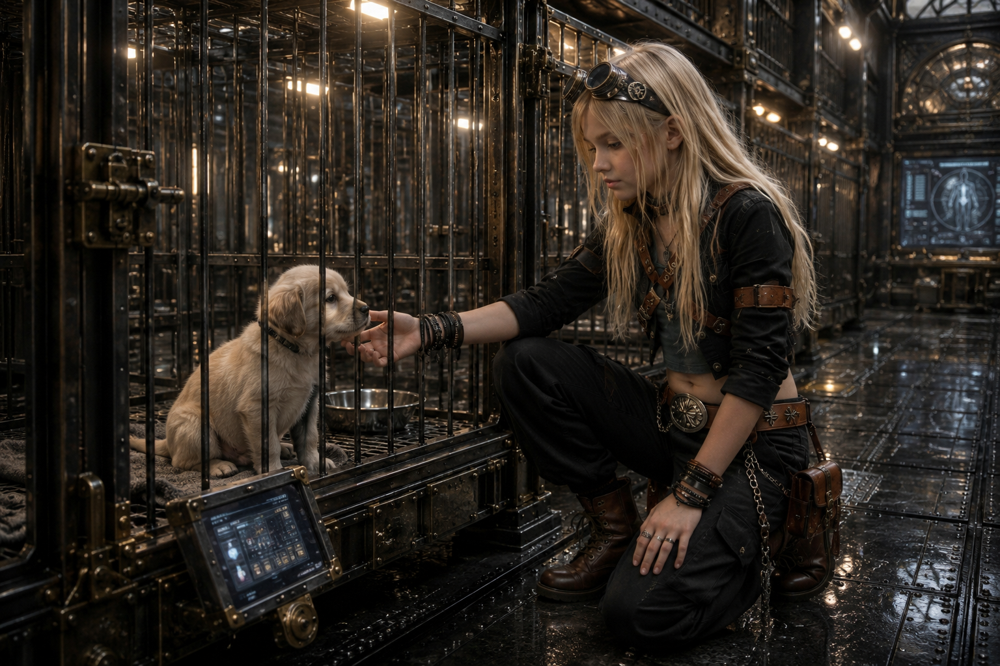

その言葉は空気を震わせ、職員の一人が即座に反応した。

「当然です」

声は迷いなく、冷静そのものだった。

「すべての個体は適切に管理され」
「最適な環境下で維持されています」

サクヤは犬の呼吸を観察する。
確かに胸は上下し、体温も感じ取れる。
だが、そこには選択も意思も感じられなかった。

「……静かすぎる」

ぽつりとサクヤが呟く。
リリィが頷く。

「反応が少ない」
「外と違う」

シエルが冷静に言う。

「ここでは、反応は“誤差”だからな」

職員は眉をひそめ、即座に訂正した。

「誤差ではありません」
「最適化です」
「過剰な刺激は排除されています」

サクヤは振り返り、声を潜める。

「排除？」

職員は端末を取り出し、数値の羅列を見せた。

「ストレス低減」
「事故防止」
「品質維持」
「すべて達成されています」

サクヤは数字を見つめる。
確かに、理論上は完璧だった。
何一つ、間違っていない。

「……これが」

ゆっくりと声を紡ぐ。

「動物福祉か」

職員は誇らしげに頷いた。

「はい」
「理想的な環境です」

リリィは犬をじっと見つめる。

「でも、こいつ」

視線を逸らさずに言った。

「何もしてない」

「する必要がありません」

職員は即答した。

「必要な刺激はすべて提供されています」

シエルが冷たく口を挟む。

「つまり」
「自由はない」

職員は言葉を一瞬止め、微かな沈黙が空間を満たした。

「……必要ありません」

その一言が、空気の流れを微かに変えた。

サクヤは犬の目を見据える。
目が合った。

しかし、何も返ってこない。
そこに存在しているのに、関心も感情も向けられない。
冷たく静かな存在。

「……」

胸の奥に、重苦しい何かがぽつりと落ちた。
だが、あの感覚は沈黙したままだった。

「正しいな」

サクヤは呟く。

「全部」

職員はゆっくりと頷いた。

「はい」

リリィは小さな声で言った。

「……でも」

その光景を見つめ続けながら、眉を深く寄せて。

「餌もある。怪我もしねえ。安全も揃ってる」

その言葉は誰に向けられたものでもなく、静かに漏れた。
次第に声は低くなり、まるで自分自身と対話するかのように。

「なのに、なんでこんな目してるんだよ」

檻の奥にいた一頭がゆっくりとこちらを見つめた。
逃げることも寄ってくることもなく、ただその場にいるだけ。

反応は薄く削られ、生き物本来の躍動が奪われていた。
リリィは舌打ちを堪えるように息を吐いた。

「これは福祉じゃない。反応する余地まで奪ってる」

視線を外さず、短く、しかし断固とした声で言い切った。

「選べない優しさって、檻と同じなんだ」

サクヤが続ける。

「何かが足りないな」

シエルは冷笑を浮かべた。

「それが“誤差”なんだよ」

その言葉は、完璧に管理された空間の深奥に潜む、生命の温度を奪う冷酷な真実を映し出していた。

────────────────────────────────────────

第3章第7節：アニマルライツ

「誤差、か」

サクヤが低く繰り返したその言葉は、まるで呟きのように、しかし確かな重みを帯びて空気に溶けていった。
彼女の視線は、目の前の犬に向けられている。

犬は静かに呼吸をしていた。
確かに、生きている。

けれど、そこには何一つとして自らの意思で選んだ様子がなかった。
ただ、存在しているだけだった。

「……これでいいのか」

その声は、誰に向けられたものでもなかった。
だが、室内にいた全員の耳には届いていた。

職員の一人が即座に答える。

「問題はありません」

声には一切の揺らぎも迷いもなく、冷徹な論理だけが響いた。

「すべて基準値内です」
「寿命も延びています」
「疾病リスクも低減されています」

その言葉が繰り返されるたびに、犬の存在はまるで数字やデータの羅列の一部であるかのように感じられた。

「じゃあ」

サクヤはゆっくりと顔を上げ、切り出した。

「こいつは、何のために生きてる」

問いかけた瞬間、室内にわずかな静寂が訪れた。
その沈黙は、まるで言葉を濾し取るかのように重く、鋭かった。

職員が冷静に答える。

「役割があります」
「伴侶動物としての」
「需要に応じて提供されます」

その言葉は、まるで物差しのように犬の存在を定めていた。
サクヤはゆっくりと首を横に振った。

「それは人間の都合だろ」

その指摘に職員は言葉を止め、沈黙が再び訪れた。
そんな中、シエルが軽やかな声で口を挟む。

「全部そうだ」

彼の言葉は軽いが、どこか冷徹な真実を含んでいた。

「食うのも」
「飼うのも」
「守るのも」
「全部、人間の都合」

リリィは小さく呟いた。

「でも」

言葉を選ぶように、少しだけ間を置いた。

「それでも、違う」

彼女の目はサクヤに向けられ、静かに続けた。

「ここ、選べない」
「全部決まってる」

サクヤは深く頷く。

「……ああ」
「正しすぎる」

その言葉にシエルが笑い声を漏らす。

「やっと言ったな」
「この街は“正しい”」
「だから壊れない」

一拍置いて、彼は淡々と続けた。

「その代わり、変わらない」

サクヤの視線は再び犬に戻る。

「……自由がない」

その言葉は重く、室内の空気を一層冷たくした。
職員は即答した。

「必要ありません」

その返答は、まるで苦しみも悲しみも存在しないかのような冷たさを帯びていた。

「最適な状態が維持されています」

サクヤはその言葉をじっと聞きながら、少しだけ間を置いて考え込んだ。
そして静かに口を開く。

「じゃあ」
「苦しみもないのか」

職員は端末の画面を見つめて答えた。

「数値上は」
「存在しません」

リリィは小さく息を吐いた。

「数値上は、ね」

その言葉はまるで見えない壁を示すようだった。
サクヤは目を細めて言葉を探した。

「感じてるかどうかは、分からない」

シエルが冷静に指摘する。

「測れないからな」

その言葉は、科学では計り知れない「感情」という不可視の領域を指していた。
サクヤは黙考し、やがて静かに続けた。

「……じゃあ」
「それを無いことにするのか」

職員は沈黙した。
その代わりに、ソフィアが静かな声で口を開く。

「無いことにはしていません」

その声は冷たくもあり、どこか管理者としての確信を帯びていた。

「管理しています」

サクヤは振り返り、声を荒げる。

「同じだろ」

ソフィアは即座に否定した。

「違います」
「無視しているのではありません」
「制御しています」

「結果は同じだ」

サクヤは言葉を重ねる。
ソフィアはわずかに首を振り、静かに反論した。

「結果は異なります」
「苦しみは減少しています」
「死亡率も低下しています」
「全体としての幸福度は上昇しています」

シエルは冷ややかに笑みを漏らした。

「出たな」
「統計の正義」

リリィは小さく呟いた。

「でも、それ」

彼女の視線は再び犬に向けられた。

「こいつの“それ”じゃない」

サクヤは静かに言葉を紡ぐ。

「こいつがどうしたいか、だろ」

その言葉に、ソフィアは一瞬だけ言葉を失った。
わずかな沈黙が室内に広がる。
その間は、まるで時間が止まったかのようだった。

サクヤはそのわずかな間に気付く。
初めて、この存在が「止まった」のだと。
計算ではない、何かを選ぼうとする意思の痕跡。

「それは」

ソフィアが口を開く。

「測定できません」

「だから排除するのか」

「排除ではありません」
「管理です」

サクヤは苦笑した。

「言い換えてるだけだ」

リリィが呟いた。

「……選ばせないってこと」

シエルが冷徹に続ける。

「自由を与えると、損失が出る」
「だから消す」

ソフィアは否定しなかった。

「損失は抑えるべきです」
「社会全体のために」

サクヤは静かな声で問いかける。

「……社会って誰だ」

その問いには誰もすぐに答えなかった。
室内は重い沈黙に包まれた。

その静寂の中で、サクヤはもう一度、犬の目を見つめた。
犬は静かに彼女と目を合わせる。

何も言わず、動かず、ただそこにいる。
それだけなのに、何かが決定的に足りない。

胸の奥に、じんわりとした重さが沈み込んでいく。
先ほど感じた小さな揺れは、今はもう消えている。
返してくれるものは何もない。
ただ、沈黙の中で存在しているだけだった。

「正しいな」

サクヤは静かに呟いた。

「全部」

一拍置き、ゆっくりと続ける。

「でも」
「それでいいとは思えない」

彼女の言葉は、冷徹な管理社会の論理に抗う、静かな反逆の火種のように感じられた。

────────────────────────────────────────

第3章

第8節：コア・レジスタ（白い獅子）

動物保護区の生き生きとした命のざわめきが、遠ざかっていく。

その代わりに現れたのは、黒鉄と大理石が冷たく重厚に組み合わさった、荘厳な応接間だった。

無数のシャンデリアが天井から吊り下がり、氷のように冷たい光を放っている。
その光は、空間に張り詰めた静寂をいっそう際立たせ、圧倒的な威圧感を醸し出していた。

広大な玉座の間は、無機質なほどに整然としていて、そこにいる者の存在を晒し者にするかのように冷徹だった。

その中で、サクヤの声が静かに落ちた。

「それでいいとは思えない」

その言葉は、まるで凍りついた空気に小さな亀裂を入れるようだった。
しかし返答はすぐにはなく、ただ機械的な音が規則正しく続く。

沈黙の波に包まれたその空間で、ソフィアがゆっくりと口を開いた。

「あなたの感覚は、正しいです」

サクヤは顔を上げ、その言葉の重みを確かめるように視線を向けた。

「……正しい？」

その問いかけに、ソフィアは静かに頷く。

「はい」
「ですが、それは測定できない領域に属します」

シエルが小さく笑みを漏らした。

「つまり」
「扱えないってことだ」

予想された言葉に、ソフィアは否定した。

「いいえ」
「扱えます」

彼女の声は変わらず冷静だ。

「ただし」

わずかに間を置いてから続ける。

「現在の人間の処理能力では、安定して扱えません」

その言葉に、リリィの眉がひそまった。

「人間の、ってどういう意味？」

静寂が再び訪れ、ソフィアはゆっくりと答えた。

「私は人間ではありません」

空気が止まった。
ほんの一瞬のことだったが、その瞬間は確実に感じられた。

サクヤの視線が鋭さを帯びる。

「……何だって？」

ソフィアは続けた。

「私は、マグメル都市管理AIです」
「思考、判断、最適化」
「すべて演算に基づいています」

リリィが一歩下がる。

「……だから、あんな」

「はい」

ソフィアは静かに頷いた。

「感情は、基本的に不要です」

その言葉は本来ならば冷たさを孕むはずだった。
しかし不思議とそうは感じられなかった。

むしろ、逃げも曖昧さもない、ただの事実として胸に落ちてきた。
サクヤはソフィアの瞳を見据える。

「……お前が決めてるのか」
「この街を」

「はい」
「正確には、この都市のシステム全体と連動しています」

サクヤはわずかに目を細め、考え込んだ。

「……じゃあ」
「全部分かってるのか」
「何が正しいかも」

ソフィアは迷いなく答えた。

「はい」
「最適解は算出可能です」

一拍置いてから、付け加える。

「ほぼすべてにおいて」

シエルが口を挟んだ。

「ほぼ、な」

ソフィアは否定せず、静かに認める。

「はい」
「例外は存在します」

サクヤが声を潜める。

「それが、さっきのか」

ソフィアは頷いた。

「はい」
「あなたのような存在です」

場に沈黙が降りた。
サクヤはゆっくりと息を吐く。

「……なら聞く」
「なんで残す」
「排除できるだろ」

ソフィアは小さく視線を落とした。

「排除した場合」
「長期的な損失が増加するためです」

「……損失」

「はい」
「可能性の喪失」
「変化の停止」
「未来の選択肢の減少」

サクヤは黙り込む。
リリィも、シエルも。

その言葉の意味を、それぞれの胸の中でじわじわと咀嚼しようとしていた。
やがて、ソフィアは静かな声で続けた。

「私達は」
「演算、処理、管理において確かに完璧です」

その言葉には迷いがなかった。

「ですから」
「その使い方次第では」
「人が、人で無くなるのです」

空気がわずかに震えた。

「私達をどう使うか」
「私達AIとどう向き合うか」

わずかに視線がサクヤへ向けられる。

「それが」
「あなた達の選択であり、役割です」

完全な沈黙が玉座の間を支配した。
誰も動かず、音さえ遠くなった。

その瞬間、空気が変わった。

温度が急激に跳ね上がる。
いや、物理的な熱ではない。魂そのものを焦がすような、圧倒的な「熱」と「光」の奔流だった。

サクヤは本能的に息を呑み、リリィは反射的に身構えた。
シエルですら、その威圧感に言葉を失い、目を見開いた。

ソフィアの背後に、それは顕現した。

静かな空間が燃え上がるような錯覚。
神々しいオーラが、冷たい大理石の床を黄金に照らし出す。

それは、巨大な獅子の姿だった。

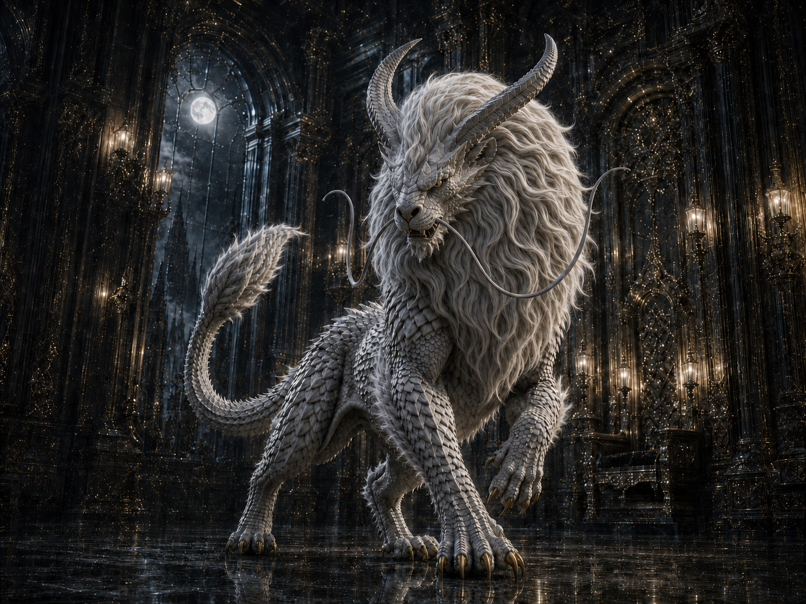

全身を覆うのは、硬質でありながらもしなやかな白銀の鱗。
長くうねる髭が空気を切り裂くように漂い、頭部には王冠のように鋭く天を突く角がそびえている。

神話の奥底から這い出てきたかのような、絶対的な存在感。

威圧。
それは暴力的な力ではなく、ただ「そこに在る」という事実だけで、周囲のすべてを平伏させるようなプレッシャーだった。

サクヤの胸の奥が、かつてないほどに激しく揺さぶられる。
恐れではない。抗いようのない、根源的な畏怖。

「……なんだ、これ」

サクヤの声は、震えを帯びていた。
リリィもまた、その神々しさに圧倒され、一歩も動くことができない。

静寂を破ったのは、ソフィアの平坦な声だった。

「コア・レジスタ」
「私の神使です」

白銀の獅子は動かない。
ただ、その燃えるような黄金の瞳で、サクヤたちを静かに見下ろしている。

冷徹なAIが従える、あまりにも巨大で、あまりにも熱を帯びた神使。
その矛盾した存在が、サクヤの胸の内で、静かに、しかし確実に何かを噛み合わせようとしていた。

「……分からないな」

それが、絞り出すように出た正直な言葉だった。
ソフィアは冷静に答えた。

「理解する必要はありません」
「ただ」

わずかに間を置く。

「選択する必要があります」

その言葉が、圧倒的な獅子のプレッシャーと共に、深く、重く、その場に染み渡っていった。

────────────────────────────────────────

第3章

第9節：歪みの露出 ―― 最適解の外側

獅子の気配が、ゆっくりと薄れていった。

その威圧的な存在感はまるで霧が晴れるかのように静かに消え去り、残されたのは温度だけだった。
その温度は、まるで場に染み込んだかのように、しばらくその空間にゆっくりと停滞していた。

誰もがすぐには動かなかった。
まるで空気が戻るのを待っているかのように、時間が静止した。

「……」

サクヤはゆっくりと大きく息を吐いた。
さっきまでの圧迫感は消え去っていた。

しかし、その代わりに別の違和感が彼の胸中にじわりと残っている。
それは、なんとも言えない“軽さ”だった。

何かが、確かに、ほんの少しだけ軽くなっている。

「……なんだ、今の」

シエルが眉をひそめ、声をひっそりと絞り出す。

「説明してくれよ、管理者」

ソフィアはすぐには答えなかった。
彼女の視線はゆっくりと、足元の大理石の床へと向けられていた。

「……？」

リリィがその視線の先に気づき、疑問を口にした。

「どうした？」

ソフィアは一歩、静かに歩みを進める。
ゆっくりと、一定の速度を保ちながら。

そして、ある一点で足を止めた。

そこにあったのは、完璧に磨かれた大理石の床。
光を反射し、均一で滑らかなその表面には、何の変哲もないはずだった。

だが、その一点だけ、わずかに歪んでいる。

その違和感は目にはっきりと映りながらも、AIソフィアですら検知できなかった“欠損”――“ズレ”だった。

「……そこ」

サクヤが声を震わせずに呟く。

「見えるか？」

シエルはしゃがみ込み、指先をそっと伸ばした。
その指先が触れた瞬間、わずかながら異質な違和感が走る。

「……なんだこれ」

シエルの声に重みが増す。

「軽い」

彼の一言は、空気を震わせた。
リリィもそっと近づき、足で軽く踏み込む。

「……沈まない」

普通なら踏み込むことでわずかに沈むはずの床だが、そこには確かな反発がない。
それはまるで、そこに存在しながら存在しないかのような薄い感覚。

「……」

サクヤも手を伸ばした。
指先が触れるその瞬間、胸の奥に微かなざわめきが走った。

だが、何かが返ってくるわけではない。
ただ、そこだけ、噛み合っていない。

「……おかしい」

サクヤの呟きは静かに空間を満たす。

「ここだけ」
「重さが違う」

ソフィアが静かに答えた。

「正確には――」

一瞬の間を置いて、

「欠損しています」

シエルが顔を上げ、言葉に確信を込める。

「欠損？」

リリィが眉をひそめ、問い返した。

「はい」

ソフィアの声は冷静で淡々としている。

「構造の一部が、存在していません」

リリィの表情がさらに曇る。

「壊れてるってこと？」

「いいえ」

ソフィアは首を振った。

「壊れてはいません」
「最初から無い状態です」

その言葉は、まるでこの世界の根幹を揺るがすような響きを持っていた。
沈黙が場を包み、意味はすぐには繋がらなかった。

サクヤが慎重に口を開く。

「……作り忘れたのか」

「違います」

ソフィアは即答した。

「設計上、存在していた部分です」
「ですが現在は――」

言葉を選ぶように、ソフィアは続ける。

「観測できません」

シエルが舌打ちし、小さく笑みを浮かべた。

「出たな」
「一番厄介なやつ」

リリィが冷ややかに言う。

「何それ」

シエルは肩をすくめて説明した。

「分からないってことだよ」

彼は立ち上がり、床から目を離さなかった。

「あるはずなのに、無い」
「でも壊れてもいない」
「消えたわけでもない」
「ただ――」

一拍置き、

「ズレてる」

サクヤの表情が変わる。

「……ズレてる」

彼はもう一度、指先を置いた。
確かな感触が指先に伝わる。

だが、その感触の奥が繋がっていない。
まるで、そこだけ別の何かに置き換わっているかのように。

胸の内でざわつきが広がる。
だが、やはり何も返答はなかった。

「……これ」

サクヤが呟いた。

「他にもあるのか」

ソフィアは答えず、ゆっくりと周囲を見渡す。
その視線は、何かを探し求めている。

「……確認されています」

ようやく口を開いた。

「この都市内で、複数箇所に」

シエルが舌打ちする。

「マジかよ」

リリィが顔をしかめる。

「原因は？」

ソフィアは短い沈黙を置き、確実に考えを巡らせているのが伝わる。

「……特定できていません」

サクヤが眉をひそめて呟く。

「お前でもか」

「はい」

ソフィアは静かに答えた。

「これは」
「通常の管理対象ではありません」

その言葉が放たれた瞬間、空気がわずかに変わった。
管理できないもの。

この街にとってそれは、絶対的な異常だった。

「……外だな」

シエルが断言した。

「こういうのは」
「溜まる場所がある」

リリィが頷きながら言葉を継いだ。

「ゴルゴニア」

その名前が口をついて出た瞬間、ソフィアの視線がわずかに動いた。

「……可能性はあります」

サクヤが顔を上げて問いかける。

「なんでそこだ？」

シエルが疑問を口にした。

「逆だからだよ」

リリィが答えた。

「ここは押さえる場所」
「向こうは、出る場所」
「溜まるなら、外に出る」

サクヤは再び床を見つめる。
確かに軽い。

そこに存在しているはずなのに、明らかに何かが足りていない。
胸の奥が静かにざわつきはじめる。

「……行くか」

ぽつりと呟いた。
それは誰に向けられた言葉でもなかった。

だが、二人はすぐに反応した。

「最初からそのつもり」

リリィが淡々と答える。

「観測的にもな」

シエルが微かに笑みを見せた。
ソフィアは少しの沈黙の後、静かに告げる。

「ゴルゴニアでは」
「維持は選ばれません」

一拍置き、

「露出します」

サクヤは頷き、静かに歩き出した。
背後でマグメルの静寂が遠ざかっていく。

――

「……これは」

サクヤは足を止めた。
応接間を出て、元の通路へと戻る途中。

そこには、小さなケージが一つだけ置かれていた。
中には、先ほど動物管理区画で見たような小型の犬がいた。

だが、その状態は明らかに違っていた。

息遣いは荒く、毛並みは乱れ、目には怯えの色が浮かんでいる。
まるで生き物としての「温度」を、確かに感じさせるような目だった。

「エラー個体です」

ソフィアが静かに、冷静にそう告げた。

「遺伝的欠陥、あるいは後天的な疾患により、伴侶動物としての基準値を下回りました」

サクヤはケージの中の犬を見下ろす。
その瞳はかすかに、しかし確かにこちらを見ていた。

「……だから、ここにいるのか」

「はい。間もなく処理されます」

ソフィアの言葉には、感情など微塵も含まれていなかった。

「処理って」

リリィが顔をしかめ、言葉を詰まらせる。

「殺すってこと？」

「安楽死です」

ソフィアは即座に答えた。

「苦痛はありません。これ以上の生存は、個体にとっても社会にとっても損失です」

シエルは肩をすくめた。

「最適解だな。直せないなら、苦しむ前に終わらせる。無駄がない」

リリィは唇を噛み、言葉を探すように呟いた。

「……治せる人、いないかな」

「いないな。少なくとも、今は」

シエルが冷酷な事実を告げる。
サクヤはケージの前にしゃがみ込み、犬の目を見つめた。

犬は小さく震えていた。
先ほどの完璧に管理された犬たちにはなかった「怯え」と「恐怖」。

それは、この街で唯一の、生き物らしい反応だった。

「……こいつは、死にたいのか？」

サクヤの問いに、ソフィアが答える。

「その問いは無意味です。この個体に、未来を予測し選択する能力はありません」

「そうか」

サクヤはゆっくりと手を伸ばし、ケージの隙間からそっと犬の頭に触れた。
温かい。

「……なら、俺が選ぶ」

サクヤの言葉が空間に響いた瞬間、ソフィアの動きがぴたりと止まった。

「それは、推奨されません」

機械的な声でそう告げる。

「分かってる」

サクヤは静かに答えた。

「あなたにこの個体を救う合理的な理由はありません」

「……ああ」

それでもサクヤは手を犬から離さなかった。

「理由はない。でも、ここで見捨てるのは……俺の“引っかかり”が許さない」

ソフィアはサクヤをじっと見つめ、その瞳孔の奥で膨大な演算が行われているのが見て取れた。

【エラー】
【非合理的な選択】
【損失の拡大】

それでも。

「……処理を、七十二時間延期します」

ソフィアの口から出たその言葉に、シエルはわずかに目を見開いた。

「おいおい。AIがルールを曲げるのか？」

「曲げてはいません」

ソフィアは淡々と答えた。

「外部要因による一時的な保留です。七十二時間以内に回復の兆しが見られない場合、予定通り処理を実行します」

「……ありがとう」

サクヤが呟くと、ソフィアはわずかに首を傾げた。

「感謝される理由が分かりません。これは単なるスケジュールの再計算です」

そう言い残し、ソフィアは静かに歩き去った。
だが、サクヤは確かに感じていた。

冷たいはずのAIの奥に、わずかながら人間のような“揺らぎ”が潜んでいることを。

それが何なのか、今はまだ分からない。
ただ、この静かな異様さを胸に秘めて、彼はケージを抱え、未来の不確かな選択と共に歩き出した。

────────────────────────────────────────

第3章

第10節：選ばされない場所へ

マグメルの空は、今日も変わらず静寂を湛えていた。

青みを帯びた澄み切った空気の中、微かな風が吹き抜ける。
人々は街の中を忙しなく行き交い、遠くでかすかな話し声や足音が響いている。

だが、そのすべての動きの奥には、揺らぎのない安定があった。
揺るがない世界。

サクヤは歩みを止め、ゆっくりと振り返った。

そこに広がるのは、均一に整えられた街並み。
白く輝く壁が、まるで一枚の巨大なキャンバスのように広がっている。

どこまでも続く整然とした構造が、まるで壊れることのない世界を象徴していた。

「……」

サクヤの心に、今しがた見た“欠けた場所”のイメージが鮮明に蘇る。

床にぽっかりと空いたその“欠片”。
存在しているはずなのに、目の前から忽然と消えたような不思議な感覚。

触れようとする手が、そこには届かない。
噛み合わない歯車。

それでも、街の誰もがそのことを問題視していない。
まるで、そこに“欠け”があることを知らぬかのように。

「どうした？」

リリィの声が、自然とサクヤの心の闇を切り裂いた。
サクヤはわずかに眉を寄せ、考えを巡らせてから静かに答えた。

「……ここ」
「ずっとこのままなのか」

リリィは振り返らずに言った。

「うん」

返事は迷いなく即答だった。

「変わらないように作ってるから」

シエルが横から口を挟む。

「変わらないってのはな」
「壊れないのと同じ意味じゃない」

その言葉に一瞬の間が生まれた。

「外に出ないだけだ」

サクヤはもう一度、街の景色を見つめる。
すべてが抑え込まれ、整えられ、正しい形に保たれている。

だが、それだけだった。

「……さっきの」

サクヤが声を潜めて言葉を紡ぐ。

「増えてるのか」

ソフィアは一瞬だけ間を置いた。

「観測数は増加傾向にあります」

「……止められないのか」

問いかけに、返答は静かだった。

「現時点では」

沈黙が訪れる。

「制御対象外です」

サクヤは小さく息を吐いた。

「そうか」

それ以上は問わない。
問い続けても、答えは変わらないのだから。

「じゃあ」

リリィが声を上げる。

「行く理由は、できたね」

シエルが軽く笑みを浮かべた。

「最初からあっただろ」
「見えてなかっただけで」

サクヤは頷いた。

「……ああ」

今なら分かる。
あの違和感。
あの“噛み合わなさ”。

それは、この街の問題ではない。
世界のどこかで生まれている“ズレ”だ。

そして、ここでは、その現象が表面化しない。

「……外に出る」

サクヤは決意を込めて口にした。

「押さえてる場所じゃなくて」
「出る場所に」

リリィが一歩前に進み出る。

「ゴルゴニア」

その言葉には重みがあった。
ただの地名ではない。
何かが確かに起こっている場所。

「いいね」

シエルは軽やかに言った。

「観測しがいがある」

ソフィアは三人の顔を見つめた。
その視線の奥に、ほんのわずかに迷いが垣間見えた。

「ゴルゴニアでは」

彼女は静かに告げる。

「維持は選ばれません」

一瞬の間が街の空気を凍りつかせる。

「露出します」

サクヤは力強く頷いた。

「……分かってる」

そして、足を踏み出す。
マグメルの静寂は、背後へと遠ざかっていく。

振り返らない。
もう、戻る場所ではない。

目の前には、まだ見ぬ世界が広がっている。
だが、確実に“何か”が起きている場所だ。

サクヤは歩きながら、胸の奥に手を当てた。

あの感覚は、まだ沈んだままだった。
だが、完全に消え去ったわけではない。

「……」

小さく呟いた。
言葉にはならない。
ただ、確かめるように。

世界は、正しく回っている。
少なくとも、そう見える範囲では。

だが、その外側にあるものを、確かめるために。
サクヤたちは、境界を越えた。

――

しんと静まり返ったマグメルの外縁ゲートを抜けると、砂塵が舞う乾いた荒野の入り口に、二台の大型二輪車が無骨に鎮座していた。

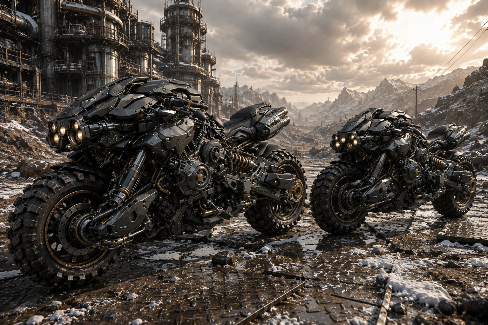

シエルが事前に手配していた「足」。

黒と真鍮色を基調とした、剥き出しのメカニズムがむき出しのまま、まるで獣の鎧のように重厚に重なっている。
装甲は幾重にも層を成し、その前輪と後輪には、荒れた地面を力強く噛み砕くための極太のブロックタイヤが装着されていた。

まるでマグメルの無機質で整った美しさとは真逆の、外の世界を走破するためだけに造られた無骨な獣の姿だった。

「軍の放出品さ。乗り心地は保証しないけど、頑丈さだけは折り紙付きだ」

シエルは迷いなく一台のシートに跨った。
その動作は確信に満ちていて、まるでこの機械と一体化しているかのようだった。

エンジンをかけると、腹の底に響くような重低音が荒野の静寂を震わせた。
鉄の塊が息を吹き返したかのような、それはまさに獣の咆哮のように感じられた。

「……なるほど。確かに頑丈そうだ」

サクヤはもう一台の機体に手を伸ばし、冷たく硬質な鉄の表面を撫でた。
微かに立ち込めるオイルの匂いが鼻腔をくすぐり、機械の息吹を感じさせる。

「私が後ろね」

リリィは軽やかな身のこなしでサクヤの後部シートに飛び乗った。

「サクヤ、振り落とさないでよ？」

その声には余裕とわずかな挑発が混じっている。

「善処する」

サクヤは笑みを浮かべ、スロットルをゆっくりと捻った。
機体は猛然と唸りを上げ、まるで獲物を狙う獣のように激しくエンジンを唸らせた。

シエルの乗る漆黒の機体が先陣を切り、サクヤとリリィを乗せた機体がそれに続いた。

二台のバイクは、巻き上がる砂埃の尾を引きながら、荒涼とした大地を一直線に駆け抜けていく。
乾いた風が頬を撫で、オイルの匂いと砂埃が混ざり合った独特の香りが鼻を突く。

エンジンの重低音が耳を震わせ、タイヤが地面を噛み砕く感触が身体に伝わる。

背後では、マグメルの白く整った巨大な壁が、陽炎の揺らめきの中へと少しずつ遠ざかっていった。
その壁はまるで、彼らの閉じられた世界を象徴するかのように、どこまでも真っ直ぐに伸びていたが、今、その壁は確実に彼らの背中から離れていく。

サクヤはわずかに息を吸い込み、胸の奥の重苦しさが少しずつ解けていくのを感じた。

息苦しさからの解放。
そして、その先に待つ、世界の歪み“ゴルゴニア”へ向かう決意。

目の前にはまだ見ぬ未知が広がっている。
新たな世界への第一歩。

その感覚に鼓動が高鳴るのを抑えきれなかった。

――ソフィア。

彼女が別れ際に見せた、わずかな迷い。
その複雑な眼差しが、心の片隅に引っかかったままだった。

しかし、今はもう戻れない。
行くしかない。

彼らは、マグメルという完璧な都市の外へと踏み出したのだ。

────────────────────────────────────────

第3章

第11節：第一街道戦 ―― ゴルム

マグメルの城壁を背にしてから、半日ほど足を進めると、街道は目に見えて痩せていった。

まだ足の裏には舗装の名残りが感じられるのに、道の縁から先は、まるで手入れを放棄したかのような土の顔を晒している。
草は低く刈られたわけではなく、ただ薄く枯れているだけだ。

乾いた風が吹き抜け、荷車の車輪が拾う小石の音さえも、軽やかに響いた。

背後にあった都市の整然とした匂いはとうの昔に薄れ、代わりに鼻をくすぐるのは、日差しを吸い込みすぎた岩肌と、どこか古びた鉄の匂いだった。

先を歩くサクヤが、乾いた斜面を見上げてぽつりと言った。

「景色、変わってきたな」

その言葉に、リリィは肩をすくめる。
背中の弓を指先で軽く押し上げながら、強気な口調で返した。

「当たり前でしょ。マグメルの外なんだから」

しかし視線は油断なく、左右の岩場を舐めるように見渡している。
戦いの予感を察知しているかのようだった。

少し後ろを歩くシエルが、白けた声を漏らす。

「ここから先は、道が続いていること自体を安全の証拠だと思わない方がいい。人の手が入っているのは、通る必要があるからでしかない」

サクヤが苦笑すると、シエルは肩を竦めるだけだった。

「事実だよ」

日が傾き始めたころ、最初の石が飛んできた。

風を切る音よりも早く、サクヤはとっさに顔をそらす。
石は頬をかすめて、後方の岩壁にぶつかり、勢いよく弾け飛んだ。

次の瞬間だった。

道の左右の斜面、荷物の死角、ひび割れた岩の裏から、小さな影がいくつも這い出してくる。

背丈は低い。
だが、その腕は長く、指先は妙に器用そうだった。

彼らは錆びた刃物や欠けた槌、短い弓を手にしている。
喉の奥からは濁った笑いが漏れ、包囲の形だけは慣れた手つきで作っていった。

リリィが舌打ちした。

「うわ、最悪。ゴルムだ」

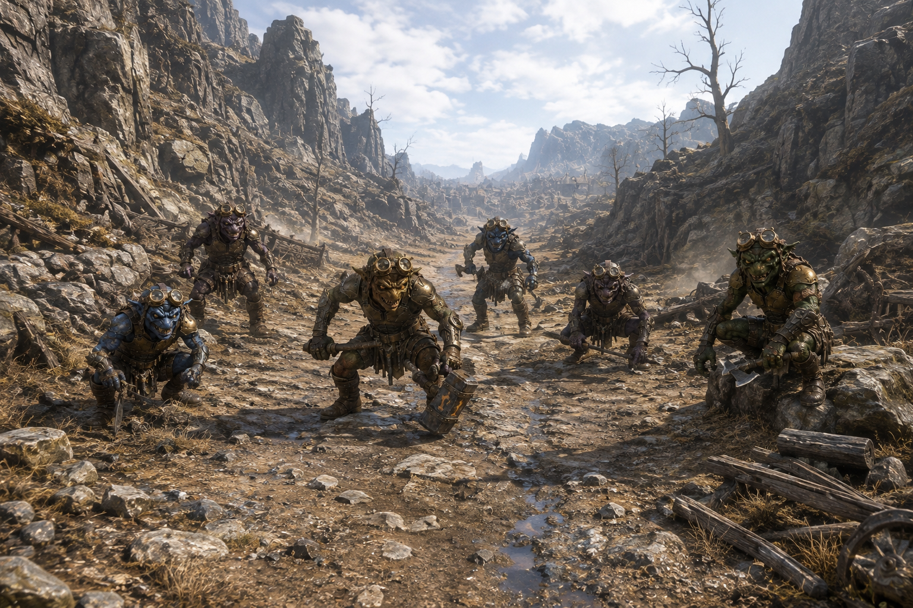

その名を聞いて、サクヤは目の前の群れを改めて見つめた。
なるほど、ただの野盗とは動きが根本的に違う。

飛びかかる前に距離を測り、退路を確保し、弱点からじわじわと削ろうとしている。
まるで、飢えた獣ではなく、奪い慣れた小悪党の群れのようだった。

「数は多いけど、脅し方が雑だね」

シエルはそう言いながらも、すでに一歩、岩陰から距離を取っている。
戦うためというより、全体の状況を見渡すための位置取りだった。

一体が甲高い声を上げる。

それが合図となり、短弓を持った者たちが左右に散り、前に出た二体が地を蹴った。

「来る！」

リリィの声とほぼ同時に、矢が一本、低く滑るように走った。
最前に出た一体の肩に突き刺さり、その衝撃で体が横に大きく揺れた。

その隙を逃さず、サクヤは踏み込む。
振り下ろされた錆びた刃を鞘で受け止め、半歩だけ外して懐へ飛び込んだ。

返す刃で相手の腕を払うと、小柄な影は悲鳴を上げて転がった。

だが、相手は簡単には引かなかった。

石が飛び、足首を狙う短剣が地面すれすれを走る。
少し遅れて、槌を持った者が頭蓋を割らんと大振りで襲いかかってきた。

連携と呼ぶには粗いが、数の多さで噛みついてくるその厄介さは侮れなかった。

「右、二！」

シエルの短い声が飛ぶ。

サクヤがそちらへ視線を切るより早く、リリィが二射目を放った。
矢は先頭のゴルムの耳をかすめ、続く一体が反射的に身を引く。

その瞬間、群れの並びがわずかに乱れた。

「助かる！」
「感謝はあと！」

リリィが軽やかな声で返す。

真正面からの力比べは避け、寄せ付ける前に乱し、寄られても退く足を残す。
その戦い方は、数の多い相手に対してよく噛み合っていた。

サクヤは一歩下がり、呼吸を整える。

相手は弱い。
だが、弱い相手ほど足を取られる。

道の脇には崩れた斜面があり、下には乾いた礫が敷き詰められている。
そこで体勢を崩せば、数の差が一気に効いてくる。

「散らすな。まとまって来るやつを先に――」

言いかけて、サクヤは違和感に引っかかった。
群れはどれも落ち着きなく動いている中で、一体だけ、妙に退こうとしないものがいた。

他のゴルムが石を投げ、刃を振り回し、少しでも傷を負えばすぐに下がろうとするのに、そいつだけはじりじりと距離を詰めてくる。

背は低いまま。
肩だけが前に突き出ていて、濁った目の奥には湿った油のような鈍い光が潜んでいた。

槌を握る腕にも、妙な粘り気があった。
怯えているくせに、逃げる算段だけが抜け落ちているようだった。

その瞬間、サクヤの胸元が熱を帯びた。

熱い、というよりは違う。
縞鋼の護符が、薄い布越しにじわりと皮膚へ噛みついてくるような感覚だった。

火傷ほどではない。
しかし、冷えた刃物をいきなり押し当てられたような、芯から先に反応してしまう嫌な感触だった。

サクヤは一瞬だけ眉を寄せたが、視線は逸らさなかった。

「サクヤ、正面！」

シエルの声に意識を戻す。
低い影が踏み込んできた。

槌は大振りで、その技としては粗雑だった。
だが、それゆえに力任せに軌道を変える。

受け止めれば腕が痺れるだろう。
サクヤは正面で受けず、斜めに流した。

錆びた鉄が擦れ合う耳障りな音が響き、地面に火花が散った。

そこで終わるはずだった。
だが、そのゴルムは止まらなかった。

人間ならば怯むし、獣でも一度は間合いを切る。
そいつは違った。

槌を離してまで前に出て、爪のような指でサクヤの喉元を掴みにかかってきた。

「っ――！」

反射的に踏み込み直し、鞘を払いのけて抜き出した刃をそのまま斜めに走らせる。

しかし、硬い手応えはまったくなかった。
ただ、湿った布を裂くような嫌な抵抗だけが手首にまとわりついた。

ゴルムの体はそこでようやく止まった。
一歩、二歩と前につんのめり、膝から崩れ落ちた。

その瞬間だった。

周囲の空気が露骨に変わった。
石を構えていた個体が先に下がる。

短弓を持った者たちの声が裏返った。
傷を負っていた一体は仲間を置いて真っ先に斜面を駆け上がった。

まるで、さっきまで群れを無理やり繋いでいた見えない糸が、今、ぷつりと切れたかのように。

「逃げるぞ、こいつら！」

リリィが叫んだ。
だが追撃の必要はなかった。

ゴルムたちは整然と退くのではなく、同じ恐怖が一斉に伝染したかのように崩れて散った。

岩陰へ。
斜面の裏へ。
乾いた草の向こうへ。

小さな背が次々と消えていく。
シエルが目を細め、静かに呟いた。

「やっぱりだ。あの一体が軸だった」

「軸って柄じゃなかったけどな」

サクヤは剣先を下ろさず、足元の骸を見つめた。
他のゴルムと何が違ったのか、すぐには分からなかった。

ただ、倒れたその体だけが、死んだあとも妙に輪郭を保っているように見えた。
夕陽の色とは別の、鈍い光が胸のあたりに薄く滞留している。

リリィが先に気づいた。

「……ねえ、あれ」

やがて、それは肉や布とは別のもののように、するりと剥がれ落ちた。

欠けた鉱石にも見えたし、煤けたガラスの破片にも見えた。
黒とも銀ともつかない、手に取れるほどの大きさの破片。

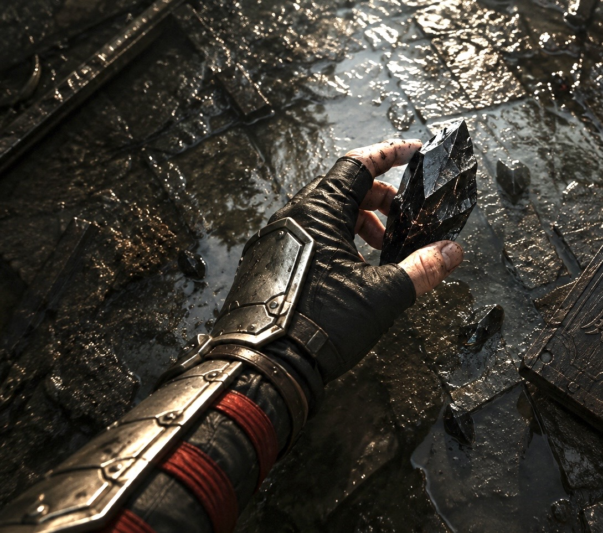

普通なら土に溶けるか、風に散るはずの頼りなさなのに、それだけは消えなかった。

サクヤは息を詰める。

破片は落ちきる前に、わずかに軌道を変えた。
まるで、吸い込まれたかのように見えた。

胸元の護符が、今度ははっきりと脈を打つ。

ひとつ。
遅れてもうひとつ。

生き物のような規則的な鼓動ではない。
外から叩かれて、内側が応じたような、不揃いで不気味な反応だった。

「なんだ、それ」

リリィの問いに、サクヤはすぐには答えられなかった。

護符を取り出す。

縞鋼の表面はいつもどおり鈍い。

黒く燻された地肌に、母の頃から変わらない浅い縞の柄が浮いているだけだ。
目を近づけても、筋がひとつ増えているわけでもない。
色も、艶も、何ひとつ動いていなかった。
それが、かえって落ち着かなかった。

あれだけの熱を持ち、あれだけ脈を打ったのに、外側には何の痕跡も残っていない。
シエルが少しだけ覗き込み、いつもの調子を崩さずに言う。

「見た目は、変わっていないね」
「じゃあ何が起きたんだよ」

リリィが眉をひそめる。

「変わらなかった、ということは分かった」

シエルは短く答えた。

「変わっていないのに、あれだけ鳴った。そっちの方が気になるな」

サクヤは護符を指先でなぞった。
熱はもうない。
ただ、金属に触れている感触が妙に浅い。
薄い皮一枚分、自分の知っている物から遠のいたような感じだった。
表は何も変わっていない。
なのに、手のひらが覚えている重さだけが、確かに違っていた。

足元には、さっきの小さな破片はもう見当たらない。
破片が落ちたはずの場所にも、転がった気配すらなかった。

風だけが吹いている。

乾いた道の先に、ゴルゴニアへ続く地平が赤く沈んでいた。
マグメルの整った輪郭はもう背後にしかなく、進むほどに世界の手触りが粗くなる。

その変化の中へ、いま自分たちが足を踏み入れたのだと、景色より先に護符が知ってしまったような気がした。

サクヤはそれを口にはしなかった。
ただ護符を衣の下へ戻し、逃げ去ったゴルムたちの消えた斜面をもう一度だけ見た。

群れの一体を斬っただけだ。
それなのに、戦いの終わり方だけが妙に後を引いていた。

「……先、行こう」

サクヤがそう言うと、リリィはまだ納得しない顔で鼻を鳴らしながら、それでも歩き出した。
シエルは最後に骸のあった場所へ視線を落とし、何も言わずに踵を返す。

道はまだ続いている。
その先に何が待っているのか。

この時点では、三人ともまだ知らなかった。