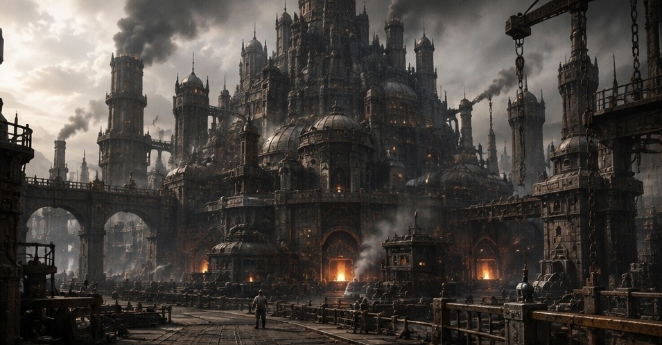
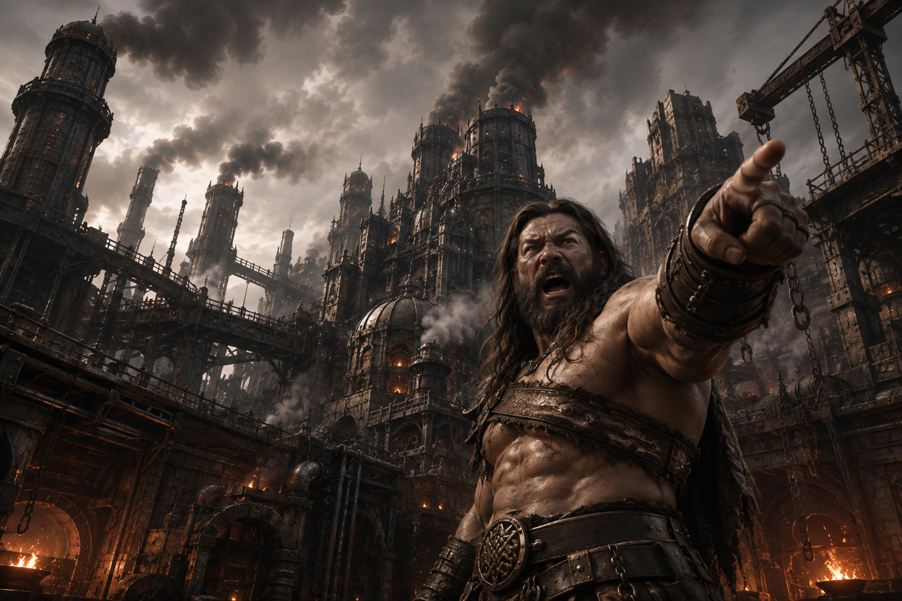
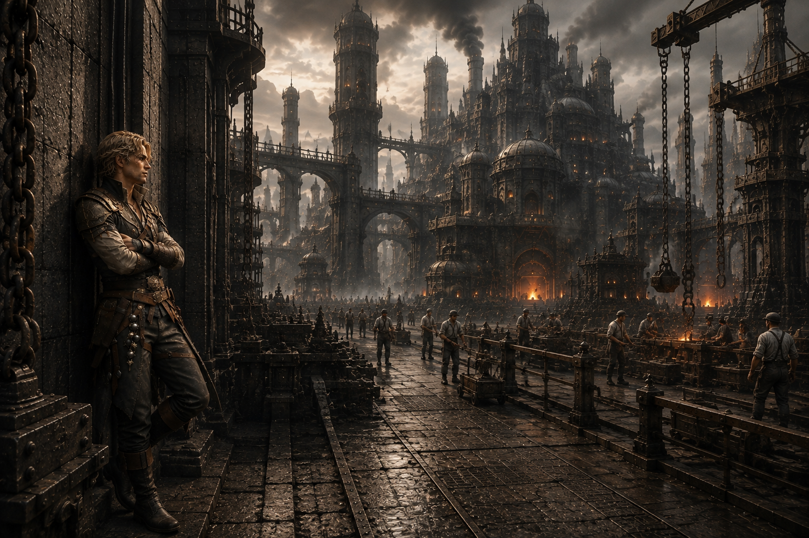
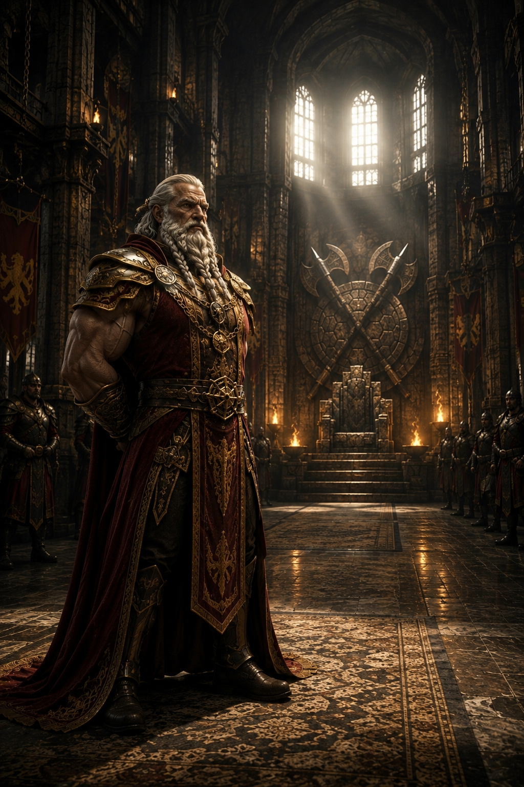
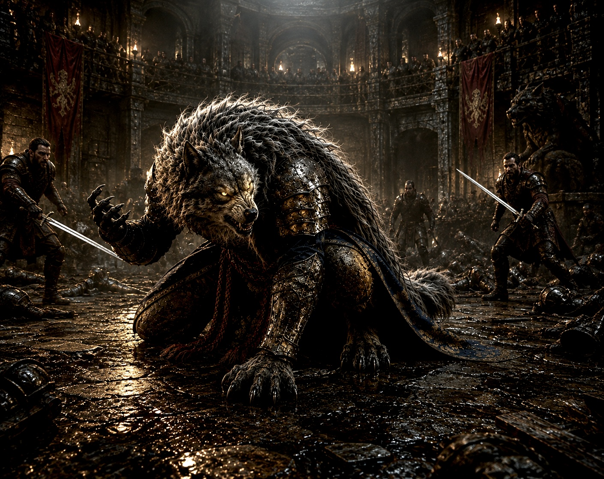

# 第4章：錆びた誇り、選ばされる街

────────────────────────────────────────

## 第4章第1節：鋼鉄の王国

最初にサクヤの耳に届いたのは音だった。
ゴゴンと深く響き、続けてギィィ……と金属が擦れる鈍い悲鳴が続く。それはまるで地面の奥底から蠢く巨大な生物の胎動のように、脈打つように這い上がってくる。一つ一つの音は独立している。鍛冶場で鉄を打つ硬質な打撃音、巨大な歯車が軋む擦過音、鎖が擦れ合う乾いた音。だがそれらはどこかで確かに繋がっていた。無秩序に乱れているようで、しかし全体として見れば完璧なリズムを刻んでいる。

耳だけで捉えているのではない。
足の裏、いや全身でその振動を感じ取っていた。サクヤが踏みしめたのは縞模様の鋼板だった。その瞬間、足元がわずかに沈み込むような感覚に襲われる。まるで巨大な磁石に引かれるかのように、体が重力に引き寄せられる。

「……重いな」

思わず乾いた唇から言葉が漏れた。
アシハラと同じ鉄。同じような構造物。しかしここゴルゴニアでは、その鉄の質感が、存在感がまるで異なる。

「ここじゃ、地面も働かされてるんだよ」

前を歩くリリィが振り返らずに言った。
その声は軽い口調だったが、表情には微塵も笑みが浮かんでいない。リリィの視線は絶えず動いていた。耳に飛び込む無数の音。行き交う人々の流れ。巨大な荷物が移動する様。その全てを瞬時に拾い上げ、処理している。

サクヤはゆっくりと顔を上げた。
ゴルゴニアの空は厚い煤の層に覆われ、濁っていた。太陽の光は削り取られ、薄暗い鉛色の光しか届かない。それが昼なのか、夕方なのか、あるいは夜明けなのか判別することができない。しかし街そのものは、その曖昧な光の下ではっきりとその存在を主張していた。
決して止まることはない。
巨大な炉は常に燃え盛り、紅蓮の炎を吐き出し続ける。古くなった鎖は次々と新しいものに張り替えられていく。無数の歯車は寸分の狂いもなく回り続ける。一瞬たりとも途切れることはない。

遠くから怒鳴り声が聞こえた。

「分かってる！分かってるよ！」

鋭い声が返る。
だがその声の主の手は、一瞬たりとも止まることなく目の前の作業を続けていた。巨大な鉄塊を押す男たちの腕は筋骨隆々としていた。煤にまみれた顔は汗と埃で汚れている。しかしその瞳には一点の迷いもない。男たちの視線が交差する。言葉を交わすことはない。合図もない。しかし彼らの動きは寸分の狂いもなく揃っていた。まるで一つの巨大な機械の部品であるかのように。

「次の炉、空けろ！早くしろ！」

「鎖が足りねぇ！誰か持ってこい！」

怒号と金属音が混ざり合う。
しかしそこに混乱はなかった。誰もが次に何をすべきか、何を求められているのかを正確に知っている。そして知っているからこそ、立ち止まることができない。

サクヤはその光景から目を離すことができなかった。
アシハラは自らを壊しながら、それでも何かを支えようとしていた。マグメルは自らを削り、整えることで秩序を保っていた。だがここは違う。ゴルゴニアでは、人々が自らの意思で、自らを削り摩耗させているように見えた。言葉が出かかって喉の奥で止まる。そのサクヤの様子を見ていたかのようにリリィが言った。

「“選んでる”って顔だろ？」

リリィは振り返らず、前を向いたままぽつりと続けた。

「ゴルゴニアの連中はな、自分でここに立ってるって信じてるんだよ」

サクヤはゆっくりと視線を動かした。
巨大な炉の前。一人の男が全身の力を込めて巨大な槌を振り下ろしている。その腕は何度も繰り返された作業によって震えている。背中は長年の重労働で曲がっていた。だがその男の瞳には、一点の迷いも諦めもなかった。

「……それ、違うのか」

サクヤが静かに問うと、リリィは少しだけ間を置いた。
その間はまるで何かの重さを測るかのようだった。

「違わない」

あっさりとリリィは答えた。

「だから厄介なんだ」

その言葉がサクヤの心に重く残った。
遠くでドン、と低く響く音がした。それは地鳴りのような、内臓に響く振動だった。足の裏からその揺れが這い上がってくる。サクヤの体がわずかに強張る。その瞬間、胸の奥が微かに揺れるような感覚に襲われた。それは熱にはならない。形にもならない。ただ何かに触れかけているような、曖昧でしかし確かに存在する感触。

サクヤは細めた目で街を見つめた。
ここには何かがある。まだ掴めない。しかし確実にその存在を感じる。

「……生きてるな」

ぽつりとサクヤは呟いた。

「うん、生きてるよ」

リリィがその言葉に応え、そして静かに言葉を続けた。

「壊れながら」

サクヤは一歩足を踏み出した。
ゴルゴニアの街の中へ。無数の音の中へ。この街が持つ圧倒的な重さの中へ。まだ分からない。この街で一体何が起きているのか。しかし確実にある。この街の底に、押さえ込まれてはいない何かが。

────────────────────────────────────────

第4章

第2節：選択の重さ

ゴルゴニアの通りはどこまでも続く鉄の回廊だった。
道幅は広く、行き交う人々がぶつかることはない。空間もゆったりと取られ、人の流れはまるで訓練された兵士のように整然としていた。それなのに誰一人として立ち止まる者がいない。

「……休まないのか」

サクヤは無意識にそう口にしていた。その声は自分自身の足音にかき消されそうになる。

「休んでるよ」

リリィは一瞬も視線を前方から外すことなく、淡々とした声で答えた。

「どこでだ」

サクヤは歩きながら周囲に視線を走らせる。

「動いてる間に」

その言葉はあまりにも短く、まるで冗談のようにも聞こえた。しかしリリィの表情には微塵も冗談めいた色はなく、その言葉が真実であることを物語っていた。

サクヤは改めて周囲を見渡す。
灼熱の炉の前で巨大な金槌を振り下ろす男たちの腕。重い荷を背負い、よろめくことなく歩を進める女たちの背中。誰もがその動きを止めることなく作業に没頭している。だが無理をしているようには見えない。彼らの動きは淀みなく、まるで身体の一部のように滑らかだ。疲労の色は見て取れるものの、その表情にはどこか諦めのような、あるいは達観したようなものが浮かんでいた。

「……止まらないのか」

サクヤはまるで自分自身に問いかけるように呟いた。

「止まると、遅れる」

リリィはほんのわずかに歩調を緩めた。その動きは注意深く周囲を警戒する獣のようでもあった。周囲の喧騒がわずかに遠のいたように感じられる。

「遅れると、回らなくなる」

「回らなくなると？」

サクヤの問いにリリィは即座に答える。

「止まる」

その言葉はあまりにも短く、あまりにも簡潔だった。それだけだった。

サクヤは言葉を探した。何かを言わなければ、この重苦しい沈黙に押しつぶされてしまいそうな気がした。

「それ、同じじゃないのか」

「違うよ」

リリィはほんの少しだけ口元を緩めた。それが笑みであるのか、あるいは自嘲であるのかサクヤには判別できなかった。

「こっちは、止めたら終わる」

「……？」

サクヤは無言でリリィの顔を見つめた。その瞳には疑問の色が浮かんでいる。リリィはサクヤの視線を受け止めながらゆっくりと言葉を紡いだ。

「水が止まる」

それだけだった。

「……水？」

サクヤの脳裏にゴルゴニアの街を流れる、あの濁った水路が浮かぶ。

「うん、ここ、水で詰むから」

リリィはまるで世間話でもするように軽く頷いた。その言い方はあまりにも軽快だったが、その言葉が持つ意味はサクヤの胸に重くのしかかる。

「止まると、水が来ない。水が来ないと、全部止まる。だから止まらない」

サクヤは黙り込んだ。その言葉の論理はあまりにも明確で納得せざるを得ない。しかし心の奥底で何かが強く抵抗していた。納得したくない。この理不尽な現実を認めたくない。リリィはサクヤの沈黙を肯定と受け取ったかのように言葉を続けた。

「選択肢はあるよ。やめる、とか。外に出る、とか」

その声はどこか遠くから聞こえてくるようだった。

「……できるのか」

「できる。ただ、選ばないだけ」

サクヤの足がわずかに、本当にわずかに止まった。
その瞬間だった。それまで淀みなく流れていた人の波が、ほんのわずかにしかし確実に歪んだ。サクヤの周囲だけがまるで水面に石を投げ入れたかのように波紋を描いて広がる。誰もぶつかってはこない。しかし確実に避けられている。

サクヤの背中に薄い寒気が走った。まるで見えない壁に囲まれたかのような奇妙な感覚。誰もサクヤの顔を見てはいない。しかしその場にいる全員が、サクヤが「止まったやつ」であることを本能的に察知しているかのようだった。

「……なんだこれ」

サクヤはかすれた声で呟いた。

「止まると、こうなる」

リリィはやはり前を見たまま淡々と答える。

サクヤはその場に立ち尽くしていた。動こうにもその足が鉛のように重い。しかしこの居心地の悪さは一秒たりとも耐え難いものだった。ほんの数秒。それだけの時間でサクヤは理解した。ここでは止まること自体が異物なのだ。

サクヤは重い足を引きずるようにして再び歩き出した。止まっていた時間を埋めるかのように急ぎ足で人の流れに戻る。その瞬間、周囲の空気がまるで何事もなかったかのように元に戻った。歪んでいた波紋は消え、再び淀みない流れが生まれる。

「選択肢はある」

リリィはサクヤの横顔をちらりと見た。その言葉にはどこか諦めのような響きがあった。

「でも、選べる状態じゃない」

サクヤは眉を寄せた。

「……どういう意味だ」

リリィはそこで初めてサクヤの方へ振り返った。その視線はまっすぐにサクヤの瞳を捉える。

「選択肢があることと、選べることは違う」

静かに。だがはっきりと。リリィの言葉はゴルゴニアの街の真実を容赦なくサクヤに突きつけた。

「ここは、選ばされてる」

その言葉がサクヤの心に重く落ちる。サクヤは何も言えなかった。リリィの言葉はあまりにも正しかった。否定できない。しかし心の奥底でどうしても納得できない自分がいた。

その時だった。
雑踏のざわめきの中に別の音が混じり始める。通路の脇に低い木製の卓が一つ。その上には歪んだ金属製のコップが二つ置かれている。男が一人、その卓に座っていた。

「やるか？」

男は通りすがりの男に軽い調子で声をかけた。その声にはどこか退廃的な響きがある。隣の男は乾いた笑いを浮かべた。

「今日はいい」

「そうか」

それだけで会話は終わる。だが終わっていない。二人の男の間に言葉にならない視線だけが残る。サクヤは卓を見た。単純な仕組みだ。コップのどちらかに何かを隠しそれを当てる。ただの当て物。賭け事だ。この重苦しい街の片隅で、こんなにも軽薄な賭け事が何の違和感もなく行われている。その光景がサクヤには異様に映った。

「……軽いな」

サクヤはぽつりと呟いた。リリィはその言葉を聞き逃さなかった。

「軽いから入る。だから回る」

サクヤは黙る。リリィの言葉の意味は理解できる。しかしこの街の全てをまだ完全に掴みきれていない。その違和感がサクヤの胸にざらついていた。

その時、遠くでドンと鈍い音が響いた。地面の奥底から直接響いてくるような重い音。さっきよりもわずかに近い。サクヤの胸の奥がわずかに揺れる。

「……来るな」

リリィが短く言う。その一言で空気が少しだけ変わる。サクヤは構える。まだ分からない。だが確信だけがある。これはただの音じゃない。ゴルゴニアの中で何かが動いている。

────────────────────────────────────────

第4章

第3節：止める者

工廠の奥へ進むにつれて、鼓膜を震わせていた喧騒が明確な質感を伴って変化していった。これまでは叩き、削り、溶かし、繋ぎ合わせる、あらゆる作業が織りなす混沌とした音の洪水だった。それが今は違う。
同じ鉄の音だ。だがその響きは何かを叩き割るような暴力的なそれではない。測る音。合わせる音。確かめる音。精密な作業が生み出す研ぎ澄まされた金属の軋みや微かな振動が、空気そのものを変容させている。

「……違うな」

サクヤの喉から乾いた呟きが漏れた。

「うん。ここ、“直す側”だね」

リリィの声がその言葉を拾うように響いた。
サクヤは無意識のうちに足を止めていた。視線の先、巨大な鉄骨の前に一人の男がいた。その男は周囲の喧騒とは隔絶されたかのように微動だにしない。叩きもしない。削りもしない。ただそこに在る巨大な鉄の塊をじっと見つめている。

周囲では作業員たちが慌ただしく動いていた。汗と油にまみれた腕がボルトを締め上げる。筋肉が隆起した背中が支柱を支える。溶接の火花が暗い空間を瞬時に切り裂き、焦げた金属の匂いが鼻腔を刺激する。熱気が肌を刺し全身の毛穴が開くような錯覚に陥る。
だがその男だけは、まるで時間の流れから切り離されたかのように静かに佇んでいた。

巨大な機械の一部が起動の時を待つように。彼の存在そのものが周囲の狂騒を吸い込み、静寂を生み出しているかのようだった。

「……あいつか」

シエルが小さく息を吐いた。

「誰だ？」

サクヤは視線を男から剥がせないまま尋ねた。

「バショウだね。この辺の“止め役”だよ」

リリィの声にはどこか呆れたような響きがあった。

「止め役？」

サクヤの眉間に微かな皺が刻まれた。止める、とは一体何を。
その時だった。

「そこ、締めすぎだ。一回外せや」

低い、しかし有無を言わせぬ声が淀んだ空気を切り裂いて飛んだ。男は視線を鉄骨から外さない。振り向きもしない。だがその右手の指先だけが微かに、しかし明確に動いた。
作業員たちの動きがぴたりと止まる。一瞬だけ迷いの色が彼らの顔に浮かんだ。だがそれはすぐに消え失せる。彼らはまるで反射のように男の言葉に従った。締めたばかりのボルトを緩め、再びゆっくりと締め直していく。

「……今だ」

バショウの短い言葉が響くと同時に、周囲の音がまるで魔法のように変わった。キィンと澄んだ金属音が工廠の天井に反響する。それまでの鈍い軋みや、無理な力が加わるような音とは明らかに異なる。
バショウが一歩だけ鉄骨に近づいた。その指先がまるで生き物の肌に触れるかのように優しく鉄骨を叩く。コツン。短くしかし確かな音。

「……通るぜ」

たった一言。それで終わりだった。作業員たちは張り詰めていた息を吐き出す。誰も男の言葉を疑わない。誰もその判断を確認しようとはしない。絶対的な信頼がその一言に込められているかのようだった。
サクヤは目を細めた。

「……分かるのか」

「分かる人なんだよ」

リリィの声がどこか感心した響きを帯びていた。

「構造で見てるんだ。一番面倒な位置だよ。上じゃない、下でもない。でも止める権限だけある」

シエルが冷静に分析する。
その少し離れた場所。壁にもたれるようにもう一人の男がいた。腕を組んでいる。何もしていない。ただその視線だけが執拗に周囲を追っていた。人の流れ。鉄の配置。足場の微かなズレ。全てをその瞳は捉えている。まるで工廠全体を一つの生命体として捉え、その脈動を感じ取っているかのように。
サクヤの視線が一瞬だけその男に吸い寄せられるように止まった。しかしすぐに外す。何か底知れない冷たいものがその男の奥底に潜んでいるような気がしたのだ。
その時、バショウがゆっくりと振り向いた。初めてサクヤと彼の視線が交錯する。
重い。それは威圧感のような一方的な力ではない。“見られている”という深淵からの呼びかけのようなずっしりとした重さだった。まるで魂の奥底まで覗き込まれているかのような感覚。

「外から来たな、兄ちゃん」

バショウの声は低い。しかしその声には荒々しい海賊の船長が見慣れない土地に足を踏み入れた異邦人を見定めているかのような探るような響きがあった。

「……ああ」

サクヤの返答は短く、そして乾いていた。

「ここ、どう見える？」

バショウは唐突に問いかけた。その言葉の裏には、この場所をどう捉えているのか、その本質を見抜けるのかという試すような意図が感じられた。
サクヤはバショウの言葉を受けてゆっくりと周囲を見渡した。視界に映るのは無数の鉄。動き続ける人。そして澱むことなく流れ続ける巨大な工廠の脈動。全身でその重厚な存在感を受け止める。そして口を開いた。

「……重い」

バショウはわずかに頷いた。

「重い、か。……それだけかよ」

その声にはどこか不満げな響きがあった。もっと深い何かを求めているかのように。
サクヤは少し考える。工廠の重さ。それは物理的な質量だけではない。歴史。時間。そしてここで働く人々の途方もない労力。それら全てがこの場所に凝縮されている。そしてその重さの先に見えてくるもの。

「……止まれない」

サクヤの言葉にバショウの表情が微かに変化した。その口元にわずかな笑みが浮かんだような気がした。

「……止まれない、ね。いい目してんじゃねぇか」

その言葉には荒々しさの中にもどこか称賛のような響きが込められていた。

「褒めてるよ」

リリィが小さく付け加えた。

「相当だぞ、それ」

シエルが珍しく感心したような声を出した。
その時、壁にもたれていた男が小さく口を開いた。その声は低いが、工廠の喧騒の中でも不思議なほど明確に響いた。まるで氷の塊がゆっくりと溶け出すような冷たさがあった。

「止めているつもりでも、流れは切れていない」

全員がわずかに視線をその男に向けた。サクヤもその言葉の意味を測りかねて男を見る。男は動かない。まるで工廠の壁そのものが言葉を紡いだかのようだ。

「……誰だ？」

サクヤはバショウに尋ねた。

「ナギだよ」

リリィが簡潔に答えた。
サクヤは再びバショウに向き直った。彼の胸の奥で焔核が微かに反応しているのが分かった。この工廠の、この場所の何か本質的な部分に触れている。

「なんで止まらない」

サクヤは問いかけた。その言葉にはこの巨大なものがいつか崩壊するのではないかという漠然とした不安が滲んでいた。

「止める理由がねぇからな」

バショウは即答だった。その言葉には揺るぎない確信があった。

「……壊れるぞ」

サクヤは警告するように言った。

「壊れねぇようにやってんだよ」

バショウはふてぶてしく言い放った。その瞳には自分の仕事に対する絶対的な自信と職人としての誇りが宿っていた。

「壊れても、流れる」

ナギが低く言った。その声は感情を一切含まない機械的な響きがあった。
サクヤの目がナギのほうへ動く。その言葉にはこの工廠の、そして世界の避けられない摂理が込められているかのようだった。ナギはそれ以上続けない。ただその瞳だけが工廠全体を静かに見つめていた。

「……壊れたらどうする」

サクヤは食い下がるようにバショウに問うた。

「直す。それだけだ」

バショウの答えはあまりにも単純で、そして強固だった。
サクヤの胸の奥が引っかかる。直す。それで済むのか。この巨大な流れは本当に永遠に直り続けるのか。
その時だった。

ドン。

低い音が響く。さっきより近い。
ナギの視線が初めて止まる。ほんの一瞬だけ。

「……来るな」

ナギが短く呟いた。
バショウも動かない。だが分かっている。二人の男はただその音の正体を静かに待ち受けていた。
サクヤの胸の奥が揺れる。今までよりはっきりと。何かが押し上がってくる。だがまだ形にならない。

「……なんだ」

サクヤが呟く。誰も答えない。
ただゴルゴニアの音の中に、確実にズレが混じり始めていた。

────────────────────────────────────────

第4章

第4節：止められぬ秤

工廠のさらに奥、金属がぶつかり合う鈍い音が響き渡る。ゴン、ゴゴン、ギィィ……。最初はバラバラだった打音が、やがて一定のリズムに束ねられていく。重く、硬質な、生命の鼓動のような音。それはこの場所の心臓の音だった。

「……ここだけ、違うね」

シエルがひやりとした空気の奥から聞こえる金属音に耳を傾けながら呟く。その声には微かな驚きが混じっていた。

「中心だよ。うん。ここが、この国の芯だね」

リリィが小さく頷く。彼女の視線は音の発生源、巨大な機械の影を捉えていた。
バショウは何も言わずに一行の先頭に立った。その背中は分厚い鋼鉄の扉のように頼もしい。荒くれ者の海賊らしい無骨な歩き方で迷いなく進んでいく。

「こっちだ」

短い言葉だったがその声には有無を言わせぬ響きがあった。彼は振り返らなかったが、一行がついてくることを当然の前提としているかのような確固たる歩みだった。
サクヤたちはバショウの後に続く。そのすぐ後ろ、一歩遅れてナギも歩みを進める。彼の足音は他の誰よりも静かだった。
リリィがふと足を止めて振り返った。一瞬だけその視線がナギを捉える。そして不機嫌そうな声が響いた。

「……お前、なんでついて来るんだよ」

ナギは止まらない。視線は前方の一点を見据えたままだ。

「観るためだ」

その声は感情の起伏を一切感じさせない、短く冷徹なものだった。

「はぁ？勝手に決めんなよ」

リリィが眉をひそめる。苛立ちが募る。ナギはリリィに視線を向けることなく淡々と続けた。

「止めていない。なら問題ない」

リリィは小さく舌打ちした。

「気に食わねぇな」

その声音には隠しきれない反発が滲んでいた。
そのやり取りをバショウは意に介さない。彼は振り返りもせずただひたすらに先に進んでいく。彼の背中からはこの場に漂う緊張感すらも切り裂くような確固たる意志が感じられた。
その時だった。地を這うような重い足音がゴン、ゴンと響く。その音に呼応するように足元の地面が微かに振動する。全員の視線が一斉に音の発生源へと向けられた。

そこに立っていたのはガレオス王だった。

その場の空気が彼の存在によって一変する。重く威厳に満ちた空気が、乱れた打音を整えるかのように収束していく。彼の顔には深い疲労の色が刻まれていたが、その眼差しには未だ揺るがぬ王としての覚悟が宿っていた。

「……来たか」

低い声が短く響き渡る。
バショウがすっと一歩下がる。その動きは無言のうちにガレオスに中心の座を譲るものだった。それだけで彼らの間に存在する揺るぎない力関係が明らかになる。この場を支配するのはこの男なのだと。

ガレオスの視線がゆっくりと動く。サクヤ、リリィ、シエル、バショウ。そしてナギでほんの一瞬だけ止まった。その短い間にも二人の間に通じる何かが確かに存在した。ガレオスが重々しく口を開く。

「ヘリオスからか」

その問いは短くも核心を突いていた。ナギは無言で頷く。

「監査だ」

それだけだった。その言葉はまるで氷の塊のように冷たく、この場の空気をさらに引き締めた。
空気がわずかに変わる。リリィがその変化に敏感に反応した。

「はぁ？ヘリオス？……なんでそんなのがここにいんだよ」

思わず漏れた声には驚きと困惑が入り混じっていた。ナギは何も答えない。代わりにガレオスが重い口調で語り出す。

「要人だ。この国の供給は、あちらの提案で持っている」

その言葉は一切の感情を排した事実の羅列だった。リリィの表情がわずかに変わる。何かを思い出しかけるような複雑な感情が瞳に宿る。だが彼女は何も言葉にはしなかった。
ガレオスは視線を再び現場へと戻す。彼の視線の先には壊れた床、歪んだ梁、そしてそれでも働き続ける人々がいた。

「……収まっているな」

低い声が自問自答するように響く。バショウが答える。その声もまた感情の抑揚がない。

「見えているだけです」

ガレオスはゆっくりと頷いた。

「そうだろうな。止めてはいない。回しているだけだ」

その言葉には深い諦念と抗いがたい現実の重みが込められていた。サクヤの眉がピクリと動く。

「……止めないのか」

彼は迷いなくガレオスに問いかけた。そのまっすぐな視線は王の疲弊した顔を射抜く。ガレオスの視線がサクヤへと向かう。逃げ場などどこにもない。

「止めれば止まる。だが、その後を誰が引き受ける」

低い声が重く響く。彼は一歩、ゆっくりと踏み出した。ゴンと、その足音は再び地面を揺らす。サクヤは言葉を詰まらせた。その問いはあまりにも重く、彼に即座に答えられるものではなかった。ガレオスが続ける。

「この国は水で持っている。水が止まれば終わる」

その言葉は冷たい真実として彼らの心に突き刺さった。空気が沈黙と共に沈んでいく。リリィが小さく呟いた。

「……やっぱりな」

彼女の瞳にはかつてヘリオスが語った水資源の重要性に関する言葉が蘇っていた。ガレオスはその言葉を否定しない。

「供給が崩れれば、一日で干上がる」

短い言葉はこの国の脆さを如実に物語っていた。サクヤはゆっくりと口を開いた。

「アシハラでも歪みはあった。直せた。追いつけた。ここは違う。直しても、追いついてない」

その言葉に全員の視線が彼に集まる。サクヤは視線を上げガレオスを見据える。沈黙が重くのしかかる。バショウが低い声でその沈黙を破った。

「追いつかせていない。止めた瞬間に崩れる。だから止めない」

彼の言葉はガレオスの抱える葛藤をより深く抉り出す。ナギが小さく呟いた。

「供給優先か」

その声はまるで状況を分析する機械のようだった。ガレオスは静かに頷いた。

「そうだ」

それだけだった。その一言に彼の背負うすべての重みが凝縮されていた。
サクヤは周囲を見渡す。傾いた卓、ひびの入ったコップ、汗まみれで働く人々。彼は何も言わない。だがその瞳にはこの場所が抱える深い病巣が映し出されていた。これはただの歪みではない。もっと根深い、この国の構造そのものに刻まれた傷だ。
その時だった。ミシッ……。耳慣れない、しかし明確な音が足元から響いた。全員の視線が一斉に足元の縞鋼板へと落ちる。わずかにそれは歪んでいた。

「……来るな」

ガレオスが低く呟く。その声には押し寄せる運命に対する抗いがたい諦めが込められていた。ガレオスは動かない。だが彼には分かっていた。この歪みをもう止めることはできないのだと。
サクヤの胸の奥が揺れる。今までで一番はっきりと。ここは壊れかけている。だが止められない。その“何か”が足元の鋼板を押し上げるように下からじわりと確かな力で迫り上がってくる。それはこの国の根幹を揺るがす避けられない崩壊の予兆だった。

────────────────────────────────────────

【幕間】スケールの基本構造と心理の罠

ゴルゴニアをはじめ、世界中で熱狂的にプレイされている合法的選択型賭博「スケール」。
伏せられたコップの中のコインを当てるという、子供でもできる単純なゲームである。
しかし、このゲームには人間を永遠に拘束する「完璧な罠」が仕組まれている。

Ⅰ. 基本ルール
	•	参加費：100G ＋ 手数料 5G（合計105G）
	•	ルール：伏せられたコップの中から、コインが入っているものを当てる。
	•	進行：正解すれば次のステージへ。途中で「降りる（利確）」を選択すれば、その時点の報酬を獲得できる。不正解ならすべて没収。

Ⅱ. 報酬構造（全10ステージ）
ステージが進むごとに、コップの数（選択肢）が1つずつ増えていく。

	•	ステージ1（2択）：成功率 1/2（50%） → 報酬 200G
	•	ステージ2（3択）：成功率 1/3（33%） → 報酬 600G
	•	ステージ3（4択）：成功率 1/4（25%） → 報酬 2,400G
……（中略）……
	•	ステージ9（10択）：成功率 1/10（10%） → 報酬 3億6,288万G
	•	最終ステージ10（11択）：成功率 1/11（9%） → 報酬 約40億G

最終ステージの突破確率は「約3,991万分の1」。
しかし、10万人が1日3回プレイする都市であれば、「年に2〜3人」の40億G獲得者が現実に誕生する。この「ゼロではない」という事実が、敗者の屍の山を隠し、「次は自分が当たるかもしれない」という狂気の都市伝説を生み出し続けている。

Ⅲ. プレイヤーを拘束する「心理トリック」
なぜ人々は、途中で降りることなく全財産を失うまで賭け続けてしまうのか？

① 小勝ちの罠
最初のステージの成功率は50%。数回プレイすれば誰でも「勝つ体験」を味わえるため、脳が「自分は勝てる人間だ」と錯覚する。

② 参照点のズレ（プロスペクト理論）
ステージを進んで報酬が「600G」「2,400G」と増えると、プレイヤーの脳内ではその金額が「自分の持ち金（新しい基準）」にすり替わる。そのため、途中で降りる（利確する）ことが、「得られたはずの金を失う（損をする）」ことのように感じられ、恐怖で降りられなくなる。

③ 惜しい体験の増幅（ニアミス効果）
上のステージで外したとき、「あと少しで億万長者だったのに！」という極限の喪失感を味わう。この天文学的な「惜しさ」が、次こそはという強迫的な継続衝動を生む。

Ⅳ. 究極の目的：「免責」のシステム
スケールの最も恐ろしい点は、金の搾取ではない。
プレイヤーから**「選択の責任」を奪うこと**にある。

自分で考えて失敗すれば、後悔と責任が伴う。
しかし、スケールに委ねて失敗した者はこう言う。
「俺のせいじゃない。確率が、システムが悪かったんだ」

105Gという小銭を払うだけで、人々は「自分の人生の失敗」をすべてゲームのせいにできる。
スケールとは、40億Gの幻影を見せながら、人々から「当事者としての責任」を永遠に吸い上げ続ける、世界で最も甘美な【免責】の装置なのである。

────────────────────────────────────────

第4章

第5節：軽さの入り口

工廠の灼熱が届かない場所があった。熱気を帯びた空気の揺らぎも油と鉄の匂いもここでは薄い。音はする。しかしそれは直接的な響きではない。炉の唸るような振動も何枚もの壁を隔てたように鈍く、遠くで微かに響くばかりだ。

「……ここ」

サクヤは足を止めた。先ほどまで全身にまとわりついていたあの重苦しい金属の匂いと圧迫感がわずかに、ほんのわずかに抜けるような気がした。

「休める場所だ」

リリィの声が硬質な空間に響いた。その声にはどこか諦めにも似た響きがあった。

「……休めるのか」

サクヤは問いかけた。その言葉には疑念の色が濃く滲んでいた。リリィは肩をすくめた。その仕草は多くを語らずとも全てを物語っていた。

「止まれるやつだけな」

その言い回しがサクヤの心に引っかかった。「止まれる」と「止まらない」の間に横たわる見えない断絶。サクヤはゆっくりと周囲を見渡した。
低い卓がいくつか並んでいる。簡素な椅子は木と鉄でできていて長年の使用で表面が摩耗している。床は鉄板を無造作に継ぎ足したもので歩くたびに微かに軋む音がした。しかしそこにいる人々の空気だけが他とは決定的に異なっていた。

「……軽いな」

思わずサクヤの口から呟きが漏れた。シエルがどこか諦めたような、それでいて嘲るような笑みを浮かべた。

「ここだけな。ゴルゴニアで唯一、息ができる場所だ」

サクヤは眉をひそめた。その言葉の裏に隠された深い意味を測りかねていた。

「……なんでだ」

「止まれるからだよ」

声が返ってきた。サクヤは声のした方へ振り向いた。ルーク。卓の向こうにだらりと身を任せて座っていた。彼の姿勢はまるで背骨がないかのように崩れている。しかしその瞳だけは獲物を狙う鷹のように鋭く、一瞬たりとも油断を見せない。

「ルークだ」

彼は短く名乗った。その声にはどこか軽薄な響きがあった。

「サクヤ」

サクヤも名乗った。

「リリィ」

リリィもそれに続いた。ルークは軽く頷いた。まるで最初から知っていたかのように。

「知ってる」

さらりと彼は言った。その言葉には隠された情報収集能力が窺えた。

「……観測されてるってやつか」

サクヤが返した。その声には警戒の色が滲んでいた。ルークは口元だけで笑った。

「まあな。でもここは違う」

彼は卓の上にコップを二つ並べた。無骨な縞鋼板柄にボルトが打ち込まれた重厚な作り。下部には赤と青の目を光らせる髑髏と薔薇の装飾が施されている。ゴルゴニアの工廠で生産されたスケール専用のコップだ。

「ここは“選べる”場所だ」

サクヤの視線がそのコップに吸い寄せられるように止まった。選べる。この全てが決められたような国ではあまりにも珍しい言葉だった。

「何をだ」

ルークは並べられたコップの一つを指先で軽く動かした。乾いた金属音が静かな空間に響いた。

「どっちに入ってるか当てるだけ」

それだけだった。あまりにも単純なゲームだった。

「……それで？」

サクヤはその先の展開を促した。

「当たれば増える」

ルークの返答は短く、そして断定的だった。隣の卓に座っていた男がからかうように笑った。

「軽いぞ。昼飯一回分で跳ねる」

サクヤは二つのコップを交互に見た。何が入っているのか今は知る由もない。

「……いくらだ」

「100G」

ルークが答えた。

「手数料5G」

シエルが補足した。安い。ゴルゴニアの重労働で稼げる賃金に比べればあまりにも軽すぎる金額だった。

「だろ？」

ルークがサクヤの思考を読み取ったかのように言った。

「だから回る」

サクヤは黙った。その言葉が妙に恐ろしいほどにしっくりきた。
一人の男が卓の前に座った。迷いのない手つきで小銭を置いた。その表情には何の感情も読み取れない。

「右だ」

男は確信に満ちた声で言った。ルークが右のコップをゆっくりと持ち上げる。その下には黄金色のコインが置かれていた。ゴルゴニアの象徴である神使「テクトニクス」の亀甲模様が美しく刻まれたスケール専用のコインだ。当たり。男の口元に小さな笑みが浮かんだ。それだけだった。大声で喜ぶこともなくただわずかな満足感に浸っているようだった。男は立ち上がろうとはしない。そのまま次のゲームを続ける。

「もう一回」

ルークは再びコップを混ぜ合わせた。今度は左のコップを持ち上げる。外れる。男の表情が一瞬だけ止まる。しかしすぐにその停止は解けた。

「もう一回」

その声には何の迷いもなかった。サクヤがルークに問いかけた。

「……止まれるんだよな」

ルークはゆっくりと頷いた。

「止まれる。でも止めない」

「……なんでだ」

ルークは手元のコップを軽く回した。その動作はまるで哲学者のようだった。

「止める理由がないからだ」

それだけだった。その言葉には反論の余地がないように聞こえた。シエルが静かに言った。

「もう一個ある」

サクヤがシエルの方に顔を上げた。

「何だ」

シエルは男の背中を見つめながら言った。

「気づいてない。削られてること」

その言葉に空間の空気がわずかに変わった。ひんやりとした感覚がサクヤの肌を撫でる。

「……削られてる？」

リリィが静かに、そしてゆっくりと繰り返した。

「少しずつな」

サクヤは卓の男に視線を戻した。彼は勝って、負けて、そしてまたゲームを続けている。その表情は依然として無感情だ。何が減っているのかはっきりとは分からない。しかし確かに何かが減っているという感覚だけはサクヤの胸の奥にはっきりとあった。ナギが冷徹な声で言った。

「判断が速すぎる」

その言葉は短くそして断定的だった。サクヤがナギを見た。ナギは卓を見たまま言葉を続けた。

「考えていない。選択だけが先に走っている」

サクヤの目が細められた。目の前の男の動きがまるで早送りされているかのように見えた。ルークがまた軽く笑った。

「軽いだろ。だから入る」

サクヤはゆっくりと息を吐いた。視線を外す。しかし男の姿が網膜に焼き付いたかのように意識から離れない。もう一回だけ見てもいいかもしれない。ほんの少しだけそう思う自分がいることにサクヤは気づいた。その感覚にサクヤは眉をひそめた。なぜそう思うのか明確な理由は見つからない。しかし確かにその誘惑はそこにあった。
遠くでドンと鈍い音が鳴った。先ほどよりもほんの少しだけ近くに聞こえる。サクヤの胸の奥がわずかに揺れるのを感じた。分かる。これはただの遊びじゃない。もっと深く恐ろしいものだ。

────────────────────────────────────────

第4章

第6節：流れ続けるもの

コップの音は止まらなかった。カタン。乾いた金属音が規則正しく響き続ける。サクヤはルークの背中越しにその光景をじっと見つめていた。
卓の周りには先ほどと同じように人が群がっている。無骨な縞鋼板柄のコップが伏せられ、亀甲模様のコインが隠される。開けられ、コインが現れる。あるいは現れない。金が動く。人が入れ替わる。そのサイクルは驚くほど速く、そして機械的だった。
勝った者はわずかな笑みを浮かべ、負けた者は無表情のまま次の小銭を置く。誰も立ち止まらない。誰も考え込まない。ただ反射のように次の選択へと手を伸ばす。

「……速いな」

サクヤはぽつりと呟いた。その声には単なる驚きではなく得体の知れない薄気味悪さが混じっていた。ルークが肩越しに振り返る。その表情には相変わらずの飄々とした笑みが浮かんでいる。

「だろ？でもな、速いだけじゃない」

ルークは卓の一つを顎でしゃくった。サクヤはその視線の先を追う。一人の男が卓の前に立っていた。彼の顔には疲労の色が濃く滲んでいる。だがその目は異様なまでにギラギラと輝いていた。
男は手元の小銭を無造作に卓に放り出す。コップが伏せられる。男は迷うことなく一つのコップを指差した。開けられる。外れ。金が没収される。男は小さく舌打ちをするとすぐさま次の小銭を取り出し卓に放り投げた。その間わずか数秒。

「……なんだ、あれ。負けたのに悔しがってない」

サクヤは眉をひそめた。アシハラであれば、何かを失った者は天を仰ぎ、地に伏し、その喪失を全身で表現する。だがこの男にはそれがない。

「悔しがってる暇がないんだよ」

ルークが冷ややかな声で言う。

「ここは立ち止まることを許さない。勝っても負けても、すぐに次の選択が待っている。立ち止まれば、自分が何を失ったのか気づいちまうからな」

その言葉はサクヤの胸に重く響いた。喪失を直視しないための速度。それは麻薬のように人々の思考を奪っていく。

「……だから、流し続けるのか」

サクヤの問いにルークは無言で頷いた。

「感情も、後悔も、全部。次のゲームに押し流してなかったことにする。それがこの『スケール』ってゲームの本当の恐ろしさだ」

ルークは薄く笑う。サクヤは周囲を見渡した。無数の卓。無数の人々。絶え間なく響くコップの音。誰もが何かに追われるように選択を繰り返している。その光景はまるで巨大な機械の歯車のように無機質で冷酷だった。

「……狂ってる」

サクヤは低く呟いた。

「狂ってないさ。むしろ、正しすぎるくらいだ。人間は弱いからな」

ルークの言葉にはどこか諦めに似た響きがあった。

「責任から逃れたい。楽になりたい。その欲望を完璧に満たしてくれるシステムがここにある。ここは免責の揺り籠だ」

サクヤは再び卓の前の男を見た。男は相変わらずコップを指差し続けている。その表情にはもはや感情は読み取れない。ただ機械的に選択を繰り返すだけ。この男は本当に自分の意志で選んでいるのだろうか。それともシステムに選ばされているだけなのだろうか。

「……でも、それじゃあ」

サクヤは言葉を濁した。その先にある結末を想像しただけで背筋が寒くなった。

「ああ。いつか、壊れる」

ルークがその言葉を引き継ぐ。彼の瞳が一瞬だけ鋭く光った。

「流しきれなくなった感情が、後悔が、どこかで必ず吹き出す」

ルークは足元の縞鋼板の床を見つめる。

「この街の地下深くで、何かが溜まり続けている」

その言葉はまるで予言のように重く響いた。サクヤは足元から伝わってくる微かな振動を感じた。それは街全体の稼働音とは違う、何か別の不吉な響きを含んでいた。ゴルゴニアの重厚な鉄の層のさらに下、見えない暗闇の中で、それは確実に膨張している。

「……行くぞ」

ルークが踵を返す。サクヤはもう一度だけ卓の光景を振り返った。止まらないコップの音。それはまるで破滅へのカウントダウンのように聞こえた。

────────────────────────────────────────

第4章

第7節：鋼鉄の獣

最初に異変を告げたのは音だった。ミシッ……。それは微かな音だった。しかしこの街では決して聞かれることのない種類の異質な音。鉄が擦れる音ではない。もっと深く、構造そのものが根本から軋むような重々しい響き。サクヤの視線が足元へと落ちる。縞鋼板の床がわずかに、しかしはっきりと浮き上がっていた。

「離れろ」

バショウの声が荒々しく飛ぶ。その一言で周囲の動きは一変した。迷いも躊躇もない。一瞬のうちに人々は卓から距離を取り、後方へと退がっていく。

「……来る」

リリィが低く、しかし確信に満ちた声で呟く。ナギが短い言葉でその方向を指し示す。

「下からだ」

次の瞬間、ドンッ！！という耳をつんざくような轟音とともに地面が弾けた。鋼板が盛大に持ち上がり、ボルトが悲鳴を上げて軋む。構造そのものが内側から強烈な力で押し上げられていく。裂け目の奥からそれが姿を現す。
最初に現れたのは腕だった。鋼鉄の腕。しかしそれは機械的な装甲とは異なる。まるで肉体と一体化したかのように滑らかで、そして恐ろしいほどに完成されていた。誰も声を発しない。その異様な存在はそのままゆっくりと全身を地上へと引き上げていく。狼の顔。獣人。だがその動きはあまりにも“完成されすぎていた”。
関節には一切の無駄がない。力の逃げ場がどこにもない。すべてが最短で、そして最も効率的な動きへと繋がっている。

「……バハムだ」

誰かがか細い声で呟いた。だがその声には感情は宿っていなかった。ただ目の前の現実を理解したという事実だけがあった。バハムはゆっくりと顔を上げる。その瞳がサクヤと視線を交わした。そこに宿る理性の光。それこそが何よりも異常なことだった。

「……おい」

サクヤは一歩前へと踏み出そうとする。だがリリィの腕がその動きを阻んだ。

「行くな」

リリィの声は低く警告めいていた。バハムが動き出す。ズンッと地面がわずかに沈む。その動きは見るからに重々しい。だが同時に信じられないほどの速さを秘めていた。次の瞬間、鋼鉄の拳がサクヤたちがいた場所へと振り下ろされる。
ガンッ！！という衝撃が空間を揺るがす。しかしそれは破壊ではない。“圧縮”。鉄が逃げ場を失い潰れていく。まるでその空間そのものを押し潰すかのような動き。シエルが静かに、しかし確かな声で言う。

「正確すぎる」

「無駄がない。全部、最短だ」

リリィがその言葉に重ねる。サクヤはほとんど無意識に呟いた。

「間違ってるだろ」

ルークが小さく笑う。

「違うな。正しすぎる」

その言葉がずしりと空間に落ちる。バハムが再び踏み込む。一直線。迷いがない。

「来るぞ！」

リリィが素早く動く。横へ。わずか一歩。その一歩がバハムの軌道をほんのわずかにずらした。拳が空を切る。シエルがその動きに合わせるように動く。

「そっちだ」

短い指示。シエルはバハムを誘導する。その一瞬の誘導でバハムの動きがほんのわずかに遅れた。バショウが踏み込む。正面ではない。“受ける位置”へとその巨体をねじ込む。ドンッ！！という激しい衝突音。だがバショウはバハムの動きを止めない。止められない。

「止めるな！流せ！」

バショウが荒々しく叫ぶ。その一言で全員の動きがまるで一つの意思に統率されたかのように揃った。壊さない。逃がす。ずらす。
サクヤの胸が激しく揺れる。何かが噛み合いかける。

「……繋がってる」

思わず口から言葉が漏れる。誰もその言葉を否定しない。バハムの動き。人の流れ。卓。すべてが同じ“構造”で動いている。バショウが叫ぶ。

「今だ！」

鎖がバハムの巨体へと撃ち込まれる。絡みつき、締め上げる。重さがさらに重さを重ねる。バハムが膝をつく。だが倒れない。

「……まだ、だ」

バハムの口から低い声が漏れる。理性がまだ残っている。その言葉がその場の空気を一瞬にして凍らせた。誰も動かない。やがて兵たちがなだれ込んできた。拘束具。鎖。バハムは完全に固定される。
バハムは連れて行かれる。誰もその後を追わない。サクヤはその背中をじっと見つめていた。
足元に何かが落ちている。黒い破片。焼け焦げているようにも見える。だが崩れない。サクヤはそれを拾い上げた。軽くもない。重くもない。ただ“そこにある”。

「……なんだ、これ」

シエルがサクヤの手元を覗き込む。その声にはほんのわずかだが動揺の色が滲んでいた。ルークが静かに言う。

「……残ったな。削られたもんが、残ることがある」

サクヤは破片を見る。意味は分からない。だが違和感だけははっきりと胸に迫っていた。その瞬間、首元に下げた護符がずしりと重くなった。理由は分からない。だが確かに何かが繋がる感覚があった。ここには消えなかったものがある。そしてそれは終わっていない。

手の中の破片が、風もないのにさらりと動いた。
落としたのではない。指の間から抜けて、胸元へ引かれていった。袖口を潜るように衣の下へ消え、縞鋼の平らに触れた瞬間、音もなく沈んだ。
胸が一拍、重くなる。
サクヤは衣の下から護符を引き出した。
そして、そのまま動けなくなった。

黒くない。

ずっと黒かったものが、黒ではなくなっている。
縞の柄の間に沈んでいた燻しが、拭い取ったみたいに引いていた。代わりに、地肌そのものが鈍い銀へ変わっている。研いで出した光ではない。磨いた跡も、削った跡もない。金属の内側から、色を一枚剥がれたような変わり方だった。

「……色が」

シエルが言いかけて、そのまま黙った。
サクヤは答えない。親指の腹で表をなぞる。引っかかりのない、冷え切った平面。縞の凸部だけが光を拾って、さっきまでなかった影を作っている。

「前は、こんな色じゃなかっただろ」

ルークが視線を外さずに言った。

「黒だった」

サクヤの声は低く、それ以上の語彙を持ち合わせていなかった。
マグメルでは、鳴っても熱を持っても、表は何ひとつ変わらなかった。それが今回は変わった。一つ目ではなく、これで二つ目だ。数を重ねてはじめて、外側が動いた。
そういう仕組みなのだと、この時はまだ誰も知らない。
ただ、黒だったものが銀になった。その事実だけが、引き返しのつかない変化として手の中にあった。

────────────────────────────────────────

第4章

第8節：残るもの

バハムが鎖に繋がれ、兵士たちに引きずられるようにして連行された後も、ゴルゴニアの街はその巨大な機構を止めることはなかった。いや、止めることができなかった、という方が正確だろう。

破壊された縞鋼板の床はそのまま迂回路が設けられ、人々の流れが途切れることはない。歪んだ鉄骨は別の支点で急ごしらえの補強が施され、新たな構造が組み上げられていく。

稼働を止めた炉の代わりに別のラインが再稼働し、街の活動はまるで何事もなかったかのように淀みなく続けられていた。サクヤはその修復の早さと、異常なまでの執着を静かに見つめていた。確かに街は元に戻ろうとしている。だが完全に元通りになったわけではない。

ゴン。ゴゴン。

足元から鈍い音が鳴る。それは街全体を覆う絶え間ない機械の駆動音と同じものだった。だが先ほどバハムが現れる前に聞いた音とはその響きが決定的に異なっている。

「……押さえてるな」

サクヤが微かな振動を足の裏に感じながら呟く。リリィが手元の弓の弦を軽く弾きながら小さく頷いた。

「うん。潰してる」

短い言葉だったがその意味するところは明確だった。サクヤは再び足元を見る。先ほどまでそこにあった床の巨大な歪みや裂け目はもう見えない。強引に上から鉄板が被せられ、太いボルトでねじ伏せられている。だがそれが完全に消え去ったわけではないことをサクヤは知っていた。
サクヤは自分の手の中にあるものへ視線を落とす。黒い破片。先ほどの戦闘の最中、バハムの体から削り落ちた一部だ。焼け焦げているようにも見え、鉄のようでもあり、しかし奇妙な生々しさを持っている。サクヤはそれを指の腹で強くこすってみた。崩れない。変わらない。ただそこにある。

「……普通は残らない」

シエルがサクヤの手元を横目で見ながら淡々とした声で言った。

「壊れたものは流れる。処理される」

シエルは空を舞う煤煙を見上げる。その言葉にサクヤの視線が止まる。

「……処理？」

ルークが面倒くさそうに肩をすくめた。

「この国はな。全部流してる」

彼は相変わらず絶え間なくコップの音が響き続ける卓の方へと顎をしゃくった。ルークの視線の先には伏せられたコップと亀甲柄のコイン、そして狂ったような速さで選択を繰り返す人々の流れがある。

「損も、怒りも、失敗も。全部な」

彼の瞳には冷ややかな諦観が宿っていた。サクヤは手の中の破片を再び強く握りしめる。硬い感触が手のひらに食い込む。

「……じゃあ、これ。なんで残ってる」

サクヤは破片をルークに見せた。周囲の喧騒が一瞬だけ遠のいたように感じられた。誰もすぐに答えようとはしなかった。ただコップが卓を叩くカタン、カタンという乾いた音だけが無機質に響き続けている。バショウが太い腕を組みながら沈黙を破るように重い口を開いた。

「流れなかった」

短い。だがその言葉には実感がこもっていた。リリィがバショウの言葉を引き継ぐように言う。

「流しきれなかった。押さえ込んだだけ」

彼女は足元の縞鋼板を軽くブーツの爪先で叩いた。サクヤの中でバラバラだったピースがゆっくりと噛み合っていく。街を見る。黙々と働き続ける人々。狂ったようにゲームに没頭する人々。止まることのない動き。そしてその奥に隠された巨大な矛盾。

「……溜まってるな」

サクヤはぽつりと呟いた。ルークが口角をわずかに上げて小さく笑みを浮かべる。

「やっと見えたか」

その声はどこか軽やかだったが目は全く笑っていなかった。サクヤは言葉を続ける。自分自身の思考を確認するように。

「流してるのに、残ってる」

彼は足元の不自然な補強跡を見つめる。シエルがその言葉に重ねるように淡々と事実を述べる。

「全部は流れない」

ナギが腕を組み断定的な口調で言い放つ。

「流す量より、増える方が速い」

彼は街の奥へと鋭い視線を向けた。サクヤの視線が再びゴルゴニアの街全体へと向けられる。重い。止まらない。だがどこかで、何かが確実に溜まっている。感情。後悔。選ばれなかった選択肢。それらがこの巨大な鉄の街の地下で出口を求めて渦巻いている。ガレオスが地の底から響くような重々しい声で言った。

「それが歪みだ。見えているのは一部だ」

低く響く声がサクヤの鼓膜を震わせる。サクヤは黙り込む。ガレオスが容赦なく言葉を続ける。

「止めれば、一気に出る」

短い。その言葉ですべての意味がサクヤの中で一変した。この街は止まらないのではない。止まることができないのだ。止まれば、これまで流しきれずに溜め込んできたすべての歪みが一気に吹き出し、街そのものを崩壊させるからだ。サクヤは手に握りしめた破片をさらに強く握りしめる。感じる。これはただの残りではない。ここに集まっている。流れなかったものが。押し込まれたものが。選ばれなかったものが。
その時だった。遠くで音が鳴る。ミシッ……。先ほどよりもはっきりと。サクヤの胸がこれまでで一番強く揺れる。分かる。これは一箇所だけではない。街のあちこちで構造が悲鳴を上げ始めている。リリィが静かに、しかし確かな緊張を孕んだ声で言う。

「次は、もっと分かりやすく出る」

「隠れてない場所で」

シエルがその言葉に続く。ルークが皮肉めいた笑みを浮かべる。

「つまり、中心だな」

彼は街の最も奥深く、巨大な建造物がそびえ立つ方向を指差した。サクヤは顔を上げる。ゴルゴニアの奥。まだ見えていない場所。もう分かる。ここは流している場所ではない。溜めている場所だ。