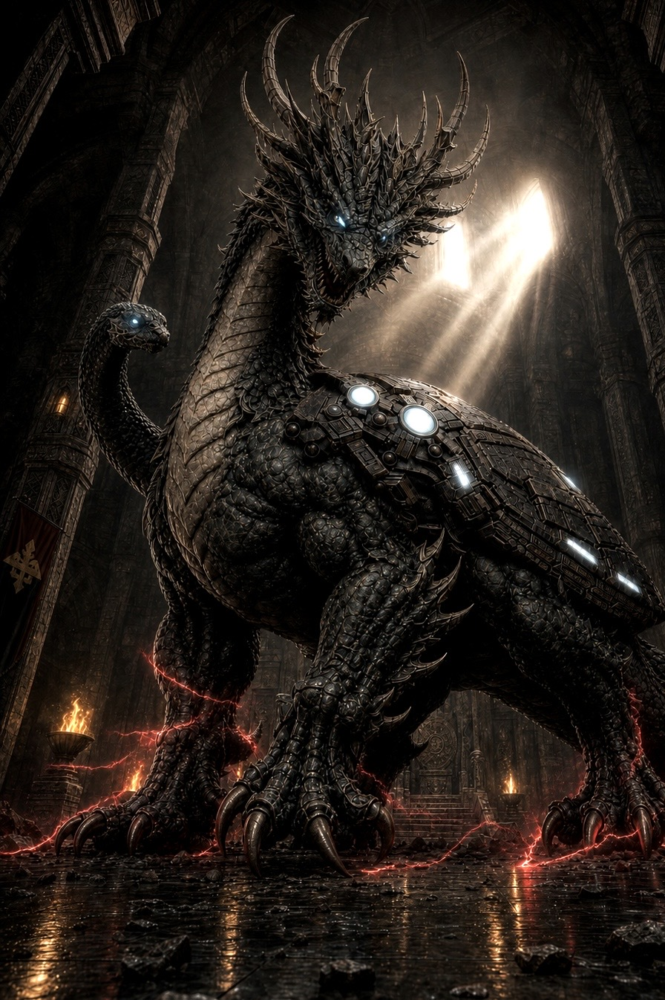
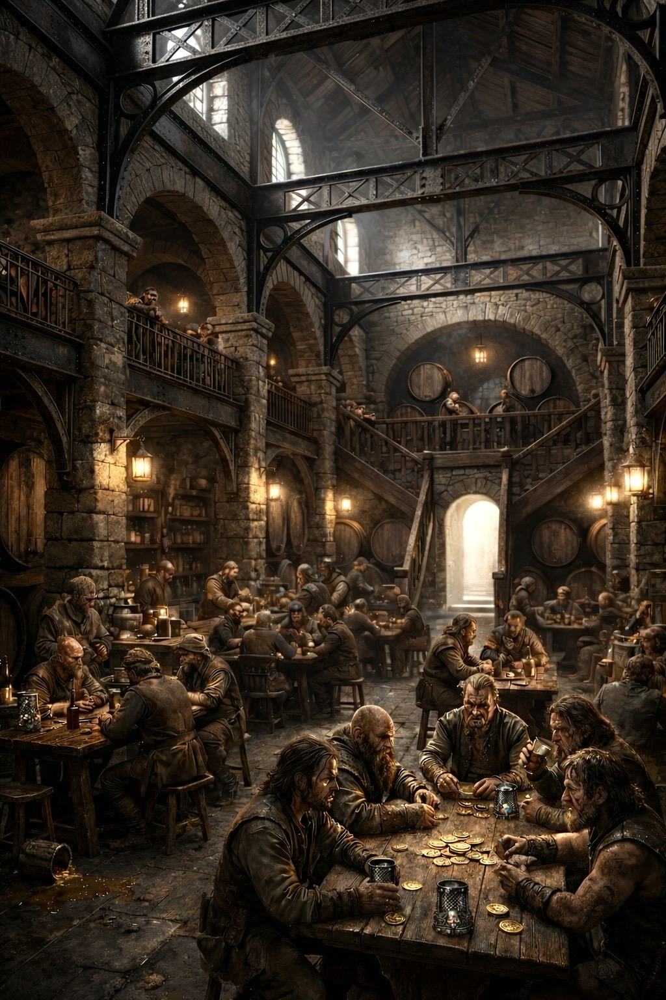
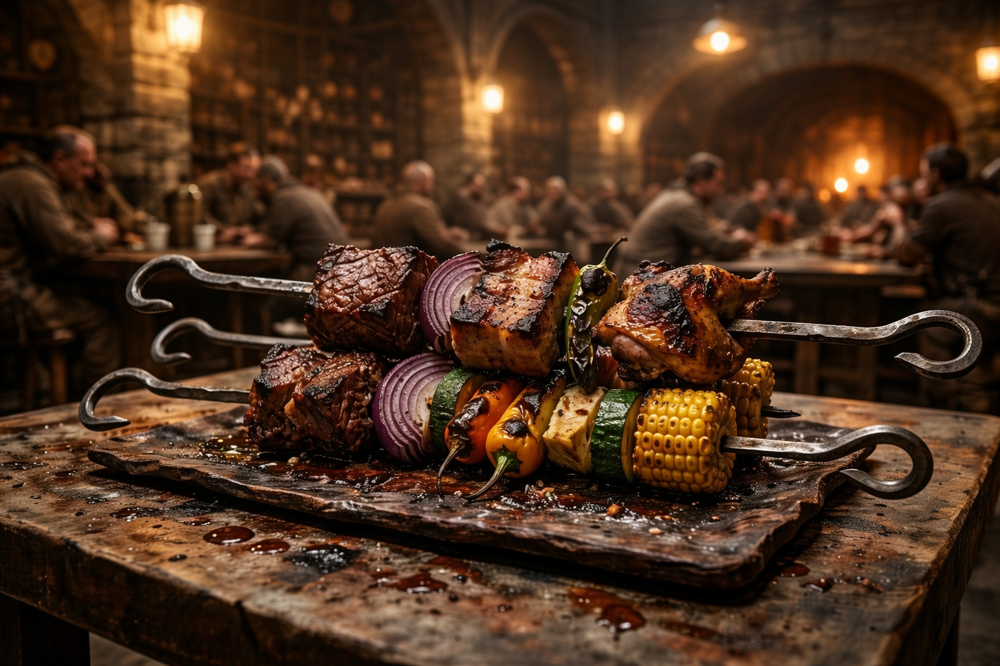
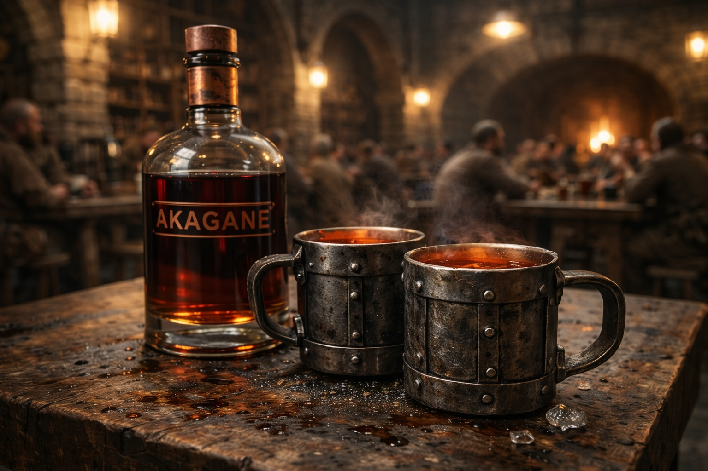
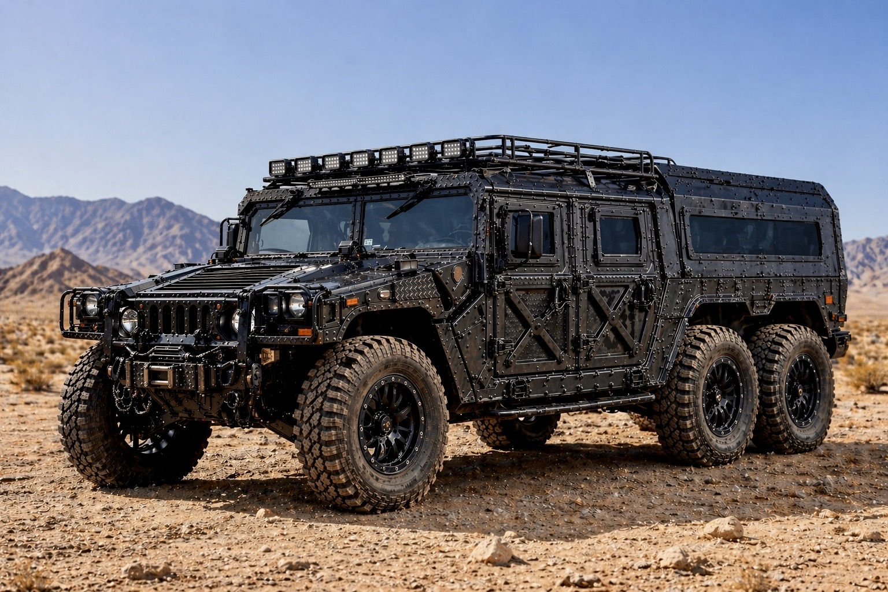
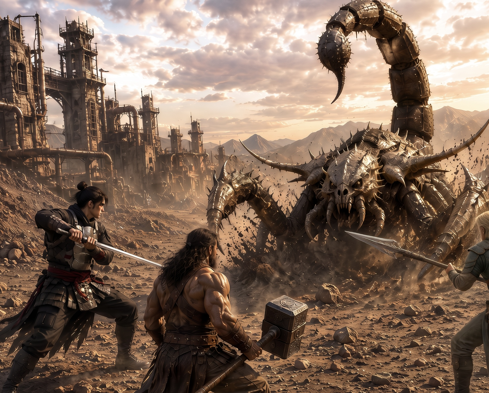
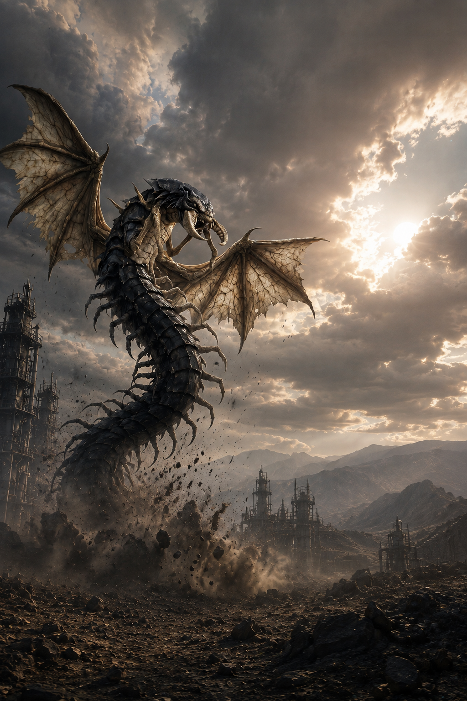
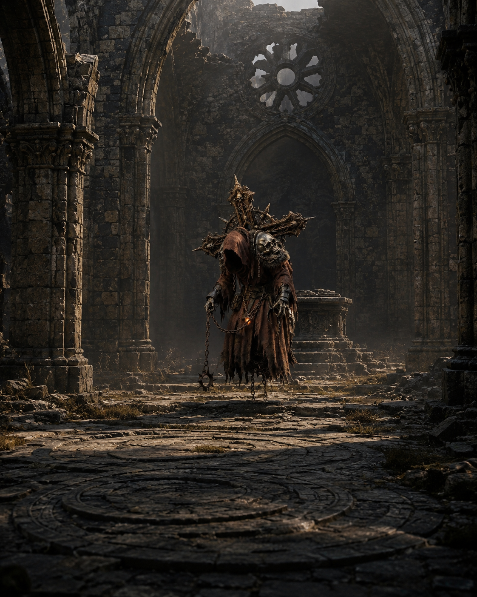

# 第6章：定まる夜明け

## 第1節：動き続ける街

ゴン、ゴゴン、ギィィと絶え間なく響く音が、薄暗い空間を震わせている。鉄の塊が叩かれ、炉が吐き出す熱気が蒸気管から漏れては空中に白い靄を描き出した。煤けた壁にへばりつく鉄粉が微細に舞い、縞鋼板の冷たく硬質な感触が足元の床を支えている。戦いの爪痕がまだ鮮明に残るこの場所は、壊れた床板の継ぎ目や、歪んだ梁の応急処置が生々しい。だが、ゴルゴニアはその傷痕を押し隠さず、止まることなく歯車を回し続けている。

サクヤは膝を曲げ、朽ちた継ぎ目に指先を這わせる。皮膚が冷えた鉄の表面と擦れ合うたび、微かな震えが伝わってきた。押し込みながら、彼は小さく呟く。

「雑だな」

指先の感覚が、荷重が逃げている場所を正確に捉えていた。工具箱を開くと、中で冷たく重いラチェットレンチが光を反射した。手に取った瞬間、錆び付いたボルトの抵抗感が伝わり、締め外すたびに手首に微細な振動が走った。彼は慎重にボルトを緩め、重みを感じながら膝で鋼板を支えつつ板をずらした。

梁との距離を目測で見定め、支点を取り直す。サクヤの指示に従い、作業員が手を添えて板を押し支える。彼の手がラチェットレンチでボルトを締め直すと、力加減は絶妙なトルクの感覚として掌に伝わり、過度な締め付けは避けられていた。最後に鋼板をコンと叩き、微かな響きを確かめる。

「通る」

修理はトト直伝の職人技だった。迷いのない手の動きには、経験が刻み込まれている。バショウが近づき、静かな声で短く告げた。

「……悪くない」

その言葉は最大の評価を意味していた。シエルは僅かに笑みを浮かべて言う。

「やっぱそっち側だな」

ルークも頷きながら応じた。

「納得だ」

ナギは何も言わず、ただじっとサクヤの動きを見つめていた。その視線は、確かな技術と揺るがぬ意志を映し出していた。街が動き続ける限り、修理の手もまた止むことはないのだと、彼らは知っていた。

鋼鉄の残骸が、谷底へと無残に垂れ下がっている。断ち切られた橋は対岸までの約二十メートルを隔てて、深い谷の闇に沈んでいた。下から吹き上げてくる風が冷たく、肌を撫でるように通り過ぎ、谷の底の見えない深さを暗示した。その場に立ち尽くしたサクヤは、唇をかみしめて短く呟く。

「くそっ、反乱軍の奴ら、橋を落としてやがる。谷底までは見えないし、これじゃ対岸に渡れないぞ」

彼の視線は残骸の向こう側にある対岸を見据えていた。だが、絶望はまだない。バショウが冷静に状況を分析しながら周囲を見渡す。額に汗がにじみ、埃と鉄の臭いが鼻腔をくすぐる中、彼は静かに口を開く。

「慌てるな。人呼んでこい！」

声を張り上げると、周囲にいた作業員たちが次々と集まってきた。男たちの足音が石畳に響き、肩越しに道具箱をかかえた者、鉄骨を抱えた者が集結する。バショウはその群れの中で指揮を執り、鋭い目つきで状況に対処していく。

「対岸までざっと二十メートルってとこか。俺たちで鉄骨を架けて道を作る。だが、支えがねえと途中で崩れちまうな」

バショウの声は低く、しかし確信に満ちていた。サクヤもすぐに技術屋として立ち上がり、彼と並んで谷の縁に立つ。彼らは図面も設計書もなしに、ただ目測と経験だけで支点の位置を定める。指先の感覚で鉄骨の太さや長さのバランスを確認し、風の流れや地盤の硬さに神経を集中させる。作業員たちには的確な指示が飛び交い、重い鉄骨は唸りをあげながら慎重に運ばれていった。懐から取り出された火打石が火花を散らし、溶接の閃光が夜空のような曇天に一瞬の煌めきを与えた。

その時、ルークが神使『マウンテン・ピーク』の力を借りて、谷底から力強い上昇気流を作り出した。鉄骨の一部が微かに揺れたが、強風に押し戻されることなく空中に宙づりになった。

「俺が下から上昇気流で鉄骨を支えよう。見えない橋脚代わりにはなるはずだ」「ただ、長くは保たねえぞ」

低く響く声に、リリィは軽やかに笑みを浮かべた。

「十分。じゃあ、私が一番に渡るよ。私の速度なら、鉄骨が軋む前に向こう岸へ到達できる。そこで安全なロープを固定するから、あんたたちは後からゆっくり渡ってきなさい」

サクヤは慌てて制止するが、リリィの瞳は揺るがなかった。

「リリィ、いくらお前でも無茶だ！」

「大丈夫。バショウの足場とルークの風があれば、私にとってはただの平らな道よ……行くわよ！」

彼女は神使『ヴェクター・ゼロ』の力を呼び出し、瞬時に風を切って対岸へと飛び立った。風の切れる音だけが、空間に残り、彼女の軌跡を示していた。ほどなく、確かな手応えのあるロープが対岸にしっかりと固定されたのが見え、安堵の表情が周囲に広がった。

バショウは感嘆の声を漏らす。

「あの嬢ちゃん、とんでもねえ速さだな」

ルークも負けじと拳を握った。

「俺たちも負けてられねえな」

作業員たちは言葉少なに、それぞれの役割を確認しあいながら動き出した。鉄の匂いと火花の飛び散る音、風のざわめきが耳を包み、手にした工具の冷たさと重みが身体に伝わる。彼らの間に言葉以上の信頼が流れ、互いの技術と判断を認め合う静かな誓いのようだった。谷間に広がるその小さな現場で、命を預ける共同作業が一つの橋を再び繋ぎ始めていた。

鈍い音が、地面の奥から響いた。ドン……。昨日聞いたそれよりもずっと重く、鈍く、空気が振動したが、その波は大気に溶けていくようにすぐに消えてしまった。リリィがぽつりと呟く。

「……静かだな」

シエルもまた、小さな声で応えた。

「静かすぎる」

声は低く、まるで何かを警戒しているかのようだった。皆の視線は自然と隔離区画の厚い鉄扉へと集まった。錆びついた鉄の面は長年の重みに耐えかね、ところどころ凹凸を生じている。バショウが一歩前に出て、ゆっくりと口を開く。

「……見るだけだ」

その言葉には、覚悟と緊張が滲んでいた。バショウの手が扉の冷たい取っ手に触れると、鉄の冷たさが指先にじんわりと伝わった。扉は重く、きしむ音を立てながらゆっくりと開かれた。冷たい空気が勢いよく流れ込み、鉄の匂いに混じった何か、腐食した金属のような、錆びた血のような匂いが鼻を突いた。

闇の中に、横たわるものが見えた。バハムだった。彼の鎧は剥がれ落ち、鋼の層と肉の層の境目が曖昧になっている。まるで一体化しようとしているかのように、金属の冷たさと生々しい肉の感触が混ざり合っていた。動かないが、胸のあたりが微かに上下し、かすかな呼吸が感じられた。シエルが呟く。

「沈んでるな」

彼の声は静かで、しかしその言葉には迷いの色がなかった。リリィはそれに応えた。

「止まってるだけだ」

ナギはじっとバハムの胸に手をかざし、静かに言った。

「繋がってる」

サクヤは護符を取り出し、その表面にそっと触れた。護符がひんやりとした感触から、次第に重さを帯びていく。目を閉じると、胸の奥で何かが絡まり合うような感覚が広がった。
バハムの存在、カケラ、そして護符が同じ一点に繋がっているのを感じた。その繋がりは言葉にできないほど強く、しかし壊れかけているような不安定さを孕んでいた。

誰も口を開かなかった。言葉にする必要がなかったのだ。全員の心に、ここが終わった場所ではないという認識が深く刻まれていた。重苦しい空気が、その場を支配し、誰もが静かにその事実を受け入れていた。

外に出ると、いつもの砂漠の音が耳に入る。ゴン、ゴゴン、と乾いた音が繰り返されているが、それはもはや同じものには聞こえなかった。砂の向こうに、二つの影がゆっくりと離れていく。メデューサとヴォルグだった。彼らは振り返らず、立ち止まることもなく、静かに歩みを進めていた。朝の光が砂漠の地面を染め、彼らの影を長く、ひしゃげた形に伸ばしている。

リリィが小さく、しかし確かな声でつぶやいた。

「……行ったな」

サクヤは沈黙を守ったが、その瞳は深く遠くを見つめていた。言葉はなくとも、終わっていないことが確かに伝わってきた。彼の手は護符を握り締め、冷たく硬い感触が指先に伝わる。砂漠の風が頬を撫で、冷たく乾いた空気が胸を締め付ける。

ここは、まだ続いている。

────────────────────────

第6章

第2節：未処理の残滓

工廠の喧騒が遠ざかっていく。人の流れから外れたその狭間には、炉の熱気も届かず、冷ややかな風が薄く揺れていた。煤と油に染まった壁面は暗黒のベールのように空間を覆い、天井の配管が絡み合いながら、静謐な無機質さを増している。足元の縞鋼板には埃が薄く積もり、長らく踏みつけられていない証がそこかしこに散らばっていた。遠くから、鈍いゴン、ゴゴンという槌音が壁の向こう側から響き渡り、重く鈍い振動が床を伝うものの、ここにはまだ人の気配が及んでいなかった。

彼らは声を潜めながら、その場に身を沈める。誰もすぐには口を開かなかった。やがて、シエルが間を破るように声を放った。

「で、何が起きてる」

雑で直接的な問いだったが、誰一人笑う者はいなかった。言葉の裏に込められた焦燥は、周囲の空気を一層緊張させた。リリィは壁にもたれ、肩を預けるその姿はどこか疲弊していた。ルークは軽い調子で、しかし目の奥に影を宿し、口を開く。

「じゃあ見てるもんからいくか」

バショウが静かに一歩前に出て、布に包まれた物体を床に置いた。ゆっくりとその包みを解く手つきは、無言の儀式のように儀礼的だった。露わになったのは黒く不規則な形状のカケラで、昨日よりも確実に数が増えていた。

「増えてるな」ルークの声は低く、感情の起伏を抑え込んだままだった。

サクヤは静かにしゃがみ込んで、その黒い欠片を手に取った。指先に伝わる感触は予想以上に軽かったが、重さが一定せず、手の中で微妙に変化しているのがわかった。持ち上げた瞬間と次の瞬間で、その感覚は揺らぎ、まるで物質が自らの意志で形を変えているかのようだった。

「気持ち悪いな」彼は小さな声で呟いた。

表面はガラスのような冷たさもなければ、石のような硬質な重みも感じられず、どことなく半固形の粘土がひび割れを起こしたような不安定さを秘めていた。微細な振動が指先を通じて伝わり、触れた瞬間にごくわずかに震えているのを感じる。光の反射も一定せず、角度を変えるたびに表面はざらついた鉱石とも、濡れた腐葉土のようにも見え、揺れ動く影が不気味さを際立たせていた。

シエルは彼の隣でそっと手をかざすと、視線を細めて観察を続けた。

「観測が揺れる……同じ位置に固定できない」

その言葉通り、カケラの輪郭はどこか揺らめき、焦点を当てても対象が微妙に動いているようだった。リリィは腕を組みながら、眉間に皺を寄せて言った。

「壊れてる感じじゃねぇな」

その直後、ルークが首を振りながら補足する。

「消えかけてもねぇ」

ナギがゆっくりと口を開いた。

「未処理だ」

サクヤはふと顔を上げて、疑問を含んだ声を出す。

「……未処理？」

ナギは言葉を選びながら続けた。

「本来は流れる。残らない。だが残っている」

バショウが静かに頷きながら説明を付け加える。

「流せなかった」

シエルは眉をひそめ、何度も繰り返すように言った。

「全部流してるはずなのにな」

リリィは小さく吐息を漏らし、視線を落とした。

「一部だけ残る」

カケラの不安定な性質は、触れる者の感覚を蝕むようだった。
手に取ったそれは、確かな存在感を持ちつつも、どこか揺らぎを孕み、まるで生命の残滓が微かに脈打っているかのような錯覚を与えた。表面は硬質な鉱石とも違い、透明感のない漆黒の液体が固まりかけ、しかし凝固しきれずに形を保っているような質感で、指先がわずかに触れるたびに細かな振動を放っては消え、また現れる。それが光を受けると、表面はざらつき、油を含んだ石炭のように鈍い光沢を放ち、反射は一定しなかった。

折り重なった煤の塊のように見える部分もあり、まるで生き物の皮膚のように微妙に動いているように感じられた。

誰もがそのカケラの前で立ちすくみ、言葉に詰まった。重さの揺れ、微かな振動、揺らめく影のような形状の変化、一定しない光の反射。これらが彼らの感覚を撹乱し、理解の先にある混沌を示していた。

だが確かなのは、これまで見えていた世界のルールが、ここでは既に破綻しかけているという事実だった。未処理の残滓は、彼らの前にじっと静かに横たわり、ただその存在を訴えていた。あらゆる理屈が通用しないこの空間で、彼らはただ見つめ続けるしかなかった。

ナギの声が静かな部屋の空気を切り裂くように響いた。「一つだけ確定してる」その言葉に、皆の視線が一斉に彼の方へ向く。彼の目は何か確信めいたものを宿しながらカケラの断片を指し示した。

「これは結果だ」

その一言はまるで空気の流れを変えたかのように、場の緊張を一層深める。サクヤは薄く息を吐きながら、指先でカケラの表面をなぞる。「……結果」彼の声は小さく、しかし確かな響きを帯びていた。ナギは続けた。

「原因じゃない」

その言葉に含まれる意味は重かった。ここ、ゴルゴニアで何かが始まったわけではない。どこか別の場所で起きた出来事の余波が、この場所に流れ込んでいるということだ。

ルークはその言葉を受けて眉をひそめ、「つまり、どっかで何か起きてるってことだ」と呟く。彼の声には真剣味がこもっていた。

シエルは瞳を細めて、「ここじゃない」と断言する。

リリィはその言葉に頷きながらも、どこか遠くを見据えているようだった。

「でも繋がってる」

彼女の言葉は静かな確信を帯びていた。サクヤは再びカケラに視線を落とす。手の中で冷たく硬いその断片は、まるで異物のように存在していた。確かなのはただ一つ。ここは原因ではなく、結果なのだという事実だけだった。

その時、ルークの目がサクヤの胸元にかかる護符に止まった。護符は暗い光を帯びていて、彼が近づくとその重みを感じた。ルークの視線は鋭く、まるで何かを探るかのように護符を見つめる。「……それ」彼の声には僅かな震えが混じっていた。サクヤは護符を触られるのを許し、じっとその反応を待つ。

「……なんだ」

彼は問いかける。ルークの指が護符の表面に触れ、縞鋼の模様が滑らかに指先をなぞった。その模様は不思議なほどに繊細で、凹凸の間から微かな冷気が伝わってくる。

ルークはカケラに視線を移し、再び護符に戻す。その動作は何度も繰り返され、彼の眉間には深い皺が寄っていた。

「……なるほどな」

彼は小さく呟いた。シエルが疑問の声を上げる。

「何がだ」

ルークは真剣な表情で答えた。

「これと同じの、見たことがある」

その言葉は空気を一変させた。シエルの顔に驚きが広がり、「お前もか・・・」と漏らす。リリィはそのやり取りを聞きながら、声を震わせて尋ねる。

「……どこで」

ルークはゆっくりと視線を落とし、答えた。

「場所は覚えてねぇ。でも分かる」

彼はカケラを軽く弾いてみせた。カン、と鈍い金属音が部屋に響き渡る。彼の言葉通り、その触れた瞬間に何かが変わるのが手に取るように分かった。

サクヤの胸が微かに揺れた。彼の視線は護符とカケラを行き来しながら、何かを掴もうと必死に探っている。二つの存在が、まるで見えない糸で結ばれているかのように感じられたが、まだ言葉にすることはできなかった。手の中の冷たさと重みが、静かに彼の心を押し込めていく。

外からはゴルゴニアの遠い音が聞こえてくる。ゴン。ゴゴン。そのリズムは変わらず、同じ動きを繰り返しているように思えたが、サクヤにはもう同じには聞こえなかった。

彼はゆっくりとカケラを握りしめ、もう一方の手で護符に触れた。
冷たく硬いカケラの感触と、護符のずしりとした重みが掌の中で重なり合う。

二つの異なる存在が手の中で絡み合い、一つの塊となって彼の感覚を支配した。外の世界は遠く、音も形も歪み、ただこの感覚だけが現実感を持って彼に迫ってくる。
サクヤは息を詰め、目の前の不可視の繋がりにじっと目を凝らしていた。

彼の胸中には言葉にできない何かが渦巻いていたが、それはまだ解きほぐされることはなかった。二つの感触だけが、掌の中で確かに重なっていた。

─────────────────────────────

第6章

第3節：触れたものが定まる

サクヤの両手は依然としてカケラの上にある。冷たく滑らかな表面が指先にじわりと伝わり、指の腹は微かな振動を拾っていた。揺れている。まるで呼吸を繰り返すように形が定まらず、時折黒い影が表面を波打つ。誰もが動かず、ただその瞬間を見つめている。沈黙の中、重さの不確かさ、質量が手のひらにねじれる感触が満ちていた。

ルークの声が低く響いた。

「……やってみるか」

その言葉は軽やかだったが、視線はカケラから一瞬も逸れなかった。緊張が空気に溶け込んでいる。サクヤは一言も返さず、揺れるカケラから目を離さなかった。指先の感覚が鋭くなり、わずかな変化も見逃さないように集中している。

ナギが静かに言葉を重ねる。

「条件は揃ってる」

床の木目、室内の湿度、そして何よりサクヤの手の位置。
シエルも続けた。

「前も同じだった。床も、これも」

記憶の彼方に繋がる実験の断片が浮かび、あの時と同じ光景が頭をよぎった。リリィが声を潜めて指摘した。「お前が触った時だな」サクヤは否定できず、目を伏せた。

バショウが静かに促した。「もう一回やれ」逃げ場はなかった。全員がその言葉で息を呑み、部屋の空気が一層濃くなった。サクヤは深く息を吐き、背筋を伸ばしてゆっくりと手を伸ばした。指先がカケラに触れるその瞬間、世界が一変した。

指先を包み込む冷たさが急激に固まった。触れた部分の表面がざらつきから滑らかへと変化し、不安定だった微振動はふいに止まり、重さが一定の確かなものとなった。まるで曇りガラスが一瞬で透明な鏡へと変わるように、光の反射が落ち着き、黒い歪みがゆっくりと整っていった。
指先に感じる触覚が、波打つ不安定さから静寂な安定へと変わる。カケラが確固たる実体を得た瞬間だった。

リリィが小さく息を呑む音が聞こえた。シエルは静かに言った。

「まただ」「今のははっきりしてる」

確信に満ちた声に、空間が緊張で震えた。
ルークは肩を震わせて笑いながら言った。

「偶然じゃねぇな」

笑いの中に、彼の中で芽生えた不思議な納得感が混じっていた。

サクヤはゆっくりと手を離し、浅く速い呼吸が胸を上下させる。言葉が途切れ途切れに紡がれた。「……今の」考えがまとまらず、続けることができなかった。ナギが静かに口を開いた。

「固定された」

その言葉にサクヤの眉がぴくりと動く。「……固定？」疑問を含んだ声に、ナギは淡々と答えた。

「観測が一致した」

変化の正体を言葉にすることはできないが、確かなものとして認識された。

シエルは続けた。

「ズレが消えた」

揺らいでいた輪郭がぴたりと止まった瞬間のことを指す。リリィも顔をしかめながら言った。

「さっきまで揺れてたのに」

視線は揺るがない。サクヤは再びカケラを見つめた。そこにはもう揺れはなく、ただ「そこにある」という存在感だけが確かにあった。

ルークが手を腰にあて、口元に笑みを浮かべながら言った。

「戻したんじゃねぇな」

それから間を置いて言葉を紡いだ。

「決めた」

その一言が、場の空気を一変させた。ナギが声を張った。

「お前が原因だ」

サクヤは首を振りながら答えた。

「分からない。意識してない」

言葉の裏に無意識の深淵が垣間見えた。

シエルが眉間に皺を寄せて言った。

「だから厄介だ」

ルークも付け加えた。

「無意識でやってる」

その事実が、全員の胸に小さな波紋を広げている。
バショウが冷静にまとめた。

「構造として成立してる」

理論ではなく、現象としての認識。それが今の全てだった。

ナギが静かに言葉を置いた。「再現できる」その響きが、確かな決定を示していた。再び揺らぎの中に戻ることはなく、カケラは一つの形として定まった。触れることで変わる。それが、この場で確認された事実だった。

サクヤはもう一度、カケラに手を伸ばし、指先に伝わるその安定した感触を確かめた。揺れのない黒い表面は、確かに「そこにある」ことを強く告げていた。

サクヤの指先が無意識に胸元を探る。ひんやりとした護符の輪郭が掌に触れた瞬間、鋭い音が部屋の静寂を割った。カンと、硬質な金属がぶつかり合うような響きが、空気の密度を変えたかのように明瞭に鳴り響く。彼は一瞬目を見開き、次いで護符を手のひらに包み込むように握りしめた。その音が、ただの装飾品ではないことを示していた。シエルがカケラを指先でそっと摘み上げ、淡い光の中にかざすと、微細な粒子が揺らめきながら輝きを帯びた。

「……これは、ただの破片じゃないかもな」

シエルの声は静かだが確信を含んでいた。誰も否定しなかった。沈黙がその言葉の重みを増幅させ、部屋の隅々まで張り詰めた空気が漂う。彼は破片を慎重に光に透かしながら、続けた。

「形として残っているだけで、実際には何かの“関係”が切れ残った痕跡、そういうものかもしれない」

その言葉に、サクヤの眉が僅かに寄る。

「関係……？」彼の声は低く、まだ理解の輪郭を探しているようだった。シエルはゆっくりとカケラを回しながら説明を重ねる。

「物が壊れたというよりは、繋がっていたはずの何かが途中でうまく切断されず、ねじれたように凝り固まってしまった感じだ。お前の護符は、それをただの物理的な存在として留めているわけじゃない。切れたはずの繋がりを、ここに引っかけている可能性がある」

彼の言葉は理屈のはざまに漂い、確かな答えではないが核心に触れていることを誰も否定できなかった。

部屋の空気は張り詰め、誰も口を挟まなかった。だがその静謐を破るように、重く規則的な足音が廊下から響いてきた。ゴン、ゴンと地面を叩く響きは、まるで巨大な鉄塊がこちらへ向かっているかのように重く、そして確実だった。ガレオスが姿を現した。
彼の体は圧倒的な巨体で、鉄のように硬質な肌は微かな光を反射しながら周囲の空気を押し潰しているように感じられた。彼の存在が放つ重力のような圧は、まるで周囲の空間そのものの密度を変えてしまうかのようだった。

バショウが小さくつぶやいた。「繋がった」その言葉は、ガレオスと彼との間に既に何か深い通じ合いがあることを示していた。無数の視線が二人の間を行き来し、それが言葉を超えた理解を生んでいるのが伝わってくる。ガレオスの視線がゆっくりとサクヤに向けられた。鋭く、何かを見透かすような目つきだった。

「……来い」それだけだった。

言葉は短く、力強く、逃げ場のない空間を突き刺す刃のように響いた。サクヤは一瞬体が硬直したが、護符を握る手は揺らがなかった。彼はもはやただの傍観者ではなかった。自分の中に深く関わりが生まれていることを、自覚せざるをえなかった。カケラを握るその手の中で、その小さな欠片はもう揺れていなかった。

すべてが静まり返り、次に起こることを待ち受けているかのように。

────────────────────────────────────────

第6章

第4節：流れの終端

ガレオスの一言が空気を裂いた。彼の声が低く響くと、場の重みが一変し、張り詰めた気配が薄れてゆく。サクヤはカケラをぎゅっと握り締めたまま、ためらいなく歩き出した。誰一人として止める者はなく、静かにその背に視線を注ぐだけだった。足音が、しかし、不自然に軽やかに響いているようにも感じられた。

工廠の奥へと足を踏み入れるにつれて、周囲の音は次第に遠ざかり、ざわめきが溶けていく。人の気配はいつしか完全に消え、空間はまるで吸い込まれるように静まり返った。床の感触が変わり始めていた。
かつての鉄板の冷たく鈍い硬さは消え、代わって足裏に伝わるのはどっしりとした岩の感触だった。
沈まぬ堅牢さがあり、揺れは一切感じられず、重みをしっかりと受け止めている床だった。

温度は下がり、空気がぐっと乾いているのがわかる。息を吸い込むと、清冽で鋭い冷気が喉の奥を刺した。
天井は見上げるほど高くなり、頭上の光源もどこか遠く儚げに揺れていた。壁は無骨に荒削りされた岩盤へと変貌しており、そのざらつきが視覚と触覚に迫る。鉄の匂いが霧散し、代わって湿気のない石の匂いが鼻をくすぐった。
空間全体が地層の深奥を思わせる異界へと変じていた。

シエルが低く呟いた。

「……ここか」

ナギも頷きながら答える。

「支点だな」

その言葉に、場の意味が一層重くのしかかる。バショウは迷いなく前へ進み出た。まるで引力に導かれるかのように、中央へと歩を進める。彼の足取りは確信に満ち、静かな決意がその背中から滲み出ていた。一歩、その足が岩盤の床を踏み締めると、鈍い音が響いた。

ドン――

床が開くその音は、割れるというよりも、長く閉ざされていた何かが戻るような感触だった。岩盤がゆっくりと分かれ、隙間が現れた。亀裂ではなく、まるで石の扉が静かに開いていくかのように。サクヤは息を呑み、足を止めた。眼前の裂け目の先は闇に包まれているが、その闇は単なる暗闇ではなかった。

そこは下方、しかし空間ではない。深く、重く、圧が漂っていた。
押し潰すような恐怖ではなく、支えられているという感覚が身体を包んだ。圧が手のひらにずしりと乗り、ただ存在するだけで安定を感じさせる。

時間の流れすら鈍くなるような、静謐な重み。やがて、その闇の中からゆっくりと、巨大な物体が姿を現し始めた。

甲殻は岩のように硬く、しかし呼吸をしているかのように微かに膨張し、縮んだ。表面には無数の層が積み重なり、まるで地層そのものが意志を持ったかのように重厚だった。頭部は巨大な亀のそれを思わせる形状で、裂け目の中からゆっくりと目が開いた。目は古代の石の深みを湛え、時の単位が異なる存在の証明のように、悠久の静寂を映し出していた。

その姿は言葉を超えていた。言葉は不要だった。ただ、そこに「構造」として存在しているだけで、この空間のすべての秩序を支えているように感じられた。ガレオスが短く名を告げる。

「テクトニクスだ」

声は鈍く、しかし確かな響きを持って頭の奥に落ちた。サクヤはただその巨体を見上げ、胸の奥に震えるような感触を抱いた。彼の掌のカケラが微かに熱を帯び、まるでその存在と呼応しているかのように感じられた。風もなければ音もない空間で、ただゆっくりと揺らぎながら、テクトニクスの呼吸が周囲の岩盤と一体化し、地層の鼓動となって響いていた。

この瞬間、彼らの足元に流れてきた「流れの終端」が静かに重なり合い、積み重なっていた。処理漏れの一部がここに残り、歪みを孕みながらも確かな支点となっている。すべてが溜まり、すべてがここに集約されていることを、身体が確かに知覚していた。

サクヤの視線は揺らぐことなく、その存在の細部にまで吸い込まれていった。岩の節理に似た甲殻の隙間、古い時代の鉱脈のような亀裂、そして瞳の奥に宿る静謐な光。彼の体温が微かに上がり、握るカケラの重さが増したように感じられた。

テクトニクスの視線がゆっくりと揺らぎながら、その巨大な身体を覆う甲殻の隙間から複雑な光が滲み出る。彼の瞳は硬質な岩肌のように鈍く輝き、カケラのひとつひとつ、護符の繊細な文様、そしてサクヤの全身をまるで触れるかのように舐め回すように見つめていた。
そこにあるはずのない深遠な時間の流れを掬い取るかのような、その視線はひときわ重く、圧倒的で、周囲の空気までをも引き締めていく。
やがて、その存在感が一層増していく中で、テクトニクスの声が頭の奥深くに忍び込み、まるで脳の神経を掻き鳴らすように響いた。耳ではなく、意識の奥底に直接触れるその声は低く、揺るぎなく、そして静かに断言していた。

「……流れている」

その言葉はまるで大地の深層から染み出す水のように重く、しかし確かなリズムを持っていた。続いて、短く響いた次の声は、削り取られていく岩のような無慈悲な現象を告げているかのようだった。

「削られている」

それもまた、砂粒が絶え間なく風に吹きさらされて消えていくような、止めどなく続く変化の一端を示していた。やがて、テクトニクスの声はさらに深みを増し、千年の時を越えたような重みを帯びて続ける。

「外へ」

その単語が放たれると、空気が一瞬凍りつくかのような静謐さが広がり、ナギの口元がわずかに動いた。小さく、しかし確信を込めて呟いた。

「……転嫁か」

テクトニクスは肯定の言葉を返さず、ただ静かにまた視線をカケラへと戻す。すると、その凝視の先でひとつの変化が起きていた。歪み、曲がり、ねじれるようにカケラの一部が異形の様相を帯び始めていたのだ。

「だが、一部が残る」

その声は重く、深く、まるで岩盤の中で微かに震える振動のように響き渡った。ルークが問いかける。

「処理漏れか」

その疑問に、テクトニクスは静かに肯定した。

「そうだ」

その瞬間、空間全体が微妙に震え、まるで大地の奥底で何かが囁き合うような感覚が広がった。彼の言葉は次第にその場の空気を支配し、さらなる真実を明かしていく。

「この地は、流れの終端だ」

その断言は、まるで大地に刻まれた歴史の一部を掘り起こすかのように重く響き渡った。サクヤの唇がわずかに震え、問い返す。

「……終端？」

シエルが割り込むように説明を付け加えた。

「排水口みたいなもんか」

それを聞くと、テクトニクスは肯定のうなずきを見せた。

「流れはここで止まる」

その言葉は、まるで止まった川が淀み、そこにすべての汚れや欠片が堆積していくようなイメージを呼び起こす。彼はさらに続ける。

「ゆえに、溜まる」

空気が一層重く、そして濃密になり、周囲の温度すら感じ取れるほどの圧迫感が漂った。ガレオスが重苦しい声で指摘する。

「だから止められん」

その言葉に、テクトニクスは冷徹な眼差しを向けた。

「本来、流れ続けることで均衡する」

ナギが鋭く反応する。

「だが、偏っている」

「一箇所に集中している」

その言葉に、テクトニクスは頷いた。

「崩れれば、一気に噴き出す」

その言葉が終わると同時に、サクヤの胸がまるで激しい波に揉まれるように大きく揺れた。彼の中で、バハム、メデューサ、ヴォルグのそれぞれの影が重なり合い、すべてがここに集約されていることを、彼は肌で感じ取っていた。

テクトニクスの声は最後の言葉を静かに告げた。

「ここは、結果の場所だ」

サクヤは口を閉ざし、何も言えなかった。だが、彼の全身を巡る感覚は鮮明に理解していた。原因はこの場所ではない。ここは、ただ溜まった場所だったのだということを。空気は重く、鈍い音を立てて流れ続ける地下水のように、すべての想いと出来事を押し込めていた。

原因はここにはない。ここは、ただ溜まった場所だった。

──────────────────────

第6章

第5節：そちら側

テクトニクスの言葉がまだ、湿った夜気の中に漂っていた。

「ここは、結果の場所だ」

その重く厚い響きは、空気を震わせ、見えざる何かを告げているようだった。全員の視線がじわりとサクヤへと集まる。彼の瞳は、わずかに揺れているカケラを見据えていた。手にしたそれは、まだ決まっていない、不安定な存在として震えて微かに揺らめいていた。まるで、何かが触れられた瞬間に崩れ落ちそうな薄氷のように。

ナギが低く告げる声が、空間を切り裂いた。

「もう一度だ」

指示は簡潔で、逃げられないことを暗示していた。
リリィも続けるように「やってみろ」と促す。
四方を囲む冷たい視線が、サクヤを追い詰める。彼は深く息を吐き、ゆっくりと手を伸ばした。手先がカケラの表面に触れるその瞬間、指先に伝わる微細な振動が指の皮膚を震わせる。カケラはまだ、決まらぬままに揺れ続けていた。

接触と同時に、振動がふっと消えた。サクヤの掌に乗るカケラの揺れが止まり、重さがずっしりと安定する。冷たかった表面は、ほんのりと暖かみを帯びて滑らかに固まったように感じられた。光が一定の角度で反射し、まるでそれ自体が静謐な意思を持ったかのように静止している。空気は張り詰め、微かな息遣いも遠のいていく。その瞬間、リリィが小さく息を呑んだ。

「……止まった」

シエルの声が控えめに響く。

「今度は完全だ」

ルークの言葉は確信に満ちていた。

「確定だ。お前、中心にいるな」

サクヤの胸の奥で、呼吸が浅くなった。掌に感じる確かな実感と同時に、身体の中で何かが引き締まるような感覚が広がっていく。彼の視界の端に、テクトニクスがわずかに動く気配があった。わずかに体を揺らすだけで、場の重さが鮮明に変わる。

その視線は、逃れようのない鉄壁のようにサクヤに降り注いだ。

テクトニクスの低く落ち着いた声が、彼の頭の奥深くに染み込む。

「触れたものが、定まる」

ナギの声が重なる。

「確定だな」

テクトニクスは続けて言った。

「流れていたものを、止める。決める」

サクヤの目が揺らぎ、初めてはっきりとその意味を告げられた。彼の中に潜んでいたものが、外の世界へと確かな形を持って現れた瞬間だった。

「お前は、そちら側だ」

空気が一気に張り詰め、思考を締めつけるような緊張が走った。リリィが震える声で呟く。

「……来たな」

シエルが続ける。

「流す側じゃない。決める側だ」

ルークは軽く肩をすくめて、しかし真剣な表情で言った。

「いい役もらったな」

サクヤは何も答えられなかった。ただ、否定もできないままにその言葉を飲み込んだ。掌の中のカケラはもう揺れず、確かな存在感を放っていた。何かが、はっきりと彼の中で形を成し始めていた。
冷たい空気の中で、彼の身体の芯がゆっくりと固まっていくのを感じた。静かに、しかし確実に。

テクトニクスの声が低く、重く響いた。

「我は保つ。崩さない」

その言葉は岩のように硬く、確固たる意志が宿っていた。揺るぎない強さが空気を震わせ、サクヤの胸に重くのしかかる。

「お前は……変える。定める」

その声が頭の奥に落ちた瞬間、サクヤの内側で何かが強く鳴り響いた。胸の奥底から、逃げ出したいという衝動と、抗えない引力が絡み合い、身動きが取れなくなる。ナギが冷静に言葉を重ねる。

「つまり、選択を逃がさない」

その一言で、サクヤの中にあった曖昧な感覚が一気に形を成した。

テクトニクスの視線が不意に変わった。彼が見つめる先は、サクヤの顔や身体ではなく、その奥深く、サクヤの内側に潜むものだった。
まるで彼の中に棲む「何か」と対話を始めたかのように、声の響きも変わる。

先ほどまでの厳しさは影を潜め、代わりに柔らかく、かつ確かな温もりを帯びていた。あたかも久しく会っていなかった旧友か、同じ血を分けた存在に語りかけるような低く穏やかな呼びかけだった。

「……そこに居るんだろう」

テクトニクスのその言葉は、サクヤにではなく、彼の内側の「何か」に向けて発せられた。しかしその瞬間、空間が微細に震え、周囲の空気が張り詰めた。ナギの眉がひそまり、「？」の表情で問いかける。

「誰に言ってる？」

とシエルも首をかしげ、ルークは言葉なく顔色を変えた。四人の視線が交錯する中、サクヤだけが違った反応を示した。胸の奥で何かがざわつき、護符が微かに熱を帯びる。心臓の裏側、骨の奥深くに覚えのある圧迫感が走った。言葉にできないが、サクヤの身体のどこかが、テクトニクスが語りかけた存在を知っているのだと告げていた。

テクトニクスはしばらく沈黙を保ち、やがて短く呟くように言った。

「……まだか」

その声には返事を待つような、待望と焦燥の入り混じった響きがあった。サクヤの喉が詰まった。答えたい、答えられない、自分でもどちらなのか分からないもどかしさが胸を締め付ける。
彼の言葉に反応を返すことができず、ただ沈黙のまま立ち尽くすしかなかった。テクトニクスはそれ以上何も語らず、視線をゆっくりと戻した。まるで「まだ時ではない」と判断したかのように、その瞳は静かに冷たさを取り戻していた。

サクヤは視線を下ろし、手元のカケラに目をやった。
揺らめきは完全に消え去り、そこには確固たる形があった。揺れていた光は凍りつき、静寂の中で確かな存在感を放っていた。サクヤの指先が鋭く冷たい表面に触れる。これは修復の過程ではない。もうひとつの何か、選択の瞬間が訪れたのだと、身体が震えながら告げている。
揺るぎない決意がその小さなカケラに宿り、その硬質な存在がサクヤの胸の奥に静かに波紋を広げていく。まるで深い海の底から、底知れぬ力がゆっくりと目覚めるかのように。

カケラはもう揺れていなかった。

そしてサクヤの胸の奥もまた、何かが定まりかけていた。サクヤの内側でざわめいていた存在は、まだ形を見せようとはしなかったが、その輪郭が確実に浮かび上がっていることを、身体の隠々が知っていた。
時間が止まったかのような静謐の中で、サクヤはその存在に触れ、そこにある意味を受け入れようとしていた。これが終わりではない。選択の瞬間なのだと。空気の重みが解けることなく、ただ静かに流れていく。サクヤの心臓の鼓動がゆっくりと落ち着きを取り戻し、手の中のカケラと同じく、サクヤの世界もまた確かに定まりつつあった。

────────────────────────

第6章

第6節：選べ

リリィの声は、冷たい空気の中で鋭く響いた。

「どうする」

その問いは、逃げ場を完全に塞ぐように、静かに、しかし確実に重くのしかかった。サクヤは言葉を返さず、ゆっくりと視線を上げた。彼の眼差しは、場を支配するテクトニクスに向けられていた。巨大な存在は揺るぎなく、まるで時の流れにさえ逆らうかのように動じなかった。鋼の意志を宿したその影は、周囲の動揺を一切許さず、無言の圧力となって彼らを包み込んでいた。

バショウが静かに口を開く。
声は低く、それでいて確かな響きを持っていた。

「ここは持つ」

その言葉は、まるで固く結ばれた縄のように、緊張の糸を張り詰める。サクヤは眉をひそめ、声を震わせながらも問い返した。

「……任せていいのか」

迷いの色はなかった。バショウの答えは揺らぎなく、断固としていた。

「そのためにいる。崩させない」

言葉は短く、しかし鋭い刃のように真実を切り裂いていった。彼らの背後に漂う不安を一気に吹き飛ばす力があった。誰も疑わなかった。ここを守り抜く者がいる、その確信がひとつの盾となり、空間を満たしていた。

その瞬間、ガレオスが重い口を開いた。空気が一層重く沈み、耳を澄ます者だけが彼の声の微かな震えに気付いた。

「これ以上は、ここでは止められん」

彼の言葉は、無力感を含みながらも真実を語っていた。

「原因は外だ」

ナギが短く頷く。

「一致してる」

ガレオスの視線は遠くを見つめるように揺らいだ。初めてその名を口にした。

「10年前、シルヴァンで事故があった。……空白の収穫祭と呼ばれている」

彼の声は、噂話を伝えるかのように曖昧で、不確かな記憶を辿りながらも、確かな重みを伴っていた。空気はその言葉で一層冷え、背筋に冷たいものが走った。

「村がひとつ、消えた。建物も、人も、記録も。何も残らなかった」

その言葉が描き出すのは、無音の闇に飲み込まれた世界。消えた村の残像が、まるで霧の中にぼんやりと浮かび上がり、すぐに消え去る幻のように揺らめいた。

「原因は分からん。だが……カケラが残っていたという話は聞いた」

言葉の端々に漂う謎と不安が、空間の温度をさらに下げた。彼の声はなおも続く。

「厄災が絡んでいるという噂もある」

それはまるで、知られざる暗黒がじわじわと広がっていることを示唆していた。誰もが言葉を飲み込み、沈黙が長く続く。

「シルヴァンの女帝エルゼは……何か知っているかもしれん」

ガレオスのその一言は、隠された真実の鍵を指し示すようだった。だが確信はなく、ただの伝聞として放たれた言葉が、空間に重くのしかかった。

シエルが唇を噛みしめ、冷静な声で言った。

「流れてる側だな」

ルークが即座に応じる。

「溜まる場所じゃなくて、流れる場所。逆だ」

その言葉が場の景色を一変させた。水の流れが岩を削るように、事態の本質が音を立てて動き始めた。

リリィの瞳が鋭く光る。

「シルヴァンか」

ナギが静かに頷いた。

「そこが起点に近い」

それはまるで、彼らの足元でうごめく地脈を掴み取るかのような感覚だった。見えない力の波紋が、確かに広がっていくのを感じた。

サクヤは再び口を閉じた。頭の中は言葉の洪水に溺れながらも、整理されない思考が渦巻いている。
視界の隅に、バハムの影がちらつき、隔離区画の冷たい壁面が脳裏に浮かんだ。メデューサの冷徹な視線やヴォルグの荒々しい気配も、次々と連鎖する記憶として彼を締め付けた。消えた影の存在すら、その輪郭を持って迫ってくる。

ここにただ留まっているだけでは、何も変わらない。そんな無言の叫びが胸の奥を掻きむしる。ナギの声が、サクヤの揺れる視線をとらえた。

「ここは結果だ。原因を切らない限り、止まらない」

その言葉が、重く、しかし明確な線を引いた。冷え切った空気の中、変わらぬ真実だけが確かに存在している。サクヤは目を閉じて、深く息を吸い込んだ。指先に伝わる微かな震えは、決断への途方もない重さを語っていた。だが、彼は動かなければならなかった。
ここにいるだけで、終わりを迎えることは許されない。薄闇の中に、彼の意志がじわりと固まっていく。

テクトニクスの声が低く響いた。

「選べ」

その一言は、空気を凍らせるように重く、サクヤの胸を締めつけたテクトニクスの瞳がじっとサクヤを見据え、逃げ場のない視線がその言葉に重みを加える。サクヤの呼吸は一瞬、止まった
。深く鋭い刃物が喍をかすめたような感覚。恐怖や迷いが入り混じった感情が渦巻くなか、彼の目はゆっくりと変わった。揺らぐことなく、震えることなく、ただ澄んだ「前」を捕らえている。
その言葉が何を意味するのか、サクヤは分かっていた。もう後戻りはできない。逃げ場はない。それでも、その視線は揺るがなかった。

サクヤが小さく口を開く。

「……行く」

声は控えめで、しかし揺るぎなくはっきりしていた。言葉は短いが、その背後には無数の思考が凝縮されている。足元からじわりと泥の匂いと湿り気が立ち上がり、冷たい空気が肺の奥まで満たされる。決断の瞬間、世界は一瞬ながらずっしりとした重みを帯びた。沈黙のなか、その言葉だけが確かに響いた。それだけだった。他の言葉も説明も、必要なかった。
選択はその一言に凝縮されていた。

リリィが微笑みを浮かべて言った。

「だろうな」

その声は軽やかでありながら、どこか安堵の響きを含んでいる。長い旅路の中で何度も見せたリリィの芯の強さが、ここにも現れていた。
シエルは静かに頷き、「当然だ」とだけ呟く。彼の瞳は冷静そのもので、戦いの覚悟を示していた。
ルークは唇の端を上げて、「面白くなってきた」と言い、緊張をほぐすかのように空気に一瞬の明るさをもたらした。
ナギはその言葉に無駄を感じず、「合理的だ」と冷静に分析した。
バショウは短く、「行け」とだけ言葉を投げる。その簡潔さに、仲間たちの信頼と期待が詰まっていた。

サクヤは彼らの視線を一つ一つ受け取りながら、揺らぐことなく前を見つめ続ける。

ガレオスが詰め寄るように言葉を紡いだ。

「頼む。この国を、終わらせるな」

彼の声には切実な祈りが込められていた。過去の傷跡と未来の不安が混ざり合い、彼の言葉は重くのしかかる。だがサクヤは頷かなかった。彼の願いは理解している。終わらせるのではない。逃がさない。それだけだった。
ガレオスはサクヤの背中を見つめ、サクヤはただ黙って前へと歩みを進めた。言葉ではなく行動で示すしかない。
気配が変わり、空間が張り詰めていくなか、彼の手は自然にカケラへと伸びた。

そこにあるのは重さを感じさせる断片で、冷たくざらついた表面が指先に伝わった。固く握り締めるたびに、内側から深い力が湧き上がるようだった。重みは肉体の負荷となりながらも、精神の支えとなっていた。
周囲の空気も変化し、肌を撫でる風が一層冷たく鋭くなり、遠くで雷鳴が低く唸るように響いた。サクヤの心臓は静かに高鳴り、鼓動とともに決断が確かに刻まれていく。サクヤは振り返らなかった。ただ前を見ていた。

ここから先は、選ぶしかない。

────────────────────────

第6章

第7節：継ぐ者

「行く」

サクヤの短い言葉が、空気の中で静かに震えた。言葉の重みが身体の芯にまで染み渡るようで、場の時間がほんの少しだけ緩やかに流れを変えた。終わりではない。だが、これまでの緊張がひとまずの区切りを迎えた瞬間だった。誰もがその一言の後、互いに目線を交わしながらも言葉にはしなかった。
胸の中にくすぶる何かが、少しだけ鎮まったように感じられた。

ガレオスはゆっくりと立ち上がり、重い足取りでテクトニクスの前へと歩を進める。彼の顔には疲労と決意が混じり合い、眉の辺りに深い皺が刻まれていた。テクトニクスは動かず、ただそこに巨大な甲殻を広げていたが、確かに見ているようだった。
ガレオスが甲殻の冷たく硬い表面に手を置くと、その感触が手のひら全体に鈍い重みとなって伝わってきた。命令でも祈りでもなく、ただ「引き受けてきた者」の静かな所作だった。

「……限界だ」

彼の声は低く、震えずに言い切られた。誰もがその言葉に反論する気配はなく、沈黙の中に重く響いた。ガレオスの指先から伝わる甲殻の冷たさは、まるで終わりを告げるように凛とした空気を生んでいた。彼はさらに言葉を続ける。

「この国は、もう回し続けるだけでは持たん」

その声は静かだったが、言葉の重みは鋭く、空気に刺さるようだった。地面のひび割れた感触、遠くから微かに聞こえる地下の微振動が、まるでその言葉に同意しているかのようだった。誰も反論できない現実が、そこにあった。

バショウがゆっくりと前に出る。彼は無駄な言葉を使わず、ただ短く告げた。

「代わります」

その一言は、重くも軽やかに響き渡った。ガレオスは即座に頷き、言葉は続かなかった。

「頼む」

それだけで全てが伝わった。バショウは迷いなくテクトニクスの前に立ち、ゆっくりと一歩を踏み出す。彼の足元から伝わる微かな振動が地面に波紋を生み、空気の密度が微妙に変わるのを誰もが感じ取った。すると、低く鈍い音が「ドン……」と響き、テクトニクスの甲殻がわずかに開いた。

リリィが息を呑む音が小さく聞こえた。その目は大きく見開かれ、揺らぐことなく甲殻の内部を見つめている。
内部は地層のように幾重にも重なった構造が複雑に絡み合い、何世代にも渡る時間の重みを感じさせた。その中で何かがゆっくりと動き出し、鈍く重たい振動がバショウの体へと伝わるのがわかった。

バショウの膝が微かに折れた。
だが彼は倒れず、踏みとどまりながら歯を食いしばってその重さを受け止める。身体の内側から重力が増していくようで、呼吸は荒くなるがその目は揺るがない。

「……来い」

彼の声は低く、短く、逃げる意思など微塵も感じさせなかった。テクトニクスはその声に応じるように、ゆっくりと確実に応え始める。重さがバショウの体に流れ込むのを周囲の者たちは肌で感じた。振動は次第に深く、地殻が動くような鈍い感触となって身体中を満たしていく。

ルークが小さな声で呟く。

「……継承か」

シエルが応じるように続けた。

「構造が移った」

ナギは無造作に肩をすくめながら言った。

「担い手が変わっただけだ」

バショウはゆっくりと立ち上がり、胸の内に重さを感じつつも姿勢を正す。呼吸は依然として荒いが、決して乱れてはいなかった。彼の目は静かに、だが強く未来を見据えている。

テクトニクスの甲殻は再び閉じられ、静寂が戻った。だがそれは消えたわけではなく、これまでとは違う落ち着きを持ってそこに存在している。
ガレオスはゆっくりと息を吐き、初めてわずかだが力を抜く様子を見せた。肩の荷が下りたわけではない。だが、少なくともこの瞬間は、確かな区切りがついたのだと誰もが理解していた。

地面のひび割れから微かに立ち上る埃の匂いが、乾いた風に乗って鼻腔をくすぐる。空はまだ薄暗く、星が瞬きを続けているが、その輝きは確かな変化の前触れのようにも感じられた。
テクトニクスの重みがバショウの体を支配し、彼自身の血潮とともに新たな重力を作り出している。地層が動くような、鈍くて揺るぎない生命の鼓動が、そこにあった。

ガレオスはゆっくりと肩を落とし、振り返った。荒れた呼吸の隙間から、彼の瞳はサクヤを捉えていた。彼の声は低く、地鳴りのように重く響く。

「……すまなかった」

その言葉は、ただ一語だった。詫びるための言葉としてはあまりにも簡素で、しかし同時にその重みは計り知れなかった。
サクヤは何も返さず、ただ彼の声の波紋を受け止めるだけだった。彼を責めることも、許すこともせず、ただ静かに耳を傾けている。彼の言葉は続いた。

「止められたはずだ。だが、止めなかった。選ばせた」

その声はどこか痛みに満ちていて、過去の影を引きずるようだった。ゴルゴニアの動乱の嵐に、彼らが巻き込まれた事実を、彼は今も胸の奥で重く抱えているのだろう。彼の言葉は謝罪の枠を超え、自己の責任と苦悩の告白に変わっていた。サクヤは沈黙を守り、それ以上の言葉を彼に求めなかった。

少し離れた場所に、ガンドルが立っていた。彼の姿は動かず、まるで岩のようにそこに鎮座している。サクヤはゆっくりと視線を向けた。ガンドルの顔は硬く、感情を押し殺した表情で静かに言葉を紡ぐ。

「命令は、正しかった。だが……結果は、これだ」

その短い言葉に、彼の覚悟と重圧が詰まっていた。言い訳もなければ、後悔を口にすることもない。しかし、その背中に背負ったすべての責任が透けて見えるようだった。サクヤは目を閉じ、微かな痛みを胸に感じながら一瞬だけその視線を閉じた。彼の言葉を理解したからだ。確かに正しかった。すべての行動は正当な理由に基づいていた。
しかし、それでも、終わってなどいなかった。

静かな空気が流れる中、サクヤはゆっくりと口を開いた。

「……終わらせるな」

その声は短く、しかし鋭く響いていた。彼の言葉は戦いの終結を願う者のものではなく、むしろ今から始まる戦いへの決意の表明だった。

「ここで止めたら、また同じことになる」

彼の言葉が、胸の奥で再び火を灯す。静かにガレオスも応えた。

「……ああ。分かっている」

その声には、一抹の諦めはない。覚悟が込められていた。

その瞬間、バショウが前に踏み出し、サクヤに向かって声を上げた。

「お前がそれほどまでに重き荷を背負うというなら、オレが盾となり、お前のその『熱』、どこまで届くか見せてもらおう」

その言葉はまるで鉄の鎧のように力強く、敵の刃を防ぐ盾のように堅固だった。バショウの瞳は揺るぎなく、決意に満ちていた。

ナギがすぐさま口を挟む。

「任せられるな」

シエルも笑みを浮かべながら呟く。

「固いしな」

ルークは冷静に頷き、短く言った。

「最適だ」

その言葉が場の空気を引き締める。リリィは無愛想に言葉を放った。

「死ぬなよ」

バショウは鼻で笑いながら返す。

「簡単に言うな」

その軽口に、一瞬だけ空気は和らぎ、緊張の糸が緩むのがわかった。だが、誰もがその先を知っている。これから始まる道がどれほど険しいかを。

サクヤは目を細めてゴルゴニアの残る場所を見つめた。荒涼とした大地が、彼らの戦いの痕を静かに抱えている。その地が彼らの帰るべき場所であり、同時に決して後戻りできない場所でもあった。彼は深く息を吸い込み、足を踏み出した。確かな一歩だ。

もう戻らない。

──────────────────────

第6章

第8節：別の道

果てしない砂の海が、風に撫でられてざわめく。
乾いて張りつめた空気は音すら奪い、ただ無音の世界が広がっていた。風が運ぶ細かな砂粒が、頬を撫でるように触れては肌の上で砕ける。足元の砂は柔らかく、踏み込むたびに重く沈み込む感触が足裏に伝わり、身体の重心を微妙に揺らす。二つの影がゆっくりと刻まれるように、砂漠の縁を歩いていた。

メデューサとヴォルグ。振り返ることなく、ただ同じ方向へと進んでいる。

ヴォルグの口から、ぽつりと低い声が漏れた。

「……いいのか」

その問いかけに、メデューサは足を止めなかった。動じる様子もなく、やや冷ややかな調子で彼女は返す。

「何が」

砂塵が風に舞い上がり、目の前の視界が一瞬霞む。ヴォルグは吐息を漏らしながら、さらに言葉を続ける。

「戻らなくて」

風が頬を切るように吹きつけ、細かな砂が肌を叩いた。メデューサはその刺激を感じながらも、まるで遠い何かを見据えるように前を見つめた。返答は短く、鋭く。

「戻る場所じゃない」

ヴォルグの目が僅かに揺らぎ、声に力が込められる。

「……あそこは、終わってない」

その言葉に、メデューサは一瞬だけ足を止めた。だが口は開かず、まるで風の音に溶けるかのように沈黙が続く。やがて彼女はそっと言葉を紡いだ。

「だから離れる。今は」

ヴォルグは小さく息を吐き、期待にも諦念にも似た感情を押し込めながら、さらに言葉を紡ぐ。

「……あいつは」

サクヤの名を呼ぶその声音は、わずかに震えていた。メデューサの歩みがふいに止まり、彼女の存在の重みが砂の上に静かに落ちる。やがて彼女は短く、一言だけ告げた。

「残る」

それだけの言葉に、ヴォルグは何も尋ねず、沈黙を守った。砂の粒が風に舞い続け、二人の間を静かな緊張が満たす。

再び歩き出す二人の影は、次第に離れていく。砂の上に残る足跡は、風が強まるごとに消えゆき、やがて何もなかったかのように霧散した。踏みしめる砂の柔らかさと重さが、別れの静けさを身体に刻み込む。
風の音だけが広がり、肌に触れる砂粒は冷たくも熱くもなく、ただ淡々と存在を知らせていた。二つの影はやがて砂の向こう側へと消え、広漠たる砂の世界は再び無音の闇に包まれた。

砂漠の彼方へと消えたメデューサとヴォルグの影が、まだ視界の隅に残っているような気配が工廠の端に立つサクヤの背を包んでいた。
振り返ろうとしない彼の視線は、遠くまで伸びる砂埃を揺らす熱風にも動じず、ただ静かに一点の焦点を結んでいた。離れた、そう確かに離れたのだ。ただ、それは終わりではない。心の奥底で、まだ何かが燃え続けていることを自覚しているからこそ、彼は背を向け続けるのだ。

冷えた鉄の匂いと、焦げた油の匂いが混じり合う空気の中で、リリィの声が重く響いた。

「……行くぞ」

その声に続き、シエルが静かに言葉を重ねる。

「ここじゃ終わらない。ここは結果だ」

言葉が冷たくとも、そこには揺るぎない真実が宿っていた。ナギの声が、わずかな笑みを含んで空気を震わせる。

「原因は外にある」

ルークが肩をすくめて笑った。

「流れてる側、か」

乾いた笑い声が、無数の鋼鉄の壁を擦り抜けていく。サクヤはその言葉を聞きながら、静かに目を閉じた。まぶたの裏に映るのは、ゴルゴニアの無数の煙突と鉄骨が絡み合う景色。そこは残る場所であり、削られていく場所であり、同時に積み上がる場所でもある。絶え間なく変化しながらも、決して壊れはしないその工廠の姿に、彼の中の何かが確かに結ばれていくのを感じていた。

まぶたを開いたその先には、迷いのない目があった。

「……シルヴァンだな」

その言葉は静かに、しかし確固たる決意として空気を震わせた。リリィは振り返らずに応じる。

「最初からそのつもりだ」

リリィの声が冷たくも力強い。一歩踏み出したところで、リリィが振り向かずに声を飛ばした。

「で、お前ら、ついてくんのか？」

ナギがサクヤに視線を向けたまま、淡々と答えた。

「観測は継続する。オレは君がどういう選択をするのか、個人的に少し興味がある」

リリィが舌打ちした。

「はいはい、そういうやつな」

そしてもう一人を見る。

「……お前だよ」

ルークが肩をすくめた。

「んー。まあ、いいじゃねーか」

リリィは眉をひそめて声を荒げる。

「は？　なんだそれ」

ルークは悪戯っぽく肩をすくめ、サクヤをちらりと見た。

「あの護符も気になるし」

声の端に含んだ軽さは、そのまま彼の本質を映していた。

「ま、面白そうだし一口乗らせてもらうよ。退屈な日常よりは、君らといる方がずっとマシな死に方ができそうだしな」

シエルがゆっくりと頷いた。

「理由としては十分だな」

リリィが鼻で笑いながらも呟く。

「軽すぎだろ」

ルークは肩をすくめて返す。

「重い理由じゃ、続かねぇだろ。それに、なんだかんだ役に立つぜぇ」

リリィは短く「勝手にしろ」と吐き捨て、足元の砂利を蹴った。背を向けたままバショウが低く告げる。

「行こう」

ガレオスが声を潜めて続けた。

「頼む」

サクヤは何の返事もせず、ただ静かに歩き出す。彼の足音は乾いた砂利を踏みしめ、微かな振動となって地面を伝わった。振り返らず、言葉を交わさずとも、彼の内側には確かな決意が燃えていた。
ここでは止められない。原因は別の場所にある。そう、彼の胸に響く言葉は、もう誰にも遮られはしない。

彼の手がそっと胸に下げたカケラに触れた。固く重いその感触は、彼が選んだ道の重みそのものだった。逃げず、ただ選ぶこと。
選択の責任が指先から体中へと染み渡る。冷たくも確かな存在感が、彼の魂を縛りつけて離さなかった。

消えた影と、別の道。交わらない。だが、繋がっている。

───────────────────────────

第6章

第9節：灼炉の夜

灼炉バルの扉を押し開けると、熱気と煤の匂いが押し寄せた。鉄骨アーチの高い天井からは、赤々と燃える炉の余熱がむんむんと立ち上り、石壁に埋め込まれた巨大な樽が重厚な存在感を放っている。店内は人の声が渦巻き、笑い声と怒号が入り混じる中、リベット打ちの鉄のジョッキが次々にカウンターから運ばれていた。粗削りな鉄のテーブルには煤と油が染み込み、触れるだけで暖かさが伝わってくる。

ランタンの橙色の灯りが柔らかく揺れ、汗ばんだ肌を照らし出しては隣の人の顔をほんのり赤く染めている。

バショウが豪快な笑い声とともに、鉄の皿をドンとテーブルに置いた。肉が串に刺さり、じゅうじゅうと脂が焦げる音が響く。彼の声は店のざわめきに混じってもなお力強く、これから始まる宴の合図のように場を支配した。

「ここは俺の奢りだ。遠慮すんなよ！」

濃い煙と焼けた脂の匂いが鼻をつき、ゴルゴニア名物のカジグシが炉の直火で黒焦げになりかけている。太い鉄串には厚みのある肉と根菜が交互に刺さり、表面は香ばしく炙られているのが見て取れた。香りは鼻先をくすぐるだけでなく、喉の奥まで熱を運んでいくようだった。客たちの舌を刺激するその匂いは、貪欲に食欲を掻き立ててやまない。

テーブルの中央に置かれたリベット打ちの鉄ジョッキに、赤銅色の液体が注がれた。湯気が細く立ち昇り、ジョッキの内側から感じられる熱気が、まるでこの街の気風を象徴しているようだった。サクヤは一口含み、眉をひそめた。舌の上で燃えるような辛さが広がり、喉の奥まで一気に熱が駆け上がる。

「……なんだこれは」

赤鉄（アカガネ）。ゴルゴニアの労働者が仕事終わりに流し込む火酒だ。バショウは腹を抱えて笑いながら声を張り上げた。

「馬鹿野郎、そりゃあ火を吹くための酒だ。一気に飲むもんじゃねえよ」

ルークはサクヤの反応を見てニヤリと笑った。「そりゃそうだろ。こいつは慣れないと喉が死ぬぞ」

その豪快な笑い声は、店の熱気に一層の熱を加え、周囲の労働者たちもそれに応えるかのように声を上げた。ナギは誰とも目を合わせず、じっとカジグシを見つめてから黙々と串を口に運んだ。動きは無駄なく、機械のように正確だった。彼の静かな動作が、逆にこの喧騒の中で異質に映る。

バショウはさらに太い串をサクヤ、リリィ、シエルに向けて突き出し、脂が鉄板に落ちてジュッと音を立てた。

「お前ら、食えるか？」

サクヤは無言で串を受け取り、大きく一口齧った。肉の脂が唇に触れた瞬間、熱さと濃厚な旨味が口中に爆発した。荒々しくも確かな命の味が、彼の内側を震わせる。

「……悪くない」

リリィはナイフで肉を削ぎ落としながら、静かに口に運ぶ。その手つきは丁寧で、香ばしさを逃さぬように味わっているようだった。シエルは目を細め、少し戸惑いながらも串を握った。

「……オレは、こういう場所は初めてだ。マグメルでは、栄養はもっと効率的に……」

言葉は途切れ、シエルの指先に伝わる脂の重さと熱さがひとしおの緊張を呼び起こした。バショウは無理やりシエルの手を握り込み、笑みを浮かべた。

「いいから食え！ 頭ばっか使ってると、いざって時に力が出ねえぞ！」

シエルは渋々一口かじり、あまりの熱さと脂の強烈さに顔をしかめた。ルークが思わず吹き出し、バショウは腹を抱えて笑った。サクヤの口元も、その瞬間だけわずかに緩んだ。

炉の熱気が身体の芯まで染み込み、鉄のテーブルを叩く音が空気を震わせる。周囲の怒号と笑い声が渦となって流れ込み、耳に心地良く響いた。五感が研ぎ澄まされ、熱い脂の感触が唇に残り、喉を焼くアカガネの辛さが全身に火を灯す。手元の串がずっしりと重く、テーブルの振動が伝わってくる感触に、今ここにいる全員が確かな現実を感じていた。

サクヤはゆっくりと串を置くと、目を閉じて深く息を吸い込んだ。煤と脂と酒が混じった空気が肺の奥まで満ちて、ざらついた感覚がのどを滑っていく。隣のリリィの肩越しに、バショウの笑い声が遠くに響いた。
ここは、彼らの戦いの軌跡とは異なる熱の渦巻く場所だった。だが、その熱の中にこそ、今までの緊張がほぐれ、わずかながらの安堵が宿っていた。

それぞれの顔が、ざらついた鉄のテーブルの上で影を揺らし、笑い声と酒の香りに包まれている。疲れた体の芯がじんわりと温まり、いつのまにか互いの存在を確かめ合うように視線が交差した。
ナギは相変わらず無言で串を頬張り、ルークはまだ喉をさすりながら笑いをこらえている。シエルは目を細めて、あの熱さと脂の味を忘れまいとするかのように静かに串を見つめていた。

バショウの声が再び響く。

「おい、次は酒だ、遠慮すんなよ！」

その言葉に応えるように、鉄ジョッキがテーブルにぶつかる音が重なった。熱気と喧騒の中で、彼らは今だけ、一つの輪として熱を共有しているのだと感じていた。

リリィがそっとバルの外へと抜け出したのは、ざわめきと熱気の向こう側にほんの少しだけ開いた空間が欲しかったからだった。彼女の足音は軽く、荒れた石畳の上を滑るように進んでゆく。
サクヤは何となく後を追い、言葉なくその後ろ姿を見守った。外はバルの喧騒が遠ざかり、鉄の壁がむき出しの無骨な裏手に差し掛かる。煙突からは白い煙がゆるやかに立ち上り、夜の冷たい空気と混ざり合いながら漂っている。
風は鋭くもなく、穏やかながらも鉄板をかすかに震わせて、無機質な音を奏でていた。

二人は澄み切った夜空を見上げていた。
そこに浮かぶ碧い星は、街の明かりにも負けることなく、独特の存在感を放っている。星はひときわ大きく、鮮やかな青色の光を淡く揺らしながら、まるで眼差しを注ぐかのようにじっと彼らを見つめ返していた。この世界では「守護星」と呼ばれていて、どんな夜でも必ず空に浮かんでいるという。リリィはその光の前で立ち止まり、瞳を細めた。普段の鋭い表情から少しだけ力が抜け、柔らかい影がその顔をかすめた。

「……守護星の碧い光を見てると、落ち着くんだよなぁ」

リリィの言葉は風に溶けて、夜の空間へと静かに広がった。サクヤは黙ったまま隣に立ち、同じ星を見上げ続けている。しばらく二人は言葉を交わさず、鉄の壁を鳴らす風の音だけが辺りに響いていた。

やがてリリィが、視線を星に向けたまま口を開いた。

「ねえ、覚えてる？ あたしが最初にあんたに着いてきた理由」

サクヤは少しだけ首を傾けた。

「……非効率で重い熱、だったか」

「そう。面倒くさい道ばっかり選ぶやつだなって、興味本位だったのよ。あの重たい熱はなんなんだろうって」

リリィは小さく笑った。守護星の碧い光が彼女の横顔を淡く照らしている。

「結局さ、あんたが中心だったのよね。気づいたらこの大所帯。あの時は二人だったのに」

「……別に、望んでそうなったわけじゃない」

「知ってるわよ。だから余計にタチが悪いの」

リリィは肩をすくめ、それから守護星を見上げたまま、少しだけ声を落とした。

「まあ、ここまで来たからには最後まで付き合うしかないわねえ」

その言葉に重さはなかった。軽口のようでいて、けれど確かな意志が底に敷かれている。サクヤはそれに何と返すべきか迷い、結局、短く息を吐いただけだった。

「……助かってる」

リリィは一瞬だけ目を丸くして、それからふっと笑った。

「珍しいこと言うじゃない」

風が鉄板をかすかに震わせ、無機質な音が夜に溶ける。守護星の碧い光は変わらずそこにあり、暗闇の中で静かに瞬いていた。
サクヤの胸の奥底で、何かがほんの僅かに触れたような感覚があったが、それはすぐに掻き消え、彼はその気配を気のせいだと押し込めた。

リリィの唇がわずかに動いた。

「……行くか。戻ろう」

彼女の声には軽い疲労が混じっていたが、決して暗くはなかった。サクヤは黙って頷き、守護星の碧い光をもう一度だけ見上げた。

二人がバルの中へ戻ると、先ほどの熱気が再び襲いかかってきた。
中ではバショウがルークに腕相撲を挑み、声を張り上げている。
シエルはその勝負を静かに観察し、手元のデータ端末に細かく数値を記録していた。ナギは変わらず黙々と食べ続け、その影は揺れる炎の中で静かな存在感を放っている。バショウの声がサクヤに向けられた。

「おい、どこ行ってたんだ！ 次はお前だぞ！」

リリィが即座に返す。

「うるせぇな」

だがその口元には微かな緩みが生まれていた。彼女の瞳は宴の熱気に染まりつつも、どこか遠くを見つめているようだった。
サクヤの視線はリリィから守護星のことへと揺れ動き、その光が心にまだ残っていることを確かめるように、短く瞬きをした。

明日にはここを離れる。
ゲンブに乗り込み、シルヴァンへと向かう旅が待っている。だが今夜だけは、この鉄と炎が織りなす熱気の中に身を委ね、彼らはひとときの束の間の安らぎを噛み締めていた。熱い炭火の匂いと、蒸気の混ざった空気が肌にまとわりつき、周囲の声や笑い声が遠くから響いてくる。
守護星の碧い輝きは、まだ胸の中で微かに揺れていた。

明日からは、また走る。

──────────────────────

第6章

第10節：ゲンブ

翌朝、ゴルゴニアの正門前には重苦しい空気が漂っていた。煤と鉄の匂いが鼻腔をくすぐり、夜の宴の余韻を断ち切るように、どんよりとした雲が街を覆っている。重機械の油の匂いと焦げた金属の匂いが混ざり合い、澄んだ空気とはほど遠い、機械都市らしい冷たさを帯びていた。

バショウは一行を前にして、鉄の街にふさわしい無骨極まりない代物を用意していた。黒く鈍く光る巨体が、正門の影から姿を現す。

全身を黒い重装甲で覆い尽くし、無数のリベットが無機質に輝いている。六輪駆動の大型オフロード車だ。その角ばった車体は、鋼鉄の塊のように頑強で、屋根には巨大なサーチライトがずらりと並ぶ。極太のタイヤはどれもが巨大で、荒れた大地を蹴散らすかのような迫力を放っていた。土埃を巻き上げながら、その威圧感は荒野の風景に異質な影を落としている。

G-08 汎用重装甲車　ゲンブ。ゴルゴニア正規軍が神使テクトニクスの名を冠して命名した、防御の象徴たる車両だ。

「シルヴァンまで歩いて行くのは骨が折れるからな。俺の『足』を出してやるよ」

そう言いながら、彼は力強く運転席に乗り込む。鋼鉄の扉が重々しく閉まると、バショウはエンジンをかけた。

瞬間、車体からは猛獣の咆哮のような低く唸る重低音が響き渡った。それは機械の心臓が目覚める音のように、周囲の空気を震わせる。

「……合理的だな。地形データはオレがナビゲートする」

シエルは助手席に滑り込むと、素早く計器類を確認した。背筋を伸ばし、視線は計器のディスプレイに鋭く注がれている。彼の指先が地図データを操作し、ルートを確定させた。

後部座席には、サクヤ、リリィ、ナギ、ルークの四人がそれぞれ重装備のまま乗り込んだ。六人がフル装備で乗り込んでも、車内には余裕があり、窮屈さは感じられない。

ルークが窓から身を乗り出し、興奮した声をあげた。

「ヒャッハー！ 乗り心地は最悪だが、テンションは上がるぜ！」

彼の声は風に乗り、砂埃の中に鮮烈に響いた。車体が唸りを上げて動き出すと、巨大な六つのタイヤが乾いた土を蹴り上げて、砂煙が舞い上がる。

黒い装甲車は重い鉛色の空を背に、荒野へと躍動的に走り出した。砂と砂利の混じった砂塵の匂いが車内に流れ込み、エンジンの振動が床から伝わってくる。

サクヤは窓の外に視線を向けた。目の前に広がるのは、無機質な鉄の街とは対照的な自然の荒野。割れた大地が続き、遠くの地平線は霞んでいた。風が砂を巻き上げ、肌をざらつかせる。

「こんな車で走るのは初めてだ」

サクヤの声は低く、しかし確かな感触を帯びていた。

シエルが隣でうなずきながらも、すでに次の目的地の地形データに集中している。

バショウの手元でハンドルが力強く握られ、ゲンブは無骨な鉄の獣の如く、荒野の起伏を越えていった。

道中、車体の振動が彼らの体を揺らし、エンジンの轟音が耳を塞ぐ。だが、その中にも計器の電子音やシエルの冷静な声が微かに混ざり、緊張感を保っていた。

砂煙の中、六輪の巨大なタイヤは地面を掴むように回転し続ける。重い鉄の塊が、荒野の悪路を力で押し退けていく。

ゴルゴニアの重い空気が、少しずつ後方へと遠ざかっていく。前方には、まだ見えぬ森へと続く道が伸びていた。

装甲車は砂漠の乾いた大地を背にし、シルヴァンへと続く街道を猛然と走り抜けていた。車体を覆う重厚な装甲が砂塵を巻き上げ、強烈なエンジン音が周囲の静寂を切り裂く。灼けつく陽光が鉄の車体を照らし、表面に細かな傷と埃を浮かび上がらせている。

やがて道は次第に険しさを増し、両脇を切り立った岩壁が鋭く迫る狭隘な谷合へと差し掛かっていた。風は岩の間を渦巻き、砂埃と乾いた葉の匂いが混ざり合う。空気はひんやりと冷たく、砂漠とは異なる独特の緊張感を帯びていた。

轟音に紛れて響く砂の擦れる音。だが、その喧騒の中に潜む微細な「異変」の気配に、助手席に座るシエルはすぐに気づいた。額に薄く汗を滲ませながら、彼は黄金の瞳を細めて前方を見据えた。

「……バショウ、止めろ」

彼の声は低く鋭く、揺るぎない決断を示していた。バショウは即座に反応し、重い足でブレーキペダルを踏み込む。金属が軋むような音が車内に響き、巨大な重装甲車は谷合の中央でゆっくりと停止した。

エンジンの唸りが徐々に沈静し、代わって乾燥した土を踏みしめる足音と、岩肌を撫でる風の音だけが不気味なほどに澄み渡る。シエルはドアを開けて車外に身を乗り出し、深呼吸を一つ。風の流れを確かめるように首を動かした。

「……待て」

その声に続いて、シエルの黄金の瞳が狭く暗い谷の奥を鋭く射抜いた。岩の陰に潜む可能性を探るかのように、彼の視線は一切の隙を見逃さなかった。

「この先の谷合、風の抜け方が不自然だ。地形的にも、野盗か魔物の伏兵が潜んでいる確率が80%を超える」

言葉に冷静ながらも緊張が滲む。谷間を吹き抜ける風が、まるで何かを告げるかのように不規則に変化している。砂埃の漂い方、草の揺れ方、音の反響。すべてが警鐘を鳴らしていた。

ナギが隣に立ち、眉をひそめながら頷いた。

「ああ、同感だ」

彼の声は静かだが確信に満ちていた。

「俺の目にも、あのまま突っ込めば負傷者が確実に出る。損害が大きい。サクヤ、ここは迂回した方がいい」

サクヤは周囲を見渡し、険しい地形に視線を走らせた。切り立つ岩壁と狭まる谷間。迂回路は遠回りで、日没が迫る中での時間的なリスクも大きい。

「でも迂回すると日が暮れるぞ。戦って突破した方が……」

彼は言葉を続けようとしたが、ナギが短く遮った。

「ダメだ。俺たちの目的は無事にシルヴァンへ着くことだろう？」

声に揺るぎはない。

「無駄な消耗は避けるべきだ。一番『確率の高い』安全策を取ろう」

その言葉を聞いて、バショウが苦笑を浮かべた。

「違いねえ。新入りにしちゃ、随分とまともなこと言うじゃねえか」

彼は車の側面に手をつき、鉄の冷たさを感じながら口元を引き締める。

「よし、ならこの岩山を背にして野営すっか。俺が鉄筋で即席の防壁を組んでやる。背後はこれで安全だ」

バショウの声に続き、ルークが軽やかに歩み寄った。

「じゃあ、俺が上空に気流の壁を張っておくぜ。匂いも音も風で散らせるから、夜襲の心配は減る。ゆっくり眠れるってわけだ」

ルークの言葉には余裕が感じられた。彼の手の動きは風を操る能力の発動準備を示唆していた。

サクヤは目を細め、わずかに苦笑した。

「……なんか、お前ら一瞬で完璧な陣形組んでないか？」

ナギは肩をすくめ、楽しげに笑いながら答えた。

「適材適所ってやつだ」

彼の瞳には冷静な計算が宿っている。

「俺はただ、一番安全な未来を提案しただけだ」

夕闇が谷間に静かに降り立ち、岩壁が長い影を地面に落とす。バショウの組んだ鉄筋の防壁は無骨だが頼もしく、風に揺れる草の音をさえぎる壁となった。

焚き火が爆ぜる音が小さく反響し、乾いた香りがあたりに漂う。火の温もりが冷えた空気を和らげ、彼らの緊張を少しだけ緩ませていた。

サクヤは背後の険しい山並みを見上げる。暗闇に包まれたその先には、この試練の夜を越えた先にある森が広がっているはずだった。

「……分かった。今夜はここで英気を養おう。明日には、必ずあそこへ――」

彼の声は低く、決意が込められていた。

一行の視線はすでに、眠りについた谷の先にある。命の流れる場所、シルヴァン。

その柔らかな緑の輝きを胸に描きながら、彼らは静かに、確かな眠りへとついた。

─────────────────────────

第6章

第11節：砂漠遺跡のカケラ

ゴルゴニアの外へと踏み出した瞬間、乾きの質が明らかに変わった。街の周縁にかすかに残っていた生活の気配は、風に吹き飛ばされる埃のようにすぐに途絶えた。砂はもはやただの地面ではなく、熱を帯びた風の粒子となって一行の足元を容赦なく削り取る。
細かい砂粒が靴の縫い目に入り込み、ざらりとした感触が絶えず足裏を刺激した。空は高く澄んでいるのに、呼吸は重く苦しい。熱が重いのではない。逃げ場がない、そうサクヤは確信した。岩の陰も、崩れた石柱も、遠くにぼんやり見える遺跡の影も、すべて同じ色の砂に覆われている。
乾いた黄褐色が視界を支配し、視線がどこかに定まらない。

「やっぱり好きになれねえな、この景色」

バショウが肩に担いでいた斧を少し持ち直し、吐き出すように呟いた。彼の声に混じる乾いた吐息が砂に溶けていく。

「お前が好きな景色って、酒場の裏口とかだろ」

ルークが笑いを含んだ声で返す。軽口ではあるが、その手はすでにライフルの固定具を何度も確かめ、細かな調整を繰り返していた。金属の擦れる音が、砂の静寂に微かな緊張をもたらす。

先頭付近を歩くシエルは足を止めず、わずかに視線だけを上げて遠くの遺跡を見据えていた。砂の熱気が頬を撫で、乾いた風が砂粒を巻き上げる。

「喋る余裕があるうちはまだ平和だよ。ここから先は、砂の下にも上にも気を配った方がいい」

その言葉と同時に、シエルの周囲に淡い軌道光がいくつも浮かび上がった。ゼニトオービット。高く低く散らばる光点は、風に流される砂の層とは異なる揺れを捉え、遺跡の残骸の周囲を静かに巡る。観測のための神使であり、直接戦況を覆す力はない。だが、見えないものが多いこの地形では、その存在だけで十分に厄介だった。

リリィが目を細め、砂の匂いに混じってわずかに焦げたような臭いを嗅ぎ取る。

「何かいる？」

「いる。しかも一種類じゃない」

シエルは即答した。声は低く、冷静そのものだった。

「地中に潜る反応が三、いや四。上は二。あと、遺跡の影に一つ、熱のない揺れがある」

「熱のないって、言い方がもう嫌なんだよ」

ルークがぼやき、肩をすくめる。乾いた風に混じる砂粒が彼の髪に当たってパチパチと音を立てた。

後方ではナギが槍を手に、一行の間隔を見渡している。動きは静かだが、視線は砂丘の縁から遺跡の割れ目まで絶えず往復していた。

「陣形は崩すな。サクヤ、バショウを前。リリィは左の高所を取れ。ルークは中央後衛。シエルは観測を切らずに死角を潰せ」

指示は短く、感情を含まない。命令の一音一音が乾いた空気を震わせる。

サクヤが振り返り、視線をナギに向けた。

「お前は？」

「全体を見る。必要なら刺す」

ナギはそれだけ言い、また前方へ視線を戻した。その口調は戦場の中にいながら、一歩外側から全員を測っているようだった。

次の瞬間、砂が弾けた。

右前方、半ば埋もれていた石柱の根元から、甲殻の光沢を持つ巨体が突き上がる。

ザルガ。
砂漠に棲む虫とも獣ともつかない異形だ。節くれ立った前脚が鋭い鎌のように開き、背の殻には砂で擦れた黄褐色の筋が何本も走っている。金属のような硬質な音が鎌脚の動きに伴い響いた。

「来た！」

サクヤが抜刀した瞬間、左の砂丘から二体目、三体目のザルガも姿を現した。さらに上空では、羽音では済まない硬い振動を響かせながら、細長い体節を持つ飛行種が旋回している。砂の匂いに混じって、焦げた鉄のような臭いが微かに漂った。

リリィは既に駆け出していた。崩れた石積みを足場に一気に高所を取ると、膝をついて弓を引く。弓弦が張られる音が乾いた空気に鋭く響いた。

「サクヤ、右の脚止める！」

放たれた矢は、突進してきた甲殻獣の関節へまっすぐ食い込んだ。硬い外殻の奥で嫌な音が鳴り、巨体がわずかに傾く。その一瞬を逃さず、サクヤは踏み込む。

ツエッテル式剣術の踏み込みは、速さよりも先に線を作る。正面から受けるのではなく、相手の軸へ斜めに入り、体の向きをずらして切る。振り下ろされた鎌脚を紙一重でかわし、脚の付け根へ刃を滑らせると、乾いた殻の裂ける音が砂上に鋭く響いた。砂粒が斬撃の衝撃で舞い上がり、熱風が頬を撫でた。

「硬ぇな！」

「なら割ればいいだろうが！」

横からバショウが吼えた。斧の一撃は技というより、地面ごと叩き割るような重さだった。振り下ろされた斧が甲殻獣の背を叩き割り、殻がひしゃげる。体液とも砂ともつかない濃厚な液体が弾け、獣が低く唸った。

だが、その背後から二体目のザルガが回り込んでくる。

「左、もう一枚！」

シエルの声と同時に、ルークのライフルが火を吹いた。乾いた破裂音が砂原に伸び、甲殻獣の片眼のわずか下、外殻の薄い場所を正確に撃ち抜く。致命ではないが、進行が半歩鈍った。それで十分だった。

「今だ、サクヤ！」

「見えてる！」

サクヤは切り返す。正面の獣を完全に追わず、半身のまま二体目の軌道へ刃を合わせた。その判断の早さに、後方からナギが低く言った。

「無駄に追うな。飛行種が落ちる」

言葉の通り、頭上の影、スケルダが急降下してきた。

スケルダは、ただ鋭いだけではなかった。羽を持つ百足めいた異形は、落ちながら体節をしならせ、刃のような脚をばらまく。広く浅く傷を作り、戦列を乱すための動きだ。羽ばたく度に骨ばった節が空気を切り、金属的な響きがこだました。

リリィは三本続けて矢を放った。最初の一本で軌道をずらし、二本目で翼膜の片側を裂き、三本目で体節の継ぎ目を狙う。それでも飛行種は落ちきらなかった。

「しぶとっ」

舌打ちしたリリィの真下へ、ナギの槍が一度だけ伸びた。無駄のない刺突だった。急降下の終点を狙うように穂先が入り、飛行種の腹側を浅く裂く。致命傷ではないが、その一線で姿勢が崩れた。

「充分だ」

ナギは一歩も追わず、落ちてきたところをルークの二射目が撃ち抜いた。

「助かった。今のは礼を言っとく」

ルークが言うと、ナギは視線も寄越さなかった。

「まだ終わってない」

その言葉の方が正しかった。

遺跡の影にあった、熱のない揺れが動き出す。

半ば砂に埋もれた石門の奥、崩れた壁面に沿って、黒い布を垂らしたような輪郭が浮かび上がった。風に揺れているのに、風に軽くならない。人型に近いが足元は曖昧で、砂を踏んでいる感触がない。フードの奥は空洞のように暗く、その闇の中でかすかに青白い光が滲んだ。

リリィが眉をひそめる。

「なに、あれ」

「さっき言っただろ。熱のないやつ」

シエルの声は静かだが、ゼニトオービットの軌道はわずかに速くなる。

その影――ネブラムが現れた途端、残っていたザルガたちの動きが変わった。獣としての本能ではなく、命令を受けたかのように揃う。退くはずの間合いで前へ出る。傷を無視して噛みつく。飛行種の一体は翼の片側を裂かれたまま、サクヤの顔面を狙って落ちてきた。

「こいつが軸か……！」

サクヤが低く呟く。胸元では、すでに護符が薄く熱を帯び始めていた。乾いた砂の匂いの中で、金属の縁から伝わる微かな温もりがじわりと広がる。

ゴルムの時のような偶然ではない。ゴルゴニアでの検証を経て、一行は知っている。討伐のあとに残るそれは、サクヤの近くでは消えない。護符が反応した時だけ、留まるのだ。

だからこそ、目の前の異常を見誤るわけにはいかなかった。

「サクヤ、それ」

ルークが短く言った。

「ああ。たぶん当たりだ」

「だったら前を開ける。行ける形を作る」

ルークの声色が変わる。軽さが抜け、戦場の支援役としての響きになる。彼は引き金を引くだけでなく、呼吸の置き方、目線の切り方、間合いの整理まで含めて味方を押し上げる。

「バショウ、右を押せ。リリィ、上の残りを落とすな。シエル、あの影の揺れ、止まる瞬間を拾え」

「了解」

「指図されなくてもやる」

「もう拾ってるよ」

返答はそれぞれだったが、動きは噛み合っていた。

バショウが正面の甲殻獣へ真っ向からぶつかる。斧の一撃で注意を引きつけ、無理やり進路をねじ曲げる。砂粒が振動に合わせて舞い上がり、乾いた砂の匂いが鼻をつく。リリィは高所から残るスケルダへ圧をかけ続け、サクヤの頭上を空けることに集中する。シエルのゼニトオービットは黒い影の周囲を狭く巡り、輪郭の乱れが一箇所に寄る瞬間を探していた。

「三拍ごとに外側が薄くなる」

シエルが言う。

「中心は固定されてない。遺跡の石じゃない。後ろの、浮いてる点だ」

サクヤが目を凝らす。影の奥、フードの暗がりのさらに後ろに、針の先ほどの青白い核が瞬いていた。

「あそこか」

「たぶんね。外したら面倒だけど」

「充分だ」

サクヤは砂を蹴った。足裏に細かい砂粒が押し寄せ、靴の中でざらつく感触がする。正面には甲殻獣がいる。なら正面から抜くしかない。ツエッテル式の歩法で外殻の間合いを斜めに裂き、最初の脚を流し、二歩目で腹側へ潜る。だが、そこで黒い影が横から伸びた。布の端のようなものが刃より速く撓み、首筋を狙う。

「サクヤ！」

リリィの声が鋭く響いた。

同時に、ヴェクターゼロが軌道を捻じ曲げた。矢の軌跡が不自然に曲がり、一度影から外れる角度で飛び、そこから死角へ滑り込んだ。青白い核の手前を掠め、影の輪郭が大きく揺らいだ。

「今！」

声に押されるように、サクヤはさらに半歩踏み込む。目の前の甲殻獣へではなく、その向こうにある揺れへ向けて刃を突き出した。斬るというより、縫い留めるための一撃だった。

感触は薄い。刃先が青白い核の表面をかすめた瞬間、黒い影全体が軋むように歪んだ。砂粒が跳ね、熱風が頬を撫でる。遅れて、バショウの斧が正面の甲殻獣を殴り倒した。巻き上がった砂が一瞬視界を白く染める。

その白さの中へ、ルークの銃声が一本だけ鋭く通った。乾いた、短い音だった。

核が砕ける。

黒い影は声もなく崩れた。布の形を保っていた輪郭がほどけ、青白い火の筋だけを残して空中で剥がれていく。同時に、残っていたザルガたちの動きから統一が消えた。生き延びることだけを思い出したように、砂を掻いて一斉に退く。

「逃がすな、は違うか」

バショウが斧を振って砂を払う。砂粒が彼の動きに合わせて舞い上がる。

「追う必要はない」

ナギがすぐに切った。

「本命はそっちだ」

誰の目も、崩れた黒い影の残滓へ向いていた。

それは風に散りきらなかった。

青白い火の欠片がひとつ、ふたつ、三つと浮かび、そのうちの一つだけが濃く残る。ガラス片にも、鉱石にも、骨の欠けにも見える、形の定まらない小さな破片だった。普通なら消えるはずだと、全員が知っている。

知っていて、なお黙る。

サクヤが近づくと、胸元の護符が先に反応した。熱は前回より明確だった。触れてもいないのに、縞鋼の内側で何かが脈打つ。破片の方もまた、それに応じるように明滅した。

「……残る」

リリィが小さく言った。確認ではなく、目の前の現象を淡々と言葉にしただけの声だった。

破片は地に落ちきる前に軌道を変え、サクヤの胸元へ引かれていく。護符の表面に触れた瞬間、青白さは飲み込まれるように沈み、代わりに金属の縁へ細い光の筋が一瞬だけ走った。

サクヤは息を止めたまま、護符を取り出す。
表は変わっていない。ゴルゴニアで黒から銀へ転じた地肌が、そのまま鈍く光を返しているだけだ。

だが、指先の感覚が違った。
サクヤは護符を裏返した。
そして、息を吐くのを忘れた。
今まで、裏には何もなかった。無骨な黒い平面が、一度も何かを語ったことはない。
なのに今は、その黒の奥に、銀の筋が浮いている。

表のようなはっきりした柄ではない。水の底に沈んでいるものを上から視ているような、薄く、まだ輪郭の定まらない縞の影。角度を変えれば消えそうなのに、消えない。

表と同じ向きでもなく、どこかずれているのも分かった。

「……裏にも、出てる」

かろうじて出た声は、自分でも驚くほど低かった。
リリィが覆い込むように覗き込み、眉を寄せる。

「前は無かったよな、それ」

「無かった」

ナギは短く断定した。彼もまた、視線を外さない。

「表の進行が止まったんじゃない。表だけだったものが、反対側まで回った」

シエルが黒い翼をわずかに動かし、静かに言った。

「表で収まらなくなった、ということだね」

ルークが肩をすくめ、そのまま周囲を見回す。

「で、それはいいことなのかよ」

誰も答えなかった。
サクヤは表と裏を交互に見て、もう一度裏を上にした。数だけは覚えている。マグメルの外で最初のひとつが入り、その時は何も変わらなかった。ゴルゴニアで二つ目が入って銀になり、スケールの地下では三つ目が入っても動かなかった。
そして今、四つ目で、反対側へ回った。
進む方向に、やはり規則がある。だがその規則を語れる者は、ここにはいない。

「見えたか」

ルークが静かに問う。

「ああ」

サクヤは短く答えた。

「消えてない。入った」

それだけで充分だった。意味までは分からない。なぜ自分なのかも、まだ説明できない。ただ、ゴルゴニアで触れて確かめた仮説が、今また目の前で繰り返された。

カケラは消えない。

少なくとも、サクヤの護符が反応した時だけは。

シエルが崩れた影の跡を見つめたまま言う。

「遺跡の近くにいたのも偶然じゃなさそうだね」

「厄介ごとに場所の趣味まであるのかよ」

ルークが肩を回す。砂の粒がその動きに合わせて小さく舞った。

バショウは鼻を鳴らした。

「だったら次も斬るだけだ」

「雑だなあ」

リリィが言いながらも、弓弦を張り直す指にはすでに次への警戒が戻っていた。乾いた弦の音が静かに響く。

ナギだけは少し離れた位置で、護符を見つめるサクヤと、遺跡の残骸、逃げたザルガたちの軌跡を順に見ていた。感想は口にしない。ただ、その目だけが、一行全体を俯瞰する冷たさを保っている。

「移動するぞ」

最後にそう言ったのもナギだった。

「この一帯は、もう一度寄って来る」

砂はすぐに戦闘の跡を埋め始めていた。崩れた遺跡も、逃げたザルガの足跡も、砕けた青白い火の残光も、風の中では長く残らない。だがサクヤの胸元だけには、今しがた取り込まれたものの重みが確かに残っている。

答えにはほど遠い。

それでも、集まっているという事実だけは、もう誤魔化せなかった。

一行は再び歩き出す。ゴルゴニアの乾ききった外縁から、さらに深い砂の地帯へ。その先にある森は、まだ見えない。けれど、その手前にいくつもの異常が待っていることを、この時の六人は薄々理解し始めていた。