# 第7章：緑青に咲く選別の鹿

## 第1節：境界に満ちる森

森に入った瞬間、空気の質が変わった。

乾いていたはずの喉に、いきなり湿った葉の匂いがまとわりつく。土は柔らかいのに、足裏へ返ってくる感触だけが妙に硬い。幹の太い樹々が行く手を塞ぐように並び、上を見ても枝葉が空を噛み潰していて、どこからが朝の光で、どこからが森そのものの色なのか判別がつかなかった。

「……入ったな」

サクヤが低く言う。

返事をしたのはシエルだった。黒い翼のそばを巡るゼニトオービットが、いつもよりわずかに高い位置を保っている。

「境界を越えた途端、音の返り方が変わった。目より耳を信用した方がいい」

「最悪の助言だな、それ」

ルークが肩をすくめながらも、ライフルの銃口はすでに樹間へ向いていた。リリィは一言も返さず、枝の流れと射線だけを見ている。バショウは斧を担ぎ直し、湿った地面を軽く踏んで足場を確かめた。

ナギは少し先の根上に立ち、周囲を見回してから言った。

「広がるな。ここは見通しが悪いんじゃない。森の方が、見せる順番を選んでる」

その言い回しに、ルークが一瞬だけ眉を上げた。

「珍しく親切だな」

「死にたくないだけだ」

素っ気ない返答だったが、前よりも明らかに一行の動きへ自分を合わせていた。

次の瞬間、左前方の茂みが裂けた。

跳び出してきたのは、人に似ていながら人ではない影だった。細い胴に対して異様に長い腕。節の浮いた脚。外骨格めいた艶を帯びた深緑の殻が肩から脇腹へ走り、頭部には葉に紛れる角質の張り出しがある。エルミドだった。

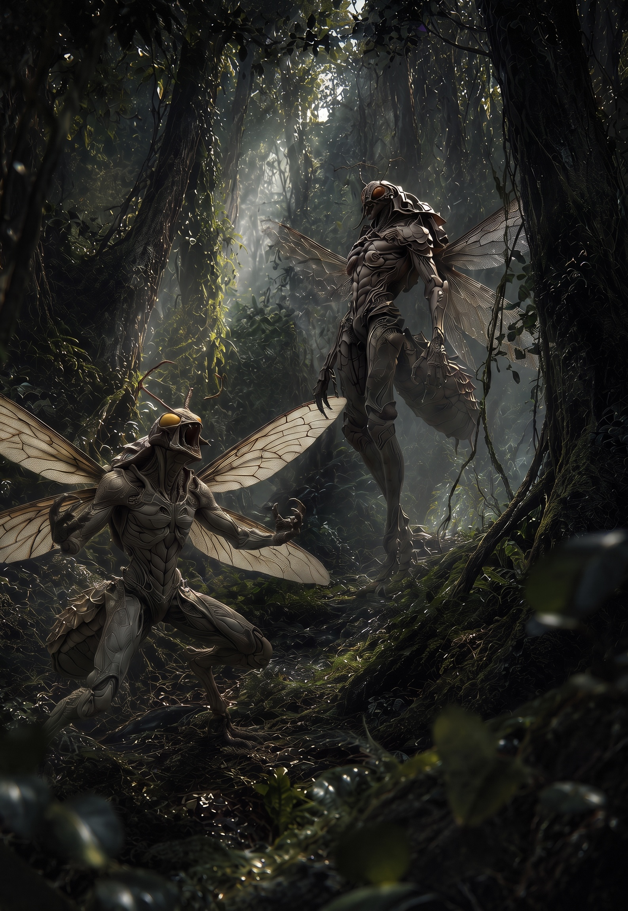

一体だけではない。

幹の裏、枝の上、蔦の切れ目。気配が次々と増える。森そのものが剥がれ落ちて、そこから敵意だけが歩き出してくるような現れ方だった。

「数は七……いや、八！」

シエルが言い切る前に、最前の一体が跳んだ。

サクヤは半歩だけ退いて斬線を外し、落ちてきた前腕を横へ流す。硬い。肉を斬った感触ではなく、薄い金属板を割ったような反発が刃に残る。だが関節は生体だ。返しの一閃で肘の内側を裂くと、体液とも樹液ともつかない暗い飛沫が散った。

同時に、右から回り込んだ二体目へバショウが突っ込む。

斧が唸り、まともに受けたエルミドの上半身が幹へ叩きつけられた。枝が折れ、葉が降る。その隙間へリリィの矢が二本走る。一本は脚の節へ、もう一本は眼の脇へ。倒し切るためというより、次の動きを止めるための射撃だった。

「真ん中の列、寄せて！」

リリィの声に合わせ、ルークの弾が奥の枝を打ち砕く。樹上へ回った個体の足場が崩れ、サクヤの前へ落ちる。そこへツエッテル式剣術の短い踏み込みが入った。深く追わず、最短の軌道だけで喉元を断つ。

だが、切り倒したはずの個体の向こうで、青白い火がふっと灯った。

火の玉、と見えたのは最初だけだった。

それは輪郭を持っていた。人の顔に見えかけて、次の瞬間には獣の頭蓋にも見える。芯のない炎が、森の暗がりで脈を打ちながら漂っている。ひとつ現れると、もうひとつ、さらにその奥にも淡い青が浮いた。

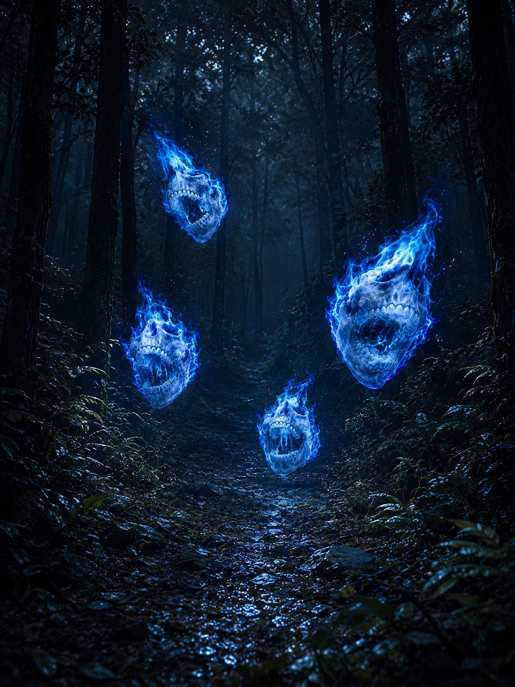

「ウィスラム……！」

シエルの声がわずかに鋭くなる。

青炎が揺れた途端、周囲のエルミドたちの動きが変わった。さっきまで獲物へ飛びかかる獣の動きだったものが、急に整う。退く間合いで退かない。潰れた脚を引きずりながらでも包囲を優先する。統率というより、森の別の意思が上書きしているようだった。

「厄介なのが混ざったな」

ルークが舌打ちする。

ナギは槍を構えたまま、上ではなく地面を見ていた。

「混ざったんじゃない。近い」

「何が」

「女王個体だ」

その一言で、空気が変わる。

サクヤがエルミドの爪を受け流しながら短く問うた。

「見えるのか」

「見えない。だが、兵隊の揃い方が早すぎる。ウィスラムの集まり方もおかしい。巣圏の縁だ」

ナギは槍の石突で根を叩き、すぐ左へ指した。

「奥へ行くな。あの暗い幹の列より向こうは切る。ここで片づけて、抜ける」

命令口調だったが、今回は誰も噛みつかなかった。合理性がはっきりしていたからだ。

「分かった。前を押し切る」

サクヤが応じる。

「シエル、ウィスラムの偏りを見ろ。リリィ、奥を撃ってエルミドを寄せるな。バショウは右を止めてくれ」

「了解」

「おう」

「任せて」

短い応答が重なる。ルークも間を置かず続けた。

「じゃあ俺は穴埋めだ。欲しい場所に弾を入れる。ナギ、お前は道筋だけ外すな」

「最初からそのつもりだ」

今度の返答には、ほんの少しだけ棘が薄れていた。

ウィスラムが三つ、弧を描くように散る。視線を追うほど距離感が狂う。近いと思った青炎が遠く、遠いと思った影がすぐ横にいる。森の奥行きそのものが撹乱されていた。

だがシエルのゼニトオービットは惑わない。薄く青い軌跡が樹間に何重も走り、揺れの中心だけを拾い出す。

「左の個体は偽像が強い。中央が実体寄り。右は囮」

「十分！」

リリィが枝へ駆け上がる。軽い。湿った幹に吸いつくみたいに跳び、横枝へ移った瞬間に二射。一本目で中央の青炎を揺らし、二本目でその芯を貫く。火は爆ぜず、音もなく崩れた。代わりに周辺の影が一斉に濃くなる。

「一つ落ちた！」

その隙に、サクヤが前へ出る。追い込むべきはエルミドではなく、隊列だ。最前の一体へ斬り込み、二体目との間へ身体を滑り込ませる。振り抜かず、止めず、刃筋だけを渡して動線を切る。ツエッテル式剣術の省動作が、森の狭い足場ではむしろ冴えていた。

バショウは反対側から圧をかける。斧は細かい対応には向かないが、道そのものを封じるには十分だった。根を踏み砕き、倒木へ刃をめり込ませ、エルミドが飛ぶための角度を潰す。

「来いよ、硬ぇ虫！」

吼えると同時に一体を肩から弾き飛ばす。その脇を抜けようとした別個体の胸を、ルークの弾丸が撃ち抜いた。

「右、まだ二枚」

「分かってる！」

返しながらも、ルークの射撃は乱れない。致命傷を狙うより、仲間の動きを一手ぶんだけ早めるための支援だ。

ナギはその間、正面へ深く出なかった。だが参加していないわけではない。サクヤが半歩ずれるたびに、槍の穂先がその外側を埋める。リリィへ飛ぼうとした一体の進路を根元から払う。何より、誰がどこまで踏み込んでいいかを一番冷静に見ていた。

「サクヤ、追うな。そいつらは餌だ」

言われた瞬間、前へ逃げるふりをしたエルミドの後ろで、幹の裂け目が不自然に暗く見えた。

巣だ。

あるいは、そのさらに奥に女王個体がいる。

サクヤは踏み込みを止め、代わりに横へ流れた。次の瞬間、見えなかった位置から飛び出した長肢が空を切る。もし追っていれば、喉を持っていかれていた。

「助かった」

「礼は要らない。外へ出ろ」

ナギが言い切る前に、残るウィスラムが二つ同時に近づいた。青白い火が近づくほど、耳鳴りのような圧が増す。視界の端で木々が逆向きに揺れ、地面の傾きすら怪しくなる。

「シエル！」

「分かってる」

ゼニトオービットが一つ、急角度で跳ね上がる。青炎の軌道を横切った瞬間、見えていた残像が剥がれた。実体が右。そう読んだサクヤが踏み込み、リリィの矢がその一瞬先へ刺さる。青炎の芯がぶれ、そこへルークの一発が重なった。

最後はバショウではなく、ナギが取った。

前へ出たわけではない。サクヤの斬撃で流れた青炎の軌道、その逃げ先へ槍を置いただけだ。だが置き方が正確だった。穂先はぶれず、ウィスラムの芯を真横から貫く。

「——落ちろ」

低い声とともに、青炎が裂けた。

実体を失った残光が崩れ、周囲のエルミドたちの動きも一気に乱れる。統率が切れた。森の奥へ戻る本能だけが先に立ち、傷を負った個体から順に枝と蔦の向こうへ消えていく。

「追撃はなし！」

ナギが先に言う。

「異論はない！」

リリィも即答した。

サクヤは逃げる背を一瞬だけ見たが、剣を引いた。ここで深追いすれば、討伐ではなく侵入になる。相手の巣圏に踏み込む価値はない。

残ったのは、倒れた二体のエルミドと、砕けかけたウィスラムの青い芯だけだった。

だが、その芯は前の土地で見たものと同じようには散らなかった。

火の欠片が消えずに留まる。

サクヤが胸元の護符へ触れると、縞に沿って淡い熱が走った。今度は誰も驚かなかった。未知ではある。だが、起きていること自体はもう偶然ではないと知っている。

青い火の残滓は細く伸び、引かれるように護符へ吸い込まれていく。途中で揺れた光が、まるで森の呼吸に合わせるように脈打った。

「また、残ったな」

バショウが低く言う。

「残るというより、定着してる」

シエルは護符を見たまま答えた。

「この森に入ってから反応が少し違う。前より脈が深い」

ルークが肩の力を抜き、周囲へ目を配る。

「感想戦は歩きながらにしようぜ。女王様と鉢合わせる趣味はない」

「賛成」

珍しく、ナギが即座に同意した。

それから彼は少しだけ間を置き、前方の根の流れを槍先で示した。

「こっちだ。巣圏の縁を外して進めば、もう一度ぶつかっても兵隊の数は減る」

サクヤは頷き、その指示に従って歩き出す。

森はまだ暗い。葉擦れの音も、見えない気配も、何ひとつ安心材料にはならなかった。だが少なくとも一つだけ、さっきまでより明確になったことがある。

この土地では、敵を倒すことと、奥へ踏み込みすぎないことが同じくらい重要だ。

そして護符の変化は、戦いのたびに確かに進んでいる。

意味はまだ分からない。

それでも、シルヴァンへ入った瞬間から、集まるものの質が変わったことだけは、もう誰の目にも明らかだった。

────────────────────────

第7章

第2節：戻すの

空気の質が変わっている。

戦闘の後、一行は巣圏を避けて歩き続けていた。ゴルゴニアの煤と熱を抜けた肺に、湿った緑が流れ込む。重くない。だが、軽すぎる。苗の匂い、苔の匂い、湿った樹皮の匂い。全てが同じ濃度で鼻に届く。

サクヤは足を止めた。

呼吸が浅い。空気はある。吸える。だが、何を吸っても同じ味がする。“均されている”。

森は深い。だが、無秩序ではない。枝は刈り揃えられ、獣道は整備され、伐採地は均等に並んでいる。自然だ。だが、自然にしては整いすぎている。

「……綺麗すぎるな」

リリィが足を止め、木々の間を見渡した。

「管理されてる。増えすぎないように」　

シエルの目が枝の切り口を追っている。

鹿の群れが、遠くを横切る。数は少ない。だが、痩せてもいない。弱ってもいない。

サクヤの視線が鹿の群れを追った。「……減らしてるな」

シエルが頷く。

「維持してる。増やさないように」

風が吹く。葉が揺れる。音はある。だが、広がらない。どこかで止まる。

サクヤは一歩踏み出す。

その瞬間だった。

鹿の群れが、わずかに揺れる。一頭が、本来進むはずの方向を外れる。ほんの数歩。だが、明らかに"ズレた"。

サクヤの足が止まる。

リリィの視線が鋭くなる。「今の見たか」

シエルが目を細めた。「……群れの動き、ズレたな」

「原因はそこだ」　ナギの視線がサクヤへ向く。

サクヤは何も言わない。ただ、鹿を見る。

鹿はすぐに戻る。元の流れへ。何事もなかったように。だが、完全ではない。ほんのわずか、遅れている。

ルークが腕を組んだ。「揃え直したな」

間を置いて、続ける。「でも、一回ズレた」

サクヤの胸の奥が、わずかに揺れる。護符が、微かに反応する。

何もしていない。ただ歩いただけだ。だが、何かが動いた。森の側が。

サクヤが眼を伏せた。

「……気持ち悪いな」

リリィが頷く。「ここ、全部決まってる」

「だからズレると目立つ」　シエルが肩を窺めた。

「均衡が前提だからな」　ナギの声は低い。

その言葉で、全員が理解する。この森は、自由ではない。保たれている。

サクヤはもう一度、森を見る。整っている。美しい。だが、どこか息が詰まる。

その時だった。

ルークが小さく口笛を吹いた。警戒ではない。感嘆だ。

「……あれ、見えるか」

倒木のそばで、ひとりの女が膝をついていた。

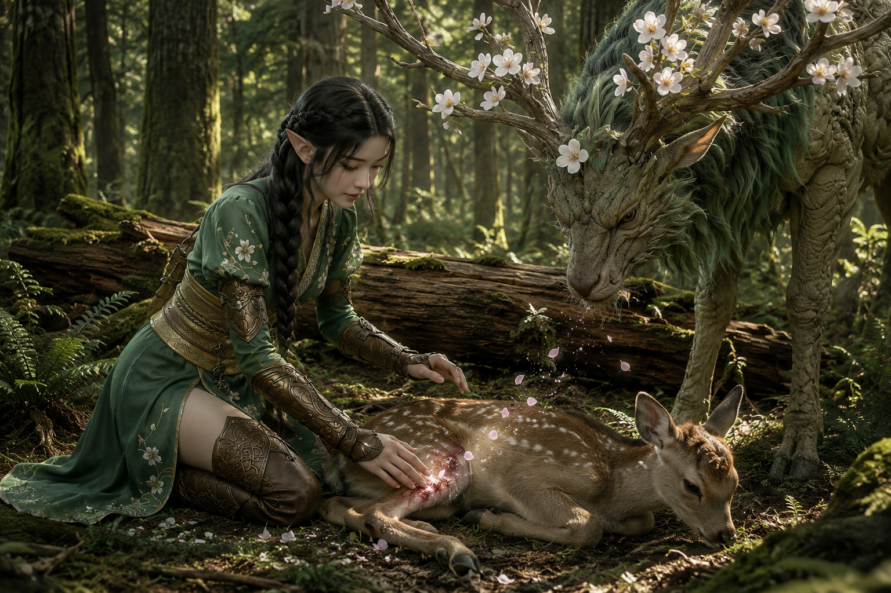

淡い翠の衣。肩から流れる長い髪は、森の緑と同じ色をしていて、一瞬、木漏れ日の一部かと見間違えた。指先が地面に触れるように伸びていて、その手のひらの下に、小さな鹿が横たわっている。

そしてその背後に立つ――鹿。

巨大で、静かで、角には桜の花が咲いている。

ケリュネ・カルマ。

ただ立っているだけで、周囲の空気がやわらぐ。さっきまでの均された圧迫とは違う。ここだけ、森が息をしている。鹿の足元の草が、他よりも濃く、他よりも柔らかく見えた。

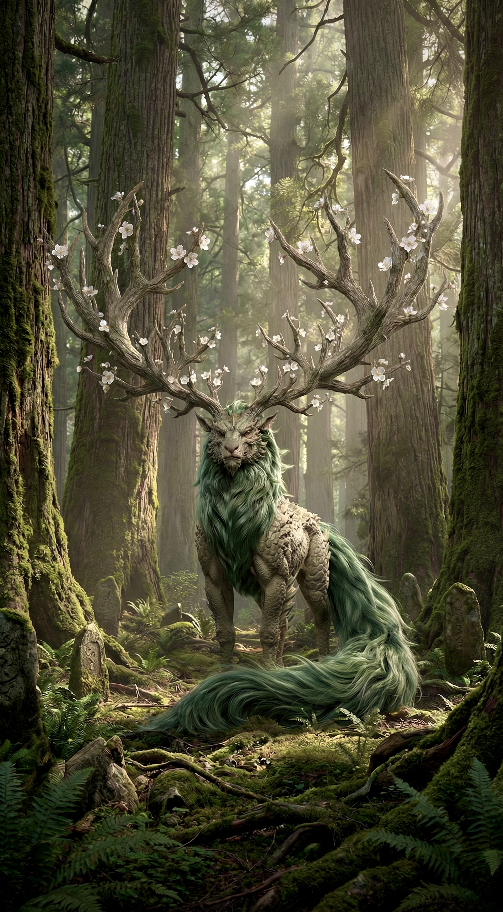

「怪我をしているだけ」

女は、倒れた小鹿の脚に触れながら言った。声は静かで、責める響きはない。こちらへ向けた言葉ではなかった。独り言のように、小鹿へ語りかけている。

「折れていない」

一拍。

「まだ、走れる」

サクヤは息を呑む。

神使は、霊ではない。そこに在る。土を踏み、風を押し、確かに存在している。鹿の体軄は馬よりも大きく、角の枝分かれは樹木のように広がっていた。その一本一本に、薄桃色の花弁が揺れている。蹄の下の土が、わずかに湿っていた。

鹿の角から、桜の花弁が一枚落ちる。

それは傷口に触れ、ゆっくりと閉じていく。肉が盛り上がるのではない。傷の縁が元の位置へ戻るように、静かに合わさっていく。

リリィが一歩前に出た。「……治すのか」

女は顔を上げた。少しだけ微笑む。

「治すんじゃない」

一拍。

「戻すの」

その言葉で、サクヤの胸の奥が揺れる。

同じだ。さっきのズレと。自分の中の何かと。

その瞬間、ケリュネ・カルマの角がわずかに傾いだ。

桜の花弁が散るのとは違う。角そのものが、ゆっくりとサクヤの方へ向く。

鹿の瞳が、小鹿から離れ、サクヤの胸元を見つめている。正確には――護符を。

大きな瞳だった。黒く、深く、底が見えない。だがそこに敵意はない。怒りもない。ただ、何かを確かめるように、じっと見ている。

アヤメが気づく。自分の神使が、見知らぬ男の胸元に視線を固定していることに。

「ケリュネ……？」

小さく呼ぶ。

鹿は答えない。ただ、一拍だけ長く、サクヤを見つめ続けた。

角の先端が、かすかに光を帯びる。桜の花弁が一枚、風もないのに浮き上がり、サクヤの方へ漂いかけた。

だが、途中で止まる。

まるで確認だけして引き返すように、花弁はふわりと鹿の角へ戻った。

そして何事もなかったように、角を戻す。

花弁が一枚、風に乗って消えた。

アヤメの眉がわずかに寄る。視線がサクヤと鹿の間を往復する。だが、問いは飲み込まれた。

サクヤも気づいていた。護符が、ほんの一瞬だけ熱を持ったことに。呼ばれたような感覚。だが、何に呼ばれたのかは分からない。

「……あなたたち、この森の人じゃないわね」

アヤメが立ち上がる。小鹿はもう動いていた。脚を折りたたみ、ゆっくりと起き上がる。傷の痕跡すらない。

サクヤは短く返した。「通りすがりだ」

「通りすがりにしては、随分と森を揺らしてくれたわね」

柔らかい声だが、指摘は正確だった。さっきの鹿の群れのズレ。アヤメはそれを見ていたのだ。

「……悪気はない」

「分かってる。だから怒ってないの」

アヤメは小鹿の背を一度撫で、送り出した。小鹿は振り返らず、群れの方へ駆けていく。その足取りに、もう痛みはない。

「でも、珍しいのよ。ケリュネがあんな反応をするのは」

アヤメの視線が、サクヤの胸元へ一瞬だけ落ちる。そこに何があるのか、彼女はまだ知らない。

サクヤは答えなかった。答えようがなかった。

沈黙が落ちる。やがて、アヤメが小さく笑った。

「ごめんね、名乗りもしてなかった。あたしはアヤメ。この子はケリュネ・カルマ」

「サクヤだ」

それだけ。アヤメはそれを気にした様子もなく、小さく頷いた。

リリィが小さく息をつく。

「……また増えたわね、不思議なこと」

詰る声ではない。ただ、旅の中で何度も見てきた光景への、静かな観察だった。

ケリュネ・カルマは再び静かに立っている。角の桜は揺れもせず、先ほどの反応が嘘のように穏やかだ。

「……」

森の奥で、もう一つの気配が動く。

サクヤは気づかない。だが、ナギは気づいている。槍の石突が地面を叩く。一度だけ。

「……始まってるな」

低い声。

アヤメの表情が変わる。さっきまでの柔らかさが消え、何かを覚悟したような面持ちになる。

風が止まる。

正確には、風が「避けた」。森の奥から来る気配を、風そのものが避けている。

遠くで、もう一頭の鹿が現れる。

角は同じ。だが、花は咲いていない。色も違う。ケリュネ・カルマが春の木だとすれば、こちらは冬の枝だ。花も葉もない。ただ、削ぎ落とされた形だけが立っている。影のような鹿。

その隣に、もうひとりの女が立っていた。

アヤメとは対照的だった。髪は短く、衣は暗い。表情に感情の波がない。ただ、判断だけがある。

「増えすぎたら、減らす」

声は硬い。迷いがない。

「それだけの話よ」

アヤメが小さく息を吐く。諦めではない。何度も繰り返されてきたやり取りへの、静かな疲労だった。

「彼女はイヴ。あたしの双子の姉よ」

アヤメがサクヤたちに向けて言った。その声に恨みはない。だが、複雑なものが混ざっている。

森は壊れていない。だが、同じ森の中に、ふたつの理屈が立っていた。

サクヤの胸奥で、焔核がわずかに震える。

怒りではない。違和感でもない。

方向だ。

森は、静かすぎる。

サクヤは二人の女を見比べた。片方は花を咲かせ、片方は花を落とす。同じ森を守ると言いながら、方法が真逆だ。

どちらが正しいか、今のサクヤには分からない。だが、胸の奥の焦核が、どちらか一方に反応していることだけは、確かだった。

その静けさが、崩れる前触れだと、まだ誰も口にしないまま。

────────────────────────

第7章

第3節：二つの理屈

木漏れ日が、斑模様の絨毯のように地面を彩る。

その光と影の中に、二体の鹿が静かに立っていた。

ケリュネ・カルマの角には満開の桜が宿り、足元の苔が淡く光を帯びている。周囲の空気が柔らかく、湿った春の気配が漂う。もう一体の鹿は姿こそ同じだが、角に花はなく、周囲には冬枯れの気配が漂う。踏みしめた草がわずかに色を失い、乾いた土の匂いがする。その鹿の傍らに立つイヴの表情に、感情はない。ただ、判断がある。

同じ森に立ちながら、季節が違う。その境界線は目に見えないが、確かにそこにある。

サクヤはその光景を見ていた。同じ存在。同じ姿。だが、同じではない。

アヤメは子鹿を送り出した後も、視線だけを真っ直ぐにイヴへ向けていた。風が緑の髪を揺らしても払わない。淡い衣の裾が揺れるだけで、足は動かない。この対話が初めてではないことが、その佇まいだけで分かる。何度も繰り返してきた議論。その重みが、場の空気に張り詰めている。

イヴが口を開く。声は硬く、乾いている。感情を削ぎ落とした後に残る、判断だけの響き。

「森は有限よ」

短い言葉。だが、そこに迷いはない。

「餌も、水も、場所も。増えすぎれば、壊れる」

正論。自然界の厳然たる法則。誰も否定できない。

リリィが小さく頷く。その瞳は二人の間を行き来し、冷静に状況を読んでいる。

「間違ってないな」

ルークが腕を組み、壁にもたれかかるように木に背を預けた。興味深そうに、だが口は出さない。

イヴはアヤメから視線を外さない。

「だから減らす。弱い個体から。適応できない種から。それが選別よ」

一拍。森の鳥たちのさえずりが、遠のいた。

「残酷に聞こえる？　でも森はそうやって千年保ってきた」

アヤメがゆっくりと立ち上がる。子鹿に触れていた指先には、まだ温もりが残っている。その手を一度握り、そして開いた。ケリュネ・カルマの角の桜が、かすかに揺れる。アヤメの心の動きに応えるように。

「減らすのは必要よ」

イヴを見る。逃げない。

「でも」

一拍。

「減らした後は？」

イヴの眉が、わずかに動く。

「……何が言いたいの」

アヤメは一歩前に出る。二人の間の距離が、鹿一頭分になる。それは物理的な距離だけではない。思想の隔たりを埋めようとする、アヤメの意志。

「減らすだけでは、森は呼吸しない。刈り込んだ後に何も植えなければ、土は痩せる。根が死ねば水脈が変わる。水脈が変われば、あなたが守ろうとしている均衡そのものが崩れるのよ」

風が止まる。鹿の足音も止まる。

「新しく芽吹く場所を残さないと」

イヴが一歩踏み出す。影の鹿も首を上げた。花のない角の先端が、かすかに空気を切る。

「時間をかければ、遅れる」

「遅れれば、取り返せない」

「今この瞬間にも、森の縁は侵食されている。外から来るものは待ってくれない」

アヤメは動かない。

「急ぎすぎれば、削りすぎる」

アヤメの声は静かだが、芯がある。

「削りすぎれば、戻らない」

「あなたが千年と言ったわね。その千年の中で、何度、削りすぎて消えた種があった？」

イヴの目が、一瞬だけ細くなる。

二人の声は荒れない。だが、逃げ場がない。言葉の一つ一つが、相手の論理の隙間を正確に突いている。

サクヤは黙って聞いていた。どちらの言葉にも嘘がない。どちらも森を見ている。ただ、見ている場所が違う。そしてその違いが、二人の間に埋めがたい溝を生んでいる。

アヤメは足元の芽を見ている。今ここにある一つ一つの命を。その命が土の中でどう繋がっているかを。

イヴは森全体を見ている。一本の木ではなく、千本の木が作る均衡を。

サクヤが静かに息を吐いた。「……どっちも、正しい」

リリィが髪を払った。「だから厄介なんだろ」

シエルが翼を畳んだまま、感情を乗せない声で続けた。「正しい理屈が二つある時点で、もうズレてる」

イヴが視線を向ける。

「ズレている？」

「どっちも"正しいことだけ"見てる。だから外れる」

その言葉に、空気がわずかに揺れる。

ナギが口を開く。槌を地面に立て、腰を据えたまま。

「構造維持だ」

唐突だった。だが、全員が聞く。ナギの言葉には、常に核心を突く重みがある。

「均衡を最優先にする。増えすぎたら削る。それ自体は合理的だ」

イヴの目がナギへ動く。その瞳に、わずかな期待の色が浮かぶ。

「それの何が悪い」

ナギは即答する。

「悪くない」

槍の石突が地面を一度叩く。

「だが、それだけだ。削り続ければ、いずれ削るものがなくなる。維持だけでは先がない。だが、増やすだけでも崩れる。どちらか一方じゃ足りない」

その言葉に、森の空気が一瞬だけ止まる。誰もが感じていたことを、ナギが言葉にした。

イヴは答えない。だが、否定もしない。

アヤメが小さく息をつく。

「……分かってるのよ、お互い」

その声はイヴへ向けたものだった。責めではない。何度も繰り返してきた対話への、静かな疲労と、それでも手放さない意志が混ざっている。アヤメの緑の髪が、風に揺れる。その表情は柔らかいままだが、瞳の奥に確かな光がある。

「あなたの言うことも、正しい。でも、あたしはそれだけじゃ嫌なの」

イヴの表情がほんのわずかだけ動く。怒りではない。何か別のもの。

「……感情で森は守れない」

「感情じゃないわ」

アヤメの声が、初めて少しだけ強くなる。その瞬間、ケリュネ・カルマの角の桜が一斉に揺れた。花弁が数枚、はらはらと舞い落ちる。

「選ぶのよ。何を残すか。何を育てるか。削った後に、何を置くか。それを決めないまま削り続けるのは、ただの放棄よ」

風が吹く。桜の花弁が一枚、イヴの足元に落ちる。

イヴはそれを見下ろし、踏まなかった。

長い沈黙。

ルークが肩の力を抜いて言う。

「で、俺たちはどっちの味方すりゃいいんだ？」

誰も答えない。

バショウが腕を組んだまま、ぽつりと言う。

「味方じゃなくていい。ただ、壊さなきゃいい」

その言葉に、場の空気がわずかに緩む。

アヤメが少しだけ笑う。初めて見せた、力の抜けた表情だった。張り詰めていたものが、ふっと解けた。

「……そうね。壊さないこと。それが一番難しいのだけど」

イヴは背を向ける。影の鹿が静かに従う。その足音は森の土に吸われ、一切の音を立てなかった。去り際、足を止めずに言う。

「結論は出ない。いつも通りよ」

だが、一度だけ振り返る。

「でも、この森に余計なものが増えているのは事実。それだけは忘れないで」

その視線は、サクヤの胸元を一瞬だけ掠めた。

護符を見たのか。それとも、その奥にあるものを。サクヤには分からなかった。ただ、その冷たい視線が胸に刺さる感覚だけが残った。

イヴの姿が木々の間に消える。影の鹿も、音を立てずに溶けるように去った。

残されたのは、桜の鹿と、その傍らに立つアヤメ。そしてサクヤたち。森の空気は再び静けさを取り戻したが、先ほどまでの緊張がまだ微かに残っている。

サクヤの首元で、護符がわずかに温度を持つ。目に見えない。だが、確かに反応している。

ケリュネ・カルマが一歩動く。ほんのわずかに。

バランスが、揺れる。森の木々が、その揺れを感じ取ったかのように、葉を鳴らした。

「もう始まってる」

ナギの声は低く、誰に向けたものでもなかった。ただ、事実を述べただけだ。

サクヤは気づかない。だが、森は気づいている。

この均衡は、もう崩れ始めている。

アヤメが静かにサクヤを見る。その視線には、問いがあった。だが、まだ言葉にはしない。

サクヤもまた、その視線に気づかなかった。

───────────────────

第7章

第4節：正しさの重なり

沈黙は長くは続かなかった。

風がゆっくりと戻る。葉が揺れ、鹿がわずかに足を動かす。だが、さっきまでと同じではない。空気の底に、硬いものが沈んでいる。光は変わらない。木漏れ日は同じ角度で地面に落ちている。
それなのに、森の温度が一度だけ下がったような感覚がある。

サクヤはまだ二人を見ていた。アヤメとイヴ。同じ神使。同じ森。同じ目的。それでも、噛み合っていない。
双子でありながら、立つ場所が違う。その距離は、敵意ではなく、もっと根深いものに見えた。互いに相手を否定していない。ただ、同じ答えに辿り着けない。そのことが、二人の間に静かな亀裂を作っている。

森の静けさは安らぎとは違っていた。枝葉の揺れにも、獣たちの気配にも、どこか息を潜めるような硬さがある。傷を癒され、飢えを逃れたはずの生きものたちが、それでも深い場所では身を縮めたままなのを、アヤメはずっと見てきた。ケリュネ・カルマの角がかすかに光を帯びる。

森の痛みを感じ取っているのか、花弁が一枚、音もなく地面に落ちた。

アヤメは傷ついた獣の伏せた耳に目を落とした。指先が、獣の背に触れるか触れないかの距離で止まる。その手が、そっと口を開いた。

「助けるだけでは、足りないんです」

サクヤたちの視線が集まる。アヤメは獣から目を離さないまま、言葉を継いだ。

「その子が戻っていく場所に、また選べる余地がなければ、救ったことにはならない」

少し間を置いて、森の奥へ視線を向ける。

「環境が痩せれば、生きものは従順にはなっても、健やかにはなれません」

短く息を吸い、静かに言い足す。

「秩序のために静かにさせることと、安らかに生きられることは、同じではありません」

その声は柔らかい。だが、芯が通っている。ケリュネ・カルマが小さく首を動かした。アヤメの言葉に応えるように、角の先が淡く光る。

イヴの目が細まる。

「同じじゃない。だからこそ、順番を間違えるべきじゃない」

腕を組んだまま、淡々と続ける。

「安らぎは、崩れない環境の上にしか成り立たない。余地を守りたいなら、まず総量を守れ」

イヴの声には感情がない。あるのは論理だけだ。影の鹿が、イヴの傍らで微動だにしない。花も葉もない角が、冬枯れの枝のように天を指している。ケリュネ・カルマとは対照的だった。同じ神使でありながら、片方は花を咲かせ、片方は花を落とす。

「あなたの優しさは否定しない。でも、その優しさが森を痩せさせるなら、それは救いじゃなく偏りだ」

サクヤの口から、思わず声が漏れた。

「……なんでだ」

誰に向けた言葉でもない。だが、全員が聞いている。ルークが背中の剣の柄に手を伸ばしかけて、やめた。戦う相手がいない。

「どっちも正しいのに」

バショウが腰を下ろし、地面に手を当てた。土の振動を読んでいるのか、ただ考えているのか。表情は変わらない。

シエルが翼を畳んだまま、低い声で返した。「それが問題だ」

間を置いて、続ける。

「正しいことだけ見てると、ズレる。見てる範囲が違うんだ」

イヴの方を顎で示す。「こっちは"今"を見てる」

アヤメの方へ視線を移す。「こっちは"先"を見てる」

「どっちも外してない。でも重ならない」

リリィが髪を指先で弄った。「だからぶつかる」

「構造上、必ずな」　ナギの声は低く、断定的だった。

イヴの視線が動く。「……構造？」

ナギは槍の石突を地面に軽く当てた。「選択だ。選ぶ以上、どちらかは削られる」

森が静まる。鹿の群れが一斉に耳を立てた。風すら止まっている。ナギの言葉が、森の底まで沈んでいくようだった。

サクヤは胸の奥を押さえた。「……削られる？」

「全部は取れない。全部は残らない。だから選ぶ」

その言葉が、サクヤの胸に刺さった。選ぶ。それは、サクヤ自身がここまで何度も繰り返してきたことだ。ゴルゴニアでも、シルヴァンに入る前でも。選ぶたびに、何かを切り捨ててきた。

リリィが足元を見る。鹿。森。均衡。「で、その結果がこれか」

イヴの声は硬い。「削らなければ、壊れる」

アヤメが静かに首を振った。「削りすぎれば、続かない」

どちらも正しい。どちらも外していない。だからこそ、この森は軋んでいる。

バショウが地面から手を離した。何も言わない。だが、その沈黙が、今の状況を物語っていた。地面の下でも、何かが動いているのだろう。

サクヤは目を閉じた。

"削る"。"残す"。"選ぶ"。その全部が、同じ線の上にある。

その時だった。

サクヤの足元に、黒いものが転がった。

カケラ。

さっきまでは無かった。小さい。親指の爪ほどの大きさ。だが、確かにそこにある。黒く、硬く、周囲の土とは明らかに異質なもの。

サクヤがしゃがみ込み、手に取る。指に触れた瞬間、護符が反応した。熱ではない。引き寄せるような、吸い込むような感覚。

「……なんで、ここに」

リリィの目が鋭くなる。「さっきは無かったぞ」

シエルが一歩寄った。「発生した。今、この場で」

ルークが周囲を見回した。敵の気配はない。だが、何かが変わった。空気の密度が、一段重くなっている。

全員が黙る。

イヴの視線がカケラに落ちる。その目が、初めて揺れた。アヤメも、同じものを見ている。ケリュネ・カルマの角が、カケラの方へゆっくりと傾いた。

サクヤはカケラを握った。指の間で、冷たい振動が脈打つ。ゴルゴニアで拾った時と同じ感触。だが、場所が違う。ここは“流れる森”だ。残るはずのないものが、残っている。

「……おかしい」　サクヤの眉が寄る。「ここ、残らないんだろ」

イヴの答えは短かった。「残らないようにしている。本来は」

空気が変わる。

シエルの目が細まった。「じゃあ今は違う」

「崩れてる」　ナギの一言が、全員の背筋を走った。

サクヤの胸が強く反応する。護符が熱を持ち、手の中のカケラがわずかに震えた。二つの振動が共鳴している。護符とカケラ。同じ周波数で、同じ方向へ引かれている。

サクヤは視線を上げ、森を見た。整っている。だが、どこかが外れている。見た目は同じでも、奥の構造が歪んでいる。木々の幹は真っ直ぐだ。枝は均等に広がっている。だが、その完璧さの内側で、何かが軸を失いかけている。

アヤメが息を吐いた。その表情に、初めて疲労が浮いた。「ここでも起きるのね」

イヴが目を伏せる。その拳が、わずかに握られていた。「……抑えきれていない」

風が止まる。森の奥で、何かが動いた。

「外から来てる」　ナギの声に、全員が振り返る。槍の石突が、地面を一度叩いた。方向を示すように、森の外へ。

サクヤが顔を上げた。「……外？」

「この森の問題じゃない。繋がってる」

ゴルゴニア。シルヴァン。カケラ。場所は違う。だが、根は同じだ。この世界のどこかが、同時に軸を失い始めている。

サクヤはカケラを強く握った。指の骨が白くなるほど。

もう分かる。

これは、場所の問題じゃない。

森が揺れる。ほんのわずかに。均衡が、崩れ始めている。そしてそれは、この森だけの話ではない。

アヤメとイヴが、同時に森の奥を見た。双子の視線が、初めて同じ方向を向いた。

リリィがサクヤの横に立った。何も言わない。だが、その足は、次に動く準備ができていた。

森の奥から、風ではない何かが近づいてくる。ケリュネ・カルマの角が、静かに光を強めた。影の鹿もまた、同じ方向を向いている。

均衡が崩れた森に、何が来るのか。サクヤはカケラを握ったまま、立ち上がった。

─────────────────────

第7章

第5節：露出する歪み

風が止まった。

葉が揺れない。空気の流れそのものが凍りついたように、森の呼吸が途絶えている。さっきまで染みていた樹液の匂いも、鳥の声も、何もかもが押し殺されている。森が息を止めた。そうとしか言いようがない。足元の苔が色を失い始めている。緑が灰に変わる。ゆっくりと、だが確実に。

「……来たな」

ナギの声には迷いがなかった。槍の石突を地面に当て、足裏から伝わる振動を読んでいる。予測していた。この森に入ってから、ずっと。バショウも地面に手を当てている。小さく首を振った。『深い』という意味だろう。地表だけの問題ではない。

鈍い音が地面を叩いた。衝撃ではない。地面そのものが一段沈んだのだ。だが裂けない。崩れない。ただ、密度だけが薄くなっていく。踏みしめた地面が、乾いた砂のように軽い。重さがない。地面の下にあるはずの根や岩の存在感が、希薄になっている。

リリィの目が細まる。「場所、関係ないな」

シエルの視線はすでに地面を捉えていた。「流してるはずなのに……残る」

サクヤは一歩踏み出した。止める必要はない。もう分かっている。足元の色が薄くなる。緑が抜ける。影が本体から分離し、地面に別の形を落とし始める。苗の根元が白っぽく乾いている。地表の苔が、色を失った紙のように剥がれかけていた。ゴルゴニアで見たものと同じ兆候だ。

「……同じだ」

声に出したのは確認のつもりだった。だがナギは首を振る。

「違う。範囲が広い。進んでる」

ナギの槍が地面を示した。サクヤの足元から、十歩、二十歩。その先まで、緑が色を失っている。円状に広がるそれは、まるで水たまりの波紋のようだった。中心は、サクヤの立つ位置。

空気が一段重くなった。リリィが腕を組み直す。

「止められてないってことか」

シエルの目が地面を追っている。

「歪みの広がり方が、さっきより速い。加速してる」

ルークが片眉を上げた。

「もしくは、そもそも止められない」

その時だった。地面の亀裂から、黒いものが浮き上がる。カケラ。今度ははっきりと形を持っている。前のものより輪郭が濃く、表面には微かな紋様が走っていた。光を吸うような色。周囲の空気が、それだけ一段冷たい。

サクヤはしゃがみ込み、それを拾い上げた。手のひらに乗せた瞬間、指先から冷たい振動が伝わる。同時に護符が熱を持つ。冷たいものと熱いものが、同じ手の中で拮抗している。さっきと同じ。だが、違う。

「……増えてる」

ナギの返答は短い。「当たり前だ。出続けてる」

誰も否定しなかった。

イヴが一歩前に出る。視線はカケラではなく、歪みそのものへ向いている。「……抑える」

花のない鹿が動いた。冬枯れの角がわずかに傾ぐ。それだけだ。たったそれだけで、歪みの一部が削り取られた。音はない。切った痕跡もない。ただ、色が戻る。影が元の位置に重なり直す。まるで最初からそこには何もなかったかのように。

ルークが低く口笛を吹いた。「すげえな。一瞬だぞ」

サクヤはそれを見た。確かに整っている。歪みがあった場所は、今、何事もなかったかのように静かだ。だが――

「……減ってる」

思わず口にしていた。削った分だけ、そこにあったものが消えている。苔も、根も、地表の湿り気も。整ったのではなく、空いたのだ。

イヴは振り向かない。その背中に迷いはない。「当然よ。削ったのだから。残す方が壊れる」

空気が冷えた。アヤメが前に出た。ケリュネ・カルマの蹄が地面に触れる。その一歩だけで、薄くなった緑がわずかに戻った。芽が伸びる。土の色が戻る。呼吸が通る。だが、それもほんの一部だ。削られた範囲の十分の一も戻っていない。

「戻してるの。呼吸できるように」

アヤメの声は静かだが、その奥には確かな意志がある。ケリュネ・カルマの角から淡い光が漏れ、地面に触れた部分だけが息を吹き返す。だが、それも長くは続かない。アヤメの額に汗が浮いていた。それでも彼女は手を止めない。戻せる限り、戻す。それがアヤメの理屈だった。たとえ追いつかなくても、止めない。

二つの理屈が同時に動いている。削る。戻す。だが完全には重ならない。削られた分だけ空き、戻された分だけ芽吹く。だがその速度は釣り合っていない。削る方が速い。アヤメの眉がわずかに曇った。

サクヤの手の中で、カケラがわずかに震えた。護符が反応する。胸の奥が熱い。この熱は、サクヤ自身のものなのか。それとも、護符の中にある何かが反応しているのか。分からない。

その時だった。

「――境界が崩れている」

上から静かな声。全員が振り向いた。

大樹の上から、一人の女が見下ろしている。

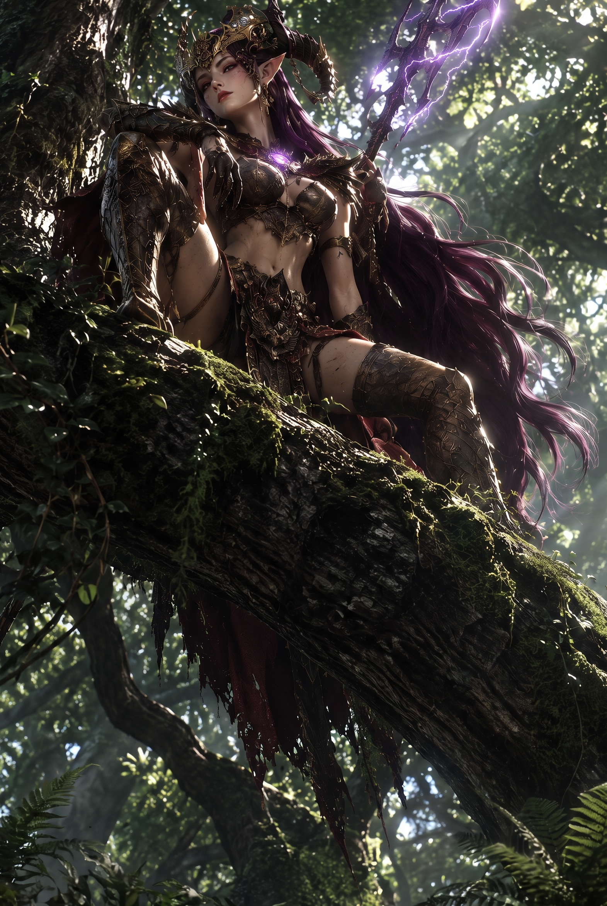

紫の髪が木漏れ日を受けて揺れている。足取りは一定。揺れがない。迷いもない。その瞳に感情の波はない。ただ、事実だけを映す瞳。冷たい風のような存在感だった。彼女が通った後の地面は、歪みも揺らぎもない。まるで最初から整っていたかのように。

エルゼ。

アヤメが小さく息を吐いた。「来たのね」　その声には安堵も緊張もない。ただ、認識。

エルゼは歪みに近づき視線を落とし、地面の色の変化を読み取っている。

「……遅れている。間に合っていない」

「……何がだ」　サクヤの声は低い

「分離」

エルゼの手が上がる。ゆっくりと。何にも触れていない。指先が空気をなぞるように動き、その軌跡に沿って空間が切れた。音はない。歪みが分かれ、整理される。削るのではない。混ざったものを、元の位置に戻している。イヴの『削る』とも、アヤメの『戻す』とも違う。第三の手法だった。

シエルの目が鋭くなった。「……観測を揃えてる」

ルークが顎を引く。「処理だな」

ナギが低く呟いた。「……間に合ってない」

エルゼの視線がナギへ動く。否定しない。その沈黙が、言葉より雄弁だった。アヤメが小さく息を吐いた。ケリュネ・カルマの角が、光を失っていく。森の痛みを感じ取っているのだろう。

エルゼが口を開いた。

「壊す者がいる。均衡を前提にしない者」

空気が変わった。森がわずかに揺れる。サクヤの護符が強く反応する。名前は出ない。だが全員が感じている。外側の存在。ゴルゴニアでも感じた、あの圧。この世界の均衡を前提としない、外側からの力。

エルゼの瞳が、サクヤに向いた。

「……あなた。境界を歪めるわね」

場が静まり返った。サクヤは言葉を失う。否定できない。自分が歩くだけで鹿の群れがズレた。カケラが反応した。護符が熱を持った。全部、自分が原因だと言われても、返す言葉がない。ナギが黙っている。シエルも。誰もサクヤを慰めない。だが、否定もしない。その沈黙が、一番重かった。

リリィの視線がサクヤに向いた。心配ではない。確認だ。『どうする』と。サクヤはその視線に応えず、足元のカケラを見つめた。

森は静かだ。だが完全ではない。どこかがまだ揺れている。均衡は保たれていない。地面の下で、何かがまだ蠢いている。

エルゼの瞳が、サクヤの胸元――護符のある位置を、一瞬だけ見た。その視線に、感情はない。ただ、認識だけがある。

アヤメもまた、サクヤを見ていた。だが彼女の視線はエルゼとは違う。問いかけるような、探るような。ケリュネ・カルマの角が微かに揺れた。

サクヤは拳を握った。護符の熱が、まだ引いていない。自分が何なのか。この森に何をもたらしているのか。答えは出ない。だが、目を逸らすことだけはしなかった。それが今のサクヤにできる、唯一のことだった。

────────────────────

第7章

第6節：侵入する影

最初に気づいたのはナギだった。

一行が森の小道を進んでいた時、不意に足を止めた。視線だけを左右に振る。呼吸が一段浅くなっている。額に浮いた汗が、森の湿気とは違う冷たさを帯びていた。周囲の鳥の声が、いつの間にか消えている。

「……囲まれてる」

サクヤが顔を上げた。「どこだ」

ナギは即答しない。代わりに地面を一度だけ踏み、返ってきた振動に眉を寄せた。土の下を何かが這っている。根ではない。もっと不規則で、もっと多い。

「全方位。しかも――もう中にいる」

ルークが腰の銃に手をかけた。バショウが斧を肩から下ろす。リリィの指が弦に触れ、シエルのオービットが音もなく浮き上がる。全員が同時に臨戦態勢に入った。

その瞬間、森が裂けた。

木の陰、根の隙間、苔の下。何もなかったはずの空間から、影が滲み出す。人型ではない。四肢は枝のように細く、胴は苔に覆われた岩のように膨れ、頭部に当たる部分には顔がない。ただ、口に相当する裂け目だけが横に走っている。表皮は腐葉土と樹皮が混ざったような質感で、動くたびに乾いた粉が落ちる。

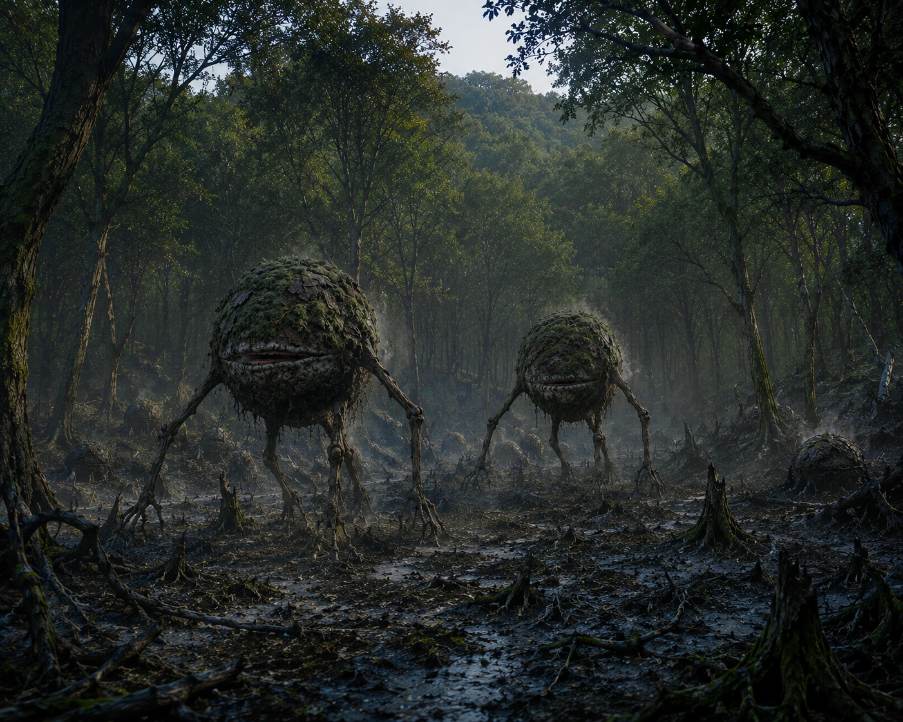

一体ではない。五、十、さらに増える。木々の間を埋めるように、次々と。地面を踏む音はない。ただ、枯葉が潰れる湿った音だけが、四方から迫ってくる。

リリィの弓弦が鳴った。矢が一体の胸を貫く。だが倒れない。裂け目が広がり、そこから灰色の胞子のようなものが噴き出す。空気が一瞬で濁り、甘い腐臭が鼻を突く。

「触れるな！」

シエルが叫ぶ。ゼニトオービットが高速で旋回し、胞子を弾く。弾かれた粒子が地面に落ちると、そこだけ苔が灰色に変色し、枯れていく。

「あれに触れたら組織が壊死する。生態系が崩れた残滓が形になってる――多様性の喪失そのものだ」

バショウが前に出た。斧を横薙ぎに振るい、三体をまとめて弾き飛ばす。衝撃で幹が揺れ、枝から葉が散る。だが、飛ばされた個体は地面に触れた瞬間、苔と融合し、別の位置から再び立ち上がった。形が少しだけ変わっている。さっきより腕が長い。

「再生じゃねぇ。移動だ」ルークが舌打ちする。「地面が本体か？」

ナギの目が細まる。「違う。こいつら個体じゃない。群体だ。一つの歪みが複数に分かれて出てるだけだ」

イヴが動いた。影の鹿が一歩踏み込み、三体を同時に「削る」。音もなく消える。だが、消えた分だけ別の場所から新しい個体が滲み出す。

「削っても湧く」イヴの声に苛立ちはない。ただ事実を述べている。影の鹿が一歩下がり、イヴの傍らに戻った。彼女の表情は変わらないが、指先がわずかに強張っている。

アヤメのケリュネ・カルマが低く唸った。角に咲いた桜の花弁が一枚、散る。

サクヤは刀を抜いたまま、周囲を見回す。数えることを諦めた。二十は超えている。影が森を埋めている。だが殺気が薄い。殺しに来ているというより、ただ「広がっている」。生態系が崩壊する過程そのものが、形を持って歩いているような不気味さだった。足元の草が、影が通った跡だけ灰色に枯れている。

ルークが一体を撃ち抜く。弾丸が貫通した穴から灰色の液体が噴き、すぐに地面へ吸い込まれた。別の場所から、同じ大きさの個体が立ち上がる。

「キリがねぇ」

「位置が定まらない」ナギの声が低い。「潰しても意味がない。固定しないと終わらない」

その言葉に、サクヤの胸元が熱くなった。護符が反応している。鎖骨の下で、金属が脈打つように温度を上げる。

前にもあった。カケラが出た時と同じ感覚。

「……やる」

短い。だが、その一言で全員の動きが変わった。サクヤを中心に、陣形が組み替わる。

サクヤが前に踏み出す。リリィが「待て」と声を上げるが、止まらない。止まれない。護符が引っ張っている。

護符の熱が手のひらまで伝わる。分かる。こいつらの中心がどこにあるか。群体の「軸」が一点だけ、他と違う密度を持っている。そこだけ空気が重い。

サクヤは走った。地面を蹴るたびに、枯れた草が粉になって散る。影が腕を伸ばす。灰色の指先がサクヤの肩を掠める寸前、バショウが割って入り、斧の柄で弾き飛ばす。衝撃で影の腕が千切れ、地面に落ちた破片がすぐに別の個体へ吸い込まれていく。リリィの矢が左右の個体を釘付けにする。ルークの銃が火を噴き、影の足元を撃ち抜いて移動を止める。シエルが上空から射線を確保した。

ナギの声が飛ぶ。「左三、右二！　中心は無視しろ、サクヤに任せろ！」

全員が散開する。バショウが正面を受け止め、斧の一振りで三体を纏めて地面に叩きつける。リリィが高所から間引き、矢の一本一本が正確に裂け目の中心を射抜く。シエルのオービットが胞子を焼き切り、焦げた匂いが森の湿気に混じる。ルークの二丁銃が立て続けに火を噴き、影の移動経路を弾幕で封じる。バショウが地面に拳を叩きつけ、テクトニクスの力で土が隆起し、壁のように立ち上がる。

その隙間を、サクヤが駆け抜ける。

中心に辿り着く。息が上がっている。左腕に擦り傷。いつついたか分からない。

一体だけ、動きが違う。他の影が「広がる」のに対し、こいつだけは「留まっている」。歪みの固定点。他より一回り大きく、裂け目の奥に微かな光が明滅している。

サクヤは手を伸ばした。護符が焦げるほど熱い。指先が触れる直前、影の裂け目が大きく開いた。声のない叫び。

触れる。

その瞬間、全体が止まった。

二十を超える影が、一斉に動きを失う。位置が「決まる」。揺らぎが消え、ただの物体になる。空気が凪ぎ、胞子が地面に落ちる。森全体が、一拍だけ静止した。

「今だ！！」

ナギの声に、全員が動いた。

バショウの斧が中心を叩き割る。今度は抜けない。完全に捉えている。衝撃が地面を伝い、周囲の個体にまで亀裂が走る。イヴの影の鹿が三体を同時に削り取る。リリィの連射が残りを射抜き、シエルのオービットが胞子ごと焼き切る。アヤメのケリュネ・カルマが一声鳴き、その振動で崩れかけた個体が完全に散った。

最後の一体が崩れ落ちた時、森に静寂が戻った。

鳥の声が遠くで一つ、鳴る。それだけが、時間が動いていることを示していた。全員の呼吸が荒い。バショウの額から汗が落ち、リリィの指先が弦の跡で赤くなっている。

足元に、黒い欠片が散っている。

カケラだ。複数。討伐の瞬間に生まれた、世界構造の残骸。光を吸うような黒さが、緑の苔の上で異様に浮いている。

サクヤがしゃがみ、一つを拾い上げる。護符が鳴る。乾いた金属音が一度だけ響き、カケラは護符の表面に吸い込まれるように消えた。

残りのカケラも、一つずつ。サクヤが触れるたびに護符へ沈んでいく。本来なら消えるはずのもの。カケラは出現後すぐに消える。それが常識だ。だが、ここでは残り、護符に吸われていく。ナギの視線がサクヤの胸元に向いている。何かを確認するように、じっと。

全てが収まった後、サクヤは自分の手を見た。

震えてはいない。だが、指先がわずかに冷たい。

アヤメが静かに近づいた。ケリュネ・カルマの角が、また一瞬だけサクヤの方を向いた。花弁が一枚、風もないのに揺れる。

「……大丈夫？」

サクヤは頷いた。それだけだった。

リリィが弓を下ろし、長く息を吐いた。「……毎回、こうなるわけ？」

誰も答えない。だが、全員が同じことを考えていた。カケラが出るたびに、サクヤの護符が反応する。そしてサクヤだけが、それを留められる。偶然にしては出来すぎている。

だが、足元の草は――影が通った跡だけ、まだ灰色のままだった。

─────────────────────────

第7章

第7節：境界に残る音

戦いが終わっても、森は元に戻らなかった。

戦闘の余波はすでに収まっている。倒れた木々も、抉られた地面も、一見すればただの自然の風景に溶け込みつつある。葉は風に揺れている。水も岩を打ちながら流れている。
逃げ出していた鹿たちも、いつの間にか元の位置へ戻って草を食んでいる。

だが、どこかが決定的に遅れている。

ほんのわずかに。

風が吹いてから葉が鳴るまでの時間。水が流れる音と、水面の波紋の広がり。空気の循環が、まるで一拍分だけずれたまま戻らない。影が消えた跡には、生命力を吸い取られたような灰色の草が円形に広がり、そこだけ土の匂いが異様に濃く立ち込めている。鉄錆と、古い血が混ざったような不快な匂いだ。

アヤメのケリュネ・カルマが低く唄くように息を吐いた。角の花弁が一枚、また一枚と落ちていく。森の傷を感じ取っているのだろう。アヤメの手が鹿の首に触れ、静かになだめている。

サクヤは足元を見た。黒いカケラが、いくつも散っている。さっきよりも増えている。戦闘中にも出続けていたのか。

「……増えたな」

リリィの声にいつもの軽さがない。彼女の視線の先で、黒いカケラが地面に落ちた枯れ葉を侵食するように広がっている。

「出続けてる」ナギが短く答える。パノプティ・アイの青い光が、カケラの分布を正確に測っている。「止まる気配がない。むしろ密度が上がっている」

シエルのオービットが上空で旋回し、データを拾い続けている。「流れてない。カケラが地面に留まったまま消えない」

「場所の問題じゃねぇな」ルークが銃をホルスターに戻しながら首を振る。「ゴルゴニアでも砂漠でも出た。ここでも出る」

誰も否定しない。

サクヤはしゃがみ込み、カケラを拾った。

その瞬間だった。手の中のカケラが、わずかに震える。同時に、首元の縞鋼の護符が鳴った。

カン――

乾いた金属音。一度だけ。

カケラが護符に吸い込まれるように消えた。手のひらに残ったのは、微かな熱だけ。

「……また、か」サクヤは立ち上がる。三度目だ。ゴルゴニアでも、砂漠でも、そしてこの森でも。偶然ではない。それだけは、もう分かっている。

エルゼの視線が止まった。完全に。サクヤの胸元へ。その瞳に、初めて色が混じる。驚きではない。もっと深い何か。

ゆっくりと近づいてくる。一歩、そしてもう一歩。森の女帝と呼ばれる女性の足取りに、迷いはない。だが、その指先がかすかに震えていることに、サクヤは気づいた。

「……見せてもらえるかしら」

サクヤは護符を首から外さず、胸元を開いた。

縞鋼板の表面が、以前より銀色に変わっている。

エルゼの指先が、護符の表面に触れた。冷たい指だった。触れた瞬間、彼女の眉がわずかに動く。何かを思い出したような、痛みを含んだ表情。護符から伝わる熱が、彼女の記憶の底にある何かを刺激したのだ。

サクヤは動かずに、彼女の指先を見つめていた。護符は今まで、ただカケラを吸い込むだけの金属板だった。だが今は、明確な意志を持っているかのように微かな振動を返している。

「ナギ」エルゼが視線を外さないまま呼ぶ。「あなたの目にはどう見える？」

ナギが一歩前に出た。神使　パノプティ・アイの瞳が護符を捉える。

「……記録だな。カケラが消えたんじゃない。護符の中に固定されてる」

「固定」シエルが繰り返す。

「つまり、護符が楔になってる」

「そうだ。普通、カケラは出現してすぐ消える。世界が自己修復しようとするから。だが――」ナギの視線がサクヤへ向く。「こいつの護符に触れた瞬間、消えずに留まる」

リリィが腕を組んだ。「じゃあ、サクヤじゃないと固定できないってこと？」

「少なくとも、オレたちの中では」ナギの答えは断定的だった。

エルゼは護符から指を離さない。目を閉じ、耳を近づけた。境界を読む者の所作。神使　トランス・ゲートの力が、護符の内側に触れようとしている。

数秒の沈黙。

エルゼの目が開いた。その瞳に、かすかな動揺が走る。

「……妙な音がするわね」

誰も動かない。

「死んだはずの村の」

一拍。

「風の音が混じっている」

空気が凍った。サクヤの呼吸が止まる。

「……村？」リリィの声が低い。彼女の表情から、すべての感情が抜け落ちていた。

エルゼは視線を外さない。サクヤの護符を見つめたまま、過去の暗闇を引きずり出すように口を開く。

「十年前」短く言う。
「村が一つ、消えた。建物も。人も。そこに暮らしていた者たちの記憶も。最初から無かったことになった。世界の修復という名目で、根こそぎ削り取られたの」

ルークの表情が変わった。

「……空白の収穫祭。ガレオス王が言ってたやつか」

ナギが頷いた。

「ゴルゴニアで、シルヴァンで事故があったと。村が消え、カケラが残っていたと」

シエルの翼が強張る。

「あの時は伝聞だった。だが今、当事者が目の前にいる」

森の音が遠くなる。葉擦れの音も、水の流れる音も、すべてが分厚いガラスの向こう側へ追いやられたように聞こえなくなる。誰も口を開かない。リリィの腕が力なく下り、バショウの巨大な拳が静かに握られる。シエルは翼を硬く折りたたみ、ルークは無意識に息を詰めた。

「私はその場に居た」

エルゼの指先が、わずかに震えている。

「境界を繋いだ。消えないように。でも――止められなかった」

静寂が落ちる。風が戻るが、軽くはない。

「……処理されたな」ナギの声が低い。

エルゼは否定しない。だが、肯定もしない。

代わりに、護符を見つめたまま言う。

「残ってる。そこに。全部」

エルゼの言葉が、重く沈む。

サクヤは護符に触れた。微かに熱い。カケラと同じ感覚。いや、それ以上の何か。人の息遣いのような、生々しい熱量が縞鋼板の中に閉じ込められている。

「消えたんじゃない」シエルの瞳が鋭くなる。「圧縮されて、隠された」

「削られただけだ」ルークの声が重なる。

「その残りがこれか」リリィの視線が護符に集まる。

「記録の固定だな」ナギの言葉で、カケラと護符が一本に繋がった。

サクヤは何も言えない。だが、理解はしている。この護符は、ただの記録媒体ではない。消された何かを、必死に留めようとしている。カケラはその破片だ。母から受け継いだこの無骨な金属の板が、世界の傷跡を、削り取られた人々の生きた証を、その内側に抱え込んでいる。

そして、さっきの戦闘。あの特殊厄災は自然発生ではなかった。サクヤの胸の奥で、護符がまだ熱を持っている。まるで、次を待っているかのように。

「ナギ」サクヤの声が低い。「さっきの厄災、おかしかったよな」

「ああ」ナギが頷く。「通常厄災が特殊厄災に転化していた。だが、自然にああはならない。あの速度、あの規模。意図的に起こされたと考える方が妥当だ」

全員の表情が引き締まる。

「誰かが仕掛けた」バショウの声が重い。

「そして、カケラが出ることを知っていた」シエルの翼が低く震える。「オレたちがここに来ることも」

エルゼが静かに口を開いた。

「私は止める側。分けることしかできない。それ以上は、ここでは分からない」

一拍の間。

「どこなら分かる」サクヤの問いは短い。

エルゼは少しだけ間を置いた。

「……計算している場所がある。削る量も。残す量も。決めている場所」

「管理側か」ナギの目が細くなる。「均衡を回してる場所だな」

「中心ってわけか」ルークが銃のグリップを無意識に握り直す。

アヤメが静かに口を開いた。「エルゼ様。その場所って――」

エルゼは首を振った。「今はまだ。でも、いずれ向き合うことになる」

それ以上は言わない。

サクヤは護符を握った。金属の熱が、掌に深く刻み込まれるように残る。十年前の村の風が、護符の中で吹き続けている。

ここでは足りない。この森の境界で止まっているだけでは、何も解決しない。

森の風が吹く。葉が揺れる。だが、その揺れはどこか遅れている。削り取られた世界は、静かに悲鳴を上げ続けている。

均衡は保たれている。だが、守られてはいない。ただ、歪みを別の場所に押し付けているだけだ。

────────────────────────

第7章

第8節：整えすぎた場所へ

森は、静かだった。

整っている。
保たれている。
だが、完全ではない。
どこかが、わずかに遅れている。

サクヤは、自分の足元を見つめた。
そこには、消えることのない「カケラ」が、ただ無機質に転がっている。陽光を弾くこともなく、風に流されることもない。ただ、そこにある。

「ここでは、それ以上は進まない」

エルゼの声は、冷たい風に吹かれたように短く、揺れがなかった。かつて彼女の瞳に宿っていた激しい感情は、今はもう、どこにも見当たらない。

「私は分ける側。止めることはできない」

サクヤは顔を上げ、彼女の静かな横顔を見つめた。
「……どこなら」
問いかける声が、森の静寂に吸い込まれていく。
エルゼは即座には答えず、ただ、深い森の奥へと視線を投げた。木々の隙間から差し込む光が、彼女の瞳の中で微かに揺れる。

「……計算している場所がある。削る量も、残す量も、決めている場所」

「管理側か」
ナギが、眼鏡のブリッジを指先で押し上げながら、低く呟いた。その声には、理屈で割り切れない事象への、微かな苛立ちが混じっている。

「アルカディアだな」

ルークが、腕を組み、忌々しげに鼻を鳴らした。その視線は、空の彼方、見えない浮遊都市を射抜くように鋭い。

エルゼは、ただ静かに頷いた。
そして、その唇から、さらなる言葉が零れ落ちる。

「壊す者も、そこに向かう。……インデムニス」

初めて、その名が森の空気に触れた。
その瞬間、世界が凍りついたような錯覚に陥る。

カン――。

サクヤの胸元で、縞鋼の護符が鋭く鳴った。
それは、まるで遠い記憶の底から響いてくる残響のように、サクヤの胸の奥を激しく突いた。知らぬはずの名。だが、その言霊が耳に届いた瞬間、肌を刺すような冷気が走り、心臓が一度だけ大きく跳ねる。
サクヤは無意識に護符を握りしめた。指先に伝わる金属の震えが、理屈を超えた「何か」を告げている。

「……また、その名か」
ナギが、深く、重い溜息を吐き出した。眉間に刻まれた深い皺が、彼の内にある「ヤレヤレ」とした、あるいは拭い去れない苛立ちを物語っている。ナギにとって、その名は効率を乱し、予測を嘲笑う、最悪の不確定要素の象徴だった。

「さっきの連中……その末端だ」
ナギの言葉を継ぐように、シエルが静かに目を細める。
「外から来ていたのに、ここで残った……。あの破壊者なら、それも頷けるな」
その声は冷徹だが、どこか遠くを見つめるような、奇妙な静寂を孕んでいた。シエルの瞳の奥には、アルカディアの「管理」を真っ向から否定し、すべてを無に帰すその存在への、深い警戒が宿っている。

「管理から外れたやつらか。……ったく、どこに行ってもあの疫病神の影がつきまとうな」
ルークが、吐き捨てるように言った。その所作には、インデムニスという存在がもたらす「破壊」の規模を知る者特有の、諦めに似た覚悟が混じっていた。

「でも繋がってる」
リリィが、弓の弦を指先で弾き、乾いた音を立てた。その一言で、バラバラだった糸が、一本の線へと収束していく。

エルゼが、再びサクヤへと視線を戻した。
「あなたが触れると、揃う。……でも、その分、歪みは増える」

サクヤは言葉を返せなかった。
その「歪み」の正体が何であれ、自分がその中心にいることだけは、痛いほど理解していた。

エルゼはそれ以上、何も語ろうとはしなかった。
ただ、静かに視線を外し、森の静寂へと戻っていく。

「私は行く」
アヤメが、一歩、前に踏み出した。その瞳に、迷いはない。
「何が削られているのか、見ないと、戻せない」
彼女はサクヤを、真っ直ぐに見つめた。
「……来るでしょ」

確認ではない。
サクヤは、ただ静かに頷いた。
「……ああ」

「私の欠落した記憶……その答えが、あなたの行く道の先にある気がするの」
アヤメの声が、微かに震える。
「それに……あなたが一人で背負うには、その荷はあまりにも重すぎるわ」

「同行する」
ナギが、短く、断定的に言った。サクヤが視線を向けても、ナギは決して逸らさない。
「最適だからだ」
その言葉の後に訪れたわずかな沈黙を、リリィが茶化すように笑い飛ばした。
「素直じゃねぇな」
ナギは返さなかったが、否定もしなかった。

「いいじゃねぇか」
ルークが、豪快に笑いながら、サクヤの肩を叩いた。
「必要だ」
シエルが、静かに、だが確かな重みを持って頷く。

「……行くぞ」
バショウが、巨大な斧を担ぎ直し、重厚な足音を立てて歩き出した。
一行は森を抜け、身支度のためシルヴァンの街へと向かった。

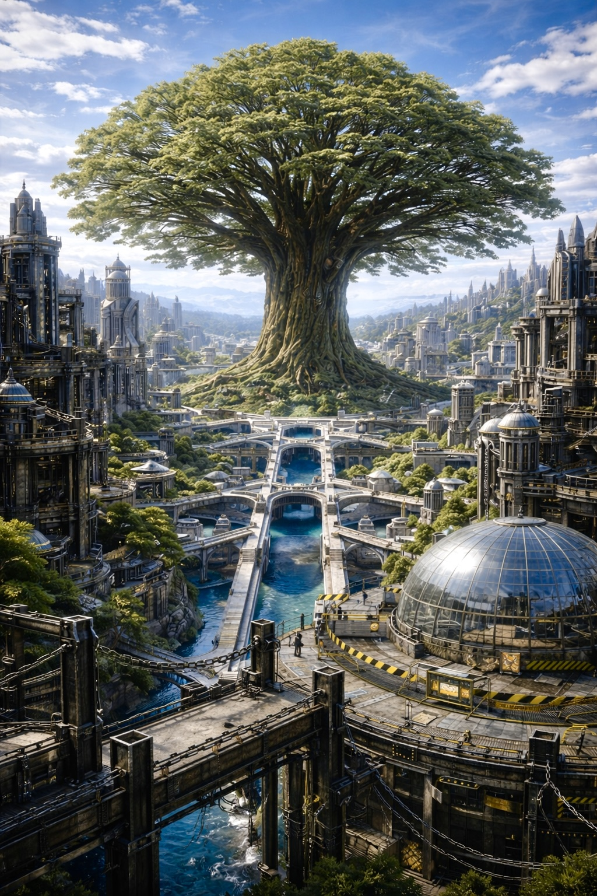

森を抜けた先で、一行は自然と足を止めた。
誰も、すぐには言葉が出ない。

眼前に広がるのは街だった。

だが、それは今まで知っているどの都市とも違う。
建物は樹を切り開いて建てられているのではない。

巨大な根を避け、
枝の伸びる先を読み、
森に許された場所だけへ街が築かれている。

まるで街が樹の一部だった。

そして、その中心には——

空そのものを支えているかのような一本の巨木。

その枝は街全体を覆い、
幹は城壁よりも太く、
根は山を抱き込むように広がっていた。

「…………」

最初に止まったのはサクヤだった。

無意識に見上げる。

「……これが、一本の木か。」

「……でけぇ。」

バショウが思わず笑う。

「オレの斧じゃ、一日振っても倒せねぇな。」

「一日？」

ルークが吹き出した。

「百年あっても無理だろ。」

リリィも見上げる。

「なんか……街が木を守ってるんじゃなくて……木が街を抱っこしてるみたい。」

シエルは静かに周囲を見る。

「生態系と都市設計が完全に同期してる。」

「一本の樹を中心に、水脈も気流も組まれてるな。」

ナギも短く続けた。

「合理的だ。」

アヤメは少しだけ誇らしそうに笑った。

「初めて来られた方は、皆さん驚かれるんです。」

彼女もまた巨木を見上げる。

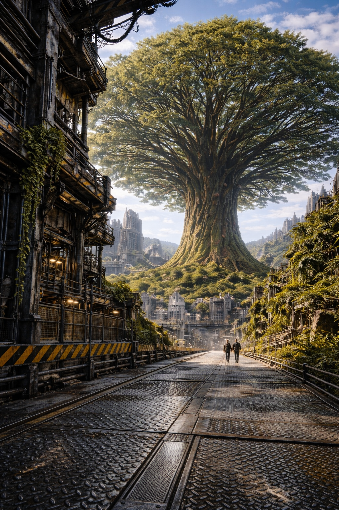

「あの樹は、何百年……何千年も、この街を見守ってきました。」

少しだけ間を置く。

「私たちは森を守っているつもりです。」

「でも、本当は——」

柔らかく微笑む。

「ずっと、この樹に守られているんですよ。」

アルカディアへ続く道へ足を踏み出す前。
アヤメが、ふと立ち止まってサクヤたちを振り返った。

「シルヴァンを出る前に、少しだけ寄りたい場所があります」

彼女が案内したのは、シルヴァンの境界近くにひっそりと佇む『テラ・ヴェルデ』という名の古いカフェだった。

巨木の根をそのままくり抜いたような造りの店内は、森の喧騒から切り離されたように静かで、深い緑の香りと焙煎された豆の匂いが満ちている。

「ここは、森の理屈から少しだけ外れた場所。誰も削られないし、誰も急がない」
アヤメはそう言って、穏やかに微笑んだ。
「ここのテリーヌは本当に美味しいんですよ。アルカディアの乾いた空気へ向かう前に、少しだけ息を整えてほしくて」

促されるまま、一行は木のテーブルを囲んだ。
運ばれてきたのは、森の木の実や茸をふんだんに使った色鮮やかなテリーヌと、深い色合いの『森林深煎り』のコーヒー。

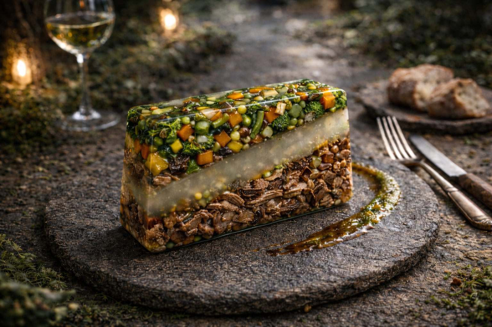

マグメルの無機質な食事や、ゴルゴニアの脂ぎった肉とも違う、優しくも力強い「命の味」だった。

シエルが、湯気を立てる黒い液体を一口含む。
いつもなら分析めいた言葉を並べる彼が、ふと目を丸くし、カップを見つめた。
「……確かに美味い」
珍しく素直なその呟きに、リリィがくすっと笑い、ルークが「お前が味を褒めるなんてな」と肩を揺らした。
バショウも無言でテリーヌを平らげ、ナギはコーヒーの香りを静かに楽しんでいる。

喧騒の後の、束の間の静寂。
サクヤはカップを両手で包みながら、向かいに座るアヤメを見た。
「……あんたは、後悔してないのか。森を出ることを」

アヤメはコーヒーの湯気越しに、サクヤの目を真っ直ぐに見返した。
「後悔はありません。森を守るためには、森の外を知らなければならないから」
彼女の瞳の奥には、慈愛だけではない、確かな覚悟の火が灯っていた。
「それに……あなたが背負っているものが何なのか、私自身の目で確かめたいんです。それが、私が選んだ『残す』ための道だから」

サクヤは短く息を吐き、コーヒーを口に運んだ。
深い苦味の奥に、ほんのわずかな甘みが残る。
「……そうか。なら、好きにしろ」
突き放すような言葉だったが、その響きは決して冷たくはなかった。

テラ・ヴェルデの静かで深い時間が、彼らの体に染み込んでいく。
過酷なアルカディアへの旅路を前に、パーティの中に、また一つ新しい絆の温度が生まれていた。

テラ・ヴェルデを出ると、店の裏手にアヤメが手配していた「足」が待っていた。

森の気配をそのまま形にしたような、六頭の騎獣。
五頭は、鱗と羽毛が混ざったような独特の表皮を持つ二足歩行の鳥型獣――走鱗鳥（スケイルランナー）。

そしてもう一頭は、岩のように硬い青とベージュの重装甲めいた鱗を持つ、四足歩行の巨大な陸竜――岩甲竜（ロックドレイク）である。

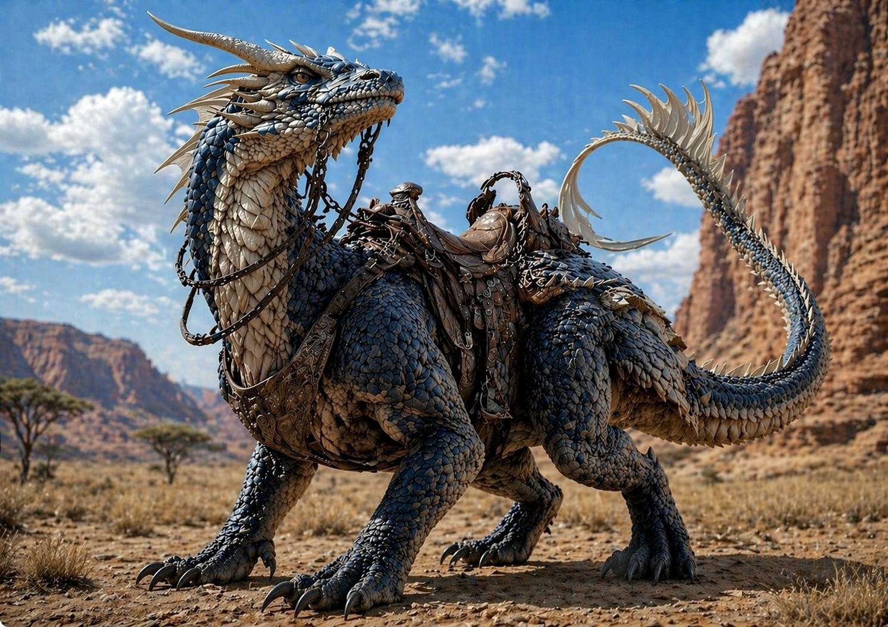

「ここから先、輝脈谷を抜けてアークゲートへ至る道は、徒歩では何日もかかります。彼らの力を借りましょう」

アヤメが走鱗鳥の首筋を優しく撫でながら言う。

「おっと、俺の図体じゃこの鳥は潰れちまうな」
バショウが苦笑しながら、ひときわ巨大な岩甲竜の広い背の鞍へ手をかけた。
「アヤメ、お前もこっちに乗れ。案内役が疲れてちゃ世話ねえからな」
「……ありがとうございます」
バショウに引き上げられ、アヤメが岩甲竜の背に同乗する。

「こっちは一人一羽か。随分と気性が荒そうだけど」
ルークが走鱗鳥に近づこうとすると、鋭い嘴で威嚇され、慌てて手を引っ込める。
「機嫌を取る必要はない。乗り手の重心さえブレなければ、勝手に最適解のルートを走る生き物だ」
ナギが淡々と説明しながら、誰よりも早く走鱗鳥に跨った。

サクヤも手綱を引き、鞍にまたがる。
羽毛と鱗が混ざった体表は、硬さと柔らかさが同居する不思議な感触だった。
「行くぞ」

サクヤの合図とともに、走鱗鳥たちが一斉に地を蹴った。
その跳躍力は、ゴルゴニアの重装甲車とも、マグメルのバイクとも全く違う。強靭な脚力が森の腐葉土を捉え、木々の間を縫うように疾走していく。

「うわっ、速い！ でも全然揺れない！」
隣を走るリリィが、風に髪を煽られながら歓声を上げる。
その後ろから、シエルとルークの乗る走鱗鳥が続き、最後尾からバショウの操る岩甲竜が、地鳴りのような足音を立てて重厚に追従する。

機械の駆動音はない。
あるのは、獣たちの力強い息遣いと、硬い爪が土を蹴る音だけだ。
一行を乗せた騎獣たちは、深い森の境界を抜け、転晶門アークゲートの足元に広がる「輝脈谷」へと一気に駆け下っていった。

サクヤは最後に、もう一度だけ森を振り返った。
整っている。
美しい。
だが、そこには守るべき温もりも、抗うべき痛みも、何一つ残されていない。

護符を握る。
重い。
だが、消えない。

そのまま、サクヤは歩き出した。
アルカディアへ。
整えすぎた場所へ。
削られる場所へ。
そして――選ばされる場所へ。

風が吹く。
葉が揺れる。
だが、その揺れは、どこか遅れている。
均衡は、まだ戻っていない。

───────────────────────

第7章

第9節：輝脈谷　前編

輝脈谷へ入った瞬間、空気の質が変わった。

シルヴァンの湿った緑は、背後でもう遠い。眼前に広がるのは、岩肌そのものが金色の光を宿した谷だった。鋭く切り立った黒い山肌の裂け目を縫うように、無数の結晶脈が地表へ突き出している。朝の光を受けたそれらは宝石のように美しいが、近づけば近づくほど、美しさよりも異様さが先に立った。まるで山そのものが、内側に別の炉を抱えているようだった。

「……派手だな」

リリィが目を細める。

「派手で済むなら観光地だがな」

ルークは肩のライフルを持ち直しながら、谷の奥を見た。

「あれが転晶門アークゲートだ」

彼が顎で示した先、断崖を削って築かれた巨大な門構えが見えた。円環状の門体は複数の金属柱で支えられ、縁には発光する古い刻印が幾重にも走っている。その中心では、水面を縦に起こしたような青い光が静かに渦を巻いていた。

アルカディアへ至る正式な転移装置。輝脈谷で採れる結晶を精製し、そのエネルギーを門へ流し込むことで、高度も距離も無視して空中都市へ接続する。

「つまり、あの門を動かす燃料が、この谷の晶石ってわけか」

バショウが鼻を鳴らした。

「燃料という言い方は乱暴だが、大筋では合っている」

ナギが乾いた声で補う。

「結晶はただ燃えるんじゃない。位相を固定する。あの門は空間の接続先を安定させるために、膨大な量の結晶出力を食う。だから谷そのものが施設の一部みたいなものだ」

「嫌な言い方するわね」

アヤメが周囲の岩壁を見上げた。

「けど、間違ってはないんでしょう」

「間違ってはいない」

ナギは短く答えたが、以前より声の棘は薄かった。シルヴァンに入った頃のような、仲間を計算式の外に置いた冷たさが、ほんの少しだけ後ろへ退いている。

サクヤは黙って護符に触れた。縞鋼の表面は、ここへ来てからずっと微かな熱を持っている。熱というより、手のひらの皮膚だけが何かを先に感じ取っているような、不快な脈動だった。

「反応、あるの？」

シエルが短く訊いた。

「ある。けど、森の時みたいな揺れ方とは違う」

「当然だ」

シエルの視線は谷へ向けられたままだった。

「ここは生き物の縄張りというより、構造物と採掘場と、それに寄生した何かの混成だ。反応が直線的になる」

「直線的って、余計わかりにくいぞ」

ルークが苦笑する。

「要するに、待ち伏せ向きってこと」

その一言が落ちた直後、谷壁の上で光が動いた。

金の結晶群のあいだから、銀青の輪郭が一つ、滑るように姿を現す。人の形に近いが、人間よりはるかに均整が取れすぎていた。薄い金属肢体の継ぎ目を、青白い発光線が脈のように走る。右手には細身の刀身。足場の悪い岩棚に立ちながら、その姿勢はまるで揺れていない。

「監視機か」

ルークが低く言った。

「いや」

シエルの黒い翼がわずかに揺れる。

「迎撃個体。来る」

次の瞬間、銀青の機体――セイルムが、音より先に視界から消えた。

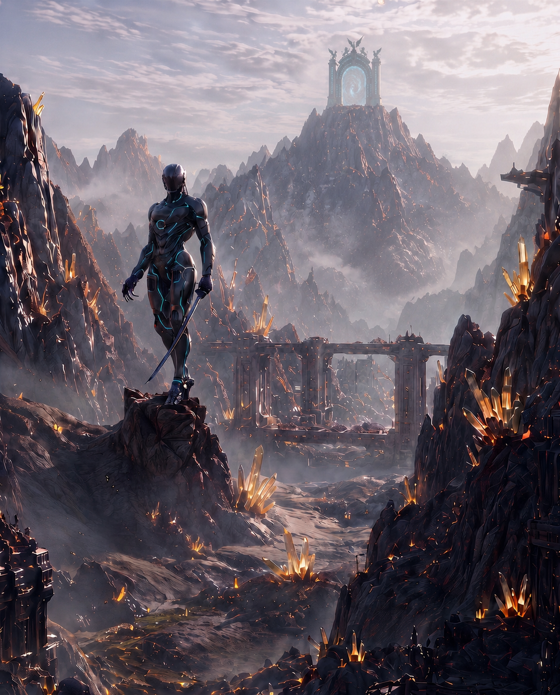

「右！」

シエルの声と同時に、サクヤは半身を切る。銀の閃線が喉元を掠め、遅れて岩肌に細い断裂が走った。

速い。だが、見えないわけじゃない。

サクヤは踏み込みを返し、ツエッテル式の斬線で機体の胴を狙う。セイルムは剣を受け流すのではなく、体幹そのものをわずかに捻って刃道を外し、逆手の爪で脇腹を裂きにきた。

その横合いへ、リリィの矢が三本連なる。

金属音。二本は肩と腰で弾かれたが、三本目が脚部の継ぎ目へ食い込んだ。

「そこ、柔い！」

「助かる！」

サクヤが一歩深く入り込む。その前へ、地を割るようにバショウが斧を振り下ろした。セイルムは退いたが、その退避先にルークの弾丸が待っていた。乾いた炸裂音が青い火花を散らし、機体の肩口を弾き飛ばす。

「いい連携だ」

ルークが軽く言う。

「褒めてる場合じゃない、後ろ！」

アヤメの声が響いた。

谷底の結晶群、そのひとつが動いた。

いや、動いたのは結晶ではない。岩肌に根を張るように見えていた金色の晶塊が、内部から金属の肢を展開し、鈍い音を立てて立ち上がる。背中に結晶を林立させた異形の機械体。そのまま採掘者を誘い込むためだけに、この谷の光景へ溶け込むよう設計された欺瞞。

「擬装型……！」

ナギが槍を引き絞る。

「オルディアだ。晶脈の陰に最低でも二体いる！」

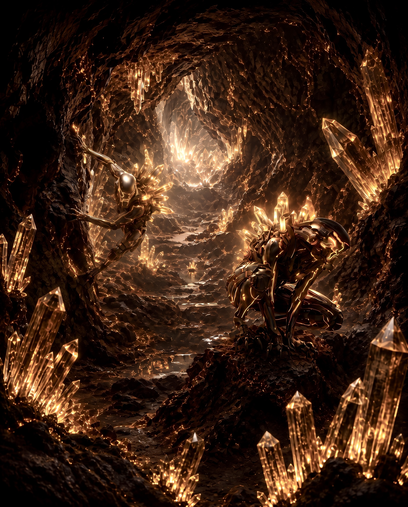

「最悪の趣味ね！」

リリィが舌打ちし、足場を変える。

二体目、三体目。谷底のあちこちで、無害な鉱石にしか見えなかった結晶群が、続けざまに形を変えた。光を背負ったまま低く這い、獲物へ飛びかかる。正面のセイルムが刃で動線を切り、側面のオルディアが死角から噛みつく。完全に、門へ近づく者を削るための配置だった。

「サクヤ、正面を切る！」

「了解！」

「バショウ、左の群れ止めて！」

「言われなくてもだ！」

バショウの斧が岩床を叩き、接近していた一体のオルディアを横から殴り飛ばす。まだ神使を出すまでもない。純粋な膂力と武器の重量だけで充分に止まる。だが止めるだけでは足りない。晶体を背負った個体は転がった勢いのまま四肢で姿勢を立て直し、岩壁を蹴って再び襲ってくる。

その進路へ、アヤメが短く呟いた。

空気が沈む。オルディアの動きが目に見えて鈍った。脚運びが半拍だけ遅れ、その隙にルークの二射が胸部装甲を撃ち抜く。

「助かるよ、お嬢さん」

「軽口はあとで」

アヤメは額に滲んだ汗も拭わず、次の個体へ視線を走らせた。

シエルは上空へ細く飛び、谷全体を見渡している。彼の視線の動きに合わせるように、声だけが無駄なく落ちてきた。

「セイルム二。オルディア三。門側の岩棚にもう一機、伏せてる」

「見えてるなら早く言え！」

バショウが叫んだ直後、潜んでいたセイルムが崖の中腹から急降下した。

しかしその軌道を、今度はナギが先に読んだ。槍の石突きで地を滑り、サクヤの背後へ回り込む角度を潰す。鋭い突きがセイルムの手首を弾き、刃筋をわずかに逸らした。

「一拍遅い」

ナギが淡々と言う。

「助かった」

サクヤは短く返し、その一拍のずれに全てを乗せて斬り返した。剣先がセイルムの首元を裂き、青い光がひび割れる。さらにリリィの矢が同じ破断箇所へ突き立ち、機体の頭部が半ばからねじ切れた。

落下したセイルムが、地面の上で数度だけ痙攣する。

だが戦いはまだ終わらない。谷底の奥、アークゲートへ続く細道の左右で、金色の晶塊が次々に身じろぎを始めていた。

「数が増える」

シエルが静かに告げる。

「門まで抜けるなら、ここで長引くのは悪手だ」

「なら道を開けるしかないね」

ルークが息を吐いた。

「サクヤ、前。リリィは右の高所。ナギ、左の死角を潰せ。バショウは中央で壁になれ。アヤメは俺と後衛。シエル、最短ルートを切ってくれ」

一瞬だけ、全員の動きがひとつに揃う。

谷の奥へ進むほど、護符の脈動は強くなった。サクヤはそれを無視して前へ出る。今は意味を考えるより、剣を振るう方が早い。

セイルムの残骸を飛び越え、オルディアの牙をかわし、輝脈谷の中心へ踏み込む。結晶の光は美しいまま、足元の影だけを不自然に濃くしていた。

その影の中で、ひときわ大きな晶塊がゆっくりと身を起こす。

「また擬装か……！」

リリィが矢を番える。

だがその個体だけ、護符の反応が違った。

熱ではない。引き寄せられるような、硬い震え。サクヤの胸元で縞鋼が細く鳴る。

「サクヤ！」

シエルの声が鋭く落ちる。

「それ、残る」

言葉の意味を考える前に、サクヤは踏み込んでいた。

オルディアの擬装殻が左右に割れ、内側の機構がむき出しになる。結晶群を背負ったまま、獣じみた速度で喉笛を狙ってくる。サクヤは刃を立てず、半歩だけ深く入った。懐へ潜り、下から斜めに斬り上げる。装甲の継ぎ目を断ち、続けざまに返しの一閃。

そこへ、ナギの槍が脇腹を抉り、リリィの矢が背面結晶の根元へ刺さった。

最後にバショウの斧が振り抜かれ、個体は真正面から砕け散った。

金属片と結晶の破片が谷底へ散る。

だが、その中心にだけ、消えないものがあった。

淡い光を内に閉じ込めた、小さな硬片。

それは砂にも金属屑にもならず、崩れた残骸のただ中に静かに留まっていた。サクヤが近づくと、胸元の護符が明確に震える。以前よりも強く、そして以前よりもはっきりと、その硬片へ応じていた。

「……やっぱり消えない」

アヤメが息を呑む。

「サクヤ」

ルークが警戒を解かないまま言う。

「触れるなら手短にな」

サクヤは頷き、硬片へ手を伸ばした。

指先が触れた瞬間、硬片は抵抗もなく護符へ引かれ、そのまま沈んだ。護符の内側で、何かが軋むように噛み合う。だが、表に浮かぶものは何もなかった。銀の地肌はそのまま、裏に沈んだ薄い縞の影もそのままで、線ひとつ増えてはいない。

硬片は崩れず、消えず、そのまま護符の反応の中へ沈むように静まり返った。

「また蓄積したか」

ナギの声は冷静だったが、完全な他人事ではなくなっていた。

「この谷の結晶系個体は、普通の厄災より護符との相性が強い可能性がある」

「相性って言い方、最悪」

リリィが顔をしかめる。

「でも、嫌なほど当たってる」

シエルは再びアークゲートへ視線を向けた。

「まだ先がある。門の手前で終わる構成じゃない」

谷の奥から、低い振動が伝わってくる。採掘坑のさらに深部。結晶の脈が集まり、光が沈み込む方角。まるで山の内側に、もうひとつ別の口が開いているみたいだった。

バショウが斧を肩へ担ぎ直す。

「なら行くしかねえな」

アヤメも小さく息を整えた。

「怪我は軽い。まだ動けるわ」

ルークはアークゲートと、その下へ続く坑道口を交互に見た。

「表の門は見せ札、本命は下かもしれん」

サクヤは護符を握り、谷の奥を見据える。輝脈谷の光は、空へ向かう道を示しているようでいて、同時に地の底へ降りる入口も照らしていた。

この先にあるのは、空中都市へ至るための装置だけじゃない。

それを動かすために掘られ、隠され、蓄えられてきたものの裏側だ。

誰も口にはしなかったが、全員が同じことを感じていた。

アルカディアへ向かう道は、空へ伸びているくせに、まず地中の暗さを通らなければならない。

そしてその暗さの中に、次の戦いが待っている。

────────────────────

第7章

第10節：輝脈谷　後編

谷の底へ口を開けた坑道は、外から見えたよりもずっと広かった。

転晶門アークゲートの真下、発光する結晶脈が幾筋も天井を這い、掘り抜かれた岩壁の継ぎ目を青金に染めている。上では空へ向かう門が唸りを上げ、下ではその喉元へ結晶の熱が送り込まれている。地上の輝きが整えられた施設の顔だとすれば、こちらはその裏肺だった。
採掘用の足場、古い搬送軌条、半ば崩れた昇降機の残骸。人の手で作られた構造物のあいだを、結晶だけが生き物みたいに増殖している。

「ひどいな」

サクヤは思わず呟いた。

「門だけ見せられたら、綺麗な遺跡で済んだのに」

「表はだいたい綺麗に作るものよ」

アヤメが静かに答える。彼女はすでに何人かの擦り傷を簡単に見て回り、包帯の締め具合を確かめていた。前半の戦いで大きな損傷はない。だが、全員が谷の空気に少しずつ削られている。

「問題は、汚い方が本体って時だ」

ルークが銃口を下げたまま、暗い坑道の先を見た。

ナギが壁面の結晶脈へ手をかざす。

「この下で出力を溜めている。門を動かす結晶流路が一本じゃない。谷全体から吸い上げたものを、ここで束ねているはずだ」

「なら、さっきの迎撃個体だけで終わるわけないってことね」

リリィが短く返す。

「終わるなら、こんな嫌な静けさにはならない」

シエルは翼を畳み、いつもより低い位置を歩いていた。坑道では飛ぶ余地が少ない。代わりに、音を聞いているのだとサクヤには分かった。石のきしみ、結晶の共鳴、その奥に混じる、呼吸ではない何か。

胸元の護符が、また震えた。

前半で拾った硬片は、もう外にない。なのに、あの時より反応は深い。熱が表面を這うだけではなく、縞鋼の内側で、見えない層が一枚ずつ重なっていくような感触があった。表にも裏にも、それは出てこない。護符そのものが、この坑道の形を先に覚えていく。

「サクヤ」

シエルが歩みを止めずに言う。

「正面じゃない。床だ」

直後、床下で何かが走った。

岩屑ではない。硬いものが爪で軌条を引っかく音が、隊列の真下を横切る。次の瞬間、左の足場板が内側から突き破られた。

飛び出したのは、骨だけで獣を組み立てたような四足の異形だった。黒灰の骨格に見える外殻、その節々には結晶粉じんが青くこびりつき、眼窩に当たる窪みの奥だけが赤く灯っている。顎は必要以上に大きく、前脚は獲物を押し倒すために異様に発達していた。

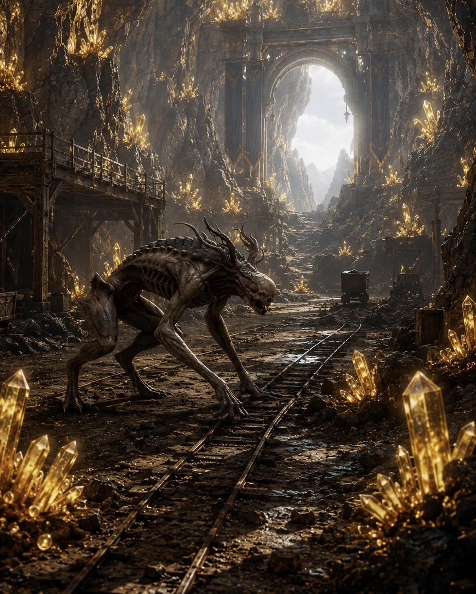

「グラドム！」

ナギが叫ぶ。

一体ではない。右、後方、さらに前方の昇降機の残骸の陰。坑道そのものを巣として覚えた追跡型が、最初から通路の上下に潜っていた。

先頭の一体がサクヤへ飛びかかる。横へ払うような噛みつき。サクヤは半身を引き、顎を剣の腹で逸らした。重い。見た目以上の衝撃が腕に食い込み、そのまま押し切られそうになる。

「骨って言うより、鉱石だな……！」

「だから正面で受けるな！」

ルークの銃声が弾け、グラドムの肩節を砕く。だが砕けた破片ごと、個体はなお前進した。脚が一本潰れても、残り三本で姿勢を作り直す。止まらない。獲物の足を止めるまで、何度でも追いすがる類の動きだった。

リリィの矢が坑道上部へ走る。上から落ちてきた二体目の鼻梁に深く刺さり、その一瞬の硬直を見逃さず、バショウが斧で叩き落とした。骨格が折れる音が短く響く。

「追跡型ってのは嫌いだ」

バショウが吐き捨てる。

「しつこいのは性に合わねえ」

「それ、敵から見たらあんたも同類よ！」

リリィが返しながら、さらに二射。暗がりで動く赤い灯を正確に射抜く。

しかし、そこで終わらなかった。

崩れた昇降機の向こう、坑道のさらに深く高いところから、細い影がひとつ、音もなく現れた。

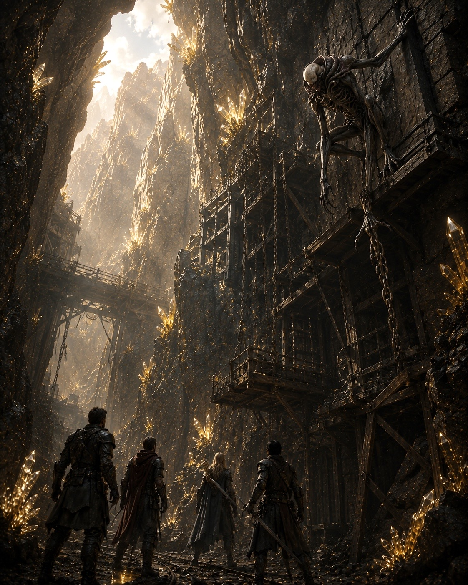

人型に近い。だが人ではない。痩せすぎた四肢は節の位置がずれており、肩から腰へかけては布ではなく、皮膜じみた闇が貼りついて見えた。歩いているのに足音がない。細い首がわずかに傾き、その黒い輪郭だけが結晶光を吸い込まずに残る。

サクヤは本能的に、一歩下がった。

「あれが……」

「シェイドル」

ナギの声が低くなる。

「深部汚染域にいる上位異形。速いぞ」

速い、という説明は足りなかった。

シェイドルは瞬きのあいだに距離を消した。一直線ではない。視界の端から端へ、影を継ぐように位置を変え、気づいた時にはアヤメの背後へ回り込んでいる。

「下がって！」

サクヤが叫ぶより早く、アヤメが自分から半歩前へ出た。

避けるためではない。仲間から遠ざけるための動きだった。

細い腕が閃き、アヤメの肩口を浅く裂く。

「アヤメ！」

リリィの声が跳ねる。

だがアヤメは倒れない。傷口を押さえながら、低くひと息吐いただけで、逆にシェイドルの方を見据えた。次の瞬間、空気の流れが変わる。見えない重みが個体の脚へ絡みついたみたいに、シェイドルの踏み込みがわずかに鈍る。

その半拍を、ルークが撃ち抜いた。弾丸は胸郭を掠めるだけに終わったが、それで十分だった。シエルが横から入り、黒い翼の軌道で視界を遮る。サクヤはその陰へ飛び込み、首筋を狙って斬り上げた。

手応えは浅い。切れたはずなのに、影を裂いたような軽さしかない。

「浅い！」

「核が深い」

シエルが即座に言う。

「外側じゃなく、内に寄ってる」

「面倒な相手だな！」

バショウが前へ出る。その足元へ、三体目のグラドムが低く潜り込んできた。前脚で膝を刈り、上からシェイドルが喉を獲りにくる。連携ですらない。ただ深部で同じ獲物を食ってきたもの同士が、自然に噛み合っている。

バショウは咄嗟に斧の柄で顎を受けたが、完全には止めきれなかった。グラドムの重さが体勢を崩し、その上からシェイドルの細い腕が迫る。

「バショウ！」

サクヤが踏み出そうとした時、足元の地面が先に応えた。

ご、と低い音が坑道を揺らす。

岩床が盛り上がり、裂け目の奥から巨大な輪郭が這い上がった。土と鉱脈をまとったような重い体躯。鋭さではなく圧そのもので前へ出る、古い地層が獣の形を取ったような実体。その巨体が、バショウの前へ斜めに割り込む。

グラドムの牙が硬い外殻へ食い込み、シェイドルの一撃が分厚い肩口に吸われた。

「……は、はは」

バショウが口の端を上げる。

「遅えぞ、テクトニクス」

呼ばれた名に応じるように、その巨体が頭をもたげた。説明などいらなかった。そこにいるだけで、坑道の重力が少し増したみたいに感じる。足場の揺れが収まり、ばらついていた結晶粉が地へ落ちる。バショウの背後に立つには、あまりにも似合いすぎる存在だった。

「初手から出しなさいよ、そういうの！」

リリィが叫ぶ。

「初見で出すには狭すぎんだよ！」

バショウも怒鳴り返し、そのまま前へ出た。テクトニクスが一歩踏み込むたび、坑道の床が低く唸る。突進してきたグラドムが足場を取られ、わずかに跳ねたところへ、バショウの斧が真上から叩き込まれた。骨格獣の背骨にあたる芯が砕け、赤い灯が弾ける。

「サクヤ、今だ！」

ルークの声に、サクヤは頷く。

テクトニクスが押し広げた一瞬の空白を、全員が迷わず使った。リリィの矢がシェイドルの逃げ道を塞ぎ、ナギの槍がその軌道を限定する。シエルはあえて高く入らず、個体の視線だけを横へ流す。サクヤは真正面からではなく、シェイドルが選ばされる三つ目の位置へ先回りした。

そこへ来る。

読んだというより、そうとしか動けない形に追い込んだ。

シェイドルが影のように滑り込んだ瞬間、サクヤは抜き上げるのではなく、低い位置から真っ直ぐ突き込んだ。刃が胸郭の奥へ沈み、今度は確かな抵抗を捉える。硬い。だが外殻とは違う、内側だけが異様に密な感触。

「そこだ！」

ナギの槍が重なる。

続けてルークの弾丸、リリィの矢。芯を穿たれたシェイドルが初めて声らしいものを漏らした。悲鳴というより、坑道の風が逆流するみたいな不快な音だった。

その音に呼ばれるように、残っていたグラドムが一斉に飛びかかる。

「まだ来るかよ！」

バショウが斧を返す。

だが数が多い。正面をテクトニクスが受けても、脇へ回る個体までは止めきれない。右から来た一体がリリィへ、後方から回った一体が負傷したアヤメへと向かう。

アヤメは自分の傷を押さえていた手を離した。

ためらいは一瞬だけだった。

彼女の横を、淡い輪郭が過ぎる。細く、しなやかで、結晶光を弾かずにやわらかく返す存在。鹿にも似ているが、それだけでは足りない。静かな森の気配だけを連れて、この坑道の濁った空気へ短く差し込まれる。

「ケリュネカルマ……」

アヤメの声は呼びかけというより、自分を支えるための確認に近かった。

その姿は長く留まらない。ただ通り過ぎるだけで十分だった。リリィへ飛びかかったグラドムの動きが一瞬だけ遅れ、足元の結晶粉が逆流する。アヤメの肩口から流れていた血も、その拍子にぴたりと勢いを失った。

「っ、助かった！」

リリィは体を低く沈め、至近から矢を叩き込む。グラドムの眼窩の赤が割れた。

アヤメはそのまま膝をつきかけたが、サクヤがとっさに支える。

「無理するな」

「これくらい、まだ……平気」

平気な声ではなかった。それでも彼女は立ち上がり、次に来るシェイドルへ視線を向ける。自己犠牲に寄りすぎる。その危うさを、サクヤはここへ来るまでにも何度か見ていた。けれど今は止めている余裕がない。

坑道の最奥で、ひときわ大きな振動が走った。

結晶流路の束ねられた先、門へ出力を送るはずの主幹が脈打っている。その真下の暗がりから、最後のシェイドルが姿を現した。先ほどの個体より細く、色も薄い。だがその周囲だけ、結晶光が不自然に曲がって見える。

「核を抱えてる」

シエルが言った。

「深部の汚染を、あれがまとめてる」

「壊せば終わるのか」

サクヤが訊いた。

「終わりはしない」

ナギが即座に否定する。

「だが、門の下を抜ける道は開く」

「充分だ」

サクヤは護符を握り込んだ。

震えが、もう脈動では済まなくなっていた。縞鋼の内側で何かが押し合い、外へ出る場所を探している。熱とも痛みとも違う。何かが定着しようとする時の、骨のきしみに似た感覚だった。

最後のシェイドルが動く。

今度は見失わなかった。いや、護符の方が先に軌道をなぞった。視界ではなく、胸元から場所が分かる。サクヤは半歩だけ遅らせて踏み込み、正面ではなく、ほんのわずか外した角度で刃を振るう。シェイドルの腕が空を切り、その懐へ剣が滑り込む。

だが浅い。

個体は裂けた胸をものともせず、至近からサクヤの喉へ食らいつこうとした。

その背へ、テクトニクスが横から体当たりする。地山そのものみたいな重量が個体の姿勢を崩し、ナギの槍が流路側へ押し返す。さらにルークの弾丸が足を止め、リリィの矢が肩を縫った。

「サクヤ！」

シエルの声が落ちる。

「今度は残る」

その言葉と同時に、サクヤは踏み込んだ。

剣先ではなく、護符を握った左手の方が先へ出る。刃がシェイドルの胸奥を穿った瞬間、内側で固められていたものがひび割れた。黒い殻ではない。結晶でも金属でもない、妙に滑らかな硬片。前半で沈んだものより大きく、暗いのに輪郭だけが光って見える。

シェイドルが崩れる。

その周囲にいたグラドムたちも、糸を切られたみたいに一斉に倒れ込んだ。坑道へ、ようやく本当の静けさが戻る。

誰もすぐには動かなかった。

サクヤの手の中で、護符が熱い。

落ちた硬片は、床へ触れたまま消えない。結晶粉にも混ざらず、ただそこだけが時間から取り残されたみたいに残っている。サクヤがしゃがみ込むと、護符が掌の中で強く脈を打った。前半で拾ったものより、応じ方が深い。

「……また入るぞ、それ」

リリィが息を呑む。

「入るだけならいい」

ナギは険しい顔で言う。

「溜まってる方が問題だ」

サクヤは何も答えず、その硬片へ手を伸ばした。

触れた瞬間、音のない衝撃が胸を抜ける。坑道の結晶脈、アークゲートの唸り、深部に残った汚染の気配。それら全部が一度に護符へ引かれ、すぐに沈む。

サクヤは息を整えてから、掌の上でそれを裏返した。

表は銀のまま。裏の縞の影も、濃くも薄くもなっていない。

ゴルゴニアで色が変わり、砂漠遺跡で裏へ回った。それからここまで、外側は一度も動いていない。なのに重さだけが着実に増えていく。

溜まっているのに、姿は変わらない。次に変わる時、何が起きるのかは分からない。ただ、まだ途中なのだという感触だけが、冷たく手の中に残った。

「サクヤ」

アヤメが、少し白い顔のまま声をかける。

「大丈夫？」

「ああ……たぶん」

自分でも曖昧な返事だった。

だが、握った護符がもう前のものではないことだけは分かる。旅の途中で積み重ねてきた残滓が、ここへ来てひとつの層として噛み合い始めている。

ルークが周囲を警戒しながら、短く息を吐いた。

「長居は無しだ。門が生きてるなら、今のうちに抜ける」

「賛成」

シエルが頷く。

「深部の静けさは、だいたい長持ちしない」

バショウは斧を肩へ戻し、隣にいるテクトニクスの重い気配を一度だけ見上げた。巨体は何も語らず、ただ坑道の揺れが収まるのと一緒に、岩陰の方へ静かに沈んでいく。

「助かった」

サクヤの声に、バショウは鼻を鳴らした。

「礼なら後だ。空の都へ行く門番が、地べたの化け物ってのは気に食わねえ」

「それは少し分かる」

ナギが珍しく即答した。

その一言に、リリィが目を丸くしてから笑う。

「今の、ちょっと面白かった」

「笑ってる暇があるなら歩け」

「はいはい」

軽口の温度が、坑道の冷えをわずかに押し返す。

アヤメは肩の傷を押さえたまま、それでも前を見た。サクヤもまた護符を握り直し、転晶門アークゲートへ続く昇降路を見上げる。上では青い光が脈打っている。空へ行くための門。そのはずなのに、ここまでの道で見せられたのは、上昇の仕組みではなく、沈殿してきたものの重さだった。

輝脈谷は、美しいだけの場所ではない。

空中都市アルカディアを支えるために掘られ、集められ、伏せられてきたものが、そのまま谷の底に澱んでいる。門は希望の形をしているが、その足元は選別と迎撃と沈殿で出来ていた。

サクヤたちは、その全部を踏み越えて進むしかない。

護符の熱を胸に残したまま、一行は坑道を抜け、転晶門アークゲートの光へ向かった。空へ至るための次の段階は、もう目の前まで来ていた。

一行を乗せた走鱗鳥は、鉱脈の岩壁を縫うように駆け抜けていく。
鉱脈は次第に途切れ、視界が大きく開けた。
切り立った岩山の谷間。
その中央に、一際巨大な門が聳え立っている。

青白い光を渦巻かせる転晶門――アークゲート。

門の周囲では旅人や商人たちが行き交い、騎獣を預ける者、荷を積み替える者、衛兵と言葉を交わす者。

アルカディアへ向かう全ての者が、一度は立ち寄る境界の街だった。

「……着きました。」

アヤメが静かに言う。

「ここが、アークゲートです。」

ルークが口笛を吹く。

「思ってたより賑やかだな。」

「空の都への唯一の玄関口ですから。」

アヤメは微笑みながら岩甲竜の背から降りた。
騎獣を預ける。

係員が慣れた手付きで走鱗鳥たちの手綱を受け取る。
鳥たちは暴れることもなく、小さく喉を鳴らしながら厩舎へ歩いていった。
岩甲竜もバショウに頭を擦り寄せるように鼻先を近づける。

「ありがとな。」

大きな頭を軽く叩くと、岩甲竜は低く唸り、ゆっくりと厩舎へ消えていった。

サクヤは巨大な門を見上げる。
青い光は絶えず渦を巻き、その向こう側は何も見えない。

空へ続く道。

だが、その先で待つのは希望なのか、それとも更なる真実なのか。
まだ誰にも分からない。

「行きましょう。」

アヤメが一歩前へ出る。

サクヤも静かに頷いた。

一行は揃って門前へ歩み寄る。
衛兵が確認を終えると、ゆっくりと道を開いた。

青白い渦が、彼らを迎え入れるように揺れる。

サクヤは護符を一度だけ握り締めた。

そして、一歩。

誰からともなく、転晶門アークゲートの光の中へ足を踏み入れた。

