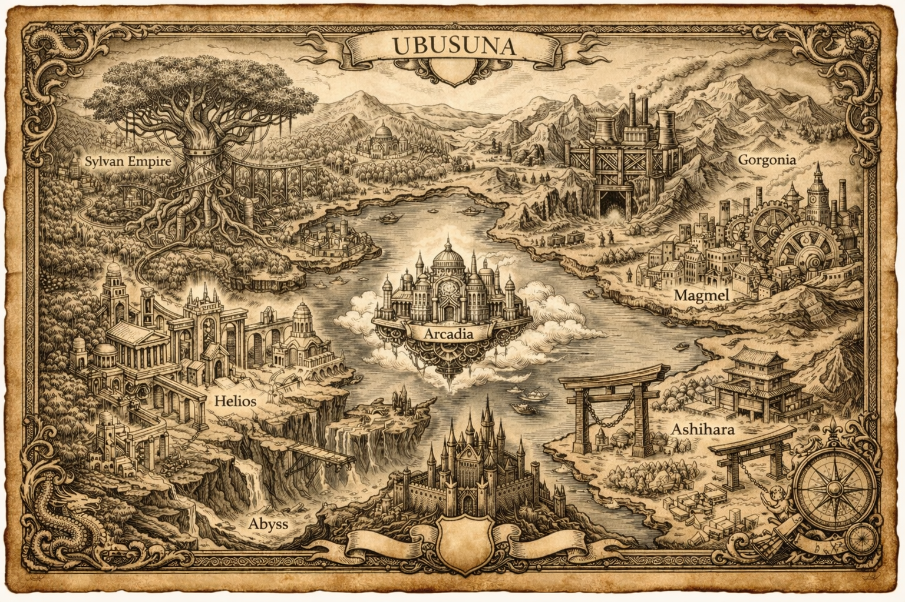

# UBUSUNA

神話・科学・AI・哲学を融合したオリジナル長編小説。

## はじめに

ようこそ、UBUSUNAへ。

本作品は約54万文字で構成された長編作品です。
章ごとに公開していますので、第1章から順番にお読みください。

---

## 目次

- [第1章　錆びゆく都市の少年](01_錆びゆく都市の少年.md)
- [第2章　焔核の兆しと風の斥候](02_焔核の兆しと風の斥候.md)
- [第3章　静寂の檻と反骨の灯](03_静寂の檻と反骨の灯.md)
- [第4章　錆びた誇り、選ばされる街](04_錆びた誇り、選ばされる街.md)
- [第5章　水の鎖、選ばれた王](05_水の鎖、選ばれた王.md)
- [第6章　定まる夜明け](06_定まる夜明け.md)
- [第7章　緑青に咲く〈選別〉の鹿](07_緑青に咲く〈選別〉の鹿.md)
- [第8章　空に縫い留められた街](08_空に縫い留められた街.md)
- [第9章　正しさの形](09_正しさの形.md)
- [第10章　隠者の森](10_隠者の森.md)
- [第11章　アビス](11_アビス.md)
- [第12章　確定する絶望](12_確定する絶望.md)
- [第13章　崩壊寸前](13_崩壊寸前.md)
- [第14章　晦のはずの朔](14_晦のはずの朔.md)
- [第15章　割り込む剣](15_割り込む剣.md)
- [第16章　見えざる秤が堕ちる時](16_見えざる秤が堕ちる時.md)
- [第17章　深淵の揺籃](17_深淵の揺籠.md)
- [第18章　朔──起源の後](18_朔_起源の後.md)

### 特別編

- [夜に浮かぶ碧い星（観測記録第零号）](19_夜に浮かぶ碧い星_観測記録第零号.md)
- [観察者の余白（CREATOR'S NOTE）](20_観察者の余白_CREATORS_NOTE.md)

---

## 試験公開について

現在は試験公開版です。

文章や構成、表示方法などは今後更新される場合があります。

---

© Tatsuya Matsuda